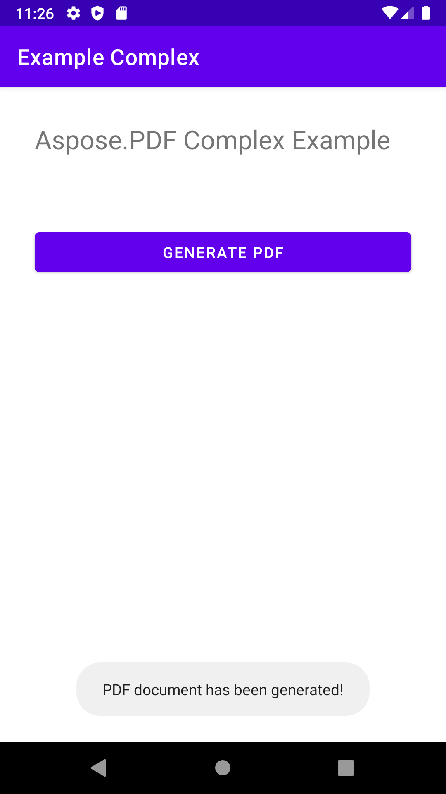

The [Hello, World](/pdf/java/hello-world-example/) example showed simple steps to create a PDF document using Java and Aspose.PDF. In this article, we will take a look at creating a more complex document with Java and Aspose.PDF for Java. As an example, we'll take a document from a fictitious company that operates passenger ferry services.
Our document will contain a image, two text fragments (header and paragraph), and a table. To build such a document, we will use DOM-base approach. You can read more in section [Basics of DOM API](/pdf/java/basics-of-dom-api/).

If we create a document from scratch we need to follow certain steps:

1. Instantiate a [Document](https://apireference.aspose.com/pdf/java/com.aspose.pdf/document) object. In this step we will create an empty PDF document with some metadata but without pages.
1. Add a [Page](https://apireference.aspose.com/pdf/java/com.aspose.pdf/page) to the document object. So, now our document will have one page.
1. In order to add Image, we create FileInputStream, indicate the path to the file we need. Then we add the picture to the rectangle with the given coordinates.
1. Create a [TextFragment](https://apireference.aspose.com/pdf/java/com.aspose.pdf.text/textfragment) for header. For the header we will use Arial font with font size 24pt and center alignment.
1. Add header to the page [Paragraphs](https://apireference.aspose.com/pdf/java/com.aspose.pdf/Page#getParagraphs--).
1. Create a [TextFragment](https://apireference.aspose.com/pdf/java/com.aspose.pdf/TextFragment) for description. For the description we will use Arial font with font size 24pt and center alignment.
1. Add (description) to the page Paragraphs. We used "Helvetica" and "Times Roman" fonts in our example, but keep in mind that there are only three system wide fonts in Android:

- normal (Droid Sans);
- serif (Droid Serif);
- monospace (Droid Sans Mono).

1. Create a table, add table properties.
1. Add (table) to the page [Paragraphs](https://apireference.aspose.com/pdf/java/com.aspose.pdf/Page#getParagraphs--).
1. Save a document "Complex.pdf".

In the end, a pop-up is displayed with a message "PDF document has been generated!".

```java
  private void RunComplexExample() {
        // Initialize document object
        Document document = new Document();

        // Add page
        Page page = document.getPages().add();

        // Add image
        java.io.FileInputStream imageStream = null;
        try {
            imageStream = new FileInputStream("/storage/0F03-0F02/Android/data/com.aspose.pdf.examplecomplex/files/MyFileStorage/logo.png");
        } catch (Exception e) {
            e.printStackTrace();
        }

        // Add image to the page
        page.addImage(imageStream, new Rectangle(20, 730, 120, 830));

        // Add Header
        TextFragment header = new TextFragment("New ferry routes in Fall 2020");
        header.getTextState().setFont(FontRepository.findFont("Helvetica"));
        header.getTextState().setFontSize(24);
        header.setHorizontalAlignment (HorizontalAlignment.Center);
        header.setPosition(new Position(130, 720));
        page.getParagraphs().add(header);

        // Add description
        String descriptionText = "Visitors must buy tickets online and tickets are " +
                "limited to 5,000 per day. Ferry service is operating at half capacity and" +
                " on a reduced schedule. Expect lineups.";

        TextFragment description = new TextFragment(descriptionText);
        description.getTextState().setFont(FontRepository.findFont("Helvetica"));
        description.getTextState().setFontSize(14);
        description.setHorizontalAlignment(HorizontalAlignment.Left);
        page.getParagraphs().add(description);


        // Add table
        Table table = new Table();
        table.setColumnWidths("200");
        table.setBorder(new BorderInfo(BorderSide.Box, 1f, Color.getDarkSlateGray()));
        table.setDefaultCellBorder(new BorderInfo(BorderSide.Box, 0.5f, Color.getBlack()));
        table.getMargin().setBottom(10);
        table.getDefaultCellTextState().setFont(FontRepository.findFont("Times Roman"));

        Row headerRow = table.getRows().add();
        headerRow.getCells().add("Departs City");
        headerRow.getCells().add("Departs Island");


        for (Cell headerRowCell : (Iterable<? extends Cell>) headerRow.getCells())
        {
            headerRowCell.setBackgroundColor(Color.getGray());
            headerRowCell.getDefaultCellTextState()
                    .setForegroundColor(Color.getWhiteSmoke().toRgb());
        }

        LocalTime time = LocalTime.of(6,0);
        Duration incTime = Duration.ofMinutes(30);

        for (int i = 0; i < 10; i++)
        {
            Row dataRow = table.getRows().add();
            dataRow.getCells().add(time.toString());
            time=time.plus(incTime);
            dataRow.getCells().add(time.toString());
        }

        page.getParagraphs().add(table);

        document.save("/storage/0F03-0F02/Android/data/com.aspose.pdf.examplecomplex/files/MyFileStorage/sample.pdf");

        Toast toast = Toast.makeText(MainActivity.this,
                "PDF document has been generated!", Toast.LENGTH_LONG);
        toast.show();
    }
```



```java
package com.aspose.pdf.examplecomplex;

import androidx.appcompat.app.AppCompatActivity;

import android.os.Bundle;
import android.os.Environment;
import android.widget.Button;
import android.widget.Toast;

import com.aspose.pdf.BorderInfo;
import com.aspose.pdf.BorderSide;
import com.aspose.pdf.Cell;
import com.aspose.pdf.Color;
import com.aspose.pdf.Document;
import com.aspose.pdf.FontRepository;
import com.aspose.pdf.HorizontalAlignment;
import com.aspose.pdf.Page;
import com.aspose.pdf.Position;
import com.aspose.pdf.Rectangle;
import com.aspose.pdf.Row;
import com.aspose.pdf.Table;
import com.aspose.pdf.TextFragment;

import java.io.File;
import java.io.FileInputStream;
import java.time.Duration;
import java.time.LocalTime;

public class MainActivity extends AppCompatActivity {

    Button generate_button;
    File myExternalFile;
    String filepath;
    String filename;

    @Override
    protected void onCreate(Bundle savedInstanceState) {
        super.onCreate(savedInstanceState);
        setContentView(R.layout.activity_main);

        generate_button = (Button) findViewById(R.id.button);
        generate_button.setOnClickListener(v->RunComplexExample());

        if(!isExternalStorageAvailable()||isExternalStorageReadOnly()){
            generate_button.setEnabled(false);
        }
        else{
            filepath = "MyFileStorage";
            filename = "SampleFile.pdf";
            myExternalFile=new File(getExternalFilesDir(filepath), filename);
        }

    }

    private void RunComplexExample() {
        // Initialize document object
        Document document = new Document();

        // Add page
        Page page = document.getPages().add();

        // Add image
        java.io.FileInputStream imageStream = null;
        try {
            imageStream = new FileInputStream("/storage/0F03-0F02/Android/data/com.aspose.pdf.examplecomplex/files/MyFileStorage/logo.png");
        } catch (Exception e) {
            e.printStackTrace();
        }

        // Add image to the page
        page.addImage(imageStream, new Rectangle(20, 730, 120, 830));

        // Add Header
        TextFragment header = new TextFragment("New ferry routes in Fall 2020");
        header.getTextState().setFont(FontRepository.findFont("Helvetica"));
        header.getTextState().setFontSize(24);
        header.setHorizontalAlignment (HorizontalAlignment.Center);
        header.setPosition(new Position(130, 720));
        page.getParagraphs().add(header);

        // Add description
        String descriptionText = "Visitors must buy tickets online and tickets are " +
                "limited to 5,000 per day. Ferry service is operating at half capacity and" +
                " on a reduced schedule. Expect lineups.";

        TextFragment description = new TextFragment(descriptionText);
        description.getTextState().setFont(FontRepository.findFont("Helvetica"));
        description.getTextState().setFontSize(14);
        description.setHorizontalAlignment(HorizontalAlignment.Left);
        page.getParagraphs().add(description);


        // Add table
        Table table = new Table();
        table.setColumnWidths("200");
        table.setBorder(new BorderInfo(BorderSide.Box, 1f, Color.getDarkSlateGray()));
        table.setDefaultCellBorder(new BorderInfo(BorderSide.Box, 0.5f, Color.getBlack()));
        table.getMargin().setBottom(10);
        table.getDefaultCellTextState().setFont(FontRepository.findFont("Times Roman"));

        Row headerRow = table.getRows().add();
        headerRow.getCells().add("Departs City");
        headerRow.getCells().add("Departs Island");


        for (Cell headerRowCell : (Iterable<? extends Cell>) headerRow.getCells())
        {
            headerRowCell.setBackgroundColor(Color.getGray());
            headerRowCell.getDefaultCellTextState()
                    .setForegroundColor(Color.getWhiteSmoke().toRgb());
        }

        LocalTime time = LocalTime.of(6,0);
        Duration incTime = Duration.ofMinutes(30);

        for (int i = 0; i < 10; i++)
        {
            Row dataRow = table.getRows().add();
            dataRow.getCells().add(time.toString());
            time=time.plus(incTime);
            dataRow.getCells().add(time.toString());
        }

        page.getParagraphs().add(table);

        document.save("/storage/0F03-0F02/Android/data/com.aspose.pdf.examplecomplex/files/MyFileStorage/sample.pdf");

        Toast toast = Toast.makeText(MainActivity.this,
                "PDF document has been generated!", Toast.LENGTH_LONG);
        toast.show();
    }

    private static boolean isExternalStorageReadOnly(){
        String extStorageState= Environment.getExternalStorageState();
        return Environment.MEDIA_MOUNTED_READ_ONLY.equals(extStorageState);
    }

    private static boolean isExternalStorageAvailable(){
        String extStorageState=Environment.getExternalStorageState();
        return Environment.MEDIA_MOUNTED.equals(extStorageState);
    }
}
```

```xml
<?xml version="1.0" encoding="utf-8"?>
<LinearLayout xmlns:android="http://schemas.android.com/apk/res/android"
    xmlns:app="http://schemas.android.com/apk/res-auto"
    xmlns:tools="http://schemas.android.com/tools"
    android:layout_width="match_parent"
    android:layout_height="match_parent"
    android:orientation="vertical"
    tools:context=".MainActivity">

    <TextView
        android:layout_width="match_parent"
        android:layout_height="wrap_content"
        android:layout_marginTop="32dp"
        android:layout_marginLeft="32dp"
        android:layout_marginRight="32dp"
        android:text="@string/title"
        android:textSize="24sp"
        android:visibility="visible"
        app:layout_constraintBottom_toBottomOf="parent"
        app:layout_constraintLeft_toLeftOf="parent"
        app:layout_constraintRight_toRightOf="parent"
        app:layout_constraintTop_toTopOf="parent" />

    <Button
        android:id="@+id/button"
        android:layout_width="match_parent"
        android:layout_height="wrap_content"
        android:layout_marginTop="64dp"
        android:layout_marginLeft="32dp"
        android:layout_marginRight="32dp"
        android:text="@string/generate_btn" />

</LinearLayout>
```