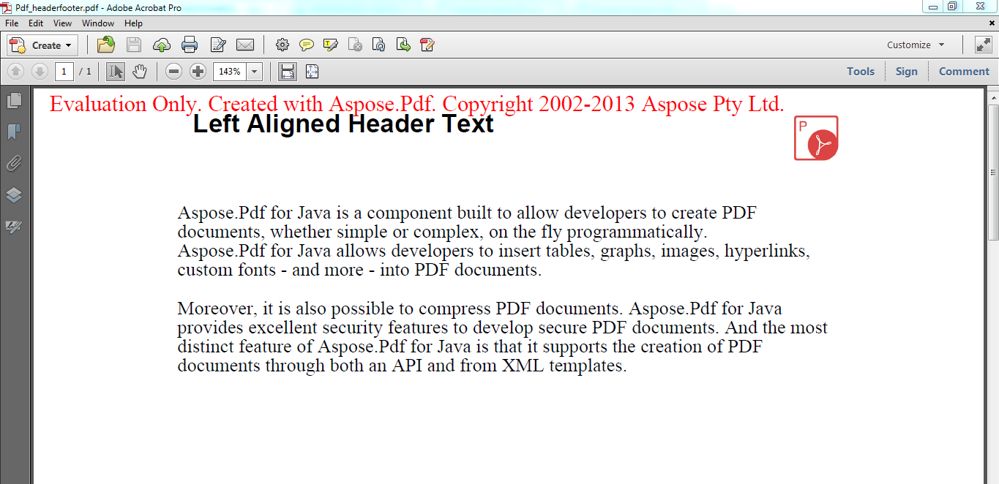

## Aspose.PDF for Java component

{}

**Aspose.PDF is a Java** component built to allow developers to create PDF documents, whether simple or complex, on the fly programmatically. Aspose.PDF for Java allows developers to insert tables, graphs, images, hyperlinks, custom fonts - and more - into PDF documents. Moreover, it is also possible to compress PDF documents. Aspose.PDF for Java provides excellent security features to develop secure PDF documents. And the most distinct feature of Aspose.PDF for Java is that it supports the creation of PDF documents through both an API and from XML templates

{} 

## Product Description

**Aspose.PDF for Java** is implemented using Java and it works with JDK 1.8 and above. Aspose.PDF for Java can be integrated with any application, for example a JSP/JSF web application or a Windows application.

**Aspose.PDF for Java** is fast and light weight. It creates PDF documents efficiently and helps your application perform better. Aspose.PDF for Java is our customers’ first choice when creating PDF documents because of its price, superb performance and great support.
Using this library, you can implement rich capabilities for creating PDF files from scratch, or completely process existing PDF documents without installing Adobe Acrobat.

# Installation

## Evaluate Aspose.PDF for Java

{} 

You can download [Aspose.PDF for Java](https://repository.aspose.com/webapp/#/artifacts/browse/tree/General/repo/com/aspose/aspose-pdf) for evaluation. The evaluation download is the same as the purchased download. The evaluation version simply becomes licensed when you add a few lines of code to [apply the license](/pdf/java/licensing/).

{} 

The evaluation version of Aspose.PDF provides full product functionality, but it has two limitations:

- It inserts an evaluation watermark.
- No more than four elements of any collection can be viewed/edited.

**A document showing the evaluation watermark**




{} 

If you want to test Aspose.PDF for Java without the evaluation version limitations, you can also request a 30-day Temporary License. Please refer to [How to get a Temporary License?](https://purchase.aspose.com/temporary-license)

{} 

## Installing Aspose.PDF for Java from Aspose Repository

Aspose hosts all Java APIs on [Aspose Repository](https://repository.aspose.com/webapp/#/artifacts/browse/tree/General/repo/com/aspose/aspose-pdf). You can easily use Aspose.PDF for Java API directly in your Maven Projects with simple configurations.

### Specify Aspose Repository Configuration

First you need to specify Aspose Repository configuration / location in your Maven pom.xml as follows:

```java

 <repositories>

    <repository>

        <id>AsposeJavaAPI</id>

        <name>Aspose Java API</name>

        <url>http://repository.aspose.com/repo/</url>

    </repository>

</repositories>
```

### Define Aspose.PDF for Java API Dependency

Then define Aspose.PDF for Java API dependency in your pom.xml as follows:

```java

 <dependencies>

    <dependency>

        <groupId>com.aspose</groupId>

        <artifactId>aspose-pdf</artifactId>

        <version>19.11</version>

    </dependency>

</dependencies>
```

After performing above steps, Aspose.PDF for Java dependency will finally be defined in your Maven Project.

### JDK 11 Compatibility and Usage Guideline

The API is optimized for Java 11 environment and all the tests and functionality works fine. However, for some classes you should add the external dependency to add classpath of the class: javax.xml.bind.annotation.adapters.HexBinaryAdapter, which was deleted from JRE.

For example:

```java

 <dependency>

    <groupId>javax.xml.bind</groupId>

    <artifactId>jaxb-api</artifactId>

    <version>2.3.0</version>

</dependency>
```
