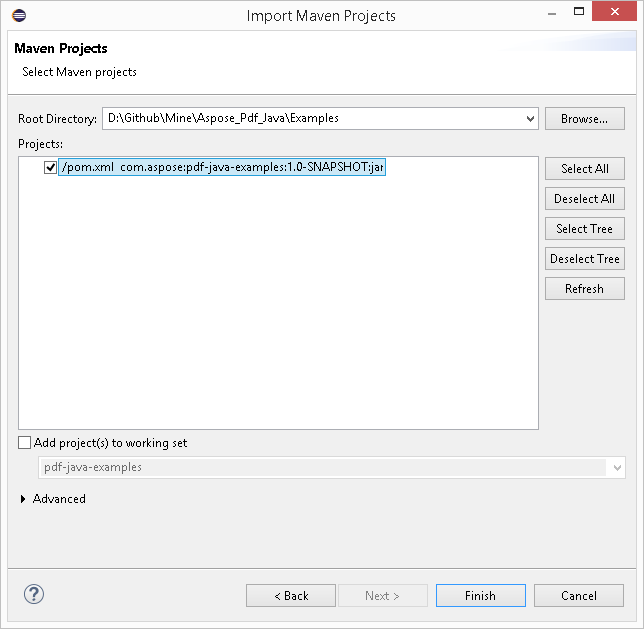
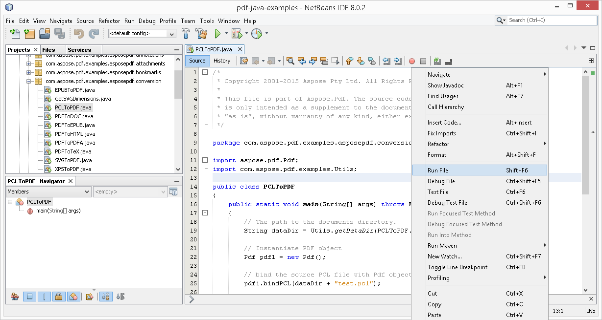

## تحميل من GitHub

جميع أمثلة Aspose.PDF للأندرويد عبر جافا مستضافة على [GitHub](https://github.com/aspose-pdf/Aspose.PDF-for-Java). يمكنك إما استنساخ المستودع باستخدام عميل Github المفضل لديك أو تنزيل ملف ZIP من [هنا](https://github.com/aspose-pdf/Aspose.PDF-for-Java/archive/master.zip).

استخرج محتويات ملف ZIP إلى أي مجلد على حاسوبك. جميع الأمثلة موجودة في المجلد **Examples**.

يستخدم المشروع نظام بناء Maven. يمكن لأي بيئة تطوير متكاملة حديثة أن تفتح أو تستورد المشروع واعتماده بسهولة. أدناه نوضح لك كيفية استخدام البيئات التطويرية الشهيرة لبناء وتشغيل الأمثلة.

### IntelliJ IDEA

انقر على قائمة **File** واختر **Open**. استعرض إلى مجلد المشروع وحدد ملف **pom.xml**.

سيتم فتح المشروع وتنزيل الاعتمادات تلقائيًا. من علامة تبويب Project، استعرض الأمثلة في المجلد **src/main/java**. لتشغيل مثال، انقر بزر الفأرة الأيمن على الملف واختر "Run .."، سيتم تنفيذ المثال وسيظهر الخرج في نافذة وحدة التحكم المدمجة.

### Eclipse

انقر على قائمة **File** واختر **Import**. حدد **Maven** - Existing Maven Projects.

استعرض إلى المجلد الذي قمت باستنساخه أو تنزيله من GitHub وحدد ملف **pom.xml**.

سيتم فتح المشروع وتنزيل الاعتمادات تلقائيًا. من علامة تبويب Package Explorer، استعرض الأمثلة في المجلد **src/main/java**. لتشغيل مثال، انقر بزر الفأرة الأيمن على الملف واختر **Run As** - **Java Application**، سيتم تنفيذ المثال وسيظهر الخرج في نافذة وحدة التحكم المدمجة.

### NetBeans

انقر على القائمة **File** واختر **Open Project**. استعرض المجلد الذي قمت باستنساخه أو تنزيله من GitHub. ستظهر أيقونة مجلد **Examples** لتوضح أنه مشروع Maven. اختر Examples وافتحه.

سيفتح المشروع ويقوم بتحميل التبعيات تلقائيًا. من علامة تبويب Projects، استعرض الأمثلة في **source packages**. لتشغيل مثال، انقر بزر الماوس الأيمن على الملف واختر **Run File**، سيتم تنفيذ المثال وسيتم عرض الناتج في نافذة الإخراج المدمجة في وحدة التحكم.

### المساهمة

إذا كنت ترغب في إضافة مثال أو تحسينه، فإننا نشجعك على المساهمة في المشروع. جميع الأمثلة ومشاريع العرض في هذا المستودع مفتوحة المصدر ويمكن استخدامها بحرية في تطبيقاتك الخاصة.

للمساهمة، يمكنك تفرع (fork) المستودع، تعديل الشيفرة المصدرية وإنشاء طلب سحب (pull request). سنقوم بمراجعة التغييرات وتضمينها في المستودع إذا ثبت أنها مفيدة.

