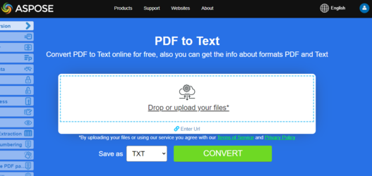

## تحويل PDF إلى EPUB

**<abbr title="Electronic Publication">EPUB</abbr>** هو معيار مجاني ومفتوح للكتب الإلكترونية من المنتدى الدولي للنشر الرقمي (IDPF). الملفات لها الامتداد .epub.
تم تصميم EPUB للمحتوى القابل لإعادة التدفق، مما يعني أن قارئ EPUB يمكنه تحسين النص لجهاز عرض معين. يدعم EPUB أيضًا المحتوى ذو التخطيط الثابت. الصيغة مقصودة كصيغة واحدة يمكن للناشرين ومنازل التحويل استخدامها داخليًا، وكذلك للتوزيع والبيع. وهو يحل محل معيار Open eBook.

المقتطف البرمجي المقدم بلغة Go يوضح كيفية تحويل مستند PDF إلى EPUB باستخدام مكتبة Aspose.PDF:

1. افتح مستند PDF.
1. تحويل ملف PDF إلى EPUB باستخدام [حفظEpub]() دالة.
1. أغلق مستند PDF وحرّر أي موارد مخصصة.

```go

    package main

    import "github.com/aspose-pdf/aspose-pdf-go-cpp"
    import "log"

    func main() {
      // Open(filename string) opens a PDF-document with filename
      pdf, err := asposepdf.Open("sample.pdf")
      if err != nil {
        log.Fatal(err)
      }
      // SaveEpub(filename string) saves previously opened PDF-document as Epub-document with filename
      err = pdf.SaveEpub("sample.epub")
      if err != nil {
        log.Fatal(err)
      }
      // Close() releases allocated resources for PDF-document
      defer pdf.Close()
    }
```

{}
**حاول تحويل PDF إلى EPUB عبر الإنترنت**

تقدم لك Aspose.PDF for Go تطبيقًا مجانيًا عبر الإنترنت [PDF إلى EPUB](https://products.aspose.app/pdf/conversion/pdf-to-epub)، حيث يمكنك محاولة استكشاف الوظيفة والجودة التي يعمل بها.

[](https://products.aspose.app/pdf/conversion/pdf-to-epub)
{}

## تحويل PDF إلى TeX

**Aspose.PDF for Go** يدعم تحويل PDF إلى TeX.
تنسيق ملف LaTeX هو تنسيق ملف نصي يحتوي على وسم خاص ويُستخدم في نظام إعداد المستندات القائم على TeX لتنسيق عالي الجودة.

يظهر مقطع كود Go المقدم كيفية تحويل مستند PDF إلى TeX باستخدام مكتبة Aspose.PDF:

1. افتح مستند PDF.
1. تحويل ملف PDF إلى TeX باستخدام [SaveTeX](https://reference.aspose.com/pdf/go-cpp/convert/savetex/) دالة.
1. أغلق مستند PDF وحرّر أي موارد مخصصة.

```go

    package main

    import "github.com/aspose-pdf/aspose-pdf-go-cpp"
    import "log"

    func main() {
      // Open(filename string) opens a PDF-document with filename
      pdf, err := asposepdf.Open("sample.pdf")
      if err != nil {
        log.Fatal(err)
      }
      // SaveTeX(filename string) saves previously opened PDF-document as TeX-document with filename
      err = pdf.SaveTeX("sample.tex")
      if err != nil {
        log.Fatal(err)
      }
      // Close() releases allocated resources for PDF-document
      defer pdf.Close()
    }
```

{}
**حاول تحويل PDF إلى LaTeX/TeX عبر الإنترنت**

تقدم لك Aspose.PDF for Go تطبيقًا مجانيًا عبر الإنترنت ["PDF إلى LaTeX"](https://products.aspose.app/pdf/conversion/pdf-to-tex)، حيث يمكنك محاولة استكشاف الوظيفة والجودة التي يعمل بها.

[](https://products.aspose.app/pdf/conversion/pdf-to-tex)
{}

## تحويل PDF إلى TXT

يعرض مقتطف الشيفرة بلغة Go المقدم كيفية تحويل مستند PDF إلى TXT باستخدام مكتبة Aspose.PDF:

1. افتح مستند PDF.
1. تحويل ملف PDF إلى TXT باستخدام [SaveTxt](https://reference.aspose.com/pdf/go-cpp/convert/savetxt/) دالة.
1. أغلق مستند PDF وحرّر أي موارد مخصصة.

```go

    package main

    import "github.com/aspose-pdf/aspose-pdf-go-cpp"
    import "log"

    func main() {
      // Open(filename string) opens a PDF-document with filename
      pdf, err := asposepdf.Open("sample.pdf")
      if err != nil {
        log.Fatal(err)
      }
      // SaveTxt(filename string) saves previously opened PDF-document as Txt-document with filename
      err = pdf.SaveTxt("sample.txt")
      if err != nil {
        log.Fatal(err)
      }
      // Close() releases allocated resources for PDF-document
      defer pdf.Close()
    }
```

{}
**حاول تحويل PDF إلى نص عبر الإنترنت**

تقدم لك Aspose.PDF for Go تطبيقًا مجانيًا عبر الإنترنت [\"PDF إلى نص\"](https://products.aspose.app/pdf/conversion/pdf-to-txt)، حيث يمكنك محاولة استكشاف الوظيفة والجودة التي يعمل بها.

[](https://products.aspose.app/pdf/conversion/pdf-to-txt)
{}

## تحويل PDF إلى XPS

نوع ملف XPS مرتبط أساسًا بمواصفة الورق XML التي طورتها شركة مايكروسوفت. مواصفة الورق XML (XPS)، التي كانت في السابق تحمل اسم كود ميترو وتضم مفهوم التسويق مسار الطباعة للجيل التالي (NGPP)، هي مبادرة مايكروسوفت لدمج إنشاء المستندات وعرضها في نظام التشغيل ويندوز.

**Aspose.PDF for Go** يوفر إمكانية تحويل ملفات PDF إلى <abbr title="XML Paper Specification">XPS</abbr> التنسيق. دعنا نجرب استخدام مقتطف الشيفرة المقدم لتحويل ملفات PDF إلى تنسيق XPS باستخدام Go.

يوضح مقطع كود Go المقدم كيفية تحويل مستند PDF إلى XPS باستخدام مكتبة Aspose.PDF:

1. افتح مستند PDF.
1. تحويل ملف PDF إلى XPS باستخدام [SaveXps](https://reference.aspose.com/pdf/go-cpp/convert/savexps/) دالة.
1. أغلق مستند PDF وحرّر أي موارد مخصصة.

```go

    package main

    import "github.com/aspose-pdf/aspose-pdf-go-cpp"
    import "log"

    func main() {
      // Open(filename string) opens a PDF-document with filename
      pdf, err := asposepdf.Open("sample.pdf")
      if err != nil {
        log.Fatal(err)
      }
      // SaveXps(filename string) saves previously opened PDF-document as Xps-document with filename
      err = pdf.SaveXps("sample.xps")
      if err != nil {
        log.Fatal(err)
      }
      // Close() releases allocated resources for PDF-document
      defer pdf.Close()
    }
```

{}
**حاول تحويل PDF إلى XPS عبر الإنترنت**

تقدم لك Aspose.PDF for Go تطبيقًا مجانيًا عبر الإنترنت ["PDF إلى XPS"](https://products.aspose.app/pdf/conversion/pdf-to-xps)، حيث يمكنك محاولة استكشاف الوظيفة والجودة التي يعمل بها.

[](https://products.aspose.app/pdf/conversion/pdf-to-xps)
{}

## تحويل PDF إلى PDF بتدرج الرمادي

يوضح مقطع الشيفرة بلغة Go المقدم كيفية تحويل الصفحة الأولى من مستند PDF إلى PDF بتدرج الرمادي باستخدام مكتبة Aspose.PDF:

1. افتح مستند PDF.
1. تحويل صفحة PDF إلى PDF بالأبيض والأسود باستخدام [PageGrayscale](https://reference.aspose.com/pdf/go-cpp/organize/pagegrayscale/) دالة.
1. أغلق مستند PDF وحرّر أي موارد مخصصة.

هذا المثال يحوِّل صفحة محددة من ملف PDF الخاص بك إلى اللون الرمادي:

```go

    package main

    import "github.com/aspose-pdf/aspose-pdf-go-cpp"
    import "log"

    func main() {
      // Open(filename string) opens a PDF-document with filename
      pdf, err := asposepdf.Open("sample.pdf")
      if err != nil {
        log.Fatal(err)
      }
      // PageGrayscale(num int32) converts page to black and white
      err = pdf.PageGrayscale(1)
      if err != nil {
        log.Fatal(err)
      }
      // SaveAs(filename string) saves previously opened PDF-document with new filename
      err = pdf.SaveAs("sample_page1_Grayscale.pdf")
      if err != nil {
        log.Fatal(err)
      }
      // Close() releases allocated resources for PDF-document
      defer pdf.Close()
    }
```

سوف يقوم هذا المثال بتحويل مستند PDF بالكامل إلى التدرج الرمادي:

```go

    package main

    import "github.com/aspose-pdf/aspose-pdf-go-cpp"
    import "log"

    func main() {
      // Open(filename string) opens a PDF-document with filename
      pdf, err := asposepdf.Open("sample.pdf")
      if err != nil {
        log.Fatal(err)
      }
      // Grayscale() converts PDF-document to black and white
      err = pdf.Grayscale()
      if err != nil {
        log.Fatal(err)
      }
      // SaveAs(filename string) saves previously opened PDF-document with new filename
      err = pdf.SaveAs("sample_Grayscale.pdf")
      if err != nil {
        log.Fatal(err)
      }
      // Close() releases allocated resources for PDF-document
      defer pdf.Close()
    }
```