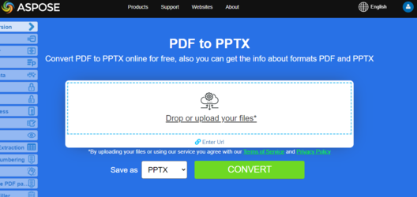

## تحويل PDF إلى PPTX

يعرض مقتطف كود Go المقدم كيفية تحويل مستند PDF إلى PPTX باستخدام مكتبة Aspose.PDF:

1. افتح مستند PDF.
1. حوّل ملف PDF إلى PPTX باستخدام [SavePptx](https://reference.aspose.com/pdf/go-cpp/convert/savepptx/) دالة.
1. أغلق مستند PDF وأطلق أي موارد مخصصة.

```go

    package main

    import "github.com/aspose-pdf/aspose-pdf-go-cpp"
    import "log"

    func main() {
      // Open(filename string) opens a PDF-document with filename
      pdf, err := asposepdf.Open("sample.pdf")
      if err != nil {
        log.Fatal(err)
      }
      // SavePptX(filename string) saves previously opened PDF-document as PptX-document with filename
      err = pdf.SavePptX("sample.pptx")
      if err != nil {
        log.Fatal(err)
      }
      // Close() releases allocated resources for PDF-document
      defer pdf.Close()
    }
```

{}
**حاول تحويل PDF إلى PowerPoint عبر الإنترنت**

تقدم لك Aspose.PDF for Go تطبيقًا مجانيًا عبر الإنترنت [“PDF to PPTX”](https://products.aspose.app/pdf/conversion/pdf-to-pptx), حيث يمكنك تجربة استكشاف الوظائف والجودة التي يعمل بها.

[](https://products.aspose.app/pdf/conversion/pdf-to-pptx)
{}