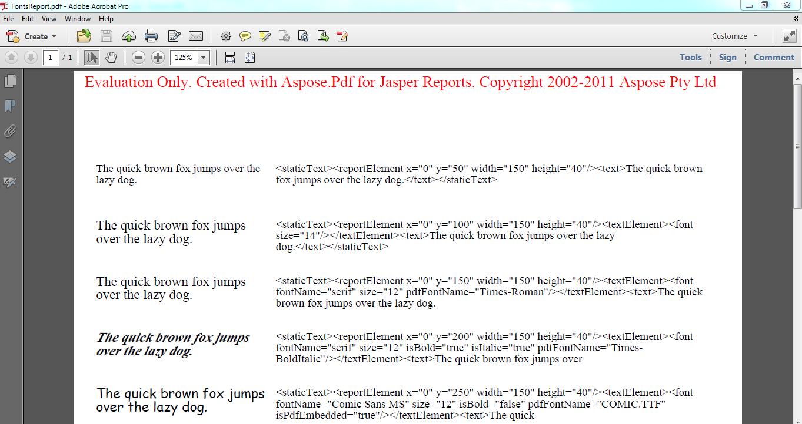

---
title: تقييم Aspose.PDF
linktitle: تقييم Aspose.PDF
type: docs
weight: 70
url: /ar/jasperreports/evaluate-aspose-pdf/
description: قم بتقييم Aspose.PDF for JasperReports مجانًا. استمتع بإمكانيات تصدير PDF المتقدمة قبل الالتزام.
lastmod: "2026-08-31"
---

{}

تأكد من الاستفادة من تقييم Aspose.PDF المجاني لـ JasperReports لأنه ليس له حد زمني، ويتم توفير الدعم الفني المجاني لمستخدمي التقييم أيضًا.

{}

{}

إنه نفس التنزيل لكل من التقييم والإصدار المدفوع من Aspose.PDF for JasperReports. ما عليك سوى تنزيل Aspose.PDF for JasperReports من صفحة التنزيل، وتثبيته وسيعمل في وضع التقييم افتراضيًا.

يقوم وضع التقييم بإدخال تحذير تقييم في المستندات المصدرة. عندما تقوم بشراء ترخيص، ما عليك سوى تطبيق الترخيص وسيعمل Aspose.PDF for JasperReports بعد ذلك في الوضع المرخص.

**يقوم Aspose.PDF for JasperReports بإدخال تحذير تقييمي عند العمل في وضع التقييم.**

{}

