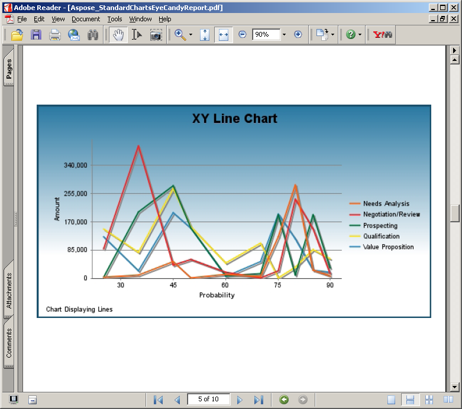
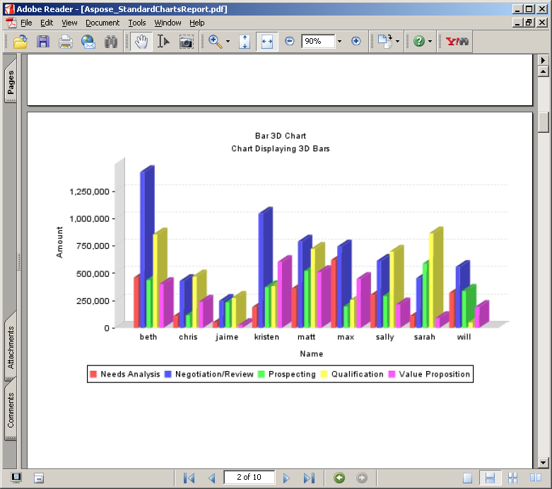

---
title: معرض نماذج التقارير
linktitle: معرض نماذج التقارير
type: docs
weight: 40
url: /ar/jasperreports/sample-reports-gallery/
description: عرض نماذج التقارير التي تم إنشاؤها باستخدام Aspose.PDF for JasperReports. انظر كيف يعزز قدرات تصدير PDF.
lastmod: "2021-06-05"
---

{}

يوضح هذا المعرض تقارير PDF التي تم تصديرها بواسطة Aspose.PDF for JasperReports.

{}

تعتمد التقارير الموضحة أدناه على بيانات نموذجية تم تثبيتها باستخدام JasperServer.

## تقرير جميع الحسابات

## تقرير محلات السوبر ماركت

## تقرير الرسوم البيانية القياسية لبحر إيجه

## تقرير الرسوم البيانية القياسية لبحر إيجه

## الرسوم البيانية القياسية تقرير حلوى العين

## الرسوم البيانية القياسية تقرير حلوى العين

## الرسوم البيانية القياسية تقرير حلوى العين

## تقرير الرسوم البيانية القياسية

## تقرير الرسوم البيانية القياسية

