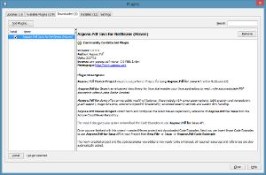

## التثبيت

يمكن تثبيت المكوّن الإضافي **Aspose.PDF Java for NetBeans (Maven)** بسهولة من علامة التبويب **Plugin** المتاحة في مربع حوار Plugin.

- لفتحه، اختر **Plugins** من قائمة **Tools** في NetBeans.

- يقوم هذا بإضافة **Aspose.PDF Maven Project** في معالج New Project و **Aspose.PDF Code Example** في معالج New File في NetBeans IDE.

## باستخدام

### Aspose.PDF Maven Project (معالج)

لإنشاء **Maven Project** باستخدام المعالج للاستخدام [Aspose.PDF for Java API](http://www.aspose.com/java/pdf-component.aspx):

1. حدّد **New Project**.
2. اختر **Aspose.PDF Maven Project** في فئة **Maven**.
3. انقر **Next**.

وفر **Project Name, Location, GroupId, ArtifactId** و **Version** لمشروع Maven الخاص بك وانقر **Finish**.

سيسترجع هذا [Aspose.PDF for Java](http://www.aspose.com/java/pdf-component.aspx) الأحدث [اعتماد Maven](http://maven.aspose.com/repository/ext-release-local/com/aspose/aspose-pdf/) مرجع من [مستودع Aspose Cloud Maven](https://repository.aspose.com/webapp/#/artifacts/browse/tree/General/repo) وقم بتكوينه في **pom.xml**. إذا قمت باختيار **Also Download Code Examples,** سيبدأ تحميل **Code Examples** أيضاً من [مستودع أمثلة API لـ Aspose.PDF for Java. ](https://github.com/aspose-pdf/Aspose.PDF-for-Java/tree/master/Examples)
سيتم إنشاء مشروع **Maven** التالي في **NetBeans IDE** الخاص بك عند إكمال المعالج:

تم إنشاء **Maven Project** وتم تكوينه لاستخدام **Aspose.PDF for Java API** وهو جاهز للتعزيز وفقًا لمتطلبات مشروعك.
   إذا قمت باختيار التحميل [أمثلة الكود](https://github.com/aspose-pdf/Aspose.PDF-for-Java/tree/master/Examples)، يمكنك استخدام **Aspose.PDF Code Example (wizard)** لاستيراد **Code Examples** المطلوبة من [Aspose.PDF for Java](http://www.aspose.com/java/pdf-component.aspx) API إلى مشروعك.

### Aspose.PDF Code Example (wizard)

**Aspose.PDF Code Example wizard** يتيح لك تجربة العديد من العينات المتوفرة لـ [Aspose.PDF for Java](http://www.aspose.com/java/pdf-component.aspx) API.

{}

لكي تتمكن من استخدام **Aspose.PDF Code Example wizard** بسهولة: يُنصح دائمًا باختيار **Also Download Code Examples** أثناء إنشاء **Maven Project** على **Aspose.PDF Maven Project** **wizard**,

{}

لاستخدام الأمثلة، فقط:

1. انقر على **New File** في **NetBeans**.
2. اختر مشروعك ثم حدد **Aspose.PDF Code Example** في فئة **Java**.
3. انقر **Next**.

قم بتوسيع الشجرة لتحديد فئة **Code Example** وانقر على **Finish**.

 سيقوم هذا بنسخ ملفات Java من الفئة المحددة **Code Examples** إلى المشروع تحت حزمة **com.aspose.pdf.examples**. كما سيتم نسخ أي موارد مطلوبة من قبل أمثلة الشيفرة إلى مجلد **src/main/resources**، كما هو موضح أدناه:

 راجع شفرة المثال، وقم بتجميعها وتشغيلها.
 يمكنك الآن اختبار أمثلة أخرى والبدء في بناء تطبيقك الخاص باستخدام [Aspose.PDF for Java API](http://www.aspose.com/java/pdf-component.aspx).
