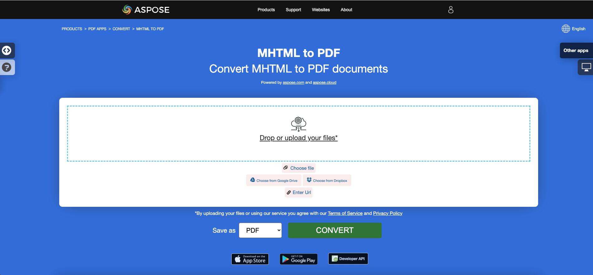

## نظرة عامة

هذا المقال يشرح كيفية **تحويل HTML إلى PDF باستخدام C#**. يغطي الموضوعات التالية.

الشفرة البرمجية التالية تعمل أيضًا مع مكتبة [Aspose.PDF.Drawing](/pdf/net/drawing/).

_التنسيق_: **HTML**
- [C# HTML إلى PDF](#csharp-html-to-pdf)
- [C# تحويل HTML إلى PDF](#csharp-html-to-pdf)
- [C# كيفية تحويل HTML إلى PDF](#csharp-html-to-pdf)

_التنسيق_: **MHTML**
- [C# MHTML إلى PDF](#csharp-mhtml-to-pdf)
- [C# تحويل MHTML إلى PDF](#csharp-mhtml-to-pdf)
- [C# كيفية تحويل MHTML إلى PDF](#csharp-mhtml-to-pdf)

_التنسيق_: **WebPage**
- [C# WebPage إلى PDF](#csharp-webpage-to-pdf)
- [C# تحويل WebPage إلى PDF](#csharp-webpage-to-pdf)
- [C# كيفية تحويل WebPage إلى PDF](#csharp-webpage-to-pdf)

## تحويل HTML إلى PDF باستخدام C#
## تحويل HTML إلى PDF في C#

**Aspose.PDF لـ .NET** هو API للتعامل مع ملفات PDF يتيح لك تحويل أي مستندات HTML موجودة إلى PDF بسلاسة. يمكن تخصيص عملية تحويل HTML إلى PDF بمرونة.

## تحويل HTML إلى PDF

المثال التالي بلغة C# يوضح كيفية تحويل مستند HTML إلى PDF.

<a name="csharp-html-to-pdf"><strong>الخطوات: تحويل HTML إلى PDF في C#</strong></a>

1. إنشاء نموذج من الفئة [HtmlLoadOptions](https://reference.aspose.com/pdf/net/aspose.pdf/htmlloadoptions/).
2. تهيئة كائن [Document](https://reference.aspose.com/pdf/net/aspose.pdf/document/).
3. حفظ مستند PDF الناتج من خلال استدعاء طريقة **Document.Save()**.

```csharp
public static void ConvertHTMLtoPDF()
{
    HtmlLoadOptions options= new HtmlLoadOptions();
    Document pdfDocument= new Document(_dataDir + "test.html", options);
    pdfDocument.Save(_dataDir + "html_test.PDF");
}
```

{}
**جرب تحويل HTML إلى PDF عبر الإنترنت**

Aspose يقدم لك تطبيق مجاني عبر الإنترنت ["HTML to PDF"](https://products.aspose.app/html/en/conversion/html-to-pdf)، حيث يمكنك تجربة الوظائف وجودة عمله.

Aspose يقدم لك تطبيقًا مجانيًا عبر الإنترنت ["HTML إلى PDF"](https://products.aspose.app/html/ar/conversion/html-to-pdf)، حيث يمكنك تجربة وظائفه وجودته.

[](https://products.aspose.app/html/ar/conversion/html-to-pdf)
{}


## التحويل المتقدم من HTML إلى PDF

محرك تحويل HTML لديه عدة خيارات تتيح لنا التحكم في عملية التحويل.

### دعم استعلامات الوسائط

استعلامات الوسائط هي تقنية شائعة لتقديم ورقة أنماط مخصصة لأجهزة مختلفة. يمكننا تعيين نوع الجهاز باستخدام خاصية [`HtmlMediaType`](https://reference.aspose.com/pdf/net/aspose.pdf/htmlloadoptions/properties/htmlmediatype).

```csharp
public static void ConvertHTMLtoPDFAdvanced_MediaType()
{
    HtmlLoadOptions options = new HtmlLoadOptions
    {
        // تعيين وضع الطباعة أو الشاشة
        HtmlMediaType = HtmlMediaType.Print
    };
    Document pdfDocument = new Document(_dataDir + "test.html", options);
    pdfDocument.Save(_dataDir + "html_test.PDF");
}
```
### تمكين (تعطيل) تضمين الخطوط

غالبًا ما تستخدم صفحات HTML الخطوط (مثل خطوط من المجلد المحلي، خطوط Google، إلخ). يمكننا أيضًا التحكم في تضمين الخطوط في المستند باستخدام خاصية [`IsEmbedFonts`](https://reference.aspose.com/pdf/net/aspose.pdf/htmlloadoptions/properties/isembedfonts).

```csharp
public static void ConvertHTMLtoPDFAdvanced_EmbedFonts()
{
    // تعطيل تضمين الخطوط
    HtmlLoadOptions options = new HtmlLoadOptions {IsEmbedFonts = false};
    Document pdfDocument= new Document(_dataDir + "test_fonts.html", options);
    pdfDocument.Save(_dataDir + "html_test.PDF");
}
```

### إدارة تحميل الموارد الخارجية

يوفر محرك التحويل آلية تتيح لك التحكم في تحميل بعض الموارد المرتبطة بمستند HTML.
تحتوي فئة [`HtmlLoadOptions`](https://reference.aspose.com/pdf/net/aspose.pdf/htmlloadoptions) على خاصية [`CustomLoaderOfExternalResources`](https://reference.aspose.com/pdf/net/aspose.pdf/htmlloadoptions/fields/customloaderofexternalresources) التي يمكننا من خلالها تحديد سلوك محمل الموارد.
فئة [`HtmlLoadOptions`](https://reference.aspose.com/pdf/net/aspose.pdf/htmlloadoptions) لديها الخاصية [`CustomLoaderOfExternalResources`](https://reference.aspose.com/pdf/net/aspose.pdf/htmlloadoptions/fields/customloaderofexternalresources) التي يمكننا من خلالها تحديد سلوك محمل الموارد.
لنفترض أننا بحاجة إلى استبدال جميع صور PNG بصورة واحدة `test.jpg` واستبدال العنوان URL الخارجي بعنوان داخلي للموارد الأخرى.
للقيام بذلك يمكننا تعريف محمل مخصص `SamePictureLoader` وتوجيه [`CustomLoaderOfExternalResources`](https://reference.aspose.com/pdf/net/aspose.pdf/htmlloadoptions/fields/customloaderofexternalresources) إلى هذا الاسم.

```csharp
public static void ConvertHTMLtoPDFAdvanced_DummyImage()
{
    HtmlLoadOptions options = new HtmlLoadOptions
    {
        CustomLoaderOfExternalResources = SamePictureLoader
    };
    Document pdfDocument= new Document(_dataDir + "test.html", options);
    pdfDocument.Save(_dataDir + "html_test.PDF");
}

private static LoadOptions.ResourceLoadingResult SamePictureLoader(string resourceURI)
{
    LoadOptions.ResourceLoadingResult result;

    if (resourceURI.EndsWith(".png"))
    {
        byte[] resultBytes = File.ReadAllBytes(_dataDir + "test.jpg");
        result = new LoadOptions.ResourceLoadingResult(resultBytes)
        {
            //Set MIME Type
            MIMETypeIfKnown = "image/jpeg"
        };
    }
    else
    {
        result = new LoadOptions.ResourceLoadingResult(GetContentFromUrl(resourceURI));
    }
    return result;
}

private static byte[] GetContentFromUrl(string url)
{
    var httpClient = new HttpClient();
    return httpClient.GetByteArrayAsync(url).GetAwaiter().GetResult();
}
```
## تحويل صفحة ويب إلى PDF

تحويل صفحة ويب يختلف قليلاً عن تحويل مستند HTML محلي. لتحويل محتويات صفحة ويب إلى تنسيق PDF، يمكننا أولاً جلب محتويات الصفحة HTML باستخدام مثيل HttpClient، إنشاء كائن Stream، تمرير المحتويات إلى كائن الوثيقة وتقديم الناتج بتنسيق PDF.

عند تحويل صفحة ويب مستضافة على خادم ويب إلى PDF:

<a name="csharp-webpage-to-pdf"><strong>الخطوات: تحويل صفحة ويب إلى PDF في C#</strong></a>

1. قراءة محتويات الصفحة باستخدام كائن HttpClient.
1. تكوين كائن [HtmlLoadOptions](https://reference.aspose.com/pdf/net/aspose.pdf/htmlloadoptions) وتعيين العنوان الأساسي.
1. تهيئة كائن الوثيقة أثناء تمرير كائن البث.
1. اختياريًا، تعيين حجم الصفحة و/أو التوجيه.

```csharp
public static void ConvertHTMLtoPDFAdvanced_WebPage()
{
    const string url = "https://en.wikipedia.org/wiki/Aspose_API";
    // تعيين حجم الصفحة A3 والتوجه الأفقي؛   
    HtmlLoadOptions options = new HtmlLoadOptions(url)
    {
        PageInfo = {Width = 842, Height = 1191, IsLandscape = true}
    };
    Document pdfDocument= new Document(GetContentFromUrlAsStream(url), options);
    pdfDocument.Save(_dataDir + "html_test.PDF");
}

private static Stream GetContentFromUrlAsStream(string url, ICredentials credentials = null)
{
    using (var handler = new HttpClientHandler { Credentials = credentials })
    using (var httpClient = new HttpClient(handler))
    {
        return httpClient.GetStreamAsync(url).GetAwaiter().GetResult();
    }
}
```
### توفير بيانات اعتماد صفحة الويب لتحويلها إلى PDF

في بعض الأحيان، نحتاج إلى تنفيذ تحويل ملفات HTML التي تتطلب مصادقة وامتيازات الوصول، بحيث يمكن للمستخدمين الموثوق بهم فقط استرداد محتويات الصفحة. يشمل هذا السيناريو أيضًا الحالات التي يتم فيها جلب بعض الموارد/البيانات المرجعية داخل HTML من خادم خارجي يتطلب مصادقة، ولتلبية هذا الطلب، تم إضافة خاصية [`ExternalResourcesCredentials`](https://reference.aspose.com/pdf/net/aspose.pdf/htmlloadoptions/fields/externalresourcescredentials) إلى فئة [`HtmlLoadOptions`](https://reference.aspose.com/pdf/net/aspose.pdf/htmlloadoptions). يوضح الجزء التالي من الكود الخطوات لتمرير بيانات الاعتماد لطلب HTML والموارد المرتبطة به أثناء تحويل ملف HTML إلى تحويل PDF.

```csharp
public static void ConvertHTMLtoPDFAdvanced_Authorized()
{
    const string url = "http://httpbin.org/basic-auth/user1/password1";
    var credentials = new NetworkCredential("user1", "password1");
    HtmlLoadOptions options = new HtmlLoadOptions(url)
    {
        ExternalResourcesCredentials = credentials
    };
    Document pdfDocument= new Document(GetContentFromUrlAsStream(url, credentials), options);
    pdfDocument.Save(_dataDir + "html_test.PDF");
}

private static Stream GetContentFromUrlAsStream(string url, ICredentials credentials = null)
{
    using (var handler = new HttpClientHandler { Credentials = credentials })
    using (var httpClient = new HttpClient(handler))
    {
        return httpClient.GetStreamAsync(url).GetAwaiter().GetResult();
    }
}
```
### عرض كل محتوى HTML في صفحة واحدة

Aspose.PDF لـ .NET يوفر القدرة على عرض كل المحتويات على صفحة واحدة أثناء تحويل ملف HTML إلى تنسيق PDF. على سبيل المثال، إذا كان لديك بعض محتوى HTML الذي يزيد حجم الناتج عن صفحة واحدة، يمكنك استخدام خيار لعرض البيانات الناتجة في صفحة PDF واحدة. لاستخدام هذا الخيار تم توسيع فئة HtmlLoadOptions بواسطة علم IsRenderToSinglePage. يوضح مقتطف الكود أدناه كيفية استخدام هذه الوظيفة.

```csharp
// للأمثلة الكاملة وملفات البيانات، يرجى الذهاب إلى https://github.com/aspose-pdf/Aspose.PDF-for-.NET
// المسار إلى دليل المستندات.
string dataDir = RunExamples.GetDataDir_AsposePdf_DocumentConversion();
// تهيئة خيارات تحميل وحفظ HTML
HtmlLoadOptions options = new HtmlLoadOptions();
// تعيين خاصية العرض في صفحة واحدة
options.IsRenderToSinglePage = true;
// تحميل المستند
Document pdfDocument= new Document(dataDir + "HTMLToPDF.html", options);
// حفظ
pdfDocument.Save(dataDir + "RenderContentToSamePage.pdf");
```

### عرض HTML مع بيانات SVG
### عرض HTML مع بيانات SVG

Aspose.PDF لـ .NET يوفر القدرة على تحويل صفحة HTML إلى مستند PDF. نظرًا لأن HTML يسمح بإضافة عنصر الرسوميات SVG كعلامة في الصفحة، فإن Aspose.PDF يدعم أيضًا تحويل هذه البيانات إلى ملف PDF الناتج. يوضح المقتطف التالي من الكود كيفية تحويل ملفات HTML التي تحتوي على علامات الرسوميات SVG إلى مستندات PDF موسومة.

```csharp
// للحصول على أمثلة كاملة وملفات البيانات، يرجى الذهاب إلى https://github.com/aspose-pdf/Aspose.PDF-for-.NET
// مسار إلى دليل المستندات.
string dataDir = RunExamples.GetDataDir_AsposePdf_DocumentConversion();
// تعيين مسار الملف الإدخالي
string inFile = dataDir + "HTMLSVG.html";
// تعيين مسار الملف الإخراجي
string outFile = dataDir + "RenderHTMLwithSVGData.pdf";
// تهيئة خيارات HtmlLoadOptions
HtmlLoadOptions options = new HtmlLoadOptions(Path.GetDirectoryName(inFile));
// تهيئة كائن Document
Document pdfDocument = new Document(inFile, options);
// حفظ
pdfDocument.Save(outFile);
```

## تحويل MHTML إلى PDF

{}
**جرب تحويل MHTML إلى PDF عبر الإنترنت**
**حاول تحويل MHTML إلى PDF عبر الإنترنت**

Aspose.PDF لـ .NET يقدم لك تطبيقًا مجانيًا عبر الإنترنت ["MHTML إلى PDF"](https://products.aspose.app/pdf/conversion/mhtml-to-pdf)، حيث يمكنك تجربة استكشاف الوظائف والجودة التي يعمل بها.

[](https://products.aspose.app/pdf/conversion/mhtml-to-pdf)
{}

<abbr title="تغليف MIME لوثائق HTML المجمعة">MHTML</abbr>، اختصار لـ MIME HTML، هو تنسيق أرشيف صفحة ويب يُستخدم لدمج الموارد التي يتم تمثيلها عادةً بواسطة روابط خارجية (مثل الصور، ورسومات Flash، وبرامج Java، وملفات الصوت) مع كود HTML في ملف واحد.
<abbr title="تغليف MIME لمستندات HTML المجمعة">MHTML</abbr>، والمختصر لـ MIME HTML، هو تنسيق أرشيف صفحة ويب يُستخدم لدمج الموارد التي تُمثل عادةً بواسطة روابط خارجية (مثل الصور، ورسومات فلاش، وتطبيقات جافا، وملفات الصوت) مع كود HTML في ملف واحد.

<a name="csharp-mhtml-to-pdf"><strong>خطوات: تحويل MHTML إلى PDF في C#</strong></a>

1. قم بإنشاء نسخة من الفئة [MhtLoadOptions](https://reference.aspose.com/pdf/net/aspose.pdf/mhtloadoptions/).
2. قم بتهيئة كائن [Document](https://reference.aspose.com/pdf/net/aspose.pdf/document/).
3. قم بحفظ مستند PDF الناتج بإستخدام الأمر **Document.Save()**.

```csharp
public static void ConvertMHTtoPDF()
{
    MhtLoadOptions options = new MhtLoadOptions()
    {
        PageInfo = { Width = 842, Height = 1191, IsLandscape = true}
    };
    Document pdfDocument= new Document(_dataDir + "fileformatinfo.mht", options);
    pdfDocument.Save(_dataDir + "mhtml_test.PDF");
}
```

## انظر أيضا 

تغطي هذه المقالة هذه الموضوعات.
هذه المقالة تغطي أيضاً هذه المواضيع.

_التنسيق_: **HTML**
- [كود تحويل HTML إلى PDF بلغة C#](#csharp-html-to-pdf)
- [واجهة برمجة تطبيقات تحويل HTML إلى PDF بلغة C#](#csharp-html-to-pdf)
- [برمجة تحويل HTML إلى PDF بلغة C#](#csharp-html-to-pdf)
- [مكتبة تحويل HTML إلى PDF بلغة C#](#csharp-html-to-pdf)
- [حفظ HTML كـ PDF بلغة C#](#csharp-html-to-pdf)
- [توليد PDF من HTML بلغة C#](#csharp-html-to-pdf)
- [إنشاء PDF من HTML بلغة C#](#csharp-html-to-pdf)
- [محول HTML إلى PDF بلغة C#](#csharp-html-to-pdf)

_التنسيق_: **MHTML**
- [كود تحويل MHTML إلى PDF بلغة C#](#csharp-mhtml-to-pdf)
- [واجهة برمجة تطبيقات تحويل MHTML إلى PDF بلغة C#](#csharp-mhtml-to-pdf)
- [برمجة تحويل MHTML إلى PDF بلغة C#](#csharp-mhtml-to-pdf)
- [مكتبة تحويل MHTML إلى PDF بلغة C#](#csharp-mhtml-to-pdf)
- [حفظ MHTML كـ PDF بلغة C#](#csharp-mhtml-to-pdf)
- [توليد PDF من MHTML بلغة C#](#csharp-mhtml-to-pdf)
- [إنشاء PDF من MHTML بلغة C#](#csharp-mhtml-to-pdf)
- [محول MHTML إلى PDF بلغة C#](#csharp-mhtml-to-pdf)

_التنسيق_: **WebPage**
- [كود تحويل WebPage إلى PDF بلغة C#](#csharp-webpage-to-pdf)
- [واجهة برمجة تطبيقات تحويل WebPage إلى PDF بلغة C#](#csharp-webpage-to-pdf)
- [برمجة تحويل WebPage إلى PDF بلغة C#](#csharp-webpage-to-pdf)
- [برمجياً تحويل صفحة ويب إلى PDF باستخدام C#](#csharp-webpage-to-pdf)
- [مكتبة تحويل صفحة ويب إلى PDF باستخدام C#](#csharp-webpage-to-pdf)
- [حفظ صفحة ويب كـ PDF باستخدام C#](#csharp-webpage-to-pdf)
- [توليد PDF من صفحة ويب باستخدام C#](#csharp-webpage-to-pdf)
- [إنشاء PDF من صفحة ويب باستخدام C#](#csharp-webpage-to-pdf)
- [محول صفحة ويب إلى PDF باستخدام C#](#csharp-webpage-to-pdf)
