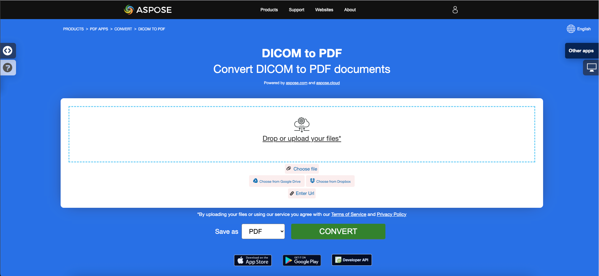

## نظرة عامة

هذا المقال يشرح كيفية تحويل صيغ الصور المختلفة إلى PDF باستخدام C#. يغطي الموضوعات التالية.

الشفرة التالية تعمل أيضاً مع مكتبة [Aspose.PDF.Drawing](/pdf/net/drawing/).

_الصيغة_: **BMP**
- [C# BMP إلى PDF](#csharp-bmp-to-pdf)
- [C# تحويل BMP إلى PDF](#csharp-bmp-to-pdf)
- [C# كيفية تحويل صورة BMP إلى PDF](#csharp-bmp-to-pdf)

_الصيغة_: **CGM**
- [C# CGM إلى PDF](#csharp-cgm-to-pdf)
- [C# تحويل CGM إلى PDF](#csharp-cgm-to-pdf)
- [C# كيفية تحويل صورة CGM إلى PDF](#csharp-cgm-to-pdf)

_الصيغة_: **DICOM**
- [C# DICOM إلى PDF](#csharp-dicom-to-pdf)
- [C# تحويل DICOM إلى PDF](#csharp-dicom-to-pdf)
- [C# كيفية تحويل صورة DICOM إلى PDF](#csharp-dicom-to-pdf)
- [C# كيفية تحويل صورة DICOM إلى PDF](#csharp-dicom-to-pdf)

_التنسيق_: **EMF**
- [C# EMF إلى PDF](#csharp-emf-to-pdf)
- [C# تحويل EMF إلى PDF](#csharp-emf-to-pdf)
- [C# كيفية تحويل صورة EMF إلى PDF](#csharp-emf-to-pdf)

_التنسيق_: **GIF**
- [C# GIF إلى PDF](#csharp-gif-to-pdf)
- [C# تحويل GIF إلى PDF](#csharp-gif-to-pdf)
- [C# كيفية تحويل صورة GIF إلى PDF](#csharp-gif-to-pdf)

_التنسيق_: **JPG**
- [C# JPG إلى PDF](#csharp-jpg-to-pdf)
- [C# تحويل JPG إلى PDF](#csharp-jpg-to-pdf)
- [C# كيفية تحويل صورة JPG إلى PDF](#csharp-jpg-to-pdf)

_التنسيق_: **PNG**
- [C# PNG إلى PDF](#csharp-png-to-pdf)
- [C# تحويل PNG إلى PDF](#csharp-png-to-pdf)
- [C# كيفية تحويل صورة PNG إلى PDF](#csharp-png-to-pdf)

_التنسيق_: **SVG**
- [C# SVG إلى PDF](#csharp-svg-to-pdf)
- [C# تحويل SVG إلى PDF](#csharp-svg-to-pdf)
- [C# كيفية تحويل صورة SVG إلى PDF](#csharp-svg-to-pdf)

_التنسيق_: **TIFF**
- [C# TIFF إلى PDF](#csharp-tiff-to-pdf)
- [C# تحويل TIFF إلى PDF](#csharp-tiff-to-pdf)
- [C# كيفية تحويل صورة TIFF إلى PDF](#csharp-tiff-to-pdf)
- [C# كيفية تحويل صورة TIFF إلى PDF](#csharp-tiff-to-pdf)

مواضيع أخرى تغطيها هذه المقالة
- [انظر أيضا](#see-also)

## تحويلات صور C# إلى PDF

**Aspose.PDF لـ .NET** يتيح لك تحويل صيغ مختلفة من الصور إلى ملفات PDF. توضح مكتبتنا أكواد لتحويل أشهر صيغ الصور، مثل - BMP، CGM، DICOM، EMF، JPG، PNG، SVG و TIFF.

## تحويل BMP إلى PDF

تحويل ملفات BMP إلى مستند PDF باستخدام مكتبة **Aspose.PDF لـ .NET**.

<abbr title="ملف صورة البت">BMP</abbr> الصور هي ملفات لها امتداد .BMP تمثل ملفات صور البتماب المستخدمة لتخزين الصور الرقمية البتماب. هذه الصور مستقلة عن محول الرسوميات وتُعرف أيضًا باسم تنسيق ملف البتماب المستقل عن الجهاز (DIB).
يمكنك تحويل صور BMP إلى ملفات PDF باستخدام API **Aspose.PDF لـ .NET**. وعليه، يمكنك اتباع الخطوات التالية لتحويل صور BMP:

<a name="csharp-bmp-to-pdf" id="csharp-bmp-to-pdf"><strong>الخطوات: تحويل BMP إلى PDF في C#</strong></a>

1.
1.
2. قم بتحميل صورة **BMP**.
3. أخيرًا، احفظ الملف بصيغة PDF.

يتبع الكود التالي هذه الخطوات ويوضح كيفية تحويل BMP إلى PDF باستخدام C#:

```csharp
//Initialize empty PDF document
using (Document pdfDocument = new Document())
{
    pdfDocument.Pages.Add();
    Aspose.Pdf.Image image = new Aspose.Pdf.Image();

    // Load sample BMP image file
    image.File = dataDir + "Sample.bmp";
    pdfDocument.Pages[1].Paragraphs.Add(image);

    // Save output PDF document
    pdfDocument.Save(dataDir + "BMPtoPDF.pdf");
}
```

{}
**جرب تحويل BMP إلى PDF عبر الإنترنت**

تقدم لك Aspose تطبيقًا مجانيًا عبر الإنترنت ["BMP إلى PDF"](https://products.aspose.app/pdf/conversion/bmp-to-pdf/)، حيث يمكنك تجربة الوظائف وجودة العمل.

[](https://products.aspose.app/pdf/conversion/bmp-to-pdf/)
{}

## تحويل CGM إلى PDF

<abbr title="Computer Graphics Metafile">CGM</abbr> هو امتداد ملف لتنسيق ملف الرسومات الحاسوبية والذي يستخدم عادة في تطبيقات التصميم بمساعدة الكمبيوتر (CAD) والرسومات التقديمية.
<abbr title="ملف الرسوميات الحاسوبية">CGM</abbr> هو امتداد ملف لتنسيق ملف الرسوميات الحاسوبية الذي يستخدم عادة في تطبيقات التصميم بمساعدة الكمبيوتر (CAD) ورسومات العروض التقديمية.

راجع الشفرة التالية لتحويل ملفات CGM إلى تنسيق PDF.

<a name="csharp-cgm-to-pdf" id="csharp-cgm-to-pdf"><strong>الخطوات: تحويل CGM إلى PDF في C#</strong></a>

1. إنشاء نسخة من الفئة [CgmLoadOptions](https://reference.aspose.com/pdf/net/aspose.pdf/cgmloadoptions).
2. إنشاء نسخة من الفئة [Document](https://reference.aspose.com/pdf/net/aspose.pdf/document) مع ذكر اسم الملف المصدر والخيارات.
3. حفظ المستند بالاسم المطلوب.

```csharp
public static void ConvertCGMtoPDF()
{
    CgmLoadOptions option = new CgmLoadOptions();
    Document pdfDocument= new Document(_dataDir+"corvette.cgm", option);
    pdfDocument.Save(_dataDir+"CGMtoPDF.pdf");
}
```

## تحويل DICOM إلى PDF

<abbr title="التصوير الرقمي والاتصالات في الطب">DICOM</abbr> هو المعيار الصناعي في المجال الطبي لإنشاء وتخزين ونقل وتصور الصور الطبية الرقمية ووثائق الفحص للمرضى.
<abbr title="Digital Imaging and Communications in Medicine">DICOM</abbr> هو المعيار الصناعي في الصناعة الطبية لإنشاء، تخزين، نقل، وتصور الصور الطبية الرقمية ووثائق المرضى المفحوصين.

**Aspsoe.PDF for .NET** يتيح لك تحويل صور DICOM وSVG، ولكن لأسباب فنية لإضافة الصور تحتاج إلى تحديد نوع الملف الذي سيتم إضافته إلى PDF:

<a name="csharp-dicom-to-pdf" id="csharp-dicom-to-pdf"><strong>الخطوات: تحويل DICOM إلى PDF في C#</strong></a>

1. إنشاء كائن من فئة الصورة.
2. إضافة الصورة إلى مجموعة Paragraphs لصفحة.
3. حدد خاصية [FileType](https://reference.aspose.com/pdf/net/aspose.pdf/image/properties/filetype).
4. حدد مسار الملف أو المصدر.
    - إذا كانت الصورة موجودة في موقع على القرص الصلب، حدد موقع المسار باستخدام خاصية Image.File.
    - إذا كانت الصورة موضوعة في MemoryStream، انقل الكائن الذي يحمل الصورة إلى خاصية Image.ImageStream.

يوضح الكود التالي كيفية تحويل ملفات DICOM إلى تنسيق PDF باستخدام Aspose.PDF.
الشفرة التالية توضح كيفية تحويل ملفات DICOM إلى صيغة PDF باستخدام Aspose.PDF.

```csharp
private const string _dataDir = "..\\..\\..\\..\\Samples";
// تحويل صور DICOM إلى PDF باستخدام فئة الصورة
public static void ConvertDICOMtoPDF()
{
    // إنشاء كائن المستند
    Document pdfDocument = new Document();

    // إضافة صفحة إلى مجموعة الصفحات في المستند
    Page page = pdfDocument.Pages.Add();

    Image image = new Image
    {
        FileType = ImageFileType.Dicom,
        File = System.IO.Path.Combine(_dataDir,"bmode.dcm")
    };
    pdfDocument.Pages[1].Paragraphs.Add(image);
    // حفظ النتيجة بصيغة PDF
    pdfDocument.Save(System.IO.Path.Combine(_dataDir,"PDFWithDicomImage_out.pdf"));
}
```

{}
**جرب تحويل DICOM إلى PDF عبر الإنترنت**

تقدم لك Aspose تطبيقا مجانيا عبر الإنترنت ["DICOM to PDF"](https://products.aspose.app/pdf/conversion/dicom-to-pdf/)، حيث يمكنك استكشاف الوظائف وجودة عمله.

[](https://products.aspose.app/pdf/conversion/dicom-to-pdf/)
[](https://products.aspose.app/pdf/conversion/dicom-to-pdf/)
{}

## تحويل EMF إلى PDF

<abbr title="تنسيق ملف الصور المعزز">EMF</abbr> يخزن EMF الصور الرسومية بشكل مستقل عن الجهاز. تتكون الملفات المؤقتة لـ EMF من سجلات متغيرة الطول بترتيب زمني يمكن أن تقوم بتقديم الصورة المخزنة بعد التحليل على أي جهاز إخراج. علاوة على ذلك، يمكنك تحويل صورة EMF إلى PDF باستخدام الخطوات التالية:

<a name="csharp-emf-to-pdf" id="csharp-emf-to-pdf"><strong>الخطوات: تحويل EMF إلى PDF في C#</strong></a>

1. أولاً، قم بتهيئة كائن الفئة [Document](https://reference.aspose.com/pdf/net/aspose.pdf/document).
2. تحميل ملف صورة **EMF**.
3. إضافة صورة EMF المحملة إلى صفحة.
4. حفظ مستند PDF.

علاوة على ذلك، يوضح الجزء التالي من الكود كيفية تحويل EMF إلى PDF باستخدام C# في جزء الكود الخاص بـ .NET:

```csharp
// تهيئة مستند PDF جديد
var doc = new Document();

// تحديد مسار ملف صورة EMF الداخلي
var imageFile = dataDir + "drawing.emf";
var page = doc.Pages.Add();
string file = imageFile;
FileStream filestream = new FileStream(file, FileMode.Open, FileAccess.Read);
BinaryReader reader = new BinaryReader(filestream);
long numBytes = new FileInfo(file).Length;
byte[] bytearray = reader.ReadBytes((int)numBytes);
Stream stream = new MemoryStream(bytearray);
var b = new Bitmap(stream);

// تحديد خصائص أبعاد الصفحة
page.PageInfo.Margin.Bottom = 0;
page.PageInfo.Margin.Top = 0;
page.PageInfo.Margin.Left = 0;
page.PageInfo.Margin.Right = 0;
page.PageInfo.Width = b.Width;
page.PageInfo.Height = b.Height;
var image = new Aspose.Pdf.Image();
image.File = imageFile;
page.Paragraphs.Add(image);

// حفظ مستند PDF الناتج
doc.Save(dataDir + "EMFtoPDF.pdf");
```
{}
**جرب تحويل EMF إلى PDF عبر الإنترنت**

تقدم لك Aspose تطبيقًا مجانيًا عبر الإنترنت ["EMF إلى PDF"](https://products.aspose.app/pdf/conversion/emf-to-pdf/)، حيث يمكنك تجربة استكشاف الوظائف والجودة التي يعمل بها.

[](https://products.aspose.app/pdf/conversion/emf-to-pdf/)
{}

## تحويل GIF إلى PDF

قم بتحويل ملفات GIF إلى مستند PDF باستخدام مكتبة **Aspose.PDF لـ .NET**.

<abbr title="Graphics Interchange Format">GIF</abbr> قادر على تخزين البيانات المضغوطة دون فقدان الجودة في تنسيق لا يزيد عن 256 لونًا. تم تطوير تنسيق GIF المستقل عن الأجهزة في عام 1987 (GIF87a) بواسطة CompuServe لنقل الصور النقطية عبر الشبكات.
يمكنك تحويل ملفات GIF إلى ملفات PDF باستخدام واجهة برمجة تطبيقات Aspose.PDF لـ .NET. لذلك، يمكنك اتباع الخطوات التالية لتحويل صور GIF:

<a name="csharp-gif-to-pdf" id="csharp-gif-to-pdf"><strong>الخطوات: تحويل GIF إلى PDF في C#</strong></a>

1.
1.
2. تحميل صورة **GIF** الأولية.
3. أخيرًا، احفظ ملف PDF الناتج.

فيما يلي قطعة الكود التالية تتبع هذه الخطوات وتوضح كيفية تحويل BMP إلى PDF باستخدام C#:

```csharp
// تهيئة وثيقة PDF فارغة
using (Document pdfDocument = new Document())
{
    pdfDocument.Pages.Add();
    Aspose.Pdf.Image image = new Aspose.Pdf.Image();

    // تحميل ملف صورة GIF نموذجي
    image.File = dataDir + "Sample.gif";
    pdfDocument.Pages[1].Paragraphs.Add(image);

    // حفظ وثيقة PDF الناتجة
    pdfDocument.Save(dataDir + "GIFtoPDF.pdf");
}
```

{}
**جرب تحويل GIF إلى PDF عبر الإنترنت**

تقدم لك Aspose تطبيقًا مجانيًا عبر الإنترنت ["GIF to PDF"](https://products.aspose.app/pdf/conversion/gif-to-pdf/)، حيث يمكنك تجربة استكشاف الوظائف وجودة عمله.

[](https://products.aspose.app/pdf/conversion/gif-to-pdf/)
{}

## تحويل JPG إلى PDF

لا داعي للتساؤل كيفية تحويل JPG إلى PDF، لأن مكتبة **Apose.PDF لـ .NET** لديها الحل الأمثل.
لا حاجة للتساؤل حول كيفية تحويل JPG إلى PDF، لأن مكتبة **Apose.PDF for .NET** لديها الحل الأمثل.

يمكنك بسهولة تحويل صور JPG إلى PDF باستخدام Aspose.PDF for .NET باتباع الخطوات التالية:

<a name="csharp-jpg-to-pdf" id="csharp-jpg-to-pdf"><strong>الخطوات: تحويل JPG إلى PDF في C#</strong></a>

1. تهيئة كائن من فئة [Document](https://reference.aspose.com/page/net/aspose.page/document).
2. إضافة صفحة جديدة إلى مستند PDF.
3. تحميل صورة **JPG** وإضافتها إلى الفقرة.
4. حفظ ملف PDF الناتج.

يوضح مقتطف الكود أدناه كيفية تحويل صورة JPG إلى PDF باستخدام C#:

```csharp
// تحميل ملف JPG الإدخال
String path = dataDir + "Aspose.jpg";

// تهيئة مستند PDF جديد
Document doc = new Document();

// إضافة صفحة فارغة في المستند الفارغ
Page page = doc.Pages.Add();
Aspose.Pdf.Image image = new Aspose.Pdf.Image();
image.File = (path);

// إضافة الصورة على صفحة
page.Paragraphs.Add(image);

// حفظ ملف PDF الناتج
doc.Save(dataDir + "ImagetoPDF.pdf");
```

ثم يمكنك معرفة كيفية تحويل صورة إلى PDF بنفس الارتفاع والعرض للصفحة.
ثم يمكنك مشاهدة كيفية تحويل صورة إلى PDF بنفس ارتفاع وعرض الصفحة.

1. تحميل ملف الصورة الأولية
1. الحصول على ارتفاع وعرض الصورة
1. تعيين ارتفاع وعرض وهوامش الصفحة
1. حفظ ملف PDF الناتج

يوضح الكود التالي كيفية تحويل صورة إلى PDF بنفس ارتفاع وعرض الصفحة باستخدام C#:

```csharp
// تحميل ملف صورة JPG الأولية
String path = dataDir + "Aspose.jpg";
System.Drawing.Image srcImage = System.Drawing.Image.FromFile(path);

// قراءة ارتفاع الصورة الأولية
int h = srcImage.Height;

// قراءة عرض الصورة الأولية
int w = srcImage.Width;

// تهيئة مستند PDF جديد
Document doc = new Document();

// إضافة صفحة فارغة
Page page = doc.Pages.Add();
Aspose.Pdf.Image image = new Aspose.Pdf.Image();
image.File = (path);

// تعيين أبعاد الصفحة والهوامش
page.PageInfo.Height = (h);
page.PageInfo.Width = (w);
page.PageInfo.Margin.Bottom = (0);
page.PageInfo.Margin.Top = (0);
page.PageInfo.Margin.Right = (0);
page.PageInfo.Margin.Left = (0);
page.Paragraphs.Add(image);

// حفظ ملف PDF الناتج
doc.Save(dataDir + "ImagetoPDF_HeightWidth.pdf");
```
{}
**جرب تحويل JPG إلى PDF عبر الإنترنت**

تقدم لك Aspose تطبيقًا مجانيًا عبر الإنترنت ["JPG إلى PDF"](https://products.aspose.app/pdf/conversion/jpg-to-pdf/)، حيث يمكنك تجربة استكشاف الوظائف والجودة التي يعمل بها.

[](https://products.aspose.app/pdf/conversion/jpg-to-pdf/)
{}

## تحويل PNG إلى PDF

**Aspose.PDF لـ .NET** يدعم ميزة تحويل صور PNG إلى تنسيق PDF. تحقق من الشفرة التالية لتحقيق مهمتك.

<abbr title="Portable Network Graphics">PNG</abbr> يشير إلى نوع من تنسيقات ملفات الصور النقطية التي تستخدم ضغطًا بدون فقدان، مما يجعلها شائعة بين المستخدمين.

يمكنك تحويل صورة PNG إلى PDF باستخدام الخطوات التالية:

<a name="csharp-png-to-pdf" id="csharp-png-to-pdf"><strong>الخطوات: تحويل PNG إلى PDF في C#</strong></a>

1. تحميل صورة **PNG** الأصلية.
2. قراءة قيم الارتفاع والعرض.
3.
3.
4. حدد أبعاد الصفحة.
5. احفظ الملف الناتج.

علاوة على ذلك، يوضح مقتطف الكود أدناه كيفية تحويل PNG إلى PDF باستخدام C# في تطبيقات .NET الخاصة بك:

```csharp
// تحميل ملف PNG الإدخال
String path = dataDir + "Aspose.png";
System.Drawing.Image srcImage = System.Drawing.Image.FromFile(path);
int h = srcImage.Height;
int w = srcImage.Width;

// تهيئة مستند جديد
Document doc = new Document();
Page page = doc.Pages.Add();
Aspose.Pdf.Image image = new Aspose.Pdf.Image();
image.File = (path);

// حدد أبعاد الصفحة
page.PageInfo.Height = (h);
page.PageInfo.Width = (w);
page.PageInfo.Margin.Bottom = (0);
page.PageInfo.Margin.Top = (0);
page.PageInfo.Margin.Right = (0);
page.PageInfo.Margin.Left = (0);
page.Paragraphs.Add(image);

// احفظ PDF الناتج
doc.Save(dataDir + "ImagetoPDF.pdf");
```

{}
**جرب تحويل PNG إلى PDF عبر الإنترنت**

تقدم لك Aspose تطبيقًا مجانيًا على الإنترنت ["PNG to PDF"](https://products.aspose.app/pdf/conversion/png-to-pdf/)، حيث يمكنك تجربة استكشاف الوظائف وجودة العمل.

Aspose يقدم لك تطبيقًا مجانيًا عبر الإنترنت ["PNG إلى PDF"](https://products.aspose.app/pdf/conversion/png-to-pdf/)، حيث يمكنك تجربة استكشاف وظائفه وجودة عمله.

[](https://products.aspose.app/pdf/conversion/png-to-pdf/)
{}

## تحويل SVG إلى PDF

**Aspose.PDF لـ .NET** يشرح كيفية تحويل صور SVG إلى تنسيق PDF وكيفية الحصول على أبعاد ملف <abbr title="رسومات متجهة قابلة للتوسيع">SVG</abbr> المصدر.

رسومات متجهة قابلة للتوسيع (SVG) هي عائلة من المواصفات لتنسيق ملف قائم على XML للرسومات المتجهة ثنائية الأبعاد، سواء كانت ثابتة أو ديناميكية (تفاعلية أو متحركة). مواصفات SVG هي معيار مفتوح تم تطويره من قبل كونسورتيوم الشبكة العالمية (W3C) منذ عام 1999.

تُعرَّف صور SVG وسلوكياتها في ملفات نصية XML.
```
تُعرف صور SVG وسلوكياتها في ملفات نصية XML.

{}
**حاول تحويل صيغة SVG إلى PDF عبر الإنترنت**

يقدم لك Aspose.PDF لـ .NET تطبيقًا مجانيًا عبر الإنترنت ["SVG إلى PDF"](https://products.aspose.app/pdf/conversion/svg-to-pdf)، حيث يمكنك تجربة استكشاف الوظائف والجودة التي يعمل بها.

[](https://products.aspose.app/pdf/conversion/svg-to-pdf)
{}

لتحويل ملفات SVG إلى PDF، استخدم الصف المسمى [SvgLoadOptions](https://reference.aspose.com/net/pdf/aspose.pdf/svgloadoptions) الذي يُستخدم لتهيئة الكائن [`LoadOptions`](https://reference.aspose.com/pdf/net/aspose.pdf/loadoptions). فيما بعد، يتم تمرير هذا الكائن كحجة أثناء تهيئة كائن الوثيقة ويساعد محرك عرض PDF على تحديد صيغة المستند المصدر.

<a name="csharp-svg-to-pdf" id="csharp-svg-to-pdf"><strong>الخطوات: تحويل SVG إلى PDF في C#</strong></a>

1.
1.
2. قم بإنشاء مثيل من الفئة [`Document`](https://reference.aspose.com/pdf/net/aspose.pdf/document) مع تحديد اسم الملف المصدر والخيارات.
3. احفظ المستند بالاسم المطلوب للملف.

الشفرة التالية توضح عملية تحويل ملف SVG إلى تنسيق PDF باستخدام Aspose.PDF لـ .NET.

```csharp
public static void ConvertSVGtoPDF()
{
    SvgLoadOptions option = new SvgLoadOptions();
    Document pdfDocument= new Document(_dataDir + "car.svg", option);
    pdfDocument.Save(_dataDir + "svgtest.pdf");
}
```

## الحصول على أبعاد SVG

من الممكن أيضًا الحصول على أبعاد ملف SVG المصدر. قد تكون هذه المعلومات مفيدة إذا أردنا أن يغطي SVG الصفحة بأكملها من PDF المخرج. خاصية AdjustPageSize في فئة ScgLoadOption تلبي هذا الشرط. القيمة الافتراضية لهذه الخاصية هي false. إذا تم ضبط القيمة على true، سيكون لملف PDF المخرج نفس الحجم (الأبعاد) كملف SVG المصدر.

الشفرة التالية توضح عملية الحصول على أبعاد ملف SVG المصدر وإنتاج ملف PDF.
يوضح الجزء التالي من الشيفرة عملية الحصول على أبعاد ملف SVG المصدر وتوليد ملف PDF.

```csharp
public static void ConvertSVGtoPDF_Advanced()
{
    // للحصول على أمثلة كاملة وملفات البيانات، يرجى زيارة https://github.com/aspose-pdf/Aspose.PDF-for-.NET
    // المسار إلى دليل المستندات.
    string dataDir = RunExamples.GetDataDir_AsposePdf_DocumentConversion();
    var loadopt = new SvgLoadOptions();
    loadopt.AdjustPageSize = true;
    var svgDoc = new Document(dataDir + "GetSVGDimensions.svg", loadopt);
    svgDoc.Pages[1].PageInfo.Margin.Top = 0;
    svgDoc.Pages[1].PageInfo.Margin.Left = 0;
    svgDoc.Pages[1].PageInfo.Margin.Bottom = 0;
    svgDoc.Pages[1].PageInfo.Margin.Right = 0;
    svgDoc.Save(dataDir + "GetSVGDimensions_out.pdf");
}
```

### الميزات المدعومة في SVG

<table>
    <thead>
        <tr>
            <th>
                <p>وسم SVG</p>
            </th>
            <th>
                <p>استخدام عينة</p>
            </th>
        </tr>
    </thead>
    <tbody>
<tbody>
   <tr>
       <td>
           <p>دائرة</p>
       </td>
       <td>
           <code><pre>&lt;circle id="r2" cx="10" cy="10" r="10" stroke="blue" stroke-width="2"&gt;</pre></code>
       </td>
   </tr>
   <tr>
       <td>
           <p>تعاريف</p>
       </td>
       <td>
           <code>&lt;defs&gt;&nbsp; <br> &lt;rect id="r1" width="15" height="15"
               stroke="blue" stroke-width="2" /&gt;&nbsp; <br> &lt;circle id="r2"
               cx="10" cy="10" r="10" stroke="blue" stroke-width="2"/&gt;&nbsp; <br>
               &lt;circle id="r3" cx="10" cy="10" r="10" stroke="blue" stroke-width="3"/&gt;&nbsp; <br> &lt;/defs&gt;&nbsp; <br> &lt;use
               x="25" y="40" xlink:href="#r1" fill="red"/&gt;&nbsp; <br> &lt;use
               x="35" y="15" xlink:href="#r2" fill="green"/&gt;&nbsp; <br> &lt;use
               x="58" y="50" xlink:href="#r3" fill="blue"/&gt;</code>
       </td>
   </tr>
</tbody>

         </tr>
        <tr>
            <td>
                <p>tref</p>
            </td>
            <td>
                <p>&lt;defs&gt;&nbsp; <br> &nbsp;&nbsp;&nbsp; &lt;text
                    id="ReferencedText"&gt;&nbsp; <br> &nbsp;&nbsp;&nbsp;&nbsp;&nbsp;
                    بيانات الحروف المرجعية&nbsp; <br> &nbsp;&nbsp;&nbsp;
                    &lt;/text&gt;&nbsp; <br> &lt;/defs&gt;&nbsp; <br
                        class="atl-forced-newline"> &lt;text x="10" y="100" font-size="15" fill="red" &gt;&nbsp; <br
                        class="atl-forced-newline"> &nbsp;&nbsp;&nbsp; &lt;tref
                    xlink:href="#ReferencedText"/&gt;&nbsp; <br> &lt;/text&gt;</p>
            </td>
        </tr>
        <tr>
            <td>
                <p>use</p>
            </td>
            <td>
                <p>&lt;defs&gt;&nbsp; <br> &nbsp;&nbsp;&nbsp; &lt;text id="Text" x="400"
                    y="200"&nbsp; <br>
                    &nbsp;&nbsp;&nbsp;&nbsp;&nbsp;&nbsp;&nbsp;&nbsp;&nbsp; font-family="Verdana" font-size="100"
```

```
    font-family="Verdana" font-size="100"
    text-anchor="middle" &gt; <br> &nbsp;&nbsp;&nbsp;&nbsp;&nbsp;
    نص مخفي <br> &nbsp;&nbsp;&nbsp; &lt;/text&gt;&nbsp; <br
        class="atl-forced-newline"> &lt;use xlink:href="#Text" fill="blue"&nbsp; /&gt;</p>
</td>
</tr>
<tr>
<td>
    <p>بيضاوي</p>
</td>
<td>
    <p>&lt;ellipse cx="2.5" cy="1.5" rx="2" ry="1" fill="red" /&gt;</p>
</td>
</tr>
<tr>
<td>
    <p>g</p>
</td>
<td>
    <p>&lt;g fill="none" stroke="dimgray" stroke-width="1.5" &gt; <br>
        &nbsp;&nbsp; &nbsp;&nbsp;&nbsp; &nbsp;&nbsp;&nbsp; &nbsp;&nbsp;&nbsp; &nbsp;&lt;line x1="-7"
        y1="-7" x2="-3" y2="-3"/&gt;&nbsp; <br> &nbsp;&nbsp;
        &nbsp;&nbsp;&nbsp; &nbsp;&nbsp;&nbsp; &nbsp;&nbsp;&nbsp; &nbsp;&lt;line x1="7" y1="7" x2="3"
```

# ترجمة المستند

<line x1="7" y1="7" x2="3" y2="3"/>  
<line x1="-7" y1="7" x2="-3" y2="3"/>  
<line x1="7" y1="-7" x2="3" y2="-3"/>  
</g>  

| الصورة   |
| --------- |
| <image id="ShadedRelief" x="24" y="4" width="64" height="82" xlink:href="relief.jpg"/> |

| الخط     |
| --------- |
| <line style="stroke:#eea;stroke-width:8" x1="10" y1="30" x2="260" y2="100"/> |
```

<tr>
    <td>
        <p>خط</p>
    </td>
    <td>
        <p>&lt;line style="stroke:#eea;stroke-width:8" x1="10" y1="30" x2="260" y2="100"/&gt;&nbsp;</p>
    </td>
</tr>
<tr>
    <td>
        <p>مسار</p>
    </td>
    <td>
        <p>&lt;path style="fill:#daa;fill-rule:evenodd;stroke:red" d="M 230,150 C 290,30 10,255 110,140 z
            "/&gt;&nbsp;</p>
    </td>
</tr>
<tr>
    <td>
        <p>أنماط</p>
    </td>
    <td>
        <p>&lt;path style="fill:#daa;fill-rule:evenodd;stroke:red" d="M 230,150 C 290,30 10,255 110,140 z
            "/&gt;</p>
    </td>
</tr>
<tr>
    <td>
        <p>مضلع</p>
    </td>
    <td>
        <p>&lt;polygon style="stroke:#24a;stroke-width:1.5;fill:#eefefe" points="10,10 180,10 10,250 10,10"
            /&gt;</p>
    </td>
</tr>
<tr>
    <td>
        <p>خط متعدد</p>
    </td>
```

<tr>
    <td>
        <p>خط متعدد الأضلاع</p>
    </td>
    <td>
        <p>&lt;polyline fill="none" stroke="dimgray" stroke-width="1" points="-3,-6 3,-6 3,1 5,1 0,7 -5,1
            -3,1 -3,-5"/&gt;</p>
    </td>
</tr>
<tr>
    <td>
        <p>مستطيل</p>
    </td>
    <td>
        <p>&lt;rect x="0" y="0" width="400" height="600" stroke="none" fill="aliceblue" /&gt;</p>
    </td>
</tr>
<tr>
    <td>
        <p>svg</p>
    </td>
    <td>
        <p>&lt;svg xmlns="http://www.w3.org/2000/svg" version="1.1" width="10cm" height="5cm" &gt;</p>
    </td>
</tr>
<tr>
    <td>
        <p>نص</p>
    </td>
    <td>
        <p>&lt;text font-family="sans-serif" fill="dimgray" font-size="22px" font-weight="bold" x="58"
            y="30" pointer-events="none"&gt;عنوان الخريطة&lt;/text&gt;</p>
    </td>
</tr>
```

<table>
    <tbody>
        <tr>
            <td>
                <p>خط</p>
            </td>
            <td>
                <p>&lt;text x="10" y="100" font-size="15" fill="red" &gt;&nbsp; <br>
                    &nbsp;&nbsp;&nbsp; نص نموذجي&nbsp; <br> &lt;/text&gt;</p>
            </td>
        </tr>
        <tr>
            <td>
                <p>tspan</p>
            </td>
            <td>
                <p>&lt;tspan dy="25" x="25"&gt;ستة ألوان حبر قيمة الإدخال. هنا سوف &lt;/tspan&gt;</p>
            </td>
        </tr>
    </tbody>
</table>

## تحويل TIFF إلى PDF

**Aspose.PDF** يدعم صيغة الملف، سواء كان إطارًا واحدًا أو إطارات متعددة <abbr title="Tag Image File Format">TIFF</abbr>. هذا يعني أن بإمكانك تحويل صورة TIFF إلى PDF في تطبيقات .NET الخاصة بك.

TIFF أو TIF، تنسيق ملف الصورة الموسومة، يمثل الصور النقطية التي تُستخدم على مجموعة متنوعة من الأجهزة التي تتوافق مع هذا المعيار لتنسيق الملفات.
```

TIFF أو TIF، تنسيق ملف الصورة الموسومة، يمثل الصور النقطية المخصصة للاستخدام على مجموعة متنوعة من الأجهزة التي تتوافق مع معيار تنسيق الملف هذا.

يمكنك تحويل TIFF إلى PDF بنفس الطريقة كما في تنسيقات ملفات الرسوم النقطية الأخرى:

<a name="csharp-tiff-to-pdf" id="csharp-tiff-to-pdf"><strong>الخطوات: تحويل TIFF إلى PDF في C#</strong></a>

1. إنشاء كائن جديد من فئة [الوثيقة](https://reference.aspose.com/pdf/net/aspose.pdf/document) وإضافة صفحة.
2. تحميل صورة **TIFF** المدخلة.
3. حفظ مستند PDF.

```csharp
Initialize empty PDF document
using (Document pdfDocument = new Document())
{
    pdfDocument.Pages.Add();
    Aspose.Pdf.Image image = new Aspose.Pdf.Image();

    // Load sample Tiff image file
    image.File = dataDir + "sample.tiff";
    pdfDocument.Pages[1].Paragraphs.Add(image);

    // Save output PDF document
    pdfDocument.Save(dataDir + "TIFFtoPDF.pdf");
}
```

في حالة الحاجة لتحويل صورة TIFF متعددة الصفحات إلى مستند PDF متعدد الصفحات والتحكم في بعض البارامترات، مثل.
في حالة الحاجة إلى تحويل صورة TIFF متعددة الصفحات إلى مستند PDF متعدد الصفحات والتحكم في بعض الإعدادات، على سبيل المثال:

1. إنشاء نموذج من فئة الوثيقة
1. تحميل صورة TIFF الأصلية
1. الحصول على أبعاد الإطارات
1. إضافة صفحة جديدة لكل إطار
1. في النهاية، حفظ الصور في صفحات PDF

يظهر المقتطف الكودي التالي كيفية تحويل صورة TIFF متعددة الصفحات أو متعددة الإطارات إلى PDF باستخدام C#:

```csharp
public static void TiffToPDF2()
{
    // تهيئة وثيقة جديدة
    Document pdf = new Document();

    // تحميل صورة TIFF إلى التيار
    Bitmap bitmap = new Bitmap(File.OpenRead(_dataDir+"multipage.tif"));
    // تحويل TIFF متعدد الصفحات أو متعدد الإطارات إلى PDF
    FrameDimension dimension = new FrameDimension(bitmap.FrameDimensionsList[0]);
    int frameCount = bitmap.GetFrameCount(dimension);

    // تكرار عبر كل إطار
    for (int frameIdx = 0; frameIdx <= frameCount - 1; frameIdx++)
    {
        Page page = pdf.Pages.Add();

        bitmap.SelectActiveFrame(dimension, frameIdx);

        MemoryStream currentImage = new MemoryStream();
        bitmap.Save(currentImage, ImageFormat.Tiff);

        Aspose.Pdf.Image imageht = new Aspose.Pdf.Image
        {
            ImageStream = currentImage,
            // تطبيق بعض الخيارات الأخرى
            // ImageScale = 0.5
        };
        page.Paragraphs.Add(imageht);
    }

    // حفظ ملف PDF الناتج
    pdf.Save(_dataDir + "TifftoPDF.pdf");
}
```
## ينطبق على

|**المنصة**|**الدعم**|**التعليقات**|
| :- | :- |:- |
|ويندوز .NET Framework|2.0-4.6| |
|ويندوز .NET Core |2.0-3.1| |
|.NET 5 ويندوز| |
|لينكس .NET Core|2.0-3.1 | |
|.NET 5 لينكس | |

## انظر أيضًا

هذه المقالة تغطي أيضًا هذه الموضوعات. الأكواد هي نفسها كما أعلاه.

_التنسيق_: **BMP**
- [كود C# BMP إلى PDF](#csharp-bmp-to-pdf)
- [API C# BMP إلى PDF](#csharp-bmp-to-pdf)
- [برمجياً C# BMP إلى PDF](#csharp-bmp-to-pdf)
- [مكتبة C# BMP إلى PDF](#csharp-bmp-to-pdf)
- [حفظ C# BMP كـ PDF](#csharp-bmp-to-pdf)
- [توليد C# PDF من BMP](#csharp-bmp-to-pdf)
- [إنشاء C# PDF من BMP](#csharp-bmp-to-pdf)
- [محول C# BMP إلى PDF](#csharp-bmp-to-pdf)

_التنسيق_: **CGM**
- [كود C# CGM إلى PDF](#csharp-cgm-to-pdf)
- [API C# CGM إلى PDF](#csharp-cgm-to-pdf)
- [برمجياً C# CGM إلى PDF](#csharp-cgm-to-pdf)
- [مكتبة C# CGM إلى PDF](#csharp-cgm-to-pdf)
- [حفظ C# CGM كـ PDF](#csharp-cgm-to-pdf)
- [توليد C# PDF من CGM](#csharp-cgm-to-pdf)
- [إنشاء C# PDF من CGM](#csharp-cgm-to-pdf)
- [محول C# CGM إلى PDF](#csharp-cgm-to-pdf)
- [محول C# CGM إلى PDF](#csharp-cgm-to-pdf)

_التنسيق_: **DICOM**
- [كود C# DICOM إلى PDF](#csharp-dicom-to-pdf)
- [واجهة برمجة التطبيقات C# DICOM إلى PDF](#csharp-dicom-to-pdf)
- [برمجياً C# DICOM إلى PDF](#csharp-dicom-to-pdf)
- [مكتبة C# DICOM إلى PDF](#csharp-dicom-to-pdf)
- [حفظ C# DICOM كـ PDF](#csharp-dicom-to-pdf)
- [توليد C# PDF من DICOM](#csharp-dicom-to-pdf)
- [إنشاء C# PDF من DICOM](#csharp-dicom-to-pdf)
- [محول C# DICOM إلى PDF](#csharp-dicom-to-pdf)

_التنسيق_: **EMF**
- [كود C# EMF إلى PDF](#csharp-emf-to-pdf)
- [واجهة برمجة التطبيقات C# EMF إلى PDF](#csharp-emf-to-pdf)
- [برمجياً C# EMF إلى PDF](#csharp-emf-to-pdf)
- [مكتبة C# EMF إلى PDF](#csharp-emf-to-pdf)
- [حفظ C# EMF كـ PDF](#csharp-emf-to-pdf)
- [توليد C# PDF من EMF](#csharp-emf-to-pdf)
- [إنشاء C# PDF من EMF](#csharp-emf-to-pdf)
- [محول C# EMF إلى PDF](#csharp-emf-to-pdf)
