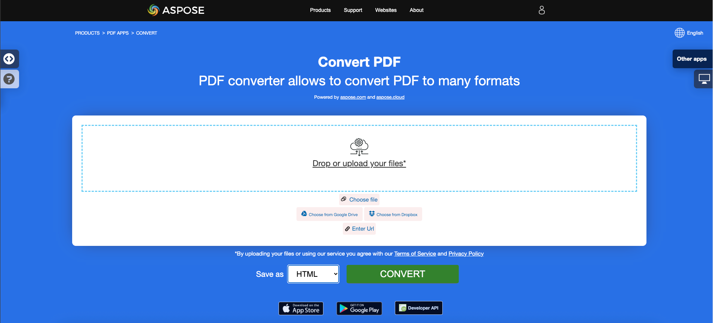

<script type="application/ld+json">
{
    "@context": "https://schema.org",
    "@type": "TechArticle",
    "headline": "Convert PDF to HTML in .NET",
    "alternativeHeadline": "Convert PDF Files to HTML with Simplified Options in C#",
    "abstract": "تقديم ميزة جديدة قوية في Aspose.PDF for .NET التي تمكن من تحويل مستندات PDF إلى تنسيق HTML بسلاسة. تدعم هذه الوظيفة الإخراج متعدد الصفحات، وإدارة صور SVG، وخيارات لتقديم النصوص الشفافة، مما يسمح للمطورين بتحويل ملفات PDF بسهولة إلى محتوى جاهز للويب مع بضع أسطر من كود C#",
    "author": {
        "@type": "Person",
        "name": "Anastasiia Holub",
        "givenName": "Anastasiia",
        "familyName": "Holub",
        "url": "https://www.linkedin.com/in/anastasiia-holub-750430225/"
    },
    "genre": "pdf document generation",
    "wordcount": "1368",
    "proficiencyLevel": "Beginner",
    "publisher": {
        "@type": "Organization",
        "name": "Aspose.PDF for .NET",
        "url": "https://products.aspose.com/pdf",
        "logo": "https://www.aspose.cloud/templates/aspose/img/products/pdf/aspose_pdf-for-net.svg",
        "alternateName": "Aspose",
        "sameAs": [
            "https://facebook.com/aspose.pdf/",
            "https://twitter.com/asposepdf",
            "https://www.youtube.com/channel/UCmV9sEg_QWYPi6BJJs7ELOg/featured",
            "https://www.linkedin.com/company/aspose",
            "https://stackoverflow.com/questions/tagged/aspose",
            "https://aspose.quora.com/",
            "https://aspose.github.io/"
        ],
        "contactPoint": [
            {
                "@type": "ContactPoint",
                "telephone": "+1 903 306 1676",
                "contactType": "sales",
                "areaServed": "US",
                "availableLanguage": "en"
            },
            {
                "@type": "ContactPoint",
                "telephone": "+44 141 628 8900",
                "contactType": "sales",
                "areaServed": "GB",
                "availableLanguage": "en"
            },
            {
                "@type": "ContactPoint",
                "telephone": "+61 2 8006 6987",
                "contactType": "sales",
                "areaServed": "AU",
                "availableLanguage": "en"
            }
        ]
    },
    "url": "/net/convert-pdf-to-html/",
    "mainEntityOfPage": {
        "@type": "WebPage",
        "@id": "/net/convert-pdf-to-html/"
    },
    "dateModified": "2024-11-25",
    "description": "يمكن لـ Aspose.PDF أداء المهام البسيطة والسريعة وكذلك التعامل مع الأهداف الأكثر تعقيدًا. تحقق من القسم التالي للمستخدمين المتقدمين والمطورين."
}
</script>

## نظرة عامة

تشرح هذه المقالة كيفية **تحويل PDF إلى HTML باستخدام C#**. تغطي هذه الموضوعات.

_التنسيق_: **HTML**
- [C# PDF إلى HTML](#csharp-pdf-to-html)
- [C# تحويل PDF إلى HTML](#csharp-pdf-to-html)
- [C# كيفية تحويل ملف PDF إلى HTML](#csharp-pdf-to-html)

تعمل مقتطفات الكود التالية أيضًا مع مكتبة [Aspose.PDF.Drawing](/pdf/ar/net/drawing/).

## تحويل PDF إلى HTML

**Aspose.PDF for .NET** توفر العديد من الميزات لتحويل تنسيقات الملفات المختلفة إلى مستندات PDF وتحويل ملفات PDF إلى تنسيقات إخراج متنوعة. تناقش هذه المقالة كيفية تحويل ملف PDF إلى <abbr title="HyperText Markup Language">HTML</abbr>. توفر Aspose.PDF for .NET القدرة على تحويل ملفات HTML إلى تنسيق PDF باستخدام نهج InLineHtml. لقد تلقينا العديد من الطلبات لوظيفة تحول ملف PDF إلى تنسيق HTML وقد قدمنا هذه الميزة. يرجى ملاحظة أن هذه الميزة تدعم أيضًا XHTML 1.0.

**Aspose.PDF for .NET** تدعم الميزات لتحويل ملف PDF إلى HTML. المهام الرئيسية التي يمكنك إنجازها باستخدام مكتبة Aspose.PDF مدرجة:

- تحويل PDF إلى HTML.
- تقسيم الإخراج إلى HTML متعدد الصفحات.
- تحديد مجلد لتخزين ملفات SVG.
- ضغط صور SVG أثناء التحويل.
- حفظ الصور كخلفية PNG.
- تحديد مجلد الصور.
- إنشاء ملفات لاحقة بمحتويات الجسم فقط.
- تقديم النصوص الشفافة.
- تقديم طبقات مستند PDF.

{}
**حاول تحويل PDF إلى HTML عبر الإنترنت**

تقدم لك Aspose.PDF for .NET تطبيقًا مجانيًا عبر الإنترنت ["PDF إلى HTML"](https://products.aspose.app/pdf/conversion/pdf-to-html)، حيث يمكنك محاولة استكشاف الوظائف وجودة العمل.

[](https://products.aspose.app/pdf/conversion/pdf-to-html)
{}

توفر Aspose.PDF for .NET كودًا من سطرين لتحويل ملف PDF المصدر إلى HTML. تحتوي [`SaveFormat enumeration`](https://reference.aspose.com/pdf/ar/net/aspose.pdf/saveformat) على القيمة Html التي تتيح لك حفظ الملف المصدر بتنسيق HTML. يوضح مقتطف الكود التالي عملية تحويل ملف PDF إلى HTML.

<a name="csharp-pdf-to-html"><strong>الخطوات: تحويل PDF إلى HTML في C#</strong></a>

1. إنشاء مثيل من كائن [Document](https://reference.aspose.com/pdf/ar/net/aspose.pdf/document/) مع مستند PDF المصدر.
2. حفظه بتنسيق **SaveFormat.Html** عن طريق استدعاء **Document.Save()**.

```csharp
// For complete examples and data files, visit https://github.com/aspose-pdf/Aspose.PDF-for-.NET
private static void ConvertPDFtoHTML()
{
    // The path to the documents directory
    var dataDir = RunExamples.GetDataDir_AsposePdf();

    // Open PDF document
    using (var document = new Aspose.Pdf.Document(dataDir + "PDFToHTML.pdf"))
    {
        // Save the output HTML
        document.Save(dataDir + "output_out.html", Aspose.Pdf.SaveFormat.Html);
    }
}
```

### تقسيم الإخراج إلى HTML متعدد الصفحات

عند تحويل ملف PDF كبير يحتوي على عدة صفحات إلى تنسيق HTML، يظهر الإخراج كصفحة HTML واحدة. قد ينتهي به الأمر ليكون طويلًا جدًا. للتحكم في حجم الصفحة، من الممكن تقسيم الإخراج إلى عدة صفحات أثناء تحويل PDF إلى HTML. يرجى محاولة استخدام مقتطف الكود التالي.

```csharp
// For complete examples and data files, visit https://github.com/aspose-pdf/Aspose.PDF-for-.NET
private static void ConvertPDFtoMultiPageHTML()
{
    // The path to the documents directory
    var dataDir = RunExamples.GetDataDir_AsposePdf();

    // Open PDF document
    using (var document = new Aspose.Pdf.Document(dataDir + "PDFToHTML.pdf"))
    {
        // Instantiate HTML SaveOptions object
        var htmlOptions = new Aspose.Pdf.HtmlSaveOptions
        {
            // Specify to split the output into multiple pages
            SplitIntoPages = true
        };

        // Save the output HTML
        document.Save(dataDir + "MultiPageHTML_out.html", htmlOptions);
    }
}
```

### تحديد مجلد لتخزين ملفات SVG

أثناء تحويل PDF إلى HTML، من الممكن تحديد المجلد الذي يجب حفظ صور SVG فيه. استخدم [`HtmlSaveOption class`](https://reference.aspose.com/pdf/ar/net/aspose.pdf/htmlsaveoptions) [`SpecialFolderForSvgImages property`](https://reference.aspose.com/pdf/ar/net/aspose.pdf/htmlsaveoptions/fields/specialfolderforsvgimages) لتحديد دليل خاص لصور SVG. هذه الخاصية تحصل أو تضبط المسار إلى الدليل الذي يجب حفظ صور SVG فيه عند مواجهتها أثناء التحويل. إذا كانت المعلمة فارغة أو null، فسيتم حفظ أي ملفات SVG مع ملفات الصور الأخرى.

```csharp
// For complete examples and data files, visit https://github.com/aspose-pdf/Aspose.PDF-for-.NET
private static void SavePDFtoHTMLWithSVG()
{
    // The path to the documents directory
    var dataDir = RunExamples.GetDataDir_AsposePdf();

    // Open PDF document
    using (var document = new Aspose.Pdf.Document(dataDir + "PDFToHTML.pdf"))
    {
        // Instantiate HTML save options object
        var newOptions = new Aspose.Pdf.HtmlSaveOptions
        {
            // Specify the folder where SVG images are saved during PDF to HTML conversion
            SpecialFolderForSvgImages = dataDir
        };

        // Save the output HTML
        document.Save(dataDir + "SaveSVGFiles_out.html", newOptions);
    }
}
```

### ضغط صور SVG أثناء التحويل

لضغط صور SVG أثناء تحويل PDF إلى HTML، يرجى محاولة استخدام الكود التالي:

```csharp
// For complete examples and data files, visit https://github.com/aspose-pdf/Aspose.PDF-for-.NET
private static void SavePDFtoCompressedHTMLWithSVG()
{
    // The path to the documents directory
    var dataDir = RunExamples.GetDataDir_AsposePdf();

    // Open PDF document
    using (var document = new Aspose.Pdf.Document(dataDir + "PDFToHTML.pdf"))
    {
        // Create HtmlSaveOptions with tested feature
        var newOptions = new Aspose.Pdf.HtmlSaveOptions
        {
            // Compress the SVG images if there are any
            CompressSvgGraphicsIfAny = true
        };

        // Save the output HTML
        document.Save(dataDir + "CompressedSVGHTML_out.html", newOptions);
    }
}
```

### حفظ الصور كخلفية PNG

التنسيق الافتراضي لحفظ الصور هو SVG. أثناء التحويل، يتم تحويل بعض الصور من PDF إلى صور SVG متجهة. قد يكون هذا بطيئًا. بدلاً من ذلك، يمكن تحويل الصور إلى ملف خلفية PNG واحد لكل صفحة.

```csharp
// For complete examples and data files, visit https://github.com/aspose-pdf/Aspose.PDF-for-.NET
private static void PdfToHtmlSaveImagesAsPngBackground()
{
    // The path to the documents directory
    var dataDir = RunExamples.GetDataDir_AsposePdf_DocumentConversion_PDFToHTMLFormat();
           
    // Create HtmlSaveOption with tested feature
    var htmlSaveOptions = new HtmlSaveOptions();
           
    // Option to save images in PNG format as background for each page.
    htmlSaveOptions.RasterImagesSavingMode = HtmlSaveOptions.RasterImagesSavingModes.AsEmbeddedPartsOfPngPageBackground;

    using (var document = new Aspose.Pdf.Document(dataDir + "input.pdf"))
    {
       document.Save(dataDir + "imagesAsPngBackground_out.html", htmlSaveOptions);         
    }
}
```

### تحديد مجلد الصور

يمكننا أيضًا تحديد المجلد الذي سيتم حفظ الصور فيه أثناء تحويل PDF إلى HTML:

```csharp
// For complete examples and data files, visit https://github.com/aspose-pdf/Aspose.PDF-for-.NET
private static void SavePDFtoHTMLWithSeparateImageFolder()
{
    // The path to the documents directory
    var dataDir = RunExamples.GetDataDir_AsposePdf();

    // Open PDF document
    using (var document = new Aspose.Pdf.Document(dataDir + "PDFToHTML.pdf"))
    {
        // Create HtmlSaveOptions with tested feature
        var newOptions = new Aspose.Pdf.HtmlSaveOptions
        {
            // Specify the separate folder to save images
            SpecialFolderForAllImages = dataDir
        };

        // Save the output HTML
        document.Save(dataDir + "HTMLWithSeparateImageFolder_out.html", newOptions);
    }
}
```

### إنشاء ملفات لاحقة بمحتويات الجسم فقط

مؤخراً، طُلب منا تقديم ميزة حيث يتم تحويل ملفات PDF إلى HTML ويمكن للمستخدم الحصول فقط على محتويات علامة `<body>` لكل صفحة. سيؤدي ذلك إلى إنتاج ملف واحد مع CSS، و`<html>`، وتفاصيل `<head>` وجميع الصفحات في ملفات أخرى تحتوي فقط على محتويات `<body>`.

لتلبية هذا الطلب، تم تقديم خاصية جديدة، HtmlMarkupGenerationMode، إلى فئة HtmlSaveOptions.

مع مقتطف الكود البسيط التالي، يمكنك تقسيم الإخراج HTML إلى صفحات. في صفحات الإخراج، يجب أن تذهب جميع كائنات HTML بالضبط إلى حيث تذهب الآن (معالجة الخطوط والإخراج، إنشاء CSS والإخراج، إنشاء الصور والإخراج)، باستثناء أن HTML الناتج سيحتوي على المحتويات الموجودة حاليًا داخل علامات (الآن سيتم حذف علامات "body"). ومع ذلك، عند استخدام هذا النهج، فإن الرابط إلى CSS هو مسؤولية كودك، لأن أشياء مثل سيتم حذفها. لهذا الغرض، يمكنك قراءة CSS عبر File.ReadAllText() وإرساله عبر AJAX إلى صفحة ويب حيث سيتم تطبيقه بواسطة jQuery.

```csharp
// For complete examples and data files, visit https://github.com/aspose-pdf/Aspose.PDF-for-.NET
private static void ConvertPDFToHTMLWithBodyContent()
{
    // The path to the documents directory
    var dataDir = RunExamples.GetDataDir_AsposePdf();

    // Open PDF document
    using (var document = new Aspose.Pdf.Document(dataDir + "PDFToHTML.pdf"))
    {
        // Initialize HtmlSaveOptions
        var options = new Aspose.Pdf.HtmlSaveOptions
        {
            // Set HtmlMarkupGenerationMode to generate only body content
            HtmlMarkupGenerationMode =
                Aspose.Pdf.HtmlSaveOptions.HtmlMarkupGenerationModes.WriteOnlyBodyContent,

            // Specify to split the output into multiple pages
            SplitIntoPages = true
        };

        // Save the output HTML
        document.Save(dataDir + "CreateSubsequentFiles_out.html", options);
    }
}
```

### تقديم النصوص الشفافة

في حالة احتواء ملف PDF المصدر/المدخل على نصوص شفافة مظللة بواسطة صور أمامية، فقد تكون هناك مشاكل في تقديم النص. لذلك، من أجل تلبية مثل هذه السيناريوهات، يمكن استخدام SaveShadowedTextsAsTransparentTexts و SaveTransparentTexts.

```csharp
// For complete examples and data files, visit https://github.com/aspose-pdf/Aspose.PDF-for-.NET
private static void ConvertPDFToHTMLWithTransparentTextRendering()
{
    // The path to the documents directory
    var dataDir = RunExamples.GetDataDir_AsposePdf();

    // Open PDF document
    using (var document = new Aspose.Pdf.Document(dataDir + "PDFToHTML.pdf"))
    {
        // Initialize HtmlSaveOptions
        var htmlOptions = new Aspose.Pdf.HtmlSaveOptions
        {
            // Enable transparent text rendering
            SaveShadowedTextsAsTransparentTexts = true,
            SaveTransparentTexts = true
        };

        // Save the output HTML
        document.Save(dataDir + "TransparentTextRendering_out.html", htmlOptions);
    }
}
```

### تقديم طبقات مستند PDF

يمكننا تقديم طبقات مستند PDF في عنصر نوع طبقة منفصل أثناء تحويل PDF إلى HTML:

```csharp
// For complete examples and data files, visit https://github.com/aspose-pdf/Aspose.PDF-for-.NET
private static void ConvertPDFToHTMLWithLayersRendering()
{
    // The path to the documents directory
    var dataDir = RunExamples.GetDataDir_AsposePdf();

    // Open PDF document
    using (var document = new Aspose.Pdf.Document(dataDir + "PDFToHTML.pdf"))
    {
        // Instantiate HTML SaveOptions object
        var htmlOptions = new Aspose.Pdf.HtmlSaveOptions
        {
            // Enable rendering of PDF document layers separately in the output HTML
            ConvertMarkedContentToLayers = true
        };

        // Save the output HTML
        document.Save(dataDir + "LayersRendering_out.html", htmlOptions);
    }
}
```

## انظر أيضًا 

تغطي هذه المقالة أيضًا هذه الموضوعات. الأكواد هي نفسها كما في الأعلى.

_التنسيق_: **HTML**
- [C# PDF إلى HTML كود](#csharp-pdf-to-html)
- [C# PDF إلى HTML API](#csharp-pdf-to-html)
- [C# PDF إلى HTML برمجيًا](#csharp-pdf-to-html)
- [C# PDF إلى HTML مكتبة](#csharp-pdf-to-html)
- [C# حفظ PDF كـ HTML](#csharp-pdf-to-html)
- [C# توليد HTML من PDF](#csharp-pdf-to-html)
- [C# إنشاء HTML من PDF](#csharp-pdf-to-html)
- [C# محول PDF إلى HTML](#csharp-pdf-to-html)