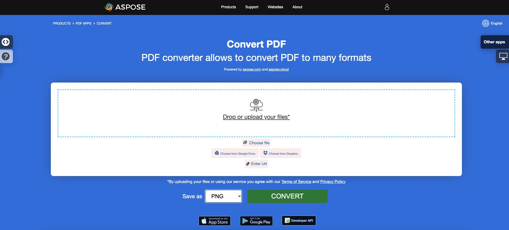

<script type="application/ld+json">
{
    "@context": "https://schema.org",
    "@type": "TechArticle",
    "headline": "Convert PDF to Different Image Formats in C#",
    "alternativeHeadline": "Convert PDF Files to Multiple Image Formats in C#",
    "abstract": "تتيح الميزة في Aspose.PDF for .NET للمستخدمين تحويل ملفات PDF بسلاسة إلى تنسيقات صور متعددة مثل TIFF و BMP و EMF و JPEG و PNG و GIF و SVG. تبسط هذه الوظيفة التعامل مع المستندات من خلال تمكين التحويل باستخدام بضع سطور من كود C#، مما يجعلها أداة أساسية للمطورين الذين يتطلعون إلى تعزيز تطبيقاتهم بقدرات معالجة PDF متعددة الاستخدامات.",
    "author": {
        "@type": "Person",
        "name": "Anastasiia Holub",
        "givenName": "Anastasiia",
        "familyName": "Holub",
        "url": "https://www.linkedin.com/in/anastasiia-holub-750430225/"
    },
    "genre": "pdf document generation",
    "wordcount": "2012",
    "proficiencyLevel": "Beginner",
    "publisher": {
        "@type": "Organization",
        "name": "Aspose.PDF for .NET",
        "url": "https://products.aspose.com/pdf",
        "logo": "https://www.aspose.cloud/templates/aspose/img/products/pdf/aspose_pdf-for-net.svg",
        "alternateName": "Aspose",
        "sameAs": [
            "https://facebook.com/aspose.pdf/",
            "https://twitter.com/asposepdf",
            "https://www.youtube.com/channel/UCmV9sEg_QWYPi6BJJs7ELOg/featured",
            "https://www.linkedin.com/company/aspose",
            "https://stackoverflow.com/questions/tagged/aspose",
            "https://aspose.quora.com/",
            "https://aspose.github.io/"
        ],
        "contactPoint": [
            {
                "@type": "ContactPoint",
                "telephone": "+1 903 306 1676",
                "contactType": "sales",
                "areaServed": "US",
                "availableLanguage": "en"
            },
            {
                "@type": "ContactPoint",
                "telephone": "+44 141 628 8900",
                "contactType": "sales",
                "areaServed": "GB",
                "availableLanguage": "en"
            },
            {
                "@type": "ContactPoint",
                "telephone": "+61 2 8006 6987",
                "contactType": "sales",
                "areaServed": "AU",
                "availableLanguage": "en"
            }
        ]
    },
    "url": "/net/convert-pdf-to-images-format/",
    "mainEntityOfPage": {
        "@type": "WebPage",
        "@id": "/net/convert-pdf-to-images-format/"
    },
    "dateModified": "2024-11-25",
    "description": "يمكن لـ Aspose.PDF أداء المهام البسيطة والسريعة وكذلك التعامل مع الأهداف الأكثر تعقيدًا. تحقق من القسم التالي للمستخدمين المتقدمين والمطورين."
}
</script>

## نظرة عامة

تشرح هذه المقالة كيفية تحويل PDF إلى تنسيقات صور مختلفة باستخدام C#. تغطي المواضيع التالية.

_تنسيق الصورة_: **TIFF**
- [C# PDF إلى TIFF](#csharp-pdf-to-tiff)
- [C# تحويل PDF إلى TIFF](#csharp-pdf-to-tiff)
- [C# تحويل صفحة واحدة أو صفحات معينة من PDF إلى TIFF](#csharp-pdf-to-tiff-pages)

_تنسيق الصورة_: **BMP**
- [C# PDF إلى BMP](#csharp-pdf-to-bmp)
- [C# تحويل PDF إلى BMP](#csharp-pdf-to-bmp)
- [C# محول PDF إلى BMP](#csharp-pdf-to-bmp)

_تنسيق الصورة_: **EMF**
- [C# PDF إلى EMF](#csharp-pdf-to-emf)
- [C# تحويل PDF إلى EMF](#csharp-pdf-to-emf)
- [C# محول PDF إلى EMF](#csharp-pdf-to-emf)

_تنسيق الصورة_: **JPG**
- [C# PDF إلى JPG](#csharp-pdf-to-jpg)
- [C# تحويل PDF إلى JPG](#csharp-pdf-to-jpg)
- [C# محول PDF إلى JPG](#csharp-pdf-to-jpg)

_تنسيق الصورة_: **PNG**
- [C# PDF إلى PNG](#csharp-pdf-to-png)
- [C# تحويل PDF إلى PNG](#csharp-pdf-to-png)
- [C# محول PDF إلى PNG](#csharp-pdf-to-png)

_تنسيق الصورة_: **GIF**
- [C# PDF إلى GIF](#csharp-pdf-to-gif)
- [C# تحويل PDF إلى GIF](#csharp-pdf-to-gif)
- [C# محول PDF إلى GIF](#csharp-pdf-to-gif)

_تنسيق الصورة_: **SVG**
- [C# PDF إلى SVG](#csharp-pdf-to-svg)
- [C# تحويل PDF إلى SVG](#csharp-pdf-to-svg)
- [C# محول PDF إلى SVG](#csharp-pdf-to-svg)

## C# تحويل PDF إلى صورة

تعمل مقتطفات التعليمات البرمجية التالية أيضًا مع مكتبة [Aspose.PDF.Drawing](/pdf/ar/net/drawing/).

**Aspose.PDF for .NET** يستخدم عدة طرق لتحويل PDF إلى صورة. بشكل عام، نستخدم طريقتين: التحويل باستخدام طريقة Device والتحويل باستخدام SaveOption. ستوضح لك هذه القسم كيفية تحويل مستندات PDF إلى تنسيقات صور مثل BMP و JPEG و GIF و PNG و EMF و TIFF و SVG باستخدام واحدة من تلك الطرق.

هناك عدة فئات في المكتبة تسمح لك باستخدام جهاز افتراضي لتحويل الصور. DocumentDevice موجه لتحويل المستند بالكامل، ولكن ImageDevice - لصفحة معينة.

## تحويل PDF باستخدام فئة DocumentDevice

**Aspose.PDF for .NET** يجعل من الممكن تحويل صفحات PDF إلى صور TIFF.

تسمح لك فئة TiffDevice (المبنية على DocumentDevice) بتحويل صفحات PDF إلى صور TIFF. توفر هذه الفئة طريقة تسمى `Process` والتي تتيح لك تحويل جميع الصفحات في ملف PDF إلى صورة TIFF واحدة.

{}
**حاول تحويل PDF إلى TIFF عبر الإنترنت**

Aspose.PDF for .NET يقدم لك تطبيقًا مجانيًا عبر الإنترنت ["PDF إلى TIFF"](https://products.aspose.app/pdf/conversion/pdf-to-tiff)، حيث يمكنك محاولة استكشاف الوظائف والجودة التي يعمل بها.

[](https://products.aspose.app/pdf/conversion/pdf-to-tiff)
{}

### تحويل صفحات PDF إلى صورة TIFF واحدة

Aspose.PDF for .NET يشرح كيفية تحويل جميع الصفحات في ملف PDF إلى صورة TIFF واحدة:

<a name="csharp-pdf-to-tiff"><strong>الخطوات: تحويل PDF إلى TIFF في C#</strong></a>

1. إنشاء كائن من فئة **Document**.
2. إنشاء كائنات **TiffSettings** و **TiffDevice**.
3. استدعاء طريقة **TiffDevice.Process()** لتحويل مستند PDF إلى TIFF.
4. لتعيين خصائص ملف الإخراج، استخدم فئة **TiffSettings**.

تظهر مقتطفات التعليمات البرمجية التالية كيفية تحويل جميع صفحات PDF إلى صورة TIFF واحدة.

```csharp
// For complete examples and data files, visit https://github.com/aspose-pdf/Aspose.PDF-for-.NET
private static void ConvertPDFtoTIFF()
{
    // The path to the documents directory
    var dataDir = RunExamples.GetDataDir_AsposePdf_WorkingDocuments();

    // Open PDF document
    using (var document = new Aspose.Pdf.Document(dataDir + "PDFtoTIFF.pdf"))
    {
        // Create Resolution object
        var resolution = new Aspose.Pdf.Devices.Resolution(300);

        // Create TiffSettings object
        var tiffSettings = new Aspose.Pdf.Devices.TiffSettings
        {
            Compression = Aspose.Pdf.Devices.CompressionType.None,
            Depth = Aspose.Pdf.Devices.ColorDepth.Default,
            Shape = Aspose.Pdf.Devices.ShapeType.Landscape,
            SkipBlankPages = false
        };

        // Create TIFF device
        var tiffDevice = new Aspose.Pdf.Devices.TiffDevice(resolution, tiffSettings);

        // Convert a particular page and save the image to stream
        tiffDevice.Process(document, dataDir + "PDFtoTIFF_out.tif");
    }
}
```

### تحويل صفحة واحدة إلى صورة TIFF

Aspose.PDF for .NET يسمح بتحويل صفحة معينة في ملف PDF إلى صورة TIFF، استخدم نسخة محملة من طريقة Process(..) التي تأخذ رقم الصفحة كوسيط للتحويل. تظهر مقتطفات التعليمات البرمجية التالية كيفية تحويل الصفحة الأولى من PDF إلى تنسيق TIFF.

<a name="csharp-pdf-to-tiff-pages"><strong>الخطوات: تحويل صفحات PDF الفردية أو المحددة إلى TIFF في C#</strong></a>

1. إنشاء كائن من فئة **Document**.
2. إنشاء كائنات **TiffSettings** و **TiffDevice**.
3. استدعاء طريقة **TiffDevice.Process()** المحملة مع معلمات **fromPage** و **toPage** لتحويل صفحات مستند PDF إلى TIFF.

```csharp
// For complete examples and data files, visit https://github.com/aspose-pdf/Aspose.PDF-for-.NET
private static void ConvertPDFtoTiffSinglePage()
{
    // The path to the documents directory
    var dataDir = RunExamples.GetDataDir_AsposePdf_WorkingDocuments();

    // Open PDF document
    using (var document = new Aspose.Pdf.Document(dataDir + "PDFtoTiffSinglePage.pdf"))
    {
        // Create Resolution object
        var resolution = new Aspose.Pdf.Devices.Resolution(300);

        // Create TiffSettings object
        var tiffSettings = new Aspose.Pdf.Devices.TiffSettings
        {
            Compression = Aspose.Pdf.Devices.CompressionType.None,
            Depth = Aspose.Pdf.Devices.ColorDepth.Default,
            Shape = Aspose.Pdf.Devices.ShapeType.Landscape,
        };

        // Create TIFF device
        var tiffDevice = new Aspose.Pdf.Devices.TiffDevice(resolution, tiffSettings);

        // Convert a particular page and save the image to stream
        tiffDevice.Process(document, 1, 1, dataDir + "PDFtoTiffSinglePage_out.tif");
    }
}
```

### استخدام خوارزمية برادلي أثناء التحويل

Aspose.PDF for .NET يدعم ميزة تحويل PDF إلى TIF باستخدام ضغط LZW ثم باستخدام AForge، يمكن تطبيق الت binarization. ومع ذلك، طلب أحد العملاء أنه لبعض الصور، يحتاجون إلى الحصول على العتبة باستخدام Otsu، لذا يرغبون أيضًا في استخدام برادلي.

```csharp
// For complete examples and data files, visit https://github.com/aspose-pdf/Aspose.PDF-for-.NET
private static void ConvertPDFtoTiffBradleyBinarization()
{
    // The path to the documents directory
    var dataDir = RunExamples.GetDataDir_AsposePdf_WorkingDocuments();

    // Open PDF document
    using (var document = new Aspose.Pdf.Document(dataDir + "PDFtoTiffBradleyBinarization.pdf"))
    {
        string outputImageFile = dataDir + "PDFtoTiffBradleyBinarization_out.tif";
        string outputBinImageFile = dataDir + "PDFtoTiffBradleyBinarization-bin_out.tif";

        // Create Resolution object
        var resolution = new Aspose.Pdf.Devices.Resolution(300);

        // Create TiffSettings object
        var tiffSettings = new Aspose.Pdf.Devices.TiffSettings
        {
            Compression = Aspose.Pdf.Devices.CompressionType.LZW,
            Depth = Aspose.Pdf.Devices.ColorDepth.Format1bpp
        };

        // Create TIFF device
        var tiffDevice = new Aspose.Pdf.Devices.TiffDevice(resolution, tiffSettings);

        // Convert a particular page and save the image to stream
        tiffDevice.Process(document, outputImageFile);

        // Binarize the image using Bradley method
        using (var inStream = new FileStream(outputImageFile, FileMode.Open))
        {
            using (var outStream = new FileStream(outputBinImageFile, FileMode.Create))
            {
                tiffDevice.BinarizeBradley(inStream, outStream, 0.1);
            }
        }
    }
}
```

## تحويل PDF باستخدام فئة ImageDevice

`ImageDevice` هو السلف لـ `BmpDevice` و `JpegDevice` و `GifDevice` و `PngDevice` و `EmfDevice`.

- تسمح لك فئة [BmpDevice](https://reference.aspose.com/pdf/net/aspose.pdf.devices/bmpdevice) بتحويل صفحات PDF إلى صور <abbr title="Bitmap Image File">BMP</abbr>.
- تسمح لك فئة [EmfDevice](https://reference.aspose.com/pdf/net/aspose.pdf.devices/emfdevice) بتحويل صفحات PDF إلى صور <abbr title="Enhanced Meta File">EMF</abbr>.
- تسمح لك فئة [JpegDevice](https://reference.aspose.com/pdf/net/aspose.pdf.devices/jpegdevice) بتحويل صفحات PDF إلى صور JPEG.
- تسمح لك فئة [PngDevice](https://reference.aspose.com/pdf/net/aspose.pdf.devices/pngdevice) بتحويل صفحات PDF إلى صور <abbr title="Portable Network Graphics">PNG</abbr>.
- تسمح لك فئة [GifDevice](https://reference.aspose.com/pdf/net/aspose.pdf.devices/gifdevice) بتحويل صفحات PDF إلى صور <abbr title="Graphics Interchange Format">GIF</abbr>.

دعونا نلقي نظرة على كيفية تحويل صفحة PDF إلى صورة.

توفر فئة `BmpDevice` طريقة تسمى [Process](https://reference.aspose.com/pdf/net/aspose.pdf.devices/bmpdevice/methods/process) التي تتيح لك تحويل صفحة معينة من ملف PDF إلى تنسيق صورة BMP. تحتوي الفئات الأخرى على نفس الطريقة. لذا، إذا كنا بحاجة إلى تحويل صفحة PDF إلى صورة، نقوم فقط بإنشاء كائن من الفئة المطلوبة.

<a name="csharp-pdf-to-bmp"></a>
<a name="csharp-pdf-to-emf"></a>
<a name="csharp-pdf-to-jpg"></a>
<a name="csharp-pdf-to-png"></a>
<a name="csharp-pdf-to-gif"></a>
    
تظهر الخطوات التالية ومقتطفات التعليمات البرمجية في C# هذه الإمكانية
 
 - [تحويل PDF إلى BMP في C#](#csharp-pdf-to-image)
 - [تحويل PDF إلى EMF في C#](#csharp-pdf-to-image)
 - [تحويل PDF إلى JPG في C#](#csharp-pdf-to-image)
 - [تحويل PDF إلى PNG في C#](#csharp-pdf-to-image)
 - [تحويل PDF إلى GIF في C#](#csharp-pdf-to-image)

<a name="csharp-pdf-to-image"><strong>الخطوات: PDF إلى صورة (BMP، EMF، JPG، PNG، GIF) في C#</strong></a>

1. تحميل ملف PDF باستخدام فئة **Document**.
2. إنشاء مثيل من فئة فرعية من **ImageDevice** أي:
   * **BmpDevice** (لتحويل PDF إلى BMP).
   * **EmfDevice** (لتحويل PDF إلى Emf).
   * **JpegDevice** (لتحويل PDF إلى JPG).
   * **PngDevice** (لتحويل PDF إلى PNG).
   * **GifDevice** (لتحويل PDF إلى GIF).
3. استدعاء طريقة **ImageDevice.Process()** لأداء تحويل PDF إلى صورة.

```csharp
// For complete examples and data files, visit https://github.com/aspose-pdf/Aspose.PDF-for-.NET
private static void ConvertPDFusingImageDevice()
{
    // The path to the documents directory
    var dataDir = RunExamples.GetDataDir_AsposePdf_WorkingDocuments();

    // Create Resolution object            
    var resolution = new Aspose.Pdf.Devices.Resolution(300);
    var bmpDevice = new Aspose.Pdf.Devices.BmpDevice(resolution);
    var jpegDevice = new Aspose.Pdf.Devices.JpegDevice(resolution);
    var gifDevice = new Aspose.Pdf.Devices.GifDevice(resolution);
    var pngDevice = new Aspose.Pdf.Devices.PngDevice(resolution);
    var emfDevice = new Aspose.Pdf.Devices.EmfDevice(resolution);

    // Open PDF document
    using (var document = new Aspose.Pdf.Document(dataDir + "ConvertAllPagesToBmp.pdf"))
    {
        ConvertPDFtoImage(bmpDevice, "bmp", document, dataDir);
        ConvertPDFtoImage(jpegDevice, "jpeg", document, dataDir);
        ConvertPDFtoImage(gifDevice, "gif", document, dataDir);
        ConvertPDFtoImage(pngDevice, "png", document, dataDir);
        ConvertPDFtoImage(emfDevice, "emf", document, dataDir);
    }
}

private static void ConvertPDFtoImage(ImageDevice imageDevice,
        string ext, Document document, var dataDir)
{
    for (int pageCount = 1; pageCount <= document.Pages.Count; pageCount++)
    {
        using (FileStream imageStream =
            new FileStream($"{dataDir}image{pageCount}_out.{ext}",
            FileMode.Create))
        {
            // Convert a particular page and save the image to stream
            imageDevice.Process(document.Pages[pageCount], imageStream);
        }
    }
}
```

{}
**حاول تحويل PDF إلى PNG عبر الإنترنت**

كمثال على كيفية عمل تطبيقاتنا المجانية، يرجى التحقق من الميزة التالية.

Aspose.PDF for .NET يقدم لك تطبيقًا مجانيًا عبر الإنترنت ["PDF إلى PNG"](https://products.aspose.app/pdf/conversion/pdf-to-png)، حيث يمكنك محاولة استكشاف الوظائف والجودة التي يعمل بها.

[](https://products.aspose.app/pdf/conversion/pdf-to-png)
{}

## تحويل PDF باستخدام فئة SaveOptions

تظهر هذه الجزء من المقالة كيفية تحويل PDF إلى <abbr title="Scalable Vector Graphics">SVG</abbr> باستخدام C# وفئة SaveOptions.

{}
**حاول تحويل PDF إلى SVG عبر الإنترنت**

Aspose.PDF for .NET يقدم لك تطبيقًا مجانيًا عبر الإنترنت ["PDF إلى SVG"](https://products.aspose.app/pdf/conversion/pdf-to-svg)، حيث يمكنك محاولة استكشاف الوظائف والجودة التي يعمل بها.

[](https://products.aspose.app/pdf/conversion/pdf-to-svg)
{}

**رسومات متجهة قابلة للتطوير (SVG)** هي مجموعة من المواصفات لصيغة ملف قائمة على XML للرسومات المتجهة ثنائية الأبعاد، سواء الثابتة أو الديناميكية (التفاعلية أو المتحركة). تعتبر مواصفة SVG معيارًا مفتوحًا تم تطويره بواسطة اتحاد الويب العالمي (W3C) منذ عام 1999.

تُعرّف صور SVG وسلوكياتها في ملفات نصية XML. وهذا يعني أنه يمكن البحث عنها وفهرستها وبرمجتها وإذا لزم الأمر، ضغطها. كملفات XML، يمكن إنشاء صور SVG وتحريرها باستخدام أي محرر نصوص، ولكن غالبًا ما يكون من الأسهل إنشاؤها باستخدام برامج الرسم مثل Inkscape.

Aspose.PDF for .NET يدعم ميزة تحويل صورة SVG إلى تنسيق PDF ويقدم أيضًا القدرة على تحويل ملفات PDF إلى تنسيق SVG. لتحقيق هذا المتطلب، تم تقديم فئة [`SvgSaveOptions`](https://reference.aspose.com/pdf/net/aspose.pdf/svgsaveoptions/methods/index) في مساحة أسماء Aspose.PDF. قم بإنشاء كائن من SvgSaveOptions ومرره كوسيط ثانٍ إلى طريقة [`Document.Save(..)`](https://reference.aspose.com/pdf/net/aspose.pdf/document/methods/save/index).

تظهر مقتطفات التعليمات البرمجية التالية الخطوات لتحويل ملف PDF إلى تنسيق SVG باستخدام .NET.

<a name="csharp-pdf-to-svg"><strong>الخطوات: تحويل PDF إلى SVG في C#</strong></a>

1. إنشاء كائن من فئة **Document**.
2. إنشاء كائن **SvgSaveOptions** مع الإعدادات المطلوبة.
3. استدعاء طريقة **Document.Save()** وتمرير كائن **SvgSaveOptions** لتحويل مستند PDF إلى SVG.

```csharp
// For complete examples and data files, visit https://github.com/aspose-pdf/Aspose.PDF-for-.NET
private static void ConvertPDFtoSVG()
{
    // The path to the documents directory
    var dataDir = RunExamples.GetDataDir_AsposePdf_WorkingDocuments();

    // Open PDF document
    using (var document = new Aspose.Pdf.Document(dataDir + "PDFtoSVG.pdf"))
    {
        // Instantiate an object of SvgSaveOptions
        var saveOptions = new Aspose.Pdf.SvgSaveOptions
        {
            // Do not compress SVG image to Zip archive
            CompressOutputToZipArchive = false,
            TreatTargetFileNameAsDirectory = true                
        };

        // Save SVG file
        document.Save(dataDir + "PDFToSVG_out.svg", saveOptions);
    }
}
```