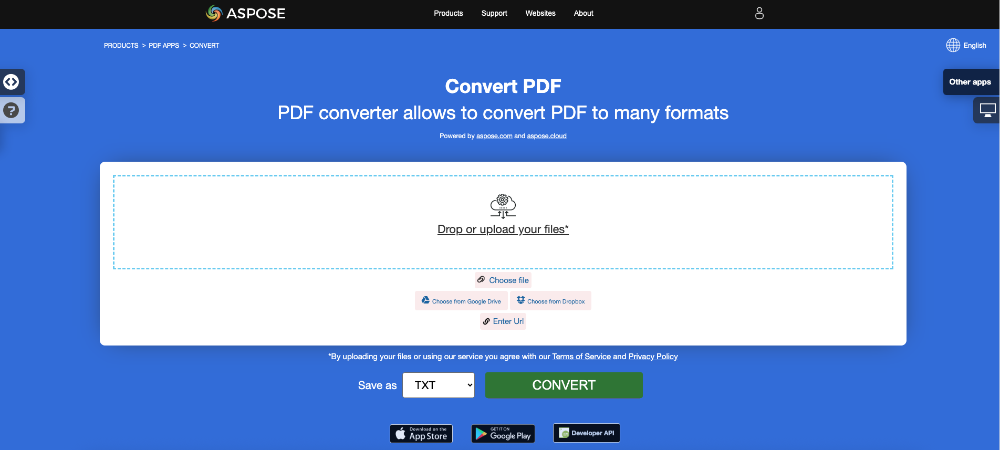

<script type="application/ld+json">
{
    "@context": "https://schema.org",
    "@type": "TechArticle",
    "headline": "Convert PDF to EPUB, LaTeX, Text, XPS in C#",
    "alternativeHeadline": "Add PDF format conversion to EPUB, LaTeX, Text, XPS in C#",
    "abstract": "Aspose.PDF for .NET يقدم ميزة قوية تسمح بالتحويل السلس لملفات PDF إلى تنسيقات متنوعة، بما في ذلك EPUB و LaTeX و نص و XPS و Markdown. تعزز هذه الوظيفة إمكانية الوصول إلى الوثائق وقابلية استخدامها من خلال تمكين المطورين من دمج تحويلات تنسيقات الملفات المتنوعة بسهولة في تطبيقات C# الخاصة بهم، مما يلبي احتياجات جمهور أوسع ويعمل على تحسين المحتوى لمختلف المنصات.",
    "author": {
        "@type": "Person",
        "name": "Anastasiia Holub",
        "givenName": "Anastasiia",
        "familyName": "Holub",
        "url": "https://www.linkedin.com/in/anastasiia-holub-750430225/"
    },
    "genre": "pdf document generation",
    "wordcount": "1419",
    "proficiencyLevel": "Beginner",
    "publisher": {
        "@type": "Organization",
        "name": "Aspose.PDF for .NET",
        "url": "https://products.aspose.com/pdf",
        "logo": "https://www.aspose.cloud/templates/aspose/img/products/pdf/aspose_pdf-for-net.svg",
        "alternateName": "Aspose",
        "sameAs": [
            "https://facebook.com/aspose.pdf/",
            "https://twitter.com/asposepdf",
            "https://www.youtube.com/channel/UCmV9sEg_QWYPi6BJJs7ELOg/featured",
            "https://www.linkedin.com/company/aspose",
            "https://stackoverflow.com/questions/tagged/aspose",
            "https://aspose.quora.com/",
            "https://aspose.github.io/"
        ],
        "contactPoint": [
            {
                "@type": "ContactPoint",
                "telephone": "+1 903 306 1676",
                "contactType": "sales",
                "areaServed": "US",
                "availableLanguage": "en"
            },
            {
                "@type": "ContactPoint",
                "telephone": "+44 141 628 8900",
                "contactType": "sales",
                "areaServed": "GB",
                "availableLanguage": "en"
            },
            {
                "@type": "ContactPoint",
                "telephone": "+61 2 8006 6987",
                "contactType": "sales",
                "areaServed": "AU",
                "availableLanguage": "en"
            }
        ]
    },
    "url": "/net/convert-pdf-to-other-files/",
    "mainEntityOfPage": {
        "@type": "WebPage",
        "@id": "/net/convert-pdf-to-other-files/"
    },
    "dateModified": "2024-11-25",
    "description": "يمكن لـ Aspose.PDF أداء المهام البسيطة والسريعة وكذلك التعامل مع الأهداف الأكثر تعقيدًا. تحقق من القسم التالي للمستخدمين المتقدمين والمطورين."
}
</script>

## تحويل PDF إلى EPUB

{}
**حاول تحويل PDF إلى EPUB عبر الإنترنت**

Aspose.PDF for .NET يقدم لك تطبيقًا مجانيًا عبر الإنترنت ["PDF إلى EPUB"](https://products.aspose.app/pdf/conversion/pdf-to-epub)، حيث يمكنك محاولة استكشاف الوظائف والجودة التي يعمل بها.

[](https://products.aspose.app/pdf/conversion/pdf-to-epub)
{}

**<abbr title="المنشور الإلكتروني">EPUB</abbr>** هو معيار مجاني ومفتوح للكتب الإلكترونية من منتدى النشر الرقمي الدولي (IDPF). الملفات لها الامتداد .epub.
تم تصميم EPUB للمحتوى القابل لإعادة التدفق، مما يعني أن قارئ EPUB يمكنه تحسين النص لجهاز عرض معين. يدعم EPUB أيضًا المحتوى الثابت التخطيط. التنسيق مخصص كتنسيق واحد يمكن للناشرين وبيوت التحويل استخدامه داخليًا، بالإضافة إلى التوزيع والبيع. إنه يحل محل معيار Open eBook.

تعمل مقتطفات الشيفرة التالية أيضًا مع مكتبة [Aspose.PDF.Drawing](/pdf/net/drawing/).

Aspose.PDF for .NET يدعم أيضًا ميزة تحويل مستندات PDF إلى تنسيق EPUB. يحتوي Aspose.PDF for .NET على فئة تسمى EpubSaveOptions يمكن استخدامها كوسيط ثانٍ لطريقة [`Document.Save(..)`](https://reference.aspose.com/pdf/net/aspose.pdf/document/methods/save/index) لإنشاء ملف EPUB.
يرجى محاولة استخدام مقتطف الشيفرة التالية لتحقيق هذا المتطلب باستخدام C#.

```csharp
// For complete examples and data files, visit https://github.com/aspose-pdf/Aspose.PDF-for-.NET
private static void ConvertPDFtoEPUB()
{
    // The path to the documents directory
    var dataDir = RunExamples.GetDataDir_AsposePdf_DocumentConversion();

    // Open PDF document
    using (var document = new Aspose.Pdf.Document(dataDir + "PDFToEPUB.pdf"))
    {
        // Instantiate Epub Save options
        EpubSaveOptions options = new EpubSaveOptions();
        // Specify the layout for contents
        options.ContentRecognitionMode = EpubSaveOptions.RecognitionMode.Flow;

        // Save ePUB document
        document.Save(dataDir + "PDFToEPUB_out.epub", options);
    }
}
```

## تحويل PDF إلى LaTeX/TeX

**Aspose.PDF for .NET** يدعم تحويل PDF إلى LaTeX/TeX.
تنسيق ملف LaTeX هو تنسيق ملف نصي مع ترميز خاص ويستخدم في نظام إعداد المستندات القائم على TeX للطباعة عالية الجودة.

{}
**حاول تحويل PDF إلى LaTeX/TeX عبر الإنترنت**

Aspose.PDF for .NET يقدم لك تطبيقًا مجانيًا عبر الإنترنت ["PDF إلى LaTeX"](https://products.aspose.app/pdf/conversion/pdf-to-tex)، حيث يمكنك محاولة استكشاف الوظائف والجودة التي يعمل بها.

[](https://products.aspose.app/pdf/conversion/pdf-to-tex)
{}

لتحويل ملفات PDF إلى TeX، يحتوي Aspose.PDF على فئة [LaTeXSaveOptions](https://reference.aspose.com/pdf/net/aspose.pdf/latexsaveoptions) التي توفر خاصية OutDirectoryPath لحفظ الصور المؤقتة أثناء عملية التحويل.

توضح مقتطفات الشيفرة التالية عملية تحويل ملفات PDF إلى تنسيق TEX باستخدام C#.

```csharp
// For complete examples and data files, visit https://github.com/aspose-pdf/Aspose.PDF-for-.NET
private static void ConvertPDFtoTeX()
{
    // The path to the documents directory
    var dataDir = RunExamples.GetDataDir_AsposePdf_DocumentConversion();

    // Open PDF document
    using (var document = new Aspose.Pdf.Document(dataDir + "PDFToTeX.pdf"))
    {
        // Instantiate LaTex save option          
        LaTeXSaveOptions saveOptions = new LaTeXSaveOptions();

        // Specify the output directory
        string pathToOutputDirectory = dataDir;

        // Set the output directory path for save option object
        saveOptions.OutDirectoryPath = pathToOutputDirectory;

        // Save PDF document into LaTex format           
        document.Save(dataDir + "PDFToTeX_out.tex", saveOptions);
    }
}
```

## تحويل PDF إلى نص

**Aspose.PDF for .NET** يدعم تحويل مستند PDF كامل وصفحة واحدة إلى ملف نص.

### تحويل مستند PDF كامل إلى ملف نص

يمكنك تحويل مستند PDF إلى ملف TXT باستخدام طريقة [Visit](https://reference.aspose.com/pdf/net/aspose.pdf.text/textabsorber/methods/visit/index) من فئة [TextAbsorber](https://reference.aspose.com/pdf/net/aspose.pdf.text/textabsorber).

توضح مقتطفات الشيفرة التالية كيفية استخراج النصوص من جميع الصفحات.

```csharp
// For complete examples and data files, visit https://github.com/aspose-pdf/Aspose.PDF-for-.NET
private static void ConvertPDFtoTXT()
{
    // The path to the documents directory
    var dataDir = RunExamples.GetDataDir_AsposePdf_DocumentConversion();

    // Open PDF document
    using (var document = new Aspose.Pdf.Document(dataDir + "demo.pdf"))
    {
        var ta = new Aspose.Pdf.Text.TextAbsorber();
        ta.Visit(document);

        // Save the extracted text in text file
        File.WriteAllText(dataDir + "input_Text_Extracted_out.txt",ta.Text);
    }
}
```

{}
**حاول تحويل PDF إلى نص عبر الإنترنت**

Aspose.PDF for .NET يقدم لك تطبيقًا مجانيًا عبر الإنترنت ["PDF إلى نص"](https://products.aspose.app/pdf/conversion/pdf-to-txt)، حيث يمكنك محاولة استكشاف الوظائف والجودة التي يعمل بها.

[](https://products.aspose.app/pdf/conversion/pdf-to-txt)
{}

### تحويل صفحة PDF إلى ملف نص

يمكنك تحويل مستند PDF إلى ملف TXT باستخدام Aspose.PDF for .NET. يجب عليك استخدام طريقة `Visit` من فئة `TextAbsorber` لحل هذه المهمة.

توضح مقتطفات الشيفرة التالية كيفية استخراج النصوص من صفحات معينة.

```csharp
// For complete examples and data files, visit https://github.com/aspose-pdf/Aspose.PDF-for-.NET
private static void ConvertPDFtoTXT()
{
    // The path to the documents directory
    var dataDir = RunExamples.GetDataDir_AsposePdf_DocumentConversion();

    // Open PDF document
    using (var document = new Aspose.Pdf.Document(dataDir + "demo.pdf"))
    {
        var ta = new Aspose.Pdf.Text.TextAbsorber();
        var pages = new [] {1, 3, 4};
        foreach (var page in pages)
        {
            ta.Visit(document.Pages[page]);
        }
    
        // Save the extracted text in text file
        File.WriteAllText(dataDir + "input_Text_Extracted_out.txt", ta.Text);
    }
}
```

## تحويل PDF إلى XPS

**Aspose.PDF for .NET** يوفر إمكانية تحويل ملفات PDF إلى تنسيق <abbr title="مواصفة ورق XML">XPS</abbr>. دعنا نحاول استخدام مقتطف الشيفرة المقدمة لتحويل ملفات PDF إلى تنسيق XPS باستخدام C#.

{}
**حاول تحويل PDF إلى XPS عبر الإنترنت**

Aspose.PDF for .NET يقدم لك تطبيقًا مجانيًا عبر الإنترنت ["PDF إلى XPS"](https://products.aspose.app/pdf/conversion/pdf-to-xps)، حيث يمكنك محاولة استكشاف الوظائف والجودة التي يعمل بها.

[](https://products.aspose.app/pdf/conversion/pdf-to-xps)
{}

نوع ملف XPS مرتبط بشكل أساسي بمواصفة ورق XML من شركة مايكروسوفت. مواصفة ورق XML (XPS)، التي كانت تُعرف سابقًا باسم Metro وتحتوي على مفهوم تسويق Next Generation Print Path (NGPP)، هي مبادرة مايكروسوفت لدمج إنشاء المستندات وعرضها في نظام تشغيل ويندوز.

لتحويل ملفات PDF إلى XPS، يحتوي Aspose.PDF على فئة [XpsSaveOptions](https://reference.aspose.com/net/pdf/aspose.pdf/xpssaveoptions) التي تستخدم كوسيط ثانٍ لطريقة [Document.Save(..)](https://reference.aspose.com/pdf/net/aspose.pdf/document/methods/save/index) لإنشاء ملف XPS.

منذ إصدار 24.2، قامت Aspose.PDF بتنفيذ تحويل PDF القابل للبحث إلى XPS مع الحفاظ على النص قابل للتحديد في XPS الناتج. للحفاظ على النص، من الضروري تعيين خاصية XpsSaveOptions.SaveTransparentTexts إلى true.

توضح مقتطفات الشيفرة التالية عملية تحويل ملف PDF إلى تنسيق XPS.

```csharp
// For complete examples and data files, visit https://github.com/aspose-pdf/Aspose.PDF-for-.NET
private static void ConvertPDFtoXPS()
{
    // The path to the documents directory
    var dataDir = RunExamples.GetDataDir_AsposePdf_DocumentConversion();

    using (var document = new Aspose.Pdf.Document(dataDir + "demo.pdf"))
    {
        var xpsOptions = new XpsSaveOptions
        {
            SaveTransparentTexts = true
        };

        // Save XPS document
        document.Save(dataDir + "PDFtoXPS_out.xps", xpsOptions);
    }
}
```

## تحويل PDF إلى Markdown

**Aspose.PDF for .NET** يوفر إمكانية تحويل ملفات PDF إلى تنسيق <abbr title="Markdown">MD</abbr>. دعنا نحاول استخدام مقتطف الشيفرة المقدمة لتحويل ملفات PDF إلى تنسيق MD باستخدام C#.

Markdown هي لغة ترميز خفيفة مصممة لتمثيل تنسيق النص العادي مع أقصى قدر من قابلية القراءة البشرية والقراءة الآلية للغات النشر المتقدمة.

### تحسين استخدام الصور بواسطة محول PDF إلى Markdown

يمكنك ملاحظة أنه في الدلائل التي تحتوي على صور، يكون عدد الصور أقل من عدد الصور في ملفات PDF.

نظرًا لأن ملف markdown لا يمكنه تعيين حجم الصورة، بدون خيار MarkdownSaveOptions.UseImageHtmlTag، يتم حفظ نفس النوع من الصور بأحجام مختلفة كصور مختلفة.

لخيار MarkdownSaveOptions.UseImageHtmlTag الممكّن، سيتم حفظ الصور الفريدة، التي يتم تغيير حجمها في المستند بواسطة علامة img.

يفتح الكود مستند PDF، ويقوم بتكوين المعلمات لتحويله إلى ملف Markdown (حفظ أي صور في المجلد المسمى "images")، ويحفظ ملف Markdown الناتج في مسار الإخراج المحدد.

توضح مقتطفات الشيفرة التالية عملية تحويل ملف PDF إلى تنسيق MD.

```csharp
// For complete examples and data files, visit https://github.com/aspose-pdf/Aspose.PDF-for-.NET
private static void ConvertPDFtoMarkup()
{
    // The path to the documents directory
    var dataDir = RunExamples.GetDataDir_AsposePdf_DocumentConversion();

    // Open PDF document
    using (var document = new Aspose.Pdf.Document(dataDir + "demo.pdf"))
    {
        // Create an instance of MarkdownSaveOptions to configure the Markdown export settings
        var saveOptions = new MarkdownSaveOptions()
        {
            // Set to false to prevent the use of HTML  tags for images in the Markdown output
            UseImageHtmlTag = false
        }
        
        // Specify the directory name where resources (like images) will be stored
        saveOptions.ResourcesDirectoryName = "images";

        // Save PDF document in Markdown format to the specified output file path using the defined save options   
        document.Save(dataDir + "PDFtoMarkup_out.md", saveOptions);
    }
}
```

### تحويل PDF إلى MobiXml

MobiXML هو تنسيق كتب إلكترونية شائع، مصمم للاستخدام على المنصات المحمولة.
توضح مقتطفات الشيفرة التالية كيفية تحويل مستند PDF إلى ملف MobiXML.
```csharp
// For complete examples and data files, visit https://github.com/aspose-pdf/Aspose.PDF-for-.NET      
private static void ConvertPdfToMobiXml()
{
    // The path to the documents directory
    var dataDir = RunExamples.GetDataDir_AsposePdf_DocumentConversion();

    // Open PDF document
    using (var document = new Aspose.Pdf.Document(dataDir + "PDFToXML.pdf"))
    {
        // Save PDF document in XML format
        document.Save(dataDir + "PDFToXML_out.xml", Aspose.Pdf.SaveFormat.MobiXml);
    }
}
```