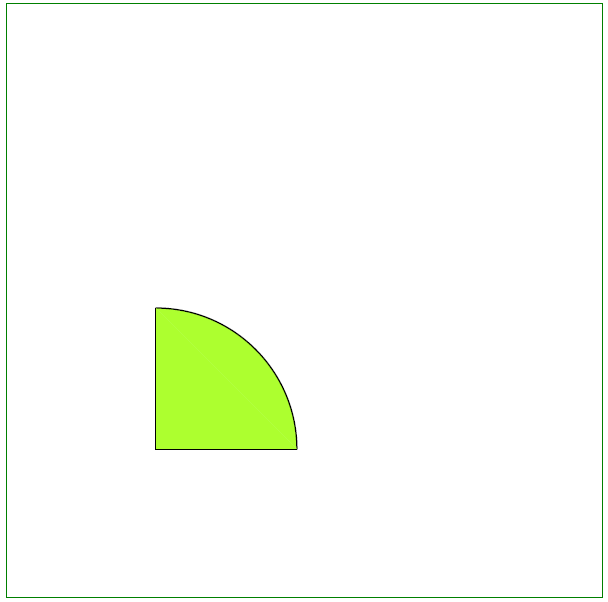

## إضافة كائن قوس

يدعم Aspose.PDF للغة بايثون عبر .NET ميزة إضافة كائنات رسومية (مثل المخطط، الخط، المستطيل إلخ) إلى مستندات PDF. كما يوفر إمكانية ملء كائن القوس بلون معين.

هذا المثال يوضح كيفية رسم الأقواس برمجيًا داخل مستند PDF باستخدام Aspose.PDF للغة بايثون عبر .NET. من خلال الاستفادة من وحدة الرسم، يمكن للمطورين إنشاء عناصر رسومية معقدة، مثل الأقواس، مع التحكم الدقيق في مظهرها وموقعها. هذه القدرة ضرورية للتطبيقات التي تتطلب توليد محتوى رسومي ديناميكي داخل ملفات PDF، مثل المخططات التقنية، الرسوم البيانية، أو الرسوم التوضيحية المخصصة.

اتبع الخطوات أدناه:

1. إنشاء مثيل [Document](https://reference.aspose.com/pdf/python-net/aspose.pdf/document/)
1. إنشاء [Drawing object](https://reference.aspose.com/pdf/python-net/aspose.pdf.drawing/) بأبعاد معينة.
1. ضبط [border](https://reference.aspose.com/pdf/python-net/aspose.pdf.drawing/graph/#properties) لكائن Drawing.
1. إضافة كائن [Graph](https://reference.aspose.com/pdf/python-net/aspose.pdf.drawing/graph/) إلى مجموعة الفقرات في الصفحة.
1. حفظ ملف PDF الخاص بنا.

تُظهر المقتطف البرمجي التالي كيفية إضافة كائن [Arc](https://reference.aspose.com/pdf/python-net/aspose.pdf.drawing/arc/).

```python

    import aspose.pdf as ap
    import aspose.pdf.drawing as drawing
    import datetime

    # Create PDF document
    document = ap.Document()

    # Add page
    page = document.pages.add()

    # Create Drawing object with certain dimensions
    graph = drawing.Graph(400, 400)

    # Set border for Drawing object
    border_info = ap.BorderInfo(ap.BorderSide.ALL, ap.Color.green)
    graph.border = border_info

    # Create arcs and set their properties
    arc1 = drawing.Arc(100, 100, 95, 0, 90)
    arc1.graph_info = drawing.GraphInfo()
    arc1.graph_info.color = ap.Color.green_yellow
    graph.shapes.add(arc1)

    arc2 = drawing.Arc(100, 100, 90, 70, 180)
    arc2.graph_info = drawing.GraphInfo()
    arc2.graph_info.color = ap.Color.dark_blue
    graph.shapes.add(arc2)

    arc3 = drawing.Arc(100, 100, 85, 120, 210)
    arc3.graph_info = drawing.GraphInfo()
    arc3.graph_info.color = ap.Color.red
    graph.shapes.add(arc3)

    # Add Graph object to paragraphs collection of page
    page.paragraphs.add(graph)

    # Save PDF document
    document.save(path_outfile)
```

## إنشاء كائن قوس مملوء

يوضح المثال التالي كيفية إضافة كائن Arc مملوء باللون وبأبعاد معينة.

```python

    import aspose.pdf as ap
    import aspose.pdf.drawing as drawing
    import datetime

    # Create PDF document
    document = ap.Document()

    # Add page
    page = document.pages.add()

    # Create Drawing object with certain dimensions
    graph = drawing.Graph(400, 400)

    # Set border for Drawing object
    border_info = ap.BorderInfo(ap.BorderSide.ALL, ap.Color.green)
    graph.border = border_info

    # Create an arc and set fill color
    arc = drawing.Arc(100, 100, 95, 0, 90)
    arc.graph_info = drawing.GraphInfo()
    arc.graph_info.fill_color = ap.Color.green_yellow
    graph.shapes.add(arc)

    # Create a line and set fill color
    line = drawing.Line([195, 100, 100, 100, 100, 195])
    line.graph_info = drawing.GraphInfo()
    line.graph_info.fill_color = ap.Color.green_yellow
    graph.shapes.add(line)

    # Add Graph object to the paragraphs collection of page
    page.paragraphs.add(graph)

    # Save PDF document
    document.save(path_outfile)
```

لنرَ نتيجة إضافة قوس مملوء:



