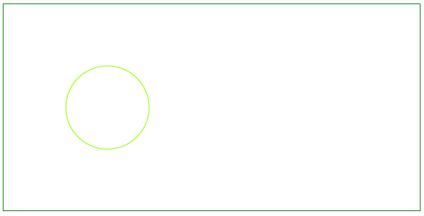

## إضافة عنصر دائرة

مثل مخططات الأعمدة، يمكن استخدام مخططات الدائرة لعرض البيانات في عدد من الفئات المنفصلة. ومع ذلك، لا يمكن استخدام مخططات الدائرة إلا عندما تتوفر لديك بيانات لجميع الفئات التي تشكل الكل. لذا دعونا نلقي نظرة على إضافة عنصر [دائرة](https://reference.aspose.com/pdf/python-net/aspose.pdf.drawing/circle/) باستخدام Aspose.PDF للبايثون .NET.

يوضح هذا المثال كيفية رسم دائرة برمجيًا داخل مستند PDF باستخدام Aspose.PDF للبايثون عبر .NET. من خلال الاستفادة من وحدة الرسم، يمكن للمطورين إنشاء عناصر رسومية معقدة مع تحكم دقيق في مظهرها وموقعها. هذه القدرة أساسية للتطبيقات التي تتطلب إنشاء محتوى رسومي ديناميكي داخل ملفات PDF، مثل المخططات التقنية، الرسوم البيانية، أو الرسومات المخصصة.

اتبع الخطوات التالية:

1. إنشاء نسخة [Document](https://reference.aspose.com/pdf/python-net/aspose.pdf/document/).
1. إنشاء [Drawing object](https://reference.aspose.com/pdf/python-net/aspose.pdf.drawing/) بأبعاد معينة.
1. تعيين [border](https://reference.aspose.com/pdf/python-net/aspose.pdf.drawing/graph/#properties) لكائن Drawing.
1. إضافة كائن [Graph](https://reference.aspose.com/pdf/python-net/aspose.pdf.drawing/graph/) إلى مجموعة الفقرات في الصفحة.
1. حفظ ملف PDF الخاص بنا.

```python

    import aspose.pdf as ap
    import aspose.pdf.drawing as drawing
    import datetime

    # Create PDF document
    document = ap.Document()

    # Add page
    page = document.pages.add()

    # Create Drawing object with certain dimensions
    graph = drawing.Graph(400, 200)

    # Set border for Drawing object
    border_info = ap.BorderInfo(ap.BorderSide.ALL, ap.Color.green)
    graph.border = border_info

    # Create a circle with the specified coordinates and radius
    circle = drawing.Circle(100, 100, 40)

    # Set the circle's color
    circle.graph_info = drawing.GraphInfo()
    circle.graph_info.color = ap.Color.green_yellow

    # Add the circle to the graph shapes
    graph.shapes.add(circle)

    # Add Graph object to paragraphs collection of page
    page.paragraphs.add(graph)

    # Save PDF document
    document.save(path_outfile)
```

ستظهر الدائرة المرسومة كالتالي:



## إنشاء عنصر دائرة مملوء

يوضح هذا المثال كيفية إضافة عنصر دائرة مملوء باللون.

```python

    import aspose.pdf as ap
    import aspose.pdf.drawing as drawing
    import datetime

    # Create PDF document
    document = ap.Document()

    # Add page
    page = document.pages.add()

    # Create Drawing object with certain dimensions
    graph = drawing.Graph(400, 200)

    # Set border for Drawing object
    border_info = ap.BorderInfo(ap.BorderSide.ALL, ap.Color.green)
    graph.border = border_info

    # Create a filled circle
    circle = drawing.Circle(100, 100, 40)
    circle.graph_info = drawing.GraphInfo()
    circle.graph_info.color = ap.Color.green_yellow
    circle.graph_info.fill_color = ap.Color.green
    circle.text = ap.text.TextFragment("Circle")

    # Add the circle to the graph shapes
    graph.shapes.add(circle)

    # Add Graph object to paragraphs collection of page
    page.paragraphs.add(graph)

    # Save PDF document
    document.save(path_outfile)
```

دعونا نرى نتيجة إضافة دائرة مملوءة:


