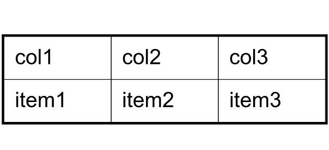

إضافة جداول إلى مستندات PDF الموجودة هي حاجة شائعة لتحسين عرض البيانات، تنظيم المعلومات، أو إنشاء تقارير. **Aspose.PDF for Python عبر .NET** يقدم حلاً شاملاً لهذه المهمة، مما يتيح للمطورين إدراج جداول في ملفات PDF الحالية بسلاسة.

يقدم هذا الدليل نهجًا خطوة بخطوة لإضافة جداول إلى مستندات PDF الموجودة باستخدام Aspose.PDF for Python عبر .NET. يغطي دليلًا تهيئة الجدول، ضبط عرض الأعمدة، تعريف الحدود، تعبئة الصفوف والخلايا، وحفظ المستند المعدل. بالإضافة إلى ذلك، يستكشف الدليل الميزات المتقدمة، مثل معالجة حدود الخلايا، تطبيق الهوامش والمسافات الداخلية، واستخدام إعدادات AutoFit لضبط أبعاد الجدول ديناميكيًا.

سواء كنت تسعى لتحسين جاذبية مظهر ملفات PDF الخاصة بك أو تنظيم البيانات بشكل أكثر فعالية، فإن هذا الدليل يُعد مصدرًا قيمًا للاستفادة من قدرات Aspose.PDF for Python القوية في تعديل الجداول.

## إنشاء جداول أساسية

## إنشاء جدول

يوضح هذا المثال كيفية إنشاء جدول في مستند PDF مع حدود وعدة صفوف.

1. إنشاء مستند PDF جديد.
1. إضافة صفحة فارغة إلى المستند.
1. تهيئة الجدول.
1. ضبط حدود الجدول العامة.
1. ضبط الحدود للخلايا الفردية.
1. إضافة صفوف وخلايا.
1. إدراج الجدول في الصفحة.
1. حفظ ملف PDF إلى المسار المحدد.

```python

    import aspose.pdf as ap
    from os import path

    path_outfile = path.join(self.data_dir, outfile)

    # Load source PDF document
    document = ap.Document()
    page = document.pages.add()
    # Initializes a new instance of the Table
    table = ap.Table()
    # Set the table border color as LightGray
    table.border = ap.BorderInfo(ap.BorderSide.ALL, 5, ap.Color.light_gray)
    # Set the border for table cells
    table.default_cell_border = ap.BorderInfo(
        ap.BorderSide.ALL, 5, ap.Color.light_gray
    )
    # Create a loop to add 10 rows
    for row_count in range(0, 10):
        # Add row to table
        row = table.rows.add()
        # Add table cells
        row.cells.add("Column (" + str(row_count) + ", 1)")
        row.cells.add("Column (" + str(row_count) + ", 2)")
        row.cells.add("Column (" + str(row_count) + ", 3)")
    # Add table object to first page of input document
    page.paragraphs.add(table)

    # Save updated document containing table object
    document.save(path_outfile)
```

### إضافة صور إلى خلايا الجدول

توضح مقطع الشيفرة هذا كيفية إدراج صور في خلايا الجدول داخل مستند PDF.

1. إنشاء مستند PDF جديد.
1. تهيئة الجدول.
1. ضبط عرض الأعمدة بالنقاط.
1. يتم إضافة قطعة نص إلى الخلية الأولى.
1. يتم إضافة كائن 'ap.Image()' إلى الخلية الثانية.
1. ضبط المسار إلى ملف الصورة باستخدام 'img.file'.
1. يتحكم 'img.fix_width' و 'img.fix_height' في حجم الصورة داخل الخلية.
1. إدراج الجدول في صفحة PDF.
1. حفظ ملف PDF.

```python

    import aspose.pdf as ap
    from os import path

    # Instantiate Document object
    document = ap.Document()
    page = document.pages.add()
    # Instantiate a table object
    table = ap.Table()
    # Set width for table cells
    table.column_widths = "200 100"

    # Create row object and add it to table instance
    row = table.rows.add()
    # Create cell object and add it to row instance
    cell = row.cells.add()
    # Add textfragment to paragraphs collection of cell object
    cell.paragraphs.add(ap.text.TextFragment(image))
    # Create an image instance
    img = ap.Image()
    # Set image type as SVG
    # Path for source file
    img.file = path.join(self.data_dir, image)
    # Set width for image instance
    img.fix_width = 50
    # Set height for image instance
    img.fix_height = 50
    # Add another cell to row object
    cell = row.cells.add()
    # Add SVG image to paragraphs collection of recently added cell instance
    cell.paragraphs.add(img)

    # Add table to paragraphs collection of page object
    page.paragraphs.add(table)
    # Save PDF file
    document.save(path_outfile)
```

يمكنك إضافة صور SVG إلى خلايا الجدول في مستند PDF:

```python

    import aspose.pdf as ap
    from os import path

    path_outfile = path.join(self.data_dir, outfile)

    # Instantiate Document object
    document = ap.Document()
    page = document.pages.add()
    # Instantiate a table object
    table = ap.Table()
    # Set width for table cells
    table.column_widths = "200 100"
    for image in images:
        # Create row object and add it to table instance
        row = table.rows.add()
        # Create cell object and add it to row instance
        cell = row.cells.add()
        # Add textfragment to paragraphs collection of cell object
        cell.paragraphs.add(ap.text.TextFragment(image))
        # Create an image instance
        img = ap.Image()
        # Set image type as SVG
        img.file_type = ap.ImageFileType.SVG
        # Path for source file
        img.file = path.join(self.data_dir, image)
        # Set width for image instance
        img.fix_width = 50
        # Set height for image instance
        img.fix_height = 50
        # Add another cell to row object
        cell = row.cells.add()
        # Add SVG image to paragraphs collection of recently added cell instance
        cell.paragraphs.add(img)

    # Add table to paragraphs collection of page object
    page.paragraphs.add(table)
    # Save PDF file
    document.save(path_outfile)
```

### دمج الأعمدة والصفوف في الجداول

يوضح هذا المثال كيفية دمج خلايا الجدول عموديًا وأفقيًا لإنشاء تخطيطات جداول معقدة.

1. ضبط حدود الجدول العامة.
1. ضبط حدود الخلايا الافتراضية.
1. دمج خليتين أفقيًا في خلية واحدة.
1. دمج الخلية عموديًا عبر صفين.
1. يأخذ الصف 5 في الاعتبار امتداد الصفوف عبر تخطي العمود المدمج.
1. إدراج الجدول في الصفحة.
1. حفظ ملف PDF.

```python

    import aspose.pdf as ap
    from os import path

    path_outfile = path.join(self.data_dir, outfile)

    # Load source PDF document
    document = ap.Document()
    page = document.pages.add()

    # Initializes a new instance of the Table
    table = ap.Table()
    # Set the table border color as LightGray
    table.border = ap.BorderInfo(ap.BorderSide.ALL, 0.5, ap.Color.black)
    # Set the border for table cells
    table.default_cell_border = ap.BorderInfo(
        ap.BorderSide.ALL, 0.5, ap.Color.black
    )
    # Add 1st row to table
    row1 = table.rows.add()
    for cellCount in range(1, 5):
        # Add table cells
        row1.cells.add("Test 1" + str(cellCount))

    # Add 2nd row to table
    row2 = table.rows.add()
    row2.cells.add("Test 2 1")
    cell = row2.cells.add("Test 2 2")
    cell.col_span = 2
    row2.cells.add("Test 2 4")

    # Add 3rd row to table
    row3 = table.rows.add()
    row3.cells.add("Test 3 1")
    row3.cells.add("Test 3 2")
    row3.cells.add("Test 3 3")
    row3.cells.add("Test 3 4")

    # Add 4th row to table
    row4 = table.rows.add()
    row4.cells.add("Test 4 1")
    cell = row4.cells.add("Test 4 2")
    cell.row_span = 2
    row4.cells.add("Test 4 3")
    row4.cells.add("Test 4 4")

    # Add 5th row to table
    row5 = table.rows.add()
    row5.cells.add("Test 5 1")
    row5.cells.add("Test 5 3")
    row5.cells.add("Test 5 4")

    # Add table object to first page of input document
    page.paragraphs.add(table)
    # Save updated document containing table object
    document.save(path_outfile)
```


### تطبيق الحدود على الجداول والخلايا

يوضح هذا المثال كيفية تعيين حشوة الخلايا، وهوامش الجدول، والتحكم في التفاف الكلمات للنص داخل خلايا الجدول.

1. تعيين عرض الأعمدة.
1. تعريف حدود الجدول والخلية.
1. تعيين الحشوة داخل الخلايا لتوفير تباعد ثابت.
1. تطبيق الحشوة على جميع الخلايا افتراضيًا.
1. إضافة النص والتحكم في التفافه.
1. إضافة صفوف وخلايا.
1. حفظ ملف PDF.

```python

    import aspose.pdf as ap
    from os import path

    path_outfile = path.join(self.data_dir, outfile)
    # Load source PDF document
    document = ap.Document()
    page = document.pages.add()
    # Instantiate a table object
    tab1 = ap.Table()
    # Add the table in paragraphs collection of the desired section
    page.paragraphs.add(tab1)
    # Set with column widths of the table
    tab1.column_widths = "50 50 50"
    # Set default cell border using BorderInfo object
    tab1.default_cell_border = ap.BorderInfo(ap.BorderSide.ALL, 0.1)
    # Set table border using another customized BorderInfo object
    tab1.border = ap.BorderInfo(ap.BorderSide.ALL, 1)
    # Create MarginInfo object and set its left, bottom, right and top margins
    margin = ap.MarginInfo()
    margin.top = 5
    margin.left = 5
    margin.right = 5
    margin.bottom = 5
    # Set the default cell padding to the MarginInfo object
    tab1.default_cell_padding = margin
    # Create rows in the table and then cells in the rows
    row1 = tab1.rows.add()
    row1.cells.add("col1")
    row1.cells.add("col2")
    row1.cells.add()
    text = ap.text.TextFragment("col3 with large text string")
    # Row1.Cells.Add("col3 with large text string to be placed inside cell")
    row1.cells[2].paragraphs.add(text)
    row1.cells[2].is_word_wrapped = False
    row2 = tab1.rows.add()
    row2.cells.add("item1")
    row2.cells.add("item2")
    row2.cells.add("item3")
    # Save updated document containing table object
    document.save(path_outfile)
```



## تخطيط الجدول وحجمه

### ضبط الأعمدة والصفوف تلقائيًا

يظهر هذا المقتطف البرمجي كيفية ضبط عرض أعمدة الجدول تلقائيًا لتناسب الصفحة.
يرجى ملاحظة أن في المتغير table.column_widths = "50 50 50" - القيم بوحدات النقاط. ولكن يمكنك أيضًا تحديد السنتيمترات (cm)، البوصة أو النسبة المئوية.

1. تعيين عرض الأعمدة الأولية.
1. ضبط الأعمدة تلقائيًا لتناسب عرض الصفحة.
1. تعريف حدود الخلية والجدول.
1. يستخدم 'table.default_cell_padding' الدالة 'MarginInfo()' لتوفير تباعد ثابت داخل الخلايا.
1. إضافة صفوف باستخدام 'table.rows.add()'، وإضافة خلايا باستخدام 'row.cells.add()'.
1. حفظ ملف PDF.

```python

    import aspose.pdf as ap
    from os import path

    path_outfile = path.join(self.data_dir, outfile)

    # Load source PDF document
    document = ap.Document()
    page = document.pages.add()
    # Instantiate a table object
    table = ap.Table()

    page.paragraphs.add(table)

    table.column_widths = "50 50 50"
    table.column_adjustment = ap.ColumnAdjustment.AUTO_FIT_TO_WINDOW

    table.default_cell_border = ap.BorderInfo(ap.BorderSide.ALL, 0.1)

    table.border = ap.BorderInfo(ap.BorderSide.ALL, 1)

    margin = ap.MarginInfo()
    margin.top = 5
    margin.left = 5
    margin.right = 5
    margin.bottom = 5

    table.default_cell_padding = margin

    row1 = table.rows.add()
    row1.cells.add("col1")
    row1.cells.add("col2")
    row1.cells.add("col3")
    row2 = table.rows.add()
    row2.cells.add("item1")
    row2.cells.add("item2")
    row2.cells.add("item3")

    document.save(path_outfile)
```

### تعديل التباعد حول المحتوى

يوضح هذا المثال كيفية إنشاء جداول تمتد عبر صفحات متعددة، ومعالجة النص الطويل في الخلايا، وتطبيق الحشوة والحدود.

1. إضافة جدول جديد إلى الصفحة باستخدام 'page.paragraphs.add(table)'.
1. تعريف عرض الأعمدة باستخدام 'table.column_widths'.
1. تعيين حدود الخلية الفردية باستخدام 'table.default_cell_border'.
1. تعيين حد الجدول العام باستخدام 'table.border'.
1. تعريف الحشوة الافتراضية للخلايا باستخدام 'MarginInfo()'.
1. إضافة النص باستخدام 'TextFragment'.
1. إضافة صف آخر.
1. حفظ ملف PDF.

```python

    import aspose.pdf as ap
    from os import path

    path_outfile = path.join(self.data_dir, outfile)

    # Create PDF document
    document = ap.Document()
    page = document.pages.add()

    # Instantiate a table object that will be nested inside outerTable that will break inside the same page
    table = ap.Table()
    # Add page
    page = document.pages.add()

    # Instantiate a table object
    table = ap.Table()

    # Add the table in paragraphs collection of the desired section
    page.paragraphs.add(table)

    # Set column widths of the table
    table.column_widths = "50 50 50"

    # Set default cell border using BorderInfo object
    table.default_cell_border = ap.BorderInfo(ap.BorderSide.ALL, 0.1)

    # Set table border using another customized BorderInfo object
    table.border = ap.BorderInfo(ap.BorderSide.ALL, 1)

    # Create MarginInfo object and set its left, bottom, right and top margins
    margin = ap.MarginInfo()
    margin.top = 5
    margin.left = 5
    margin.right = 5
    margin.bottom = 5

    # Set the default cell padding to the MarginInfo object
    table.default_cell_padding = margin

    # Create rows and cells
    row1 = table.rows.add()
    row1.cells.add("col1")
    row1.cells.add("col2")
    row1.cells.add()

    # Add a long text fragment into the third cell
    text = ap.text.TextFragment("col3 with large text string")
    row1.cells[2].paragraphs.add(text)
    row1.cells[2].is_word_wrapped = False

    # Add another row
    row2 = table.rows.add()
    row2.cells.add("item1")
    row2.cells.add("item2")
    row2.cells.add("item3")

    # Save PDF document
    document.save(path_outfile)
```


### تنسيق زوايا الجدول

يعرض Aspose.PDF للبايثون عبر .NET كيفية تطبيق زوايا مستديرة على جدول وتخصيص نصف قطر الحد.

1. إنشاء مثال جديد للجدول.
1. تهيئة حد لجميع الجوانب.
1. تعيين نصف قطر الزاوية.
1. تطبيق نمط الزاوية المستديرة.
1. إضافة صفوف وخلايا.
1. إدراج الجدول في صفحة PDF باستخدام 'page.paragraphs.add(table)'.
1. حفظ مستند PDF.

```python

    import aspose.pdf as ap
    from os import path

    path_outfile = path.join(self.data_dir, outfile)

    # Load source PDF document
    document = ap.Document()
    page = document.pages.add()
    # Initializes a new instance of the Table
    table = ap.Table()

    # Create a table
    table = ap.Table()

    # Create a blank BorderInfo object
    b_info = ap.BorderInfo(ap.BorderSide.ALL)

    # Set the border a rounded border where radius of round is 15
    b_info.rounded_border_radius = 15

    # Set the table corner style as Round
    table.corner_style = ap.BorderCornerStyle.ROUND

    # Set the table border information
    table.border = b_info

    # Create a loop to add 10 rows
    for row_count in range(0, 10):
        # Add row to table
        row = table.rows.add()
        # Add table cells
        row.cells.add("Column (" + str(row_count) + ", 1)")
        row.cells.add("Column (" + str(row_count) + ", 2)")
        row.cells.add("Column (" + str(row_count) + ", 3)")

    # Add table object to first page of input document
    page.paragraphs.add(table)
    # Save updated document containing table object
    document.save(path_outfile)
```

## إضافة محتوى إلى الجداول

### استخدام مقاطع HTML في الخلايا

يوضح هذا المثال كيفية إدراج محتوى بتنسيق HTML في خلايا الجدول.

1. تعريف حدود الجدول والخلية.
1. إضافة محتوى HTML.
1. إضافة صفوف. حلقة تكرار تضيف عدة صفوف مع محتوى HTML في كل خلية.
1. إدراج الجدول في صفحة PDF باستخدام 'page.paragraphs.add(table)'.
1. حفظ مستند PDF.

```python

    import aspose.pdf as ap
    from os import path

    path_outfile = path.join(self.data_dir, outfile)

    # Instantiate Document object
    document = ap.Document()
    page = document.pages.add()
    # Instantiate a table object
    table = ap.Table()

    # Set the table border color as LightGray
    table.border = ap.BorderInfo(ap.BorderSide.ALL, 0.5, ap.Color.light_gray)
    # Set the border for table cells
    table.default_cell_border = ap.BorderInfo(
        ap.BorderSide.ALL, 0.5, ap.Color.light_gray
    )
    # Create a loop to add 10 rows
    row_count = 1
    while row_count < 10:
        # Add row to table
        row = table.rows.add()
        # Add table cells
        cell = row.cells.add()
        cell.paragraphs.add(
            ap.HtmlFragment(f"Column <strong>({row_count}, 1)</strong>")
        )

        cell = row.cells.add()
        cell.paragraphs.add(
            ap.HtmlFragment(
                f"Column <span style='color:red'>({row_count}, 2)</span>"
            )
        )

        cell = row.cells.add()
        cell.paragraphs.add(
            ap.HtmlFragment(
                f"Column <span style='text-decoration: underline'>({row_count}, 3)</span>"
            )
        )
        row_count += 1

    # Add table object to first page of input document
    page.paragraphs.add(table)
    # Save updated document containing table object
    document.save(path_outfile)
```

### استخدام مقاطع LaTeX في الخلايا

يوضح هذا المثال كيفية إدراج محتوى بتنسيق LaTeX في خلايا الجدول للتعبيرات الرياضية أو المنسقة.

1. تعريف حدود الجدول والخلية.
1. أضف محتوى LaTeX.
1. أضف صفوفًا. حلقة تضيف عدة صفوف مع محتوى منسق بـ LaTeX في كل خلية.
1. أدخل الجدول في صفحة PDF باستخدام 'page.paragraphs.add(table)'.
1. احفظ مستند PDF.

```python

    import aspose.pdf as ap
    from os import path

    path_outfile = path.join(self.data_dir, outfile)

    # Instantiate Document object
    document = ap.Document()
    page = document.pages.add()
    # Instantiate a table object
    table = ap.Table()

    # Set the table border color as LightGray
    table.border = ap.BorderInfo(ap.BorderSide.ALL, 0.5, ap.Color.light_gray)
    # Set the border for table cells
    table.default_cell_border = ap.BorderInfo(
        ap.BorderSide.ALL, 0.5, ap.Color.light_gray
    )
    # Create a loop to add 10 rows
    row_count = 1
    while row_count < 10:
        # Add row to table
        row = table.rows.add()
        # Add table cells
        cell = row.cells.add()
        cell.paragraphs.add(
            ap.LatexFragment(f"Column $\\mathbf{{({row_count}, 1)}}$")
        )

        cell = row.cells.add()
        cell.paragraphs.add(
            ap.LatexFragment(
                f"Column $\\textcolor{{red}}{{({row_count}, 2)}}$"
            )
        )

        cell = row.cells.add()
        cell.paragraphs.add(
            ap.LatexFragment(
                f"Column $\\underline{{({row_count}, 3)}}$"
            )
        )
        row_count += 1

    # Add table object to first page of input document
    page.paragraphs.add(table)
    # Save updated document containing table object
    document.save(path_outfile)
```

## ميزات الجدول المتقدمة

### إدراج جداول عبر الصفحات

يوضح هذا المثال كيفية إنشاء جداول متعددة في ملف PDF، وضبط هوامش الصفحة، وإجبار جدول على البدء في صفحة جديدة.

1. اضبط هوامش الصفحة باستخدام 'page_info.margin'.
1. اضبط اتجاه الصفحة إلى أفقي باستخدام 'page_info.is_landscape'.
1. الجدول الأول:
- عرّف عمودين بعروض محددة.
- أضف الصفوف في حلقة باستخدام 'row.fixed_row_height'.
- عَبِّئ الخلايا بقطع نصية.
1. الجدول الثاني:
- أنشئ جدولًا جديدًا باستخدام 'table1.column_widths'.
- إجبر الجدول على البدء في صفحة جديدة.
1. أضف الجدول الأول.
1. أضف الجدول الثاني في صفحة جديدة.
1. احفظ المستند

```python

    import aspose.pdf as ap
    from os import path

    # The path to the documents directory
    path_outfile = path.join(self.data_dir, outfile)

    # Create PDF document
    document = ap.Document()

    # Set page and margin information
    page_info = document.page_info
    margin_info = page_info.margin

    margin_info.left = 37
    margin_info.right = 37
    margin_info.top = 37
    margin_info.bottom = 37
    page_info.is_landscape = True

    # First table with 120 rows
    table = ap.Table()
    table.column_widths = "50 100"

    cur_page = document.pages.add()

    for i in range(1, 121):
        row = table.rows.add()
        row.fixed_row_height = 15
        cell1 = row.cells.add()
        cell1.paragraphs.add(ap.text.TextFragment("Content 1"))
        cell2 = row.cells.add()
        cell2.paragraphs.add(ap.text.TextFragment("Content 2"))

    cur_page.paragraphs.add(table)

    # Second table with 10 rows
    table1 = ap.Table()
    table1.column_widths = "100 100"

    for i in range(1, 11):
        row = table1.rows.add()
        cell1 = row.cells.add()
        cell1.paragraphs.add(ap.text.TextFragment("Content 3"))
        cell2 = row.cells.add()
        cell2.paragraphs.add(ap.text.TextFragment("Content 4"))

    table1.is_in_new_page = True  # Force table to new page
    cur_page.paragraphs.add(table1)

    # Save updated document containing table object
    document.save(path_outfile)
```

### إنشاء جداول بدون حدود

يوضح هذا المثال كيفية إنشاء جدول كبير يمكنه الانقسام عموديًا عبر الصفحات، وتكرار الأعمدة، وتطبيق ألوان خلفية مختلفة على خلايا العنوان.

1. تهيئة الجدول.
1. اضبط حدًا افتراضيًا لجميع الخلايا.
1. خلايا العنوان تستخدم 'col_span' لدمج عدة أعمدة.
1. اضبط خلفية الخلية لتمييز بصري أفضل باستخدام 'background_color set'
1. أضف صفوفًا.
1. أدخل الجدول في صفحة PDF باستخدام 'page.paragraphs.add(table)'.
1. احفظ مستند PDF.

```python

    import aspose.pdf as ap
    from os import path

    # The path to the documents directory
    path_outfile = path.join(self.data_dir, outfile)

    # Create PDF document
    document = ap.Document()
    page = document.pages.add()

    table = ap.Table()
    table.broken = ap.TableBroken.VERTICAL
    table.default_cell_border = ap.BorderInfo(ap.BorderSide.ALL)
    table.repeating_columns_count = 2
    page.paragraphs.add(table)

    # Add header Row
    row = table.rows.add()
    cell = row.cells.add("header 1")
    cell.col_span = 2
    cell.background_color = ap.Color.light_gray
    row.cells.add("header 3")

    cell2 = row.cells.add("header 4")
    cell2.col_span = 2
    cell2.background_color = ap.Color.light_blue
    row.cells.add("header 6")

    cell3 = row.cells.add("header 7")
    cell3.col_span = 2
    cell3.background_color = ap.Color.light_green
    cell4 = row.cells.add("header 9")

    cell4.col_span = 3
    cell4.background_color = ap.Color.light_coral
    row.cells.add("header 12")
    row.cells.add("header 13")
    row.cells.add("header 14")
    row.cells.add("header 15")
    row.cells.add("header 16")
    row.cells.add("header 17")

    row_counter = 0
    while row_counter < 3:
        # Create rows in the table and then cells in the rows
        row1 = table.rows.add()
        row1.cells.add("col " + str(row_counter) + ", 1")
        row1.cells.add("col " + str(row_counter) + ", 2")
        row1.cells.add("col " + str(row_counter) + ", 3")
        row1.cells.add("col " + str(row_counter) + ", 4")
        row1.cells.add("col " + str(row_counter) + ", 5")
        row1.cells.add("col " + str(row_counter) + ", 6")
        row1.cells.add("col " + str(row_counter) + ", 7")
        row1.cells.add("col " + str(row_counter) + ", 8")
        row1.cells.add("col " + str(row_counter) + ", 9")
        row1.cells.add("col " + str(row_counter) + ", 10")
        row1.cells.add("col " + str(row_counter) + ", 11")
        row1.cells.add("col " + str(row_counter) + ", 12")
        row1.cells.add("col " + str(row_counter) + ", 13")
        row1.cells.add("col " + str(row_counter) + ", 14")
        row1.cells.add("col " + str(row_counter) + ", 15")
        row1.cells.add("col " + str(row_counter) + ", 16")
        row1.cells.add("col " + str(row_counter) + ", 17")
        row_counter += 1

    document.save(path_outfile)
```

### تكرار صفوف العنوان على صفحات متعددة

يوضح هذا المثال كيفية إنشاء جدول يمتد على عدة صفحات مع إبقاء صفوف العنوان مرئية في كل صفحة.

1. تهيئة الجدول.
1. كرر صفوف العنوان بما في ذلك الخط والحجم واللون.
1. اضبط أعرض الأعمدة وطبق الحدود على الجدول.
1. أضف صفوف العنوان.
1. أضف العديد من صفوف البيانات لإجبار الجدول على الامتداد عبر صفحات متعددة.
1. أدخل الجدول في صفحة PDF باستخدام 'page.paragraphs.add(table)'.
1. احفظ مستند PDF.

```python

    import aspose.pdf as ap
    from os import path

    path_outfile = path.join(self.data_dir, outfile)

    # Create PDF document
    document = ap.Document()
    page = document.pages.add()

    # Instantiate a table object
    table = ap.Table()

    # Set the table to break across pages
    table.broken = ap.TableBroken.VERTICAL

    # Set number of repeating header rows
    table.repeating_rows_count = 2

    text_state = ap.text.TextState()
    text_state.font_size = 12
    text_state.font = ap.text.FontRepository.find_font("TimesNewRoman")
    text_state.foreground_color = ap.Color.red
    table.repeating_rows_style =  text_state

    # Set column widths
    table.column_widths = "100 100 100"

    # Set borders
    table.default_cell_border = ap.BorderInfo(ap.BorderSide.ALL, 0.5, ap.Color.black)
    table.border = ap.BorderInfo(ap.BorderSide.ALL, 1, ap.Color.black)

    # Add header rows that will repeat on each page
    header_row1 = table.rows.add()
    header_row1.cells.add("Header 1-1")
    header_row1.cells.add("Header 1-2")
    header_row1.cells.add("Header 1-3")

    # Set background color for header rows
    for cell in header_row1.cells:
        cell.background_color = ap.Color.light_gray

    header_row2 = table.rows.add()
    header_row2.cells.add("Header 2-1")
    header_row2.cells.add("Header 2-2")
    header_row2.cells.add("Header 2-3")

    for cell in header_row2.cells:
        cell.background_color = ap.Color.light_blue

    # Add many data rows to force table across multiple pages
    for i in range(1, 101):
        row = table.rows.add()
        row.cells.add(f"Data {i}-1")
        row.cells.add(f"Data {i}-2")
        row.cells.add(f"Data {i}-3")

    # Add table to page
    page.paragraphs.add(table)

    # Save document
    document.save(path_outfile)
```

### تكرار الأعمدة

الدالة 'add_repeating_columns' تنشئ مستند PDF يحتوي على جدول به أعمدة متكررة. تُعدّ جدولًا بحدود، وتضيف رؤوسًا، وتملأ صفوف البيانات، وتحفظ ملف PDF المُنتج في الموقع المحدد. ضبط هذه الخاصية سيسبّب انقسام الجدول إلى الصفحة التالية حسب الأعمدة وتكرار عدد الأعمدة المحدد في بداية الصفحة التالية.

1. يهيئ مستند PDF جديد.
1. يضيف صفحة بأبعاد مخصصة.
1. اضبط نمط حدود الجدول.
1. ابدأ تهيئة الجدول.
1. أضف الجدول إلى صفحة PDF.
1. أضف صف العنوان.
1. أضف صفوف البيانات.
1. احفظ مستند PDF.

```python

    import aspose.pdf as ap
    from os import path

    path_outfile = path.join(self.data_dir, outfile)

    # Create PDF document
    document = ap.Document()

    # Add page
    page = document.pages.add()
    page.set_page_size(ap.PageSize.A5.height, ap.PageSize.A5.width)

    # Define border
    border = ap.BorderInfo(ap.BorderSide.ALL, 0.5, ap.Color.light_gray)

    # Create table
    table = ap.Table()
    table.broken = ap.TableBroken.VERTICAL
    table.column_adjustment = ap.ColumnAdjustment.AUTO_FIT_TO_CONTENT
    table.repeating_columns_count = 5
    table.border = border
    table.default_cell_border = border

    # Add table to page
    page.paragraphs.add(table)

    # Add header row
    row = table.rows.add()
    for i in range(1, 6):
        cell = row.cells.add(f"header {i}")
        cell.background_color = ap.Color.light_gray

    for i in range(6, 18):
        row.cells.add(f"header {i}")

    # Add data rows
    for row_counter in range(1, 6):
        row = table.rows.add()
        for i in range(1, 6):
            cell = row.cells.add(f"cell {row_counter},{i}")
            cell.background_color = ap.Color.light_gray
        for i in range(6, 18):
            row.cells.add(f"cell {row_counter},{i}")

    # Save PDF document
    document.save(path_outfile)
    print(f"File saved at: {path_outfile}")
```
