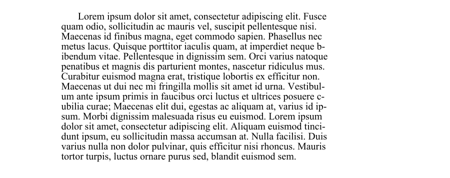
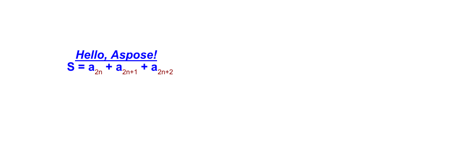
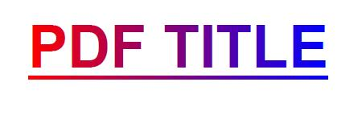
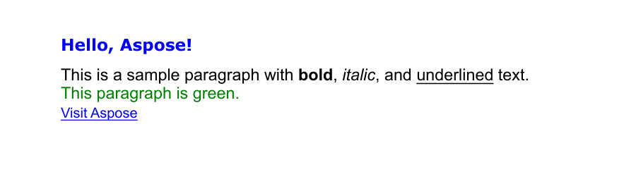

يوضح هذا الدليل كيفية إضافة محتوى نصي إلى مستندات PDF باستخدام Aspose.PDF لبايثون عبر .NET. سوف تتعلم تقنيات إدخال النص الأساسية—من وضع قطعة نص بسيطة في موضع محدد، إلى تنسيقها (الخط، الحجم، اللون، النمط)، ومعالجة اللغات من اليمين إلى اليسار (RTL)، وإدراج الروابط التشعبية، والعمل مع تخطيطات الفقرات، القوائم، وتأثيرات الشفافية. تغطي المقالة أيضًا سيناريوهات متقدمة مثل استخدام قطع HTML أو LaTeX، الخطوط المخصصة، وخيارات تنسيق النص مثل تباعد الأسطر وتباعد الأحرف.

سواء كنت تُنشئ تعليقات توضيحية بسيطة أو تخطيطات طباعة غنية، يزودك هذا المورد بالكتل الأساسية للعمل بالنص في ملفات PDF باستخدام Aspose.PDF.

## الإدخال الأساسي للنص

توفر Aspose.PDF لبايثون عبر .NET واجهة برمجة تطبيقات قوية ومرنة للتعامل مع النص داخل ملفات PDF.
سواء كنت تحتاج إلى تسميات ثابتة بسيطة، محتوى منسق غني، نص متعدد اللغات، أو روابط تشعبية تفاعلية، يتيح لك مجموعة الأدوات القيام بكل ذلك باستخدام شفرة بايثون مختصرة.

### إضافة نص - حالة بسيطة

تُظهر Aspose.PDF لبايثون عبر .NET كيفية إضافة قطعة نص بسيطة إلى موضع محدد على الصفحة. ستتعلم كيفية إنشاء مستند PDF جديد، إضافة صفحة، إدراج نص عند إحداثيات معينة، وحفظ الملف الناتج.

1. إنشاء كائن [المستند](https://reference.aspose.com/pdf/python-net/aspose.pdf/document/) جديد.
1. استخدم `document.pages.add()` لإنشاء [الصفحة](https://reference.aspose.com/pdf/python-net/aspose.pdf/page/) جديدة فارغة.
1. إنشاء [`TextFragment`](https://reference.aspose.com/pdf/python-net/aspose.pdf.text/textfragment/) مع محتوى النص.
1. ضبط موضع النص باستخدام الفئة [`Position`](https://reference.aspose.com/pdf/python-net/aspose.pdf.text/position/). إذا قمت بتحديد `Position`، سيُوضع النص في المستند من اليسار إلى اليمين وينتقل إلى الأسفل.
1. تخصيص مظهر النص. يمكنك ضبط حجم الخط، اللون، نمط الخط، والمزيد عبر [`TextState`](https://reference.aspose.com/pdf/python-net/aspose.pdf/textstate/).
1. إلحاق `TextFragment` بمجموعة فقرات الصفحة باستخدام `page.paragraphs.add(text_fragment)`.
1. حفظ المستند.

توضح الشفرة التالية كيفية إضافة نص إلى ملف PDF موجود:

```python

import os
import aspose.pdf as ap

# Global configuration
DATA_DIR = "your path here"

def add_text_simple_case(outfile):
    """
    Add simple text to a PDF document.
    Creates a new PDF document with a single page and adds a text fragment
    "Hello, Aspose!" at position (100, 600) on the page.
    Args:
        outfile (str): The file path where the generated PDF document will be saved.
    Returns:
        None: The function saves the document to the specified output file.
    Example:
        >>> add_text_simple_case("output.pdf")
        # Creates a PDF file named "output.pdf" with "Hello, Aspose!" text
    """

    # Create a new document
    document = ap.Document()
    page = document.pages.add()

    # Add a text fragment at a specific position
    text_fragment = ap.text.TextFragment("Hello, Aspose!")
    text_fragment.position = ap.text.Position(100, 600)

    page.paragraphs.add(text_fragment)
    document.save(outfile)
```

يستخدم مثال الشفرة هذا TextFragment. ولكن يمكنك أيضًا إضافة نص إلى صفحة PDF باستخدام TextParagraph. لنستكشف الفرق.
**[TextFragment](https://reference.aspose.com/pdf/python-net/aspose.pdf.text/textfragment/)** هو قطعة نصية واحدة. يمثل TextFragment وحدة نصية واحدة — في الأساس، سلسلة نصية واحدة يمكن وضعها وتنسيقها وتحديد موضعها بشكل مستقل. إنه مثالي عندما تحتاج إلى إضافة نص بسيط وكميات صغيرة من النص.

**[TextParagraph](https://reference.aspose.com/pdf/python-net/aspose.pdf.text/textparagraph/)** هو مجموعة من TextFragments. يمكنه إضافة عدة أسطر نصية. يُعد TextParagraph حاوية أو مجموعة من كائن واحد أو أكثر من TextFragment. إنه مثالي عندما تحتاج إلى تجميع عدة قطع — على سبيل المثال، لإنشاء كتلة نص تحتوي على عدة أسطر أو كلمات أو عناصر منسقة.
يدير TextParagraph أيضًا محاذاة النص، تباعد الأسطر، وتخطيطًا تلقائيًا على الصفحة. استخدام الخط الأحمر ممكن فقط مع TextParagraph.

للمزيد من المعلومات حول العمل بالنص، يرجى مراجعة أقسام الوثائق [تنسيق النص داخل PDF](/pdf/python-net/text-formatting-inside-pdf/) و[استخراج النص من PDF باستخدام بايثون](/pdf/python-net/extract-text-from-pdf/).

### إضافة نص باستخدام TextParagraph

يمكن لـ Aspose.PDF لبايثون عبر .NET إضافة فقرة نص باستخدام [`TextBuilder`](https://reference.aspose.com/pdf/python-net/aspose.pdf.text/textbuilder/) و[`TextParagraph`](https://reference.aspose.com/pdf/python-net/aspose.pdf.text/textparagraph/) مع خيارات الالتفاف.

1. إنشاء [المستند](https://reference.aspose.com/pdf/python-net/aspose.pdf/document/) و[الصفحة](https://reference.aspose.com/pdf/python-net/aspose.pdf/page/) فارغتين باستخدام `document.pages.add()`.
1. قراءة النص من ملف أو استخدام النص الافتراضي.
1. إنشاء [`TextBuilder`](https://reference.aspose.com/pdf/python-net/aspose.pdf.text/textbuilder/) لإضافة محتوى على مستوى الفقرة مع التحكم في التخطيط والالتفاف.
1. إنشاء [`TextParagraph`](https://reference.aspose.com/pdf/python-net/aspose.pdf.text/textparagraph/) وتعيين وضع الالتفاف (يستخدم المثال `DISCRETIONARY_HYPHENATION`).
1. إنشاء [`TextFragment`](https://reference.aspose.com/pdf/python-net/aspose.pdf.text/textfragment/), تطبيق الأنماط، وإلحاق الجزء بالفقرة.
1. إلحاق الفقرة بالصفحة باستخدام `TextBuilder`.
1. حفظ المستند.

```python

import os
import aspose.pdf as ap

# Global configuration
DATA_DIR = "your path here"

def add_text_paragraph(outfile):
    """
    Add formatted text paragraph with indentation and wrapping to a PDF document.

    Creates a PDF document with a text paragraph that demonstrates advanced text
    formatting including first line indentation, text wrapping with discretionary
    hyphenation, and loading text content from an external file.

    Args:
        outfile (str): The file path where the generated PDF document will be saved.

    Returns:
        None: The function saves the document to the specified output file.

    Note:
        - Attempts to load text from "lorem.txt" file in DATA_DIR
        - Falls back to default message if file doesn't exist
        - Uses Times New Roman font at 12pt size
        - First line indent: 20 points
        - Rectangle bounds: (80, 800, 400, 200)
        - Text wrapping: DISCRETIONARY_HYPHENATION mode for better line breaks

    Example:
        >>> add_text_paragraph("paragraph_text.pdf")
        # Creates a PDF with formatted paragraph text
    """
    document = ap.Document()
    page = document.pages.add()

    lorem_path = os.path.join(DATA_DIR, "lorem.txt")
    if os.path.exists(lorem_path):
        with open(lorem_path, "r", encoding="utf-8") as file:
            text = file.read()
    else:
        text = "Lorem ipsum sample text not found."

    builder = ap.text.TextBuilder(page)
    paragraph = ap.text.TextParagraph()
    paragraph.first_line_indent = 20
    paragraph.rectangle = ap.Rectangle(80, 800, 400, 200, True)
    # paragraph.formatting_options.wrap_mode = TextFormattingOptions.WordWrapMode.BY_WORDS
    paragraph.formatting_options.wrap_mode = (
        ap.text.TextFormattingOptions.WordWrapMode.DISCRETIONARY_HYPHENATION
    )

    fragment = ap.text.TextFragment(text)
    fragment.text_state.font = ap.text.FontRepository.find_font("Times New Roman")
    fragment.text_state.font_size = 12

    paragraph.append_line(fragment)
    builder.append_paragraph(paragraph)

    document.save(outfile)
```



### إضافة فقرات مع مسافات بادئة في PDF

تظهر الشفرة التالية كيفية إنشاء مستند PDF جديد وإضافة فقرتين من النص مع أنماط إزاحة مختلفة:

- الفقرة الأولى توضح إزاحة السطر الأول (فقط السطر الأول مُباع).

- الفقرة الثانية توضح إزاحة الأسطر التالية (جميع الأسطر بعد الأول مُباع).

يستخدم الفئات 'TextParagraph' و 'TextBuilder' و 'TextFragment' من Aspose.PDF للتحكم بدقة في التخطيط والتنسيق.

```python

import os
import aspose.pdf as ap

# Global configuration
DATA_DIR = "your path here"

def add_paragraphs_indents(output_file_name):
    """Add text with indents to a PDF document.
    Creates a PDF document with two text paragraphs demonstrating different
    indent styles. The first paragraph uses first line indent, while the
    second paragraph uses subsequent lines indent. Text content is loaded
    from a lorem.txt file if available, otherwise uses a fallback message.
    Args:
        output_file_name (str): The file path where the PDF document will be saved.
    Returns:
        None: The function saves the PDF document to the specified output file.
    Note:
        - Uses Times New Roman font at 12pt size
        - Text wrapping is set to wrap by words
        - First paragraph: 20pt first line indent, positioned at (80, 800, 300, 50)
        - Second paragraph: 20pt subsequent lines indent, positioned at (320, 800, 500, 50)
    """

    document = ap.Document()
    page = document.pages.add()

    lorem_path = os.path.join(DATA_DIR, "lorem.txt")
    if os.path.exists(lorem_path):
        with open(lorem_path, "r", encoding="utf-8") as file:
            text = file.read()
    else:
        text = "Lorem ipsum sample text not found."

    fragment = ap.text.TextFragment(text)
    fragment.text_state.font = ap.text.FontRepository.find_font("Times New Roman")
    fragment.text_state.font_size = 12

    builder = ap.text.TextBuilder(page)
    paragraph1 = ap.text.TextParagraph()
    paragraph1.first_line_indent = 20
    paragraph1.rectangle = ap.Rectangle(80, 800, 300, 50, True)
    paragraph1.formatting_options.wrap_mode = (
        ap.text.TextFormattingOptions.WordWrapMode.BY_WORDS
    )

    paragraph1.append_line(fragment)
    builder.append_paragraph(paragraph1)

    paragraph2 = ap.text.TextParagraph()
    paragraph2.subsequent_lines_indent = 20
    paragraph2.rectangle = ap.Rectangle(320, 800, 500, 50, True)
    paragraph2.formatting_options.wrap_mode = (
        ap.text.TextFormattingOptions.WordWrapMode.BY_WORDS
    )

    paragraph2.append_line(fragment)
    builder.append_paragraph(paragraph2)
    document.save(output_file_name)
```

### إضافة سطر جديد من النص في PDF

يتيح Aspose.PDF لبايثون عبر .NET إدراج نص متعدد الأسطر في مستند PDF باستخدام فئات TextFragment و TextParagraph و TextBuilder.

1. إنشاء مستند جديد.
1. تعريف TextFragment يحتوي على حرف سطر جديد.
1. تعيين نمط النص.
1. إضافة الجزء إلى فقرة.
1. تحديد موضع الفقرة.
1. رسم الفقرة على الصفحة.
1. حفظ المستند.

```python

import os
import aspose.pdf as ap

# Global configuration
DATA_DIR = "your path here"

def add_new_line(output_file):
    """Add a new line of text to a PDF document."""
    # Create PDF document
    document = ap.Document()
    page = document.pages.add()

    # Initialize new TextFragment with text containing required newline markers
    text_fragment = ap.text.TextFragment("Applicant Name: " + os.linesep + " Joe Smoe")

    # Set text fragment properties if necessary
    text_fragment.text_state.font_size = 12
    text_fragment.text_state.font = ap.text.FontRepository.find_font("TimesNewRoman")
    text_fragment.text_state.background_color = ap.Color.light_gray
    text_fragment.text_state.foreground_color = ap.Color.red

    # Create TextParagraph object
    par = ap.text.TextParagraph()

    # Add new TextFragment to paragraph
    par.append_line(text_fragment)

    # Set paragraph position
    par.position = ap.text.Position(100, 600)

    # Create TextBuilder object
    text_builder = ap.text.TextBuilder(page)

    # Add the TextParagraph using TextBuilder
    text_builder.append_paragraph(par)

    # Save PDF document
    document.save(output_file)
```

### تحديد فواصل الأسطر وتسجيل الإشعارات في ملف PDF

يُظهر كيفية إنشاء مستند PDF يحتوي على عدة أجزاء نصية وتمكين تسجيل إشعارات Aspose.PDF لمراقبة أحداث التخطيط — مثل فواصل الأسطر وتغليف النص — أثناء عملية العرض.

1. إنشاء مستند PDF جديد.
1. تمكين تسجيل الإشعارات.
1. استخدم document.pages.add() لإنشاء الصفحة الأولى.
1. إضافة عدة أجزاء نصية.
1. استخدم page.paragraphs.add(text) لرسم كل جزء نصي.
1. حفظ المستند.

```python

import os
import aspose.pdf as ap

# Global configuration
DATA_DIR = "your path here"

def determine_line_break(output_file):
    """Create a PDF document with multiple text fragments and log notifications."""
    # Create PDF document
    document = ap.Document()

    # Enable notification logging
    document.enable_notification_logging = True

    page = document.pages.add()

    for i in range(4):
        text = ap.text.TextFragment(
            "Lorem ipsum \r\ndolor sit amet, consectetur adipiscing elit, "
            "sed do eiusmod tempor incididunt ut labore et dolore magna aliqua. "
            "Ut enim ad minim veniam, quis nostrud exercitation ullamco laboris "
            "nisi ut aliquip ex ea commodo consequat. Duis aute irure dolor in "
            "reprehenderit in voluptate velit esse cillum dolore eu fugiat nulla "
            "pariatur. Excepteur sint occaecat cupidatat non proident, sunt in "
            "culpa qui officia deserunt mollit anim id est laborum."
        )
        text.text_state.font_size = 20
        page.paragraphs.add(text)

    # Save PDF document
    document.save(output_file)

    notifications = document.pages[1].get_notifications()
    print(notifications)
```

### قياس عرض النص ديناميكياً في PDF

قياس عرض الأحرف والسلاسل ديناميكياً بخط محدد باستخدام Aspose.PDF for Python عبر .NET. يستخدم طريقتي 'Font.measure_string()' و 'TextState.measure_string()' للتحقق من أن عرض السلاسل المقاسة متسق ودقيق.

1. استخدم 'FontRepository.find_font()' لاسترداد كائن خط Arial من المستودع.
1. إنشاء كائن TextState لإدارة خصائص الخط.
1. قياس الأحرف الفردية.
1. مقارنة نتائج الطريقتين لجميع الأحرف بين 'A' و 'z'.
1. التأكد من أن كلا نهجي القياس ينتجان نفس النتائج.

```python

import os
import aspose.pdf as ap

# Global configuration
DATA_DIR = "your path here"

def get_text_width_dynamically(output_file):

    font = ap.text.FontRepository.find_font("Arial")
    ts = ap.text.TextState()
    ts.font = font
    ts.font_size = 14

    if math.fabs(font.measure_string("A", 14) - 9.337) > 0.001:
        print("Unexpected font string measure!")

    if math.fabs(ts.measure_string("z") - 7.0) > 0.001:
        print("Unexpected font string measure!")

    c_code = ord("A")
    while c_code <= ord("z"):
        c = chr(c_code)

        fn_measure = font.measure_string(str(c), 14)
        ts_measure = ts.measure_string(str(c))

        if math.fabs(fn_measure - ts_measure) > 0.001:
            print("Font and state string measuring doesn't match!")

        c_code += 1
```

### إضافة نص مع روابط تشعبية

أضف روابط تشعبية قابلة للنقر إلى النص في ملف PDF باستخدام Aspose.PDF for Python عبر .NET. توضح مكتبتنا كيفية إضافة عدة مقاطع نصية داخل TextFragment واحد وتطبيق رابط تشعبي على مقطع محدد، وتنسيق مقاطع النص بشكل فردي (مثل اللون، الخط المائل).

1. إنشاء مستند وصفحة جديدين باستخدام 'Document()'، واستخدام 'document.pages.add()' لإضافة صفحة فارغة.
1. إنشاء TextFragment.
1. إضافة عدة كائنات TextSegment. يمكن لكل مقطع أن يحتوي على محتوى وتنسيق خاص به. على سبيل المثال نص عادي أو نص مع رابط تشعبي.
1. تطبيق رابط تشعبي على مقطع. إنشاء كائن WebHyperlink باستخدام عنوان URL المطلوب.
1. تنسيق المقطع. تخصيص اللون، نمط الخط، الحجم، إلخ، باستخدام text_state.
1. إضافة الجزء إلى الصفحة باستخدام 'page.paragraphs.add()'.
1. حفظ ملف PDF.

```python

import os
import aspose.pdf as ap

# Global configuration
DATA_DIR = "your path here"

def add_text_with_hyperlink(outfile):
    """
    Add text with embedded hyperlinks to a PDF document.

    Creates a PDF document with a text fragment containing multiple segments,
    including one with a hyperlink to Aspose. Demonstrates how to create
    clickable links within PDF text content with different formatting.

    Args:
        outfile (str): The file path where the generated PDF document will be saved.

    Returns:
        None: The function saves the document to the specified output file.

    Note:
        - Creates 4 text segments within a single text fragment
        - One segment contains a hyperlink to "https://products.aspose.com/pdf"
        - Hyperlinked text is styled in blue italic font
        - Other segments are regular text without links

    Example:
        >>> add_text_with_hyperlink("hyperlink_text.pdf")
        # Creates a PDF with clickable Aspose link in the text
    """

    document = ap.Document()
    page = document.pages.add()

    fragment = ap.text.TextFragment(
        "Sample Text Fragment"
    )

    segment = ap.text.TextSegment(" ... Text Segment 1...")
    fragment.segments.append(segment)

    segment = ap.text.TextSegment("Link to Aspose")
    fragment.segments.append(segment)
    segment.hyperlink = ap.WebHyperlink("https://products.aspose.com/pdf")
    segment.text_state.foreground_color = ap.Color.blue
    segment.text_state.font_style = ap.text.FontStyles.ITALIC

    segment = ap.text.TextSegment("TextSegment without hyperlink")
    fragment.segments.append(segment)

    page.paragraphs.add(fragment)
    document.save(outfile)
```


### إضافة نص من اليمين إلى اليسار (RTL) إلى مستند PDF

RTL (من اليمين إلى اليسار) هي خاصية تشير إلى اتجاه كتابة النص، حيث يُكتب النص من اليمين إلى اليسار.
يوضح Aspose.PDF for Python عبر .NET كيفية إضافة نص من اليمين إلى اليسار (RTL)، مثل العربية أو العبرية، إلى مستند PDF.

1. إنشاء مستند وصفحة جديدين باستخدام 'Document()'، واستخدام 'document.pages.add()' لإضافة صفحة فارغة.
1. إنشاء TextFragment بمحتوى RTL. أدخل نصك العربي أو العبري أو أي نص RTL آخر كمحتوى للجزء.
تعيين الخط والتنسيق. اختر خطاً يدعم نص RTL (مثل Tahoma، Arial Unicode MS). عيّن font_size و foreground_color حسب الحاجة.
1. تعيين المحاذاة الأفقية إلى اليمين باستخدام 'text_fragment.horizontal_alignment'.
1. إضافة جزء النص إلى الصفحة.
1. حفظ مستند PDF.

```python

import os
import aspose.pdf as ap

# Global configuration
DATA_DIR = "your path here"

def add_text_with_rtl_text(outfile):
    """
    Add right-to-left (RTL) text to a PDF document.

    Creates a PDF document with Arabic text that demonstrates right-to-left text
    rendering and alignment. The text uses the Tahoma font which supports Arabic
    characters and is aligned to the right side of the page.

    Args:
        outfile (str): The file path where the generated PDF document will be saved.

    Returns:
        None: The function saves the document to the specified output file.

    Note:
        - Uses Tahoma font at 14pt size for proper Arabic character support
        - Text color is set to blue
        - Horizontal alignment is set to RIGHT for proper RTL display
        - The Arabic text describes Nasreddin Hodja, a folklore character

    Example:
        >>> add_text_with_rtl_text("arabic_text.pdf")
        # Creates a PDF with right-to-left Arabic text
    """

    document = ap.Document()
    page = document.pages.add()
    # Styled text fragment
    text_fragment = ap.text.TextFragment(
        "يعتبر خوجا نصر الدين شخصية فولكلورية من الشرق الإسلامي وبعض شعوب البحر الأبيض المتوسط ​​والبلقان، وهو بطل القصص والحكايات القصيرة الفكاهية والساخرة، وأحيانًا الحكايات اليومية."
    )
    text_fragment.text_state.font = ap.text.FontRepository.find_font("Tahoma")
    text_fragment.text_state.font_size = 14
    text_fragment.text_state.foreground_color = ap.Color.blue
    text_fragment.horizontal_alignment = ap.HorizontalAlignment.RIGHT

    page.paragraphs.add(text_fragment)
    document.save(outfile)
```


## تنسيق النص

### إضافة نص مع تنسيق الخط

هذا مثال أكثر تقدماً يوضح تنسيق النص، تخصيص الخط، والنص المختلط التنسيق (باستخدام مقاطع نصية دونية). يشرح Aspose.PDF كيفية تطبيق خصائص الخط مثل عائلة الخط، الحجم، اللون، الغامق، المائل، والتسطير على جزء نصي.
بالإضافة إلى ذلك، يوضح هذا المقتطف البرمجي كيفية استخدام عدة مقاطع نصية داخل جزء واحد لإنشاء تعبيرات نصية معقدة — على سبيل المثال، تضمين أحرف دونية أو مرتفعة، وهو ما يُطلب غالباً في الصيغ أو الترميزات العلمية.

1. إنشاء مستند وصفحة جديدين باستخدام 'Document()'، واستخدام 'document.pages.add()' لإضافة صفحة فارغة.
1. إنشاء TextFragment لنص بسيط مُنسق.
1. تعريف محتوى النص.
1. تعيين الموضع باستخدام إحداثيات Position(x, y).
1. تطبيق التنسيق عبر خاصية 'text_state' - الخط، font_size، foreground_color، font_style، underline.
1. إنشاء تعبير مركب باستخدام كائنات متعددة من TextSegment. يمثل كل TextSegment جزءًا من النص يمكن أن يكون له نمط خاص به. يتيح لك ذلك بناء تعبيرات، مثل الصيغ الرياضية أو الكيميائية.
1. تعريف عدة كائنات من TextState. واحدة للنص الأساسي (text_state_letters). أخرى للنص الفرعي أو العلوي (text_state_index).
1. دمج مقاطع النص. إلحاق كل مقطع إلى 'TextFragment' باستخدام 'segments.append()'.
1. إضافة كلا كائنَي النص إلى الصفحة. استخدم 'page.paragraphs.add()' لوضعهما في المستند.
1. حفظ المستند النهائي.

```python

import os
import aspose.pdf as ap

# Global configuration
DATA_DIR = "your path here"

def add_text_with_font_styling(outfile):
    """
    Add styled text fragments to a PDF document.
    Creates a new PDF document with a single page and adds a styled text fragment
    "Hello, Aspose!" at position (100, 600) and a formula with styled segments at position (100, 500).
    Args:
        outfile (str): The file path where the generated PDF document will be saved.
    Returns:
        None: The function saves the document to the specified output file.
    Example:
        >>> add_text_with_font_styling("styled_text.pdf")
        # Creates a PDF file named "styled_text.pdf" with styled text and a formula
    """

    document = ap.Document()
    page = document.pages.add()

    # Initialize an empty TextFragment to build a formula using segments
    formula = ap.text.TextFragment()
    text_fragment = ap.text.TextFragment("Hello, Aspose!")
    text_fragment.position = ap.text.Position(100, 600)
    text_fragment.text_state.font = ap.text.FontRepository.find_font("Arial")
    text_fragment.text_state.font_size = 14
    text_fragment.text_state.foreground_color = ap.Color.blue
    text_fragment.text_state.font_style = (
        ap.text.FontStyles.BOLD | ap.text.FontStyles.ITALIC
    )
    text_fragment.text_state.underline = True
    text_fragment.horizontal_alignment = ap.HorizontalAlignment.LEFT

    text_state_letters = ap.text.TextState()
    text_state_letters.font = ap.text.FontRepository.find_font("Arial")
    text_state_letters.font_size = 14
    text_state_letters.foreground_color = ap.Color.blue
    text_state_letters.font_style = ap.text.FontStyles.BOLD

    text_state_index = ap.text.TextState()
    text_state_index.font = ap.text.FontRepository.find_font("Arial")
    text_state_index.font_size = 14
    text_state_index.foreground_color = ap.Color.dark_red
    # text_state_index.superscript = True
    text_state_index.subscript = True

    position = ap.text.Position(100, 500)

    # Helper function to add segments
    def add_segment(text, state):
        seg = ap.text.TextSegment(text)
        seg.text_state = state
        seg.position = position
        formula.segments.append(seg)

    add_segment("S = a", text_state_letters)
    add_segment("2n", text_state_index)
    add_segment(" + a", text_state_letters)
    add_segment("2n+1", text_state_index)
    add_segment(" + a", text_state_letters)
    add_segment("2n+2", text_state_index)
    formula.horizontal_alignment = ap.HorizontalAlignment.LEFT

    page.paragraphs.add(text_fragment)
    page.paragraphs.add(formula)
    document.save(outfile)
```



## إضافة نص شفاف

إضافة أشكال ونص شبه شفاف إلى مستند PDF باستخدام Aspose.PDF for Python.
إنه ينشئ مستطيلًا ملونًا بعتامة جزئية ويضع فوقه TextFragment بلون أمامي شفاف.

1. تهيئة كائن Document وإضافة صفحة فارغة لرسم المحتوى.
1. استخدم 'ap.drawing.Graph' لإنشاء لوحة قماش تسمح لك برسم الأشكال.
1. إضافة مستطيل بملء شبه شفاف.
1. منع انتقال موضع اللوحة القماشية.
1. إضافة اللوحة القماشية إلى الصفحة. إدراج الأشكال الرسومية في مجموعة فقرات الصفحة.
1. إنشاء مقطع نص شفاف.
1. إدراج مقطع النص في مجموعة فقرات الصفحة.
1. حفظ مستند PDF.

```python

import os
import aspose.pdf as ap

# Global configuration
DATA_DIR = "your path here"

def add_text_transparent(outfile):
    """
    Add transparent text over a semi-transparent background to a PDF document.

    Creates a PDF document with a semi-transparent filled rectangle as background
    and transparent green text overlaid on top. This demonstrates how to create
    transparency effects in PDF documents using ARGB color values.

    Args:
        outfile (str): The file path where the generated PDF document will be saved.

    Returns:
        None: The function saves the document to the specified output file.

    Note:
        - Background rectangle: 128 alpha, light purple color (0xC5, 0xB5, 0xFF)
        - Text transparency: 30 alpha, green color (0, 255, 0)
        - The canvas is set to not change position to prevent layout shifts

    Example:
        >>> add_text_transparent("transparent_output.pdf")
        # Creates a PDF with transparent text effects
    """

    # Create PDF document
    document = ap.Document()
    page = document.pages.add()

    # Create Graph object
    canvas = ap.drawing.Graph(100.0, 400.0)

    # Create rectangle with semi-transparent fill
    rect = ap.drawing.Rectangle(100, 100, 400, 400)
    rect.graph_info.fill_color = ap.Color.from_argb(128, 0xC5, 0xB5, 0xFF)
    canvas.shapes.add(rect)

    # Prevent position shift
    canvas.is_change_position = False
    page.paragraphs.add(canvas)

    # Create transparent text
    text = ap.text.TextFragment(
        "This is the transparent text. "
        "This is the transparent text. "
        "This is the transparent text."
    )
    text.text_state.foreground_color = ap.Color.from_argb(30, 0, 255, 0)
    page.paragraphs.add(text)

    document.save(outfile)
```

### إضافة نص غير مرئي إلى PDF

يوضح هذا المثال كيفية إنشاء مستند PDF يحتوي على نص مرئي وغير مرئي. يظل النص غير المرئي جزءًا من بنية المستند لكنه مخفي عن المشاهدة، مما يجعله مفيدًا لتضمين البيانات الوصفية، أو وسوم الوصولية، أو محتوى قابل للبحث دون التأثير على التخطيط.

1. إنشاء مستند PDF والصفحة.
1. إنشاء مقطع نص مع محتوى مرئي متكرر.
1. إضافة مقطع نص ثاني ووضع علامة أنه غير مرئي.
1. حفظ المستند.

```python

import os
import aspose.pdf as ap

# Global configuration
DATA_DIR = "your path here"

def add_text_invisible(outfile):
    """
    Creates a PDF document with both visible and invisible text.
    This function generates a PDF file containing two text fragments:
    one visible text that will be displayed normally, and one invisible
    text that will be hidden from view but still present in the document.
    Args:
        outfile (str): The file path where the PDF document will be saved.
    Returns:
        None: The function saves the PDF to the specified file path.
    Example:
        add_text_invisible("output.pdf")
    """

    # Create PDF document
    document = ap.Document()
    page = document.pages.add()

    # Add visible text
    text1 = ap.text.TextFragment(
        "This is the visible text. "
        "This is the visible text. "
        "This is the visible text."
    )
    page.paragraphs.add(text1)

    # Create transparent text
    text2 = ap.text.TextFragment(
        "This is the invisible text. "
        "This is the invisible text. "
        "This is the invisible text."
    )
    text2.text_state.invisible = True
    page.paragraphs.add(text2)

    document.save(outfile)
```

### إضافة نص مع تنسيق الحدود في PDF

توفر مكتبة Aspose.PDF دليلًا على كيفية إنشاء مستند PDF يحتوي على مقطع نص منسق بحد واضح. تطبق الطريقة ألوان الخلفية والأمام، إعدادات الخط، وإطار (حد) حول مستطيل النص لتعزيز التأكيد البصري.

1. إنشاء مستند PDF وصفحة.
1. إنشاء وتحديد موضع مقطع النص. إضافة مقطع نص مع الرسالة وتعيين موضعه.
1. تطبيق تنسيق النص. تعيين الخط إلى Times New Roman، الحجم 12. تطبيق خلفية رمادية فاتحة ولون أمامي (نص) أحمر.
1. تكوين تنسيق الحدود.
1. إضافة النص إلى الصفحة. استخدم TextBuilder لإلحاق النص المنسق بالصفحة.
1. حفظ المستند.

```python

import os
import aspose.pdf as ap

# Global configuration
DATA_DIR = "your path here"

def add_text_border(output_file_name):
    """
    Add text with border styling to a PDF document.

    Creates a PDF document with a text fragment that has border styling applied.
    The text includes background color, foreground color, and a configurable
    border (stroke) around the text rectangle.

    Args:
        output_file_name (str): The file path where the generated PDF document will be saved.

    Returns:
        None: The function saves the document to the specified output file.

    Note:
        - Text: "This is sample text with border."
        - Font: Times New Roman, 12pt
        - Background: Light gray
        - Foreground: Red text
        - Border: Dark red stroke around text rectangle
        - Position: (10, 700)
        - Border is only visible when draw_text_rectangle_border is True

    Example:
        >>> add_text_border("bordered_text.pdf")
        # Creates a PDF with bordered text styling
    """
    # Create PDF document
    document = ap.Document()
    # Get particular page
    page = document.pages.add()
    # Create text fragment
    text_fragment = ap.text.TextFragment("This is sample text with border.")
    text_fragment.position = ap.text.Position(10, 700)

    # Set text properties
    text_fragment.text_state.font = ap.text.FontRepository.find_font("Times New Roman")
    text_fragment.text_state.font_size = 12
    text_fragment.text_state.background_color = ap.Color.light_gray
    text_fragment.text_state.foreground_color = ap.Color.red
    # Set StrokingColor property for drawing border (stroking) around text rectangle.
    # Note: This only affects the border if draw_text_rectangle_border is set to True.
    text_fragment.text_state.stroking_color = ap.Color.dark_red
    # Enable drawing of the text rectangle border
    text_fragment.text_state.draw_text_rectangle_border = True

    text_builder = ap.text.TextBuilder(page)
    text_builder.append_text(text_fragment)

    # Save PDF document
    document.save(output_file_name)
```

### إضافة نص مشطوب إلى PDF

إضافة تنسيق الشطب (خط فوق النص) إلى مقطع نص في مستند PDF. النص المشطوب مفيد للإشارة إلى الحذف، أو المراجعات، أو التأكيد في المستندات المشروحة.

1. إنشاء مستند وصفحة جديدة باستخدام 'Document()'، واستخدام 'document.pages.add()' لإضافة صفحة فارغة.
1. إنشاء وتنسيق مقطع النص.
1. تطبيق اللون وتنسيق الشطب. تعيين الخلفية إلى رمادي فاتح، لون النص إلى الأحمر، وتفعيل الشطب.
1. وضع النص.
1. استخدم 'TextBuilder' لإلحاق النص المنسق بالصفحة.
1. حفظ المستند.

```python

import os
import aspose.pdf as ap

# Global configuration
DATA_DIR = "your path here"

def add_strikeout_text(output_file_name):
    """
    Add text with strikeout (strikethrough) formatting to a PDF document.

    Creates a PDF document with a text fragment that has strikeout formatting applied.
    The text appears with a line through it, along with additional styling including
    background color, foreground color, and bold font style.

    Args:
        output_file_name (str): The file path where the generated PDF document will be saved.

    Returns:
        None: The function saves the document to the specified output file.

    Note:
        - Text: "This is sample strikeout text."
        - Font: Times New Roman, 12pt, Bold
        - Background: Light gray
        - Foreground: Red text
        - Strikeout: Enabled (line through text)
        - Position: (100, 600)

    Example:
        >>> add_strikeout_text("strikeout_text.pdf")
        # Creates a PDF with strikethrough text formatting
    """
    # Create PDF document
    document = ap.Document()
    page = document.pages.add()

    # Create text fragment
    text_fragment = ap.text.TextFragment("This is sample strikeout text.")
    # Set text properties
    text_fragment.text_state.font_size = 12
    text_fragment.text_state.font = ap.text.FontRepository.find_font("TimesNewRoman")
    text_fragment.text_state.background_color = ap.Color.light_gray
    text_fragment.text_state.foreground_color = ap.Color.red
    text_fragment.text_state.strike_out = True
    text_fragment.text_state.font_style = ap.text.FontStyles.BOLD
    text_fragment.position = ap.text.Position(100, 600)

    # Create TextBuilder object
    text_builder = ap.text.TextBuilder(page)
    text_builder.append_text(text_fragment)

    # Save PDF document
    document.save(output_file_name)
```

## تأثيرات لون متقدمة

### تطبيق تدرج محوري على النص في PDF

يظهر Aspose.PDF for Python عبر .NET كيفية تطبيق تأثير تدرج خطي على النص في مستند PDF. ينتقل التدرج المحوري بسلاسة من الأحمر إلى الأزرق عبر النص، مما يخلق عنوانًا بصريًا جذابًا. هذه التقنية مثالية للعناوين المصممة، أو العلامات التجارية، أو العناصر الزخرفية في تخطيطات مستندات PDF.

1. تهيئة مستند جديد وإضافة صفحة فارغة.
1. إنشاء وتنسيق مقطع النص. إضافة عنوان، تعيين الموضع، الخط، والحجم.
1. تطبيق تظليل تدرج محوري باستخدام 'GradientAxialShading'. تعيين لون المقدمة باستخدام GradientAxialShading من الأحمر إلى الأزرق.
1. إضافة تنسيق التسطير.
1. إدراج مقطع النص المنسق في الصفحة.
1. حفظ المستند.

```python

import os
import aspose.pdf as ap

# Global configuration
DATA_DIR = "your path here"

def apply_gradient_axial_shading_to_text(output_file_name):
    """
    Apply axial gradient shading to text in a PDF document.

    Creates a PDF document with large title text that has an axial (linear) gradient
    effect applied. The gradient transitions from red to blue in a linear fashion
    across the text. This demonstrates advanced text styling with gradient effects.

    Args:
        output_file_name (str): The file path where the generated PDF document will be saved.

    Returns:
        None: The function saves the document to the specified output file.

    Note:
        - Text: "PDF TITLE"
        - Font: Arial Bold, 36pt
        - Position: (100, 600)
        - Gradient: Linear gradient from red to blue
        - Additional styling: Underlined text
        - Uses GradientAxialShading for linear gradient effect

    Example:
        >>> apply_gradient_axial_shading_to_text("gradient_axial.pdf")
        # Creates a PDF with linear gradient text effect
    """
    # Create PDF document
    document = ap.Document()
    page = document.pages.add()

    text_fragment = ap.text.TextFragment("PDF TITLE")
    text_fragment.position = ap.text.Position(100, 600)
    text_fragment.text_state.font_size = 36
    text_fragment.text_state.font = ap.text.FontRepository.find_font("Arial Bold")

    text_fragment.text_state.foreground_color = ap.Color()
    text_fragment.text_state.foreground_color.pattern_color_space = (
        ap.drawing.GradientAxialShading(ap.Color.red, ap.Color.blue)
    )
    text_fragment.text_state.underline = True

    page.paragraphs.add(text_fragment)
    document.save(output_file_name)
```

### تطبيق تدرج شعاعي على النص في PDF

ينشئ التدرج الشعاعي انتقال لون دائري ينبعث من مركز النص، مما يقدم خيار تنسيق بصري ديناميكي للعناوين والرؤوس أو العناصر الزخرفية.

1. إنشاء مستند جديد وإضافة صفحة فارغة.
1. إنشاء وتنسيق قطعة نصية. إضافة عنوان، تحديد الموقع، الخط، والحجم.
1. تطبيق تدرج شعاعي باستخدام 'GradientRadialShading'. تعيين لون المقدمة باستخدام GradientRadialShading من الأحمر إلى الأزرق.
1. إضافة تنسيق الخط السفلي.
1. إدراج قطعة النص المنسقة في الصفحة.
1. حفظ المستند.

```python

import os
import aspose.pdf as ap

# Global configuration
DATA_DIR = "your path here"

def apply_gradient_radial_shading_to_text(output_file_name):
    """
    Apply radial gradient shading to text in a PDF document.

    Creates a PDF document with large title text that has a radial (circular) gradient
    effect applied. The gradient radiates from the center outward, transitioning from
    red to blue. This demonstrates advanced text styling with radial gradient effects.

    Args:
        output_file_name (str): The file path where the generated PDF document will be saved.

    Returns:
        None: The function saves the document to the specified output file.

    Note:
        - Text: "PDF TITLE"
        - Font: Arial Bold, 36pt
        - Position: (100, 600)
        - Gradient: Radial gradient from red to blue
        - Additional styling: Underlined text
        - Uses GradientRadialShading for circular gradient effect

    Example:
        >>> apply_gradient_radial_shading_to_text("gradient_radial.pdf")
        # Creates a PDF with radial gradient text effect
    """
    # Create PDF document
    document = ap.Document()
    page = document.pages.add()

    text_fragment = ap.text.TextFragment("PDF TITLE")
    text_fragment.position = ap.text.Position(100, 600)
    text_fragment.text_state.font_size = 36
    text_fragment.text_state.font = ap.text.FontRepository.find_font("Arial Bold")

    # Apply radial gradient shading (red to blue)
    text_fragment.text_state.foreground_color = ap.Color()
    text_fragment.text_state.foreground_color.pattern_color_space = (
        ap.drawing.GradientRadialShading(ap.Color.red, ap.Color.blue)
    )
    text_fragment.text_state.underline = True

    page.paragraphs.add(text_fragment)
    document.save(output_file_name)
```



## قطعات HTML و LaTeX

### إضافة نص HTML إلى مستند PDF

تتيح مكتبة Aspose.PDF للغة Python عبر .NET إمكانية إدراج محتوى منسق بـ HTML في مستند PDF باستخدام فئة HtmlFragment. باستخدام وسوم HTML يمكنك عرض نص منسق أو منظم أو شبيه بالمعادلات مباشرة في ملف PDF.

1. إنشاء مستند وصفحة جديدة باستخدام 'Document()'، واستخدام 'document.pages.add()' لإضافة صفحة فارغة.
1. إنشاء نسخة من فئة HtmlFragment وتمرير سلسلة HTML الخاصة بك كمعامل.
1. إضافة القطعة إلى الصفحة باستخدام 'page.paragraphs.add()' لإدراج محتوى HTML.
1. حفظ ملف PDF.

```python

import os
import aspose.pdf as ap

# Global configuration
DATA_DIR = "your path here"

def add_text_html_fragment(outfile):
    """
    Add HTML fragment with mathematical notation to a PDF document.

    Creates a PDF document containing an HTML fragment that displays mathematical
    notation using HTML tags including subscript and superscript elements.
    This demonstrates how to embed formatted HTML content directly into PDF.

    Args:
        outfile (str): The file path where the generated PDF document will be saved.

    Returns:
        None: The function saves the document to the specified output file.

    Note:
        - Uses HTML <pre> tags to preserve formatting
        - Includes <sub> for subscript (2n) and <sup> for superscript (2)
        - Formula displayed: S=a₂ₙ+a²
        - HTML is rendered as formatted content within the PDF

    Example:
        >>> add_text_html_fragment("html_math.pdf")
        # Creates a PDF with HTML mathematical notation
    """

    # Create a new document
    document = ap.Document()
    page = document.pages.add()

    # Add a text fragment at a specific position
    text_fragment = ap.HtmlFragment("<pre>S=a<sub>2n</sub>+a<sup>2</sup><pre>")

    page.paragraphs.add(text_fragment)
    document.save(outfile)
```


### إضافة قطعة HTML منسقة مع تنسيقات متنوعة إلى مستند PDF

يمكننا تعريف قطعة HTML وتعيين نمط النص مباشرةً باستخدام وسوم HTML. دمج محتوى HTML منسق في مستند PDF. تخلق هذه الشريحة البرمجية ملف PDF جديد، تضيف صفحة، تُدخل قطعة HTML مع عناصر تنسيق مختلفة (عناوين، فقرات، روابط، وأنماط مضمنة)، وتحفظ النتيجة إلى المسار المحدد.

1. تهيئة كائن Document جديد لتمثيل ملف PDF.
1. إلحاق صفحة فارغة بالمستند حيث سيتم وضع محتوى HTML.
1. إعداد محتوى HTML. تحتوي سلسلة HTML على عنوان h1، فقرة ذات لون أخضر مع نص عريض ومائل وتحت الخط، ورابط تشعبي إلى موقع ويب بحجم خط مكبر.
1. إنشاء قطعة HTML. ضع سلسلة HTML داخل كائن HtmlFragment.
1. إدراج HTML في الصفحة. يضيف قطعة HTML إلى مجموعة الفقرات في الصفحة، مع عرض HTML كمحتوى PDF أصلي.
1. حفظ المستند.

```python

import os
import aspose.pdf as ap

# Global configuration
DATA_DIR = "your path here"

def add_html_fragment(outfile):
    """
    Add styled HTML fragment with various formatting to a PDF document.

    Creates a PDF document containing rich HTML content including headings,
    paragraphs with inline formatting, colored text, and hyperlinks.
    Demonstrates comprehensive HTML rendering capabilities in PDF.

    Args:
        outfile (str): The file path where the generated PDF document will be saved.

    Returns:
        None: The function saves the document to the specified output file.

    Note:
        - Includes HTML heading (h1) with blue color styling
        - Contains paragraph with bold, italic, and underlined text
        - Features green-colored paragraph text
        - Includes styled hyperlink to Aspose website
        - All HTML styling is preserved in the PDF output

    Example:
        >>> add_html_fragment("rich_html.pdf")
        # Creates a PDF with various HTML formatting elements
    """

    document = ap.Document()
    page = document.pages.add()
    html_content = """
        <h1 style='color:blue;'>Hello, Aspose!</h1>
        <p>This is a sample paragraph with <b>bold</b>, <i>italic</i>, and <u>underlined</u> text.</p>
        <p style='color:green;'>This paragraph is green.</p>
        <a href='https://www.aspose.com' style='font-size:16px;'>Visit Aspose</a>
    """
    html_fragment = ap.HtmlFragment(html_content)
    page.paragraphs.add(html_fragment)
    document.save(outfile)
```


### إضافة قطعة HTML مع تجاوز حالة النص

كما رأينا في المثال السابق، يمكن ضبط الأنماط مباشرةً في كود HTML. لهذا مزايا، لكنه يحمل بعض العيوب. لنفترض أننا نتعامل مع HTML الخاص بعميل ونريد توحيد مظهر المخرجات الخاصة بنا.
في هذه الحالة، يمكننا تجاوز تنسيق العميل باستخدام TextState الخاص بنا، كما هو موضح في المثال التالي.

1. إنشاء مستند وصفحة جديدة باستخدام 'Document()'، واستخدام 'document.pages.add()' لإضافة صفحة فارغة.
1. إعداد محتوى HTML. تحتوي سلسلة HTML على عنوان h1 بخط Verdana، فقرة ذات لون أخضر مع نص عريض ومائل وتحت الخط، ورابط تشعبي إلى موقع ويب بحجم خط أكبر.
1. إنشاء قطعة HTML. وضع سلسلة HTML داخل كائن HtmlFragment.
1. تجاوز تنسيق النص. إنشاء كائن TextState وتعيين الخط، حجم الخط، ولون النص.
1. إضافة قطعة HTML إلى مجموعة الفقرات في الصفحة.
1. حفظ المستند.

```python

import os
import aspose.pdf as ap

# Global configuration
DATA_DIR = "your path here"

def add_html_fragment_override_text_state(outfile):
    """
    Add HTML fragment with overridden text styling to a PDF document.

    Creates a PDF document with HTML content where the default text styling
    is overridden using TextState properties. This demonstrates how to apply
    global text formatting that supersedes HTML styling for consistent appearance.

    Args:
        outfile (str): The file path where the generated PDF document will be saved.

    Returns:
        None: The function saves the document to the specified output file.

    Note:
        - HTML includes heading, paragraphs, and links with original styling
        - TextState override applies: Arial font, 14pt size, red color
        - Override styling takes precedence over HTML inline styles
        - Useful for enforcing consistent document-wide text appearance
        - Original HTML styling is replaced by the TextState properties

    Example:
        >>> add_html_fragment_override_text_state("html_override.pdf")
        # Creates a PDF where HTML styling is overridden with red Arial text
    """

    document = ap.Document()
    page = document.pages.add()
    html_content = """
        <h1 style='color:blue;font-family:Verdana'>Hello, Aspose!</h1>
        <p>This is a sample paragraph with <b>bold</b>, <i>italic</i>, and <u>underlined</u> text.</p>
        <p style='color:green;'>This paragraph is green.</p>
        <a href='https://www.aspose.com' style='font-size:16px;'>Visit Aspose</a>
    """
    html_fragment = ap.HtmlFragment(html_content)
    html_fragment.text_state = ap.text.TextState()
    html_fragment.text_state.font = ap.text.FontRepository.find_font("Arial")
    html_fragment.text_state.font_size = 14
    html_fragment.text_state.foreground_color = ap.Color.red

    page.paragraphs.add(html_fragment)
    document.save(outfile)
```



### إضافة نص LaTeX إلى مستند PDF

إضافة تعبيرات رياضية مُنسقة بـ LaTeX إلى مستند PDF باستخدام فئة TeXFragment في Aspose.PDF للغة Python عبر .NET.
LaTeX هو نظام تنضيد قوي يُستخدم على نطاق واسع لإنشاء مستندات علمية ورياضياتية. باستخدام TeXFragment، يمكنك عرض رموز ومعادلات LaTeX مباشرةً داخل صفحة PDF.

1. إنشاء مستند وصفحة جديدة باستخدام 'Document()'، واستخدام 'document.pages.add()' لإضافة صفحة فارغة.
1. استخدام فئة TeXFragment لتصميم صيغ LaTeX مباشرةً.
1. إضافة محتوى LaTeX إلى تخطيط PDF باستخدام 'page.paragraphs.add()'.
1. حفظ ملف PDF.

```python

import os
import aspose.pdf as ap

# Global configuration
DATA_DIR = "your path here"

def add_text_latex_fragment(outfile):
    """
    Add LaTeX mathematical expression to a PDF document.

    Creates a PDF document containing a complex mathematical expression rendered
    from LaTeX markup. This demonstrates advanced mathematical typesetting
    capabilities using LaTeX syntax within PDF documents.

    Args:
        outfile (str): The file path where the generated PDF document will be saved.

    Returns:
        None: The function saves the document to the specified output file.

    Note:
        - Uses LaTeX TeXFragment for mathematical expression rendering
        - Expression includes overbrace and underbrace notation
        - Formula: (a+b)⁶ · (c+d)⁷ with braces and labels = 42
        - LaTeX commands: \\overbrace, \\underbrace, \\text, \\cdot
        - Provides professional mathematical typography

    Example:
        >>> add_text_latex_fragment("latex_math.pdf")
        # Creates a PDF with complex LaTeX mathematical expression
    """

    # Create a new document
    document = ap.Document()
    page = document.pages.add()

    # Add a text fragment at a specific position
    text_fragment = ap.TeXFragment(
        "\\underbrace{\\overbrace{a+b}^6 \\cdot \\overbrace{c+d}^7}_\\text{example of text} = 42"
    )

    page.paragraphs.add(text_fragment)
    document.save(outfile)
```


## خطوط مخصصة

### استخدام خط مخصص من ملف

يوضح هذا المثال كيفية إضافة نص إلى ملف PDF باستخدام خط OpenType مخصص في Aspose.PDF للغة Python عبر .NET. يُظهر كيفية إنشاء مستند PDF جديد، وضع النص بدقة على الصفحة، وتطبيق تنسيق مخصص مثل نوع الخط، الحجم، اللون، والنمط المائل.

1. إنشاء مستند PDF جديد وإضافة صفحة.
1. تحديد محتوى النص الذي ترغب في إضافته إلى ملف PDF.
1. تعيين موقع النص.
1. إضافة TextFragment إلى الصفحة.
1. احفظ مستند PDF.

هذه الدالة تعمل ليس فقط مع خطوط OTF بل أيضًا مع خطوط TTF.

```python

import os
import aspose.pdf as ap

# Global configuration
DATA_DIR = "your path here"

def use_custom_font_from_file(outfile):
    """
    Creates a PDF document with text using a custom font loaded from a file.
    This function demonstrates how to load a custom OpenType font (.otf) from the file system
    and apply it to text in a PDF document. The text is styled with blue color, italic style,
    and positioned at specific coordinates on the page.
    Args:
        outfile (str): The output file path where the generated PDF document will be saved.
    Returns:
        None: The function saves the document to the specified output file path.
    Note:
        - Requires the "BriosoPro Italic.otf" font file to be present in the DATA_DIR directory
        - Uses Aspose.PDF library for PDF generation and text manipulation
        - The text fragment is positioned at coordinates (100, 600) on the page
        - Font size is set to 24 points with blue foreground color and italic style
    """

    font_path = os.path.join(DATA_DIR, "BriosoPro Italic.otf")
    document = ap.Document()
    page = document.pages.add()

    fragment = ap.text.TextFragment("Hello, Aspose!")
    fragment.position = ap.text.Position(100, 600)
    fragment.text_state.font = ap.text.FontRepository.open_font(font_path)
    fragment.text_state.font_size = 24
    fragment.text_state.foreground_color = ap.Color.blue
    fragment.text_state.font_style = ap.text.FontStyles.ITALIC

    page.paragraphs.add(fragment)
    document.save(outfile)
```


### استخدم خطًا مخصصًا من تدفق

يظهر هذا المقتطف البرمجي كيفية إضافة نص إلى مستند PDF باستخدام خط OpenType (OTF) مضمّن مخصص مع Aspose.PDF للبايثون عبر .NET. يوضح كيفية فتح ملف الخط كتيار، تضمينه في PDF لضمان توفر الخط عبر الأنظمة المختلفة، وتطبيق تنسيق النص مثل حجم الخط، اللون، والنمط المائل. هذا النهج مثالي لإنشاء ملفات PDF متناسقة بصريًا تحافظ على الطباعة حتى عند مشاركتها أو عرضها على أجهزة لا تحتوي على الخط المثبت.

1. حمّل ملف الخط كتدفق ثنائي.
1. افتح وضمّن الخط باستخدام 'FontRepository.open_font'.
1. أنشئ مستند PDF جديدًا وأضف صفحة.
1. أضف جزوء نص منسق مع:
- خط مخصص مضمّن.
- نمط مائل ولون أزرق.
- حجم خط وموقع معين.
1. احفظ المستند النهائي إلى مسار إخراج محدد.

```python

import os
import aspose.pdf as ap

# Global configuration
DATA_DIR = "your path here"

def use_custom_font_from_stream(outfile):
    """Use custom font from stream."""

    font_path = os.path.join(DATA_DIR, "BriosoPro Italic.otf")
    with open(font_path, "rb") as font_stream:
        font = ap.text.FontRepository.open_font(font_stream, ap.text.FontTypes.OTF)
        font.is_embedded = True

        document = ap.Document()
        page = document.pages.add()

        fragment = ap.text.TextFragment("Hello, Aspose!")
        fragment.position = ap.text.Position(100, 600)
        fragment.text_state.font = font
        fragment.text_state.font_size = 14
        fragment.text_state.foreground_color = ap.Color.blue
        fragment.text_state.font_style = ap.text.FontStyles.ITALIC

        page.paragraphs.add(fragment)
        document.save(outfile)
```

إن تضمين الخطوط يضمن عرضًا متسقًا عبر المنصات، مما يجعل هذا النهج مثاليًا للعلامة التجارية، ودقة التصميم، والدعم متعدد اللغات.

