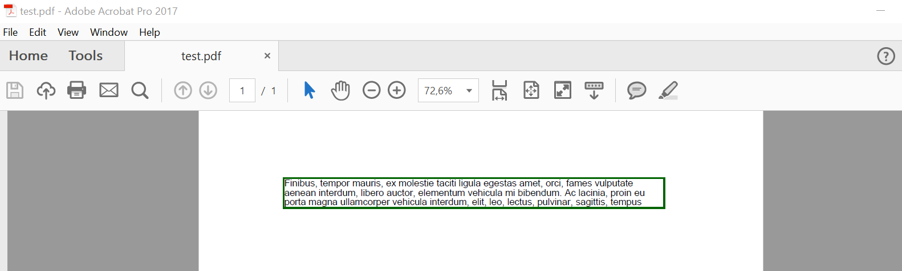
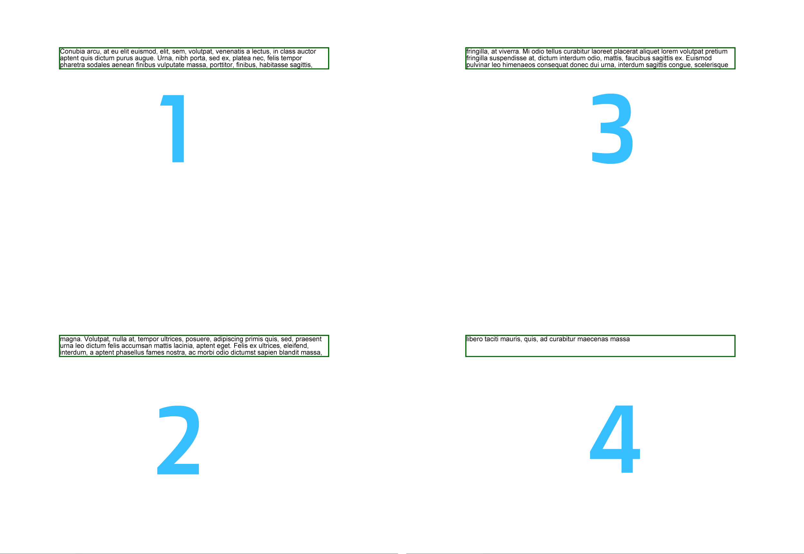

## أساسيات استخدام أداة FloatingBox

أداة [`FloatingBox`](https://reference.aspose.com/pdf/python-net/aspose.pdf/floatingbox/) هي حاوية متخصصة لوضع النصوص ومحتويات أخرى على صفحة PDF. الميزة الرئيسية لها هي تقليم النص عندما يتجاوز المحتوى حدود الصندوق. أنشئ وأضف `FloatingBox` إلى [`Document`](https://reference.aspose.com/pdf/python-net/aspose.pdf/document/) باستخدام Aspose.PDF للبايثون. يعمل `FloatingBox` كحاوية نصية قابلة للتحريك، مما يتيح تحكمًا أكبر في تموضع التخطيط والحدود والتنسيق مقارنةً بالفقرات النصية العادية.

1. أنشئ [`Document`](https://reference.aspose.com/pdf/python-net/aspose.pdf/document/) جديدًا.
1. أضف [`Page`](https://reference.aspose.com/pdf/python-net/aspose.pdf/page/) إلى المستند.
1. أنشئ [`FloatingBox`](https://reference.aspose.com/pdf/python-net/aspose.pdf/floatingbox/).
1. اضبط حد الصندوق باستخدام [`BorderInfo`](https://reference.aspose.com/pdf/python-net/aspose.pdf/borderinfo/) و[`BorderSide`](https://reference.aspose.com/pdf/python-net/aspose.pdf/borderside/).
1. تحكم في تكرار الصندوق باستخدام الخاصية [`is_need_repeating`](https://reference.aspose.com/pdf/python-net/aspose.pdf/floatingbox/#properties).
1. أضف محتوى نصي باستخدام [`TextFragment`](https://reference.aspose.com/pdf/python-net/aspose.pdf.text/textfragment/).
1. أضف `FloatingBox` إلى [`Page`](https://reference.aspose.com/pdf/python-net/aspose.pdf/page/).
1. احفظ مستند PDF النهائي باستخدام [`Document.save()`](https://reference.aspose.com/pdf/python-net/aspose.pdf/document/#methods).

```python

import math
import os
import aspose.pdf as ap

# Global configuration
DATA_DIR = "your path here"

def create_and_add_floating_box(outfile):
    """
    Create and add a basic floating box to a PDF document.

    Demonstrates the fundamental usage of FloatingBox to create a bordered
    text container with Lorem ipsum content. Shows basic box creation,
    styling, and text content addition.

    Args:
        outfile (str): Path where the PDF with floating box will be saved.

    Returns:
        None: The function creates and saves a PDF file with a floating box.

    Note:
        - Creates a FloatingBox with dimensions 400x30
        - Applies dark green border with 1.5 width
        - Sets is_need_repeating to False for single occurrence
        - Contains Lorem ipsum text fragment
        - Demonstrates basic floating box functionality

    Example:
        >>> create_and_add_floating_box("basic_floating_box.pdf")
        # Creates a PDF with a simple bordered floating text box
    """

    # Create PDF document
    with ap.Document() as document:
        # Add page to pages collection of PDF
        page = document.pages.add()
        # Create and fill box
        box = ap.FloatingBox(400, 30)
        box.border = ap.BorderInfo(ap.BorderSide.ALL, 1.5, ap.Color.dark_green)
        box.is_need_repeating = False
        phrase = "Lorem ipsum dolor sit amet, consectetur adipiscing elit. Fusce quam odio, sollicitudin ac mauris vel, suscipit pellentesque nisi."
        box.paragraphs.add(ap.text.TextFragment(phrase))
        # Add box
        page.paragraphs.add(box)
        document.save(outfile)
```  

في المثال أعلاه، نقوم بإنشاء FloatingBox بعرض 400 نقطة وارتفاع 30 نقطة.
أيضًا، في هذا المثال، تم إنشاء نص أكثر عمداً مما يمكن أن يتسع في الحجم المحدد.
وبالتالي، تم قطع النص.



الخاصية [`is_need_repeating`](https://reference.aspose.com/pdf/python-net/aspose.pdf/floatingbox/#properties) ذات القيمة `False` تقيد النص بصفحة واحدة.

إذا قمنا بتعيين هذه الخاصية إلى `True` سيتدفق النص إلى الصفحات التالية في نفس الموضع.



## الميزات المتقدمة لـ FloatingBox

### دعم متعدد الأعمدة

#### تخطيط متعدد الأعمدة (حالة بسيطة)

`FloatingBox` يدعم تخطيط متعدد الأعمدة. لإنشاء مثل هذا التخطيط، يجب عليك تعريف قيم خصائص [`ColumnInfo`](https://reference.aspose.com/pdf/python-net/aspose.pdf/columninfo/).

* `column_widths` هي سلسلة تحتوي على تعداد للعرض بالنقاط.
* `column_spacing` هي سلسلة تحتوي على عرض الفجوة بين الأعمدة.
* `column_count` هو عدد الأعمدة.

```python

import math
import os
import aspose.pdf as ap

# Global configuration
DATA_DIR = "your path here"

def multi_column_layout(outfile):
    """
    Create a multi-column layout using FloatingBox.

    Demonstrates advanced layout capabilities by creating a three-column
    text layout within a floating box. Shows dynamic width calculation
    and column spacing configuration.

    Args:
        outfile (str): Path where the PDF with multi-column layout will be saved.

    Returns:
        None: The function creates and saves a PDF file with multi-column text.

    Note:
        - Creates 3 equal-width columns with 10-unit spacing
        - Calculates column width based on page margins and spacing
        - Uses is_need_repeating for content continuation across columns
        - Adds multiple Lorem ipsum paragraphs for column demonstration
        - Automatically distributes content across columns

    Example:
        >>> multi_column_layout("multi_column.pdf")
        # Creates a PDF with text arranged in three columns
    """
    # Create PDF document
    with ap.Document() as document:
        # Add page to pages collection of PDF
        page = document.pages.add()
        # Set margin settings
        page.page_info.margin = ap.MarginInfo(36, 18, 36, 18)
        column_count = 3
        spacing = 10
        width = (
            page.page_info.width
            - page.page_info.margin.left
            - page.page_info.margin.right
            - (column_count - 1) * spacing
        )
        column_width = width / 3
        # Create FloatingBox
        box = ap.FloatingBox()
        box.is_need_repeating = True
        box.column_info.column_widths = f"{column_width} {column_width} {column_width}"
        box.column_info.column_spacing = f"{spacing}"
        box.column_info.column_count = 3
        phrase = "Lorem ipsum dolor sit amet, consectetur adipiscing elit. Fusce quam odio, sollicitudin ac mauris vel, suscipit pellentesque nisi."
        paragraphs = [
            phrase,
            phrase,
            phrase,
            phrase,
            phrase,
            phrase,
            phrase,
            phrase,
            phrase,
            phrase,
        ]
        for paragraph in paragraphs:
            box.paragraphs.add(ap.text.TextFragment(paragraph))
        # Add a box to a page
        page.paragraphs.add(box)
        # Save PDF document
        document.save(outfile)
```

استخدمنا المكتبة الإضافية LoremNET في المثال أعلاه وأنشأنا 20 فقرة. تم تقسيم هذه الفقرات إلى ثلاثة أعمدة وملأت الصفحات التالية حتى نفاد النص.

#### تخطيط متعدد الأعمدة مع بدء عمود إجبارية

سنقوم بنفس الأمر مع المثال التالي كما في السابق. الاختلاف أنه تم إنشاء 3 فقرات. يمكننا إجبار FloatingBox على عرض كل فقرة في عمود جديد. للقيام بذلك نحتاج إلى تعيين `is_first_paragraph_in_column` عند إضافة النص إلى كائن FloatingBox.

```python

import math
import os
import aspose.pdf as ap

# Global configuration
DATA_DIR = "your path here"

def multi_column_layout_2(outfile):
    """
    Create a multi-column layout with paragraph column control.

    Demonstrates advanced multi-column layout with explicit control over
    paragraph positioning within columns. Uses is_first_paragraph_in_column
    to control text flow and column breaks.

    Args:
        outfile (str): Path where the PDF with controlled multi-column layout will be saved.

    Returns:
        None: The function creates and saves a PDF file with controlled column text.

    Note:
        - Creates 3 equal-width columns with 10-unit spacing
        - Uses is_first_paragraph_in_column for explicit column control
        - Calculates column width dynamically based on page dimensions
        - Demonstrates precise paragraph positioning within columns
        - Shows advanced column layout management techniques

    Example:
        >>> multi_column_layout_2("controlled_columns.pdf")
        # Creates a PDF with precisely controlled multi-column text flow
    """

    # Create PDF document
    with ap.Document() as document:
        # Add page to pages collection of PDF
        page = document.pages.add()
        # Set margin settings
        page.page_info.margin = ap.MarginInfo(36, 18, 36, 18)
        column_count = 3
        spacing = 10
        width = (
            page.page_info.width
            - page.page_info.margin.left
            - page.page_info.margin.right
            - (column_count - 1) * spacing
        )
        column_width = width / 3
        # Create FloatingBox
        box = ap.FloatingBox()
        box.is_need_repeating = True
        box.column_info.column_widths = f"{column_width} {column_width} {column_width}"
        box.column_info.column_spacing = f"{spacing}"
        box.column_info.column_count = 3
        phrase = "Lorem ipsum dolor sit amet, consectetur adipiscing elit. Fusce quam odio, sollicitudin ac mauris vel, suscipit pellentesque nisi."
        paragraphs = [
            phrase,
            phrase,
            phrase,
            phrase,
            phrase,
            phrase,
            phrase,
            phrase,
            phrase,
            phrase,
        ]
        for paragraph in paragraphs:
            text = ap.text.TextFragment(paragraph)
            text.is_first_paragraph_in_column = True
            box.paragraphs.add(text)
        # Add a box to a page
        page.paragraphs.add(box)
        # Save PDF document
        document.save(outfile)
```

### دعم الخلفية

طبق لون خلفية على FloatingBox في مستند PDF باستخدام Aspose.PDF للبايثون عبر .NET.
`FloatingBox` هو حاوية للنص أو عناصر أخرى، ومن خلال تعيين [`Color`](https://reference.aspose.com/pdf/python-net/aspose.pdf/color/) كلون خلفية، يمكنك إبراز المحتوى بصريًا — مفيد للترويسات، الإبرازات، أو الأقسام المُنسيقة.

يظهر مقطع الشفرة هذا كيفية إنشاء صندوق نص أخضر فاتح بسيط مع محتوى نموذجي.

```python

import math
import os
import aspose.pdf as ap

# Global configuration
DATA_DIR = "your path here"

def background_support(outfile):
    """
    Demonstrate FloatingBox background color support.

    Shows how to apply background colors to floating boxes to create
    visually distinct text containers. Demonstrates basic styling
    capabilities for enhanced visual presentation.

    Args:
        outfile (str): Path where the PDF with colored background box will be saved.

    Returns:
        None: The function creates and saves a PDF file with a colored floating box.

    Note:
        - Applies light green background color to the floating box
        - Creates a 400x30 box with sample text content
        - Sets is_need_repeating to False for single occurrence
        - Demonstrates visual styling options for floating boxes
        - Shows how background colors enhance text presentation

    Example:
        >>> background_support("colored_background.pdf")
        # Creates a PDF with a light green background floating box
    """

    # Create PDF document
    with ap.Document() as document:
        # Add page to pages collection of PDF
        page = document.pages.add()
        # Create and fill box
        box = ap.FloatingBox(400, 30)
        box.background_color = ap.Color.light_green
        box.is_need_repeating = False
        box.paragraphs.add(ap.text.TextFragment("text example"))
        # Add box
        page.paragraphs.add(box)
        # Save PDF document
        document.save(outfile)
```

### دعم التموضع

موقع FloatingBox على الصفحة المُولَّدة يحدد بواسطة خصائص `positioning_mode` و`left` و`top`.
عندما تكون قيمة `positioning_mode` هي

* [`ParagraphPositioningMode.DEFAULT`](https://reference.aspose.com/pdf/python-net/aspose.pdf/paragraphpositioningmode/) (القيمة الافتراضية)

يتم تحديد الموقع بناءً على العناصر الموضوعة مسبقًا؛ إضافة عنصر يؤثر على موقع العناصر اللاحقة. إذا كانت قيمتي [`Left`](https://reference.aspose.com/pdf/python-net/aspose.pdf/floatingbox/#properties) أو [`Top`](https://reference.aspose.com/pdf/python-net/aspose.pdf/floatingbox/#properties) غير صفرية، يتم اعتبارهما أيضًا، لكن المنطق المشترك قد يكون غير واضح.

* [`ParagraphPositioningMode.ABSOLUTE`](https://reference.aspose.com/pdf/python-net/aspose.pdf/paragraphpositioningmode/)

الموقع يتم تحديده بواسطة قيمتي `Left` و `Top`؛ لا يعتمد على العناصر السابقة ولا يؤثر على موقع العناصر التالية.

```python

import math
import os
import aspose.pdf as ap

# Global configuration
DATA_DIR = "your path here"

def offset_support(outfile):
    """
    Demonstrate FloatingBox positioning and offset support.

    Shows how to position floating boxes at specific coordinates using
    absolute positioning mode. Demonstrates integration of floating boxes
    with regular text content and precise layout control.

    Args:
        outfile (str): Path where the PDF with positioned floating box will be saved.

    Returns:
        None: The function creates and saves a PDF file with positioned floating box.

    Note:
        - Uses absolute positioning mode for precise box placement
        - Sets box position to top=45, left=15 coordinates
        - Creates bordered box with dark green border
        - Integrates floating box with regular text paragraphs
        - Demonstrates layered content with mixed positioning

    Example:
        >>> offset_support("positioned_box.pdf")
        # Creates a PDF with a floating box at specific coordinates
    """

    # Create PDF document
    with ap.Document() as document:
        # Add page to pages collection of PDF
        page = document.pages.add()
        # Create and fill box
        box = ap.FloatingBox(400, 30)
        box.top = 45
        box.left = 15
        box.positioning_mode = ap.ParagraphPositioningMode.ABSOLUTE
        box.border = ap.BorderInfo(ap.BorderSide.ALL, 1.5, ap.Color.dark_green)
        box.paragraphs.add(ap.text.TextFragment("text example 1"))
        page.paragraphs.add(ap.text.TextFragment("text example 2"))
        # Add the box to the page
        page.paragraphs.add(box)
        page.paragraphs.add(ap.text.TextFragment("text example 3"))
        document.save(outfile)
```

### محاذاة الصناديق العائمة باستخدام المحاذاة العمودية والأفقية في PDF

محاذاة عناصر `FloatingBox` داخل صفحة PDF باستخدام خيارات مختلفة لـ [`VerticalAlignment`](https://reference.aspose.com/pdf/python-net/aspose.pdf/verticalalignment/) و [`HorizontalAlignment`](https://reference.aspose.com/pdf/python-net/aspose.pdf/horizontalalignment/) في Aspose.PDF للغة Python عبر .NET. يوضح ذلك كيفية التحكم في موضع التخطيط (الأعلى، الوسط، الأسفل، اليسار، اليمين) لتحقيق محاذاة بصرية دقيقة للحاويات العائمة. يتم تعيين كل صندوق عائم إلى موضع مميز لإظهار مرونة المحاذاة لتخطيط الصفحة، وضع رأس/تذييل الصفحة، أو التعليقات الجانبية.

1. إنشاء مستند PDF جديد.
1. إضافة صفحة إلى المستند.
1. إنشاء أول FloatingBox (محاذاة أسفل-يمين).
1. إنشاء الـ FloatingBox الثاني (محاذاة وسط-يمين).
1. إنشاء الـ FloatingBox الثالث (محاذاة أعلى-يمين).
1. حفظ المستند.

```python

import math
import os
import aspose.pdf as ap

# Global configuration
DATA_DIR = "your path here"

def align_text_to_float(outfile):
    """
    Demonstrate text alignment options for FloatingBox elements.

    Shows different vertical and horizontal alignment options for floating
    boxes. Creates multiple boxes with different alignment settings to
    demonstrate positioning flexibility.

    Args:
        outfile (str): Path where the PDF with aligned floating boxes will be saved.

    Returns:
        None: The function creates and saves a PDF file with variously aligned boxes.

    Note:
        - Creates three 100x100 floating boxes with different alignments
        - First box: bottom-right alignment
        - Second box: center-right alignment
        - Third box: top-right alignment
        - All boxes have blue borders for visual distinction
        - Demonstrates comprehensive alignment control options

    Example:
        >>> align_text_to_float("aligned_boxes.pdf")
        # Creates a PDF with floating boxes in different alignment positions
    """
    # Create PDF document
    with ap.Document() as document:
        # Add page to pages collection of PDF
        page = document.pages.add()

        # Create float box
        float_box = ap.FloatingBox(100, 100)
        # Set settings to float box
        float_box.vertical_alignment = ap.VerticalAlignment.BOTTOM
        float_box.horizontal_alignment = ap.HorizontalAlignment.RIGHT
        float_box.paragraphs.add(ap.text.TextFragment("FloatingBox_bottom"))
        float_box.border = ap.BorderInfo(ap.BorderSide.ALL, ap.Color.blue)
        # Add float box
        page.paragraphs.add(float_box)

        # Create float box
        float_box_2 = ap.FloatingBox(100, 100)
        # Set settings to float box
        float_box_2.vertical_alignment = ap.VerticalAlignment.CENTER
        float_box_2.horizontal_alignment = ap.HorizontalAlignment.RIGHT
        float_box_2.paragraphs.add(ap.text.TextFragment("FloatingBox_center"))
        float_box_2.border = ap.BorderInfo(ap.BorderSide.ALL, ap.Color.blue)
        # Add float box
        page.paragraphs.add(float_box_2)

        # Create float box
        float_box_3 = ap.FloatingBox(100, 100)
        # Set settings to float box
        float_box_3.vertical_alignment = ap.VerticalAlignment.TOP
        float_box_3.horizontal_alignment = ap.HorizontalAlignment.RIGHT
        float_box_3.paragraphs.add(ap.text.TextFragment("FloatingBox_top"))
        float_box_3.border = ap.BorderInfo(ap.BorderSide.ALL, ap.Color.blue)
        # Add float box
        page.paragraphs.add(float_box_3)

        # Save the document
        document.save(outfile)
```
