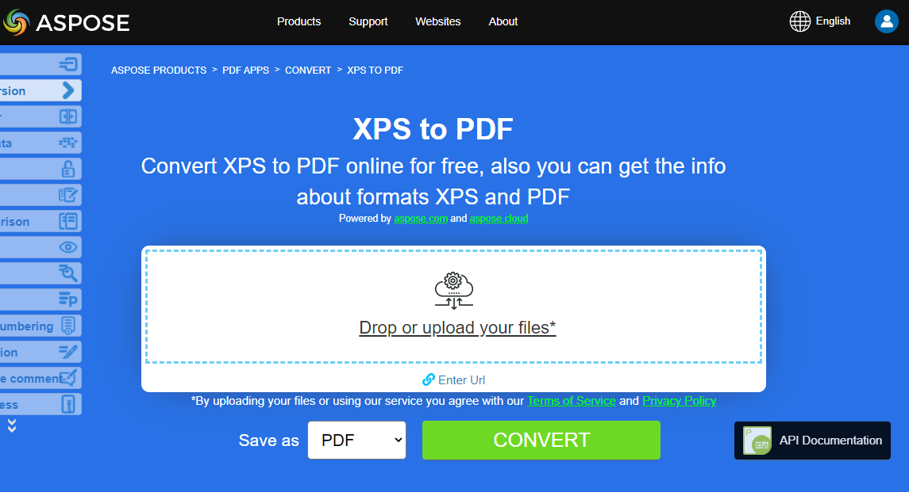

تشرح هذه المقالة كيفية **تحويل أنواع مختلفة أخرى من صيغ الملفات إلى PDF باستخدام بايثون**. تغطي المواضيع التالية.

## تحويل OFD إلى PDF

OFD هو اختصار لـ Open Fixed-layout Document (ويُطلق عليه أيضًا Open Fixed Document format). وهو معيار وطني صيني (GB/T 33190-2016) للوثائق الإلكترونية، تم تقديمه كبديل لـ PDF.

خطوات تحويل OFD إلى PDF في بايثون:

1. إعداد خيارات تحميل OFD باستخدام OfdLoadOptions().
1. تحميل مستند OFD.
1. حفظ كـ PDF.

```python

    from os import path
    import aspose.pdf as ap

    path_infile = path.join(self.data_dir, infile)
    path_outfile = path.join(self.data_dir, "python", outfile)

    load_options = ap.OfdLoadOptions()
    document = ap.Document(path_infile, load_options)
    document.save(path_outfile)

    print(infile + " converted into " + outfile)
```

## تحويل LaTeX/TeX إلى PDF

تنسيق ملف LaTeX هو تنسيق ملف نصي يحتوي على علامات في المشتق LaTeX من عائلة لغات TeX، وLaTeX هو تنسيق مشتق من نظام TeX. LaTeX (ˈleɪtɛk/lay-tek أو lah-tek) هو نظام إعداد المستندات ولغة توصيف المستندات. يُستخدم على نطاق واسع للتواصل ونشر الوثائق العلمية في العديد من المجالات، بما في ذلك الرياضيات والفيزياء وعلوم الحاسوب. كما يلعب دورًا رئيسيًا في إعداد ونشر الكتب والمقالات التي تحتوي على مواد متعددة اللغات المعقدة، مثل الكورية واليابانية والحروف الصينية والعربية، بما في ذلك الإصدارات الخاصة.

يستخدم LaTeX برنامج التنضيد TeX لتنسيق مخرجاته، وهو نفسه مكتوب بلغة ماكرو TeX.

{}
**جرّب تحويل LaTeX/TeX إلى PDF عبر الإنترنت**

تقدم لك Aspose.PDF لبايثون عبر .NET تطبيقًا مجانيًا عبر الإنترنت ["LaTex إلى PDF"](https://products.aspose.app/pdf/conversion/tex-to-pdf)، حيث يمكنك تجربة استكشاف الوظيفة والجودة التي يعمل بها.

[](https://products.aspose.app/pdf/conversion/tex-to-pdf)
{}

خطوات تحويل TEX إلى PDF في بايثون:

1. إعداد خيارات تحميل LaTeX باستخدام LatexLoadOptions().
1. تحميل مستند LaTeX.
1. حفظ كـ PDF.

```python

    from os import path
    import aspose.pdf as ap

    path_infile = path.join(self.data_dir, infile)
    path_outfile = path.join(self.data_dir, "python", outfile)

    load_options = ap.LatexLoadOptions()
    document = ap.Document(path_infile, load_options)
    document.save(path_outfile)

    print(infile + " converted into " + outfile)
```
## تحويل OFD إلى PDF

OFD هو اختصار لـ Open Fixed-layout Document (ويُطلق عليه أيضًا Open Fixed Document format). وهو معيار وطني صيني (GB/T 33190-2016) للوثائق الإلكترونية، تم تقديمه كبديل لـ PDF.

خطوات تحويل OFD إلى PDF في بايثون:

1. إعداد خيارات تحميل OFD باستخدام OfdLoadOptions().
1. تحميل مستند OFD.
1. حفظ كـ PDF.

```python

    from os import path
    import aspose.pdf as ap

    path_infile = path.join(self.data_dir, infile)
    path_outfile = path.join(self.data_dir, "python", outfile)

    load_options = ap.OfdLoadOptions()
    document = ap.Document(path_infile, load_options)
    document.save(path_outfile)

    print(infile + " converted into " + outfile)
```

## تحويل LaTeX/TeX إلى PDF

تنسيق ملف LaTeX هو تنسيق ملف نصي يحتوي على علامات في المشتق LaTeX من عائلة لغات TeX، وLaTeX هو تنسيق مشتق من نظام TeX. LaTeX (ˈleɪtɛk/lay-tek أو lah-tek) هو نظام إعداد المستندات ولغة توصيف المستندات. يُستخدم على نطاق واسع للتواصل ونشر الوثائق العلمية في العديد من المجالات، بما في ذلك الرياضيات والفيزياء وعلوم الحاسوب. كما له دور بارز في إعداد ونشر الكتب والمقالات التي تحتوي على مواد متعددة اللغات المعقدة، مثل السنسكريتية والعربية، بما في ذلك الإصدارات النقدية. يستخدم LaTeX برنامج التنضيد TeX لتنسيق مخرجاته، وهو نفسه مكتوب بلغة ماكرو TeX.

{}
**جرّب تحويل LaTeX/TeX إلى PDF عبر الإنترنت**

تقدم لك Aspose.PDF لبايثون عبر .NET تطبيقًا مجانيًا عبر الإنترنت ["LaTex إلى PDF"](https://products.aspose.app/pdf/conversion/tex-to-pdf)، حيث يمكنك تجربة استكشاف الوظيفة والجودة التي يعمل بها.

[](https://products.aspose.app/pdf/conversion/tex-to-pdf)
{}

خطوات تحويل TEX إلى PDF في بايثون:

1. إعداد خيارات تحميل LaTeX باستخدام LatexLoadOptions().
1. تحميل مستند LaTeX.
1. حفظ كـ PDF.

```python

    from os import path
    import aspose.pdf as ap

    path_infile = path.join(self.data_dir, infile)
    path_outfile = path.join(self.data_dir, "python", outfile)

    load_options = ap.LatexLoadOptions()
    document = ap.Document(path_infile, load_options)
    document.save(path_outfile)

    print(infile + " converted into " + outfile)
```

## تحويل EPUB إلى PDF

**Aspose.PDF for Python via .NET** يسمح لك ببساطة بتحويل ملفات EPUB إلى تنسيق PDF.

EPUB (اختصار ل electronic publication) هو معيار مجاني ومفتوح للكتب الإلكترونية من المنتدى الدولي للنشر الرقمي (IDPF). الملفات لها الامتداد .epub. تم تصميم EPUB للمحتوى القابل لإعادة التدفق، مما يعني أن قارئ EPUB يمكنه تحسين النص لجهاز عرض معين.

<abbr title="electronic publication">EPUB</abbr> يدعم أيضاً المحتوى ذو التخطيط الثابت. تم تصميم هذا التنسيق كتنسيق واحد يمكن للناشرين ومنازل التحويل استخدامه داخلياً، وكذلك للتوزيع والبيع. إنه يحل محل معيار Open eBook. النسخة EPUB 3 مدعومة أيضاً من قبل مجموعة دراسة صناعة الكتب (BISG)، وهي جمعية رائدة في تجارة الكتب للمعايير الأفضل المعيارية، والبحث، والمعلومات والفعاليات، لتغليف المحتوى.

{}
**حاول تحويل EPUB إلى PDF عبر الإنترنت**

يقدم لك Aspose.PDF for Python via .NET تطبيقًا مجانيًا عبر الإنترنت [\"EPUB إلى PDF\"](https://products.aspose.app/pdf/conversion/epub-to-pdf)، حيث يمكنك تجربة الوظيفة وجودتها.

[](https://products.aspose.app/pdf/conversion/epub-to-pdf)
{}

خطوات تحويل EPUB إلى PDF باستخدام Python:

1. تحميل مستند EPUB باستخدام EpubLoadOptions().
1. تحويل EPUB إلى PDF.
1. طباعة التأكيد.

القطعة البرمجية التالية توضح لك كيفية تحويل ملفات EPUB إلى تنسيق PDF باستخدام Python.

```python

    from os import path
    import aspose.pdf as ap

    path_infile = path.join(self.data_dir, infile)
    path_outfile = path.join(self.data_dir, "python", outfile)

    load_options = ap.EpubLoadOptions()
    document = ap.Document(path_infile, load_options)

    document.save(path_outfile)
    print(infile + " converted into " + outfile)
```

## تحويل Markdown إلى PDF

**هذه الميزة مدعومة بدءًا من الإصدار 19.6 أو أحدث.**

{}
**حاول تحويل Markdown إلى PDF عبر الإنترنت**

يقدم لك Aspose.PDF for Python via .NET تطبيقًا مجانيًا عبر الإنترنت [\"Markdown إلى PDF\"](https://products.aspose.app/pdf/conversion/md-to-pdf)، حيث يمكنك تجربة الوظيفة وجودتها.

[](https://products.aspose.app/pdf/conversion/md-to-pdf)
{}

تساعدك هذه القطعة البرمجية من Aspose.PDF for Python via .NET على تحويل ملفات Markdown إلى PDF، مما يتيح مشاركة المستندات بشكل أفضل، والحفاظ على التنسيق، وتوافق الطباعة.

تظهر القطعة البرمجية التالية كيفية استخدام هذه الوظيفة مع مكتبة Aspose.PDF:

```python

    from os import path
    import aspose.pdf as ap

    path_infile = path.join(self.data_dir, infile)
    path_outfile = path.join(self.data_dir, "python", outfile)

    load_options = ap.MdLoadOptions()
    document = ap.Document(path_infile, load_options)
    document.save(path_outfile)
    print(infile + " converted into " + outfile)
```

## تحويل PCL إلى PDF

<abbr title="Printer Command Language">PCL</abbr> (لغة أوامر الطابعة) هي لغة طابعة من Hewlett-Packard طُورت للوصول إلى ميزات الطابعة القياسية. مستويات PCL من 1 إلى 5e/5c هي لغات تعتمد على الأوامر باستخدام تسلسلات تحكم يتم معالجتها وتفسيرها بالترتيب الذي تُستلم فيه. على مستوى المستهلك، يتم توليد تدفقات بيانات PCL بواسطة برنامج تشغيل الطابعة. يمكن أيضًا توليد مخرجات PCL بسهولة بواسطة تطبيقات مخصصة.

{}
**حاول تحويل PCL إلى PDF عبر الإنترنت**

يقدم لك Aspose.PDF for .NET تطبيقًا مجانيًا عبر الإنترنت [\"PCL إلى PDF\"](https://products.aspose.app/pdf/conversion/pcl-to-pdf)، حيث يمكنك تجربة الوظيفة وجودتها.

[](https://products.aspose.app/pdf/conversion/pcl-to-pdf)
{}

لسماح بالتحويل من PCL إلى PDF، توفر Aspose.PDF الفئة [`PclLoadOptions`](https://reference.aspose.com/pdf/net/aspose.pdf/pclloadoptions) التي تُستخدم لتهيئة كائن LoadOptions. لاحقًا يتم تمرير هذا الكائن كوسيط أثناء تهيئة كائن Document ويساعد محرك عرض PDF على تحديد تنسيق الإدخال للمستند المصدر.

تظهر القطعة البرمجية التالية عملية تحويل ملف PCL إلى تنسيق PDF.

خطوات تحويل PCL إلى PDF باستخدام Python:

1. تحميل الخيارات لـ PCL باستخدام PclLoadOptions().
1. تحميل المستند.
1. حفظ كملف PDF.

```python

    from os import path
    import aspose.pdf as ap

    path_infile = path.join(self.data_dir, infile)
    path_outfile = path.join(self.data_dir, "python", outfile)

    load_options = ap.PclLoadOptions()
    load_options.supress_errors = True

    document = ap.Document(path_infile, load_options)
    document.save(path_outfile)

    print(infile + " converted into " + outfile)
```

## تحويل النص المنسق مسبقًا إلى PDF

**Aspose.PDF for Python via .NET** يدعم ميزة تحويل النص العادي وملف النص المنسق مسبقًا إلى تنسيق PDF.

تحويل النص إلى PDF يعني إضافة قطع نصية إلى صفحة PDF. بالنسبة لملفات النص، نتعامل مع نوعين من النص: التنسيق المسبق (مثال، 25 سطرًا ب80 حرفًا لكل سطر) والنص غير المنسق (نص عادي). بناءً على احتياجاتنا، يمكننا التحكم في هذه الإضافة بأنفسنا أو إسنادها إلى خوارزميات المكتبة.

{}
**حاول تحويل النص إلى PDF عبر الإنترنت**

يقدم لك Aspose.PDF for Python via .NET تطبيقًا مجانيًا عبر الإنترنت [\"نص إلى PDF\"](https://products.aspose.app/pdf/conversion/txt-to-pdf)، حيث يمكنك تجربة الوظيفة وجودتها.

[](https://products.aspose.app/pdf/conversion/txt-to-pdf)
{}

خطوات تحويل النص إلى PDF باستخدام Python:

1. قراءة ملف النص المدخل سطرًا بسطر.
1. إعداد خط ثابت العرض (Courier New) لتمحور النص بشكل متسق.
1. إنشاء مستند PDF جديد وإضافة الصفحة الأولى مع هوامش مخصصة وإعدادات الخط.
1. التنقل عبر أسطر ملف النص. لمحاكاة الآلة الكاتبة، نستخدم الخط 'monospace_font' بحجم 12.
1. تحديد إنشاء الصفحات إلى 4 صفحات.
1. حفظ ملف PDF النهائي إلى المسار المحدد.

```python

    from os import path
    import aspose.pdf as ap

    path_infile = path.join(self.data_dir, infile)
    path_outfile = path.join(self.data_dir, "python", outfile)

    with open(path_infile, "r") as file:
        lines = file.readlines()

    monospace_font = ap.text.FontRepository.find_font("Courier New")

    document = ap.Document()
    page = document.pages.add()

    page.page_info.margin.left = 20
    page.page_info.margin.right = 10
    page.page_info.default_text_state.font = monospace_font
    page.page_info.default_text_state.font_size = 12
    count = 1
    for line in lines:
        if line != "" and line[0] == "\x0c":
            page = document.pages.add()
            page.page_info.margin.left = 20
            page.page_info.margin.right = 10
            page.page_info.default_text_state.font = monospace_font
            page.page_info.default_text_state.font_size = 12
            count = count + 1
        else:
            text = ap.text.TextFragment(line)
            page.paragraphs.add(text)

        if count == 4:
            break

    document.save(path_outfile)

    print(infile + " converted into " + outfile)
```

## تحويل PostScript إلى PDF

يوضح هذا المثال كيفية تحويل ملف PostScript إلى مستند PDF باستخدام Aspose.PDF for Python عبر .NET.

1. إنشاء نسخة من 'PsLoadOptions' لتفسير ملف PS بشكل صحيح.
1. تحميل ملف 'PostScript' إلى كائن Document باستخدام خيارات التحميل.
1. حفظ المستند بصيغة PDF إلى المسار المطلوب.

```python

    from os import path
    import aspose.pdf as ap

    path_infile = path.join(self.data_dir, infile)
    path_outfile = path.join(self.data_dir, "python", outfile)

    load_options = ap.PsLoadOptions()

    document = ap.Document(path_infile, load_options)
    document.save(path_outfile)

    print(infile + " converted into " + outfile)
```

## تحويل XPS إلى PDF

**Aspose.PDF for Python via .NET** تدعم خاصية تحويل ملفات <abbr title="XML Paper Specification">XPS</abbr> إلى صيغة PDF. تحقق من هذه المقالة لحل مهامك.

نوع ملف XPS مرتبط أساسًا بمواصفة الورق XML (XML Paper Specification) التي طورتها شركة مايكروسوفت. تُعرف مواصفة الورق XML (XPS) سابقًا باسم Metro وتجمع مفهوم مسار الطباعة الجيل التالي (NGPP)، وهي مبادرة مايكروسوفت لدمج إنشاء المستندات وعرضها في نظام تشغيل Windows.

يوضح مقطع الشيفرة التالي عملية تحويل ملف XPS إلى صيغة PDF باستخدام بايثون.

```python

    from os import path
    import aspose.pdf as ap

    path_infile = path.join(self.data_dir, infile)
    path_outfile = path.join(self.data_dir, "python", outfile)

    load_options = ap.XpsLoadOptions()
    document = ap.Document(path_infile, load_options)
    document.save(path_outfile)

    print(infile + " converted into " + outfile)
```

{}
**حاول تحويل صيغة XPS إلى PDF عبر الإنترنت**

يقدم لك Aspose.PDF for Python عبر .NET تطبيقًا مجانيًا عبر الإنترنت ["XPS إلى PDF"](https://products.aspose.app/pdf/conversion/xps-to-pdf/), حيث يمكنك تجربة الوظيفة وجودتها.

[](https://products.aspose.app/pdf/conversion/xps-to-pdf/)
{}

## تحويل XSL-FO إلى PDF

يمكن استخدام مقطع الشيفرة التالي لتحويل ملف XSL-FO إلى صيغة PDF باستخدام Aspose.PDF for Python عبر .NET:

```python

    from os import path
    import aspose.pdf as ap

    path_xsltfile = path.join(self.data_dir, xsltfile)
    path_xmlfile = path.join(self.data_dir, xmlfile)
    path_outfile = path.join(self.data_dir, "python", outfile)

    load_options = ap.XslFoLoadOptions(path_xsltfile)
    load_options.parsing_errors_handling_type = (
        ap.XslFoLoadOptions.ParsingErrorsHandlingTypes.ThrowExceptionImmediately
    )
    document = ap.Document(path_xmlfile, load_options)
    document.save(path_outfile)

    print(xmlfile + " converted into " + outfile)
```

## تحويل XML باستخدام XSLT إلى PDF

يوضح هذا المثال كيفية تحويل ملف XML إلى PDF عبر تحويله أولاً إلى HTML باستخدام قالب XSLT ثم تحميل ملف HTML إلى Aspose.PDF.

1. إنشاء نسخة من 'HtmlLoadOptions' لتكوين تحويل HTML إلى PDF.
1. تحميل ملف HTML المحوّل إلى كائن Document في Aspose.PDF.
1. حفظ المستند كملف PDF في المسار المحدد.
1. حذف ملف HTML المؤقت بعد إتمام التحويل بنجاح.

```python

    from os import path
    import aspose.pdf as ap

    def transform_xml_to_html(xml_file, xslt_file, html_file):
        from lxml import etree
        """
        Transform XML to HTML using XSLT and return as a stream
        """
        # Parse XML document
        xml_doc = etree.parse(xml_file)

        # Parse XSLT stylesheet
        xslt_doc = etree.parse(xslt_file)
        transform = etree.XSLT(xslt_doc)

        # Apply transformation
        result = transform(xml_doc)

        # Save result to HTML file
        with open(html_file, 'w', encoding='utf-8') as f:
            f.write(str(result))


    def convert_XML_to_PDF(template, infile, outfile):
        path_infile = path.join(data_dir, infile)
        path_outfile = path.join(data_dir, "python", outfile)
        path_template = path.join(data_dir, template)
        path_temp_file = path.join(data_dir, "temp.html")

        load_options = ap.HtmlLoadOptions()
        transform_xml_to_html(path_infile, path_template, path_temp_file)

        document = ap.Document(path_temp_file, load_options)
        document.save(path_outfile)

        if path.exists(path_temp_file):
            os.remove(path_temp_file)

        print(infile + " converted into " + outfile)
```

