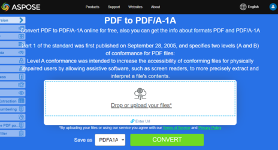

**يعني تنسيق PDF إلى PDF/x القدرة على تحويل PDF إلى صيغ إضافية، وهي PDF/A و PDF/E و PDF/X.**

## تحويل PDF إلى PDF/A

**Aspose.PDF for Python** يسمح لك بتحويل ملف PDF إلى ملف PDF متوافق مع <abbr title="Portable Document Format / A">PDF/A</abbr>. قبل القيام بذلك، يجب التحقق من صحة الملف. يشرح هذا الموضوع كيفية ذلك.

{}

يرجى ملاحظة أننا نتبع Adobe Preflight للتحقق من توافق PDF/A. جميع الأدوات في السوق لديها “تمثيل” خاص بها لتوافق PDF/A. يرجى مراجعة هذه المقالة حول أدوات تحقق PDF/A للمرجعية. اخترنا منتجات Adobe للتحقق من كيفية إنتاج Aspose.PDF لملفات PDF لأن Adobe هي في مركز كل ما يتعلق بـ PDF.

{}

قم بتحويل الملف باستخدام طريقة Convert في فئة Document. قبل تحويل PDF إلى ملف متوافق مع PDF/A، قم بالتحقق من صحة PDF باستخدام طريقة Validate. يتم تخزين نتيجة التحقق في ملف XML ثم يتم تمرير هذه النتيجة إلى طريقة Convert. يمكنك أيضًا تحديد الإجراء للعناصر التي لا يمكن تحويلها باستخدام تعداد ConvertErrorAction.

{}
**حاول تحويل PDF إلى PDF/A عبر الإنترنت**

يقدم لك Aspose.PDF للبايثون تطبيقًا مجانيًا عبر الإنترنت ["PDF إلى PDF/A-1A"](https://products.aspose.app/pdf/conversion/pdf-to-pdfa1a)، حيث يمكنك تجربة استكشاف الوظائف والجودة التي يعمل بها.

[](https://products.aspose.app/pdf/conversion/pdf-to-pdfa1a)
{}

طريقة 'document.validate()' تتحقق مما إذا كان ملف PDF يتوافق مع معيار PDF/A-1B (نسخة موثقة وفق ISO من PDF صُممت للأرشفة طويلة الأمد). تُحفظ نتائج التحقق في ملف سجل.

1. تحميل مستند PDF باستخدام 'ap.Document'.
1. استدعاء طريقة التحقق مع مستوى الالتزام المستهدف (ap.PdfFormat.PDF_A_1B).
1. تُكتب نتائج التحقق في ملف السجل المحدد.

```python

    path_infile = path.join(self.data_dir, infile)
    path_logfile = path.join(self.data_dir, "python", outfile)

    document = ap.Document(path_infile)
    document.validate(path_logfile, ap.PdfFormat.PDF_A_1B)
```

### تحويل PDF إلى PDF/A-1B

توضح الشفرة التالية كيفية تحويل ملفات PDF إلى صيغة PDF/A-1B:

1. تحميل مستند PDF باستخدام 'ap.Document'.
1. استدعاء طريقة convert مع المعلمات التالية:
- مسار ملف السجل - يخزن تفاصيل عملية التحويل وفحوصات الالتزام.
- الصيغة المستهدفة - 'ap.PdfFormat.PDF_A_1B' (معيار أرشيفي).
- إجراء الخطأ - 'ap.ConvertErrorAction.DELETE' — يزيل تلقائيًا العناصر التي تمنع الالتزام.
1. حفظ الملف المتوافق مع PDF/A بعد التحويل إلى مسار الإخراج.

```python

    from os import path
    import aspose.pdf as ap

    path_infile = path.join(self.data_dir, infile)
    path_outfile = path.join(self.data_dir, "python", outfile)

    document = ap.Document(path_infile)
    document.convert(
        self.data_dir + "pdf_pdfa.log",
        ap.PdfFormat.PDF_A_1B,
        ap.ConvertErrorAction.DELETE,
    )
    document.save(path_outfile)

    print(infile + " converted into " + outfile)
```

### تحويل PDF إلى PDF 2.0 و PDF/A-4

يوضح هذا المثال كيفية تحويل مستند PDF إلى صيغ معيارية أحدث: PDF 2.0 و PDF/A-4.
يساعد كل من التحويلين في ضمان الالتزام بالمواصفات الحديثة ومتطلبات الأرشفة.

1. تحميل المستند المدخل باستخدام ap.Document.
1. إجراء التحويل الأول إلى PDF 2.0 عن طريق استدعاء document.convert مع:
- مسار ملف السجل لتفاصيل التحويل.
- الصيغة المستهدفة - 'ap.PdfFormat.V_2_0'.
- إجراء الخطأ - 'ap.ConvertErrorAction.DELETE' لإزالة العناصر غير المتوافقة.
1. إجراء تحويل ثاني إلى PDF/A-4 باستخدام نفس الطريقة، مع ضمان توافق الملف أيضًا مع معايير الأرشفة.
1. حفظ المستند الناتج في مسار الإخراج المحدد.

```python

    from os import path
    import aspose.pdf as ap

    path_infile = path.join(self.data_dir, infile)
    path_outfile = path.join(self.data_dir, "python", outfile)
    path_logfile = path_outfile.replace(".pdf","_log.xml")

    document = ap.Document(path_infile)
    document.convert(path_logfile, ap.PdfFormat.V_2_0, ap.ConvertErrorAction.DELETE)

    document.convert(path_logfile, ap.PdfFormat.PDF_A_4, ap.ConvertErrorAction.DELETE)
    document.save(path_outfile)

    print(infile + " converted into " + outfile)
```

### تحويل PDF إلى PDF/A-3A مع ملفات مدمجة

توثق الشفرة التالية كيف يمكن دمج ملفات خارجية في PDF ثم تحويل الـ PDF إلى صيغة PDF/A-3A، التي تدعم المرفقات وتناسب الأرشفة طويلة الأمد مع المحتوى المدمج.

1. تحميل ملف PDF المدخل باستخدام 'ap.Document'.
1. أنشئ كائن 'FileSpecification' يشير إلى الملف المراد تضمينه (مثل "aspose-logo.jpg") مع وصف.
1. أضف مواصفات الملف إلى مجموعة 'embedded_files' في ملف PDF.
1. حوّل المستند إلى PDF/A-3A باستخدام 'document.convert'، مع تحديد:
- مسار ملف السجل.
- الصيغة المستهدفة - 'ap.PdfFormat.PDF_A_3A'.
- إجراء الخطأ - 'ap.ConvertErrorAction.DELETE' لإزالة العناصر غير المتوافقة.
1. احفظ ملف PDF المُحوّل إلى مسار الإخراج.
1. اطبع رسالة تأكيد.

```python

    from os import path
    import aspose.pdf as ap

    path_infile = path.join(self.data_dir, infile)
    path_outfile = path.join(self.data_dir, "python", outfile)
    path_logfile = path_outfile.replace(".pdf","_log.xml")

    document = ap.Document(path_infile)

    fileSpecification = ap.FileSpecification(self.data_dir + "aspose-logo.jpg", "Large Image file")
    document.embedded_files.add(fileSpecification)
    document.convert(path_logfile, ap.PdfFormat.PDF_A_3A, ap.ConvertErrorAction.DELETE)
    document.save(path_outfile)
    print(infile + " converted into " + outfile)
```

### تحويل PDF إلى PDF/A-1B مع استبدال الخطوط

تقوم هذه الدالة بتحويل ملف PDF إلى صيغة PDF/A-1B مع معالجة الخطوط المفقودة عن طريق استبدالها بأخرى متاحة. يضمن ذلك بقاء ملف PDF المحوَّل متسقًا بصريًا ومتوافقًا مع معايير الأرشفة.

1. حمّل ملف PDF باستخدام 'ap.Document'.
1. حوّل ملف PDF إلى PDF/A-1B باستخدام 'document.convert'، مع تحديد:
- مسار ملف السجل.
- الصيغة المستهدفة - 'ap.PdfFormat.PDF_A_1B'.
- إجراء الخطأ - 'ap.ConvertErrorAction.DELETE' لإزالة العناصر غير المتوافقة.
1. احفظ ملف PDF المُحوّل إلى مسار الإخراج.
1. اطبع رسالة تأكيد.

```python

    from os import path
    import aspose.pdf as ap 

    path_infile = path.join(self.data_dir, infile)
    path_outfile = path.join(self.data_dir, "python", outfile)
    path_logfile = path_outfile.replace(".pdf","_log.xml")

    try:
        ap.text.FontRepository.find_font("AgencyFB")

    except ap.FontNotFoundException:
        font_substitution = ap.text.SimpleFontSubstitution("AgencyFB", "Arial")
        ap.text.FontRepository.Substitutions.append(font_substitution)

    document = ap.Document(path_infile)
    document.convert(path_logfile, ap.PdfFormat.PDF_A_1B, ap.ConvertErrorAction.DELETE)
    document.save(path_outfile)
    print(infile + " converted into " + outfile)
```

### تحويل PDF إلى PDF/A-1B مع الإشارة التلقائية

تقوم هذه الدالة بتحويل مستند PDF إلى صيغة PDF/A-1B مع وضع علامات تلقائية على المحتوى لتسهيل الوصول والاتساق البنيوي. تحسين الإشارة التلقائية يعزز قابلية استخدام المستند لأدوات قراءة الشاشة ويضمن بنية دلالية صحيحة.

1. حمّل ملف PDF باستخدام 'ap.Document'.
1. أنشئ 'PdfFormatConversionOptions' مع تحديد:
- مسار ملف السجل.
- الصيغة المستهدفة - 'ap.PdfFormat.PDF_A_1B'.
- إجراء الخطأ - 'ap.ConvertErrorAction.DELETE' لإزالة العناصر غير المتوافقة.
1. ضبط 'AutoTaggingSettings':
- تمكين 'enable_auto_tagging = True'.
- تعيين 'heading_recognition_strategy = AUTO' للكشف التلقائي عن العناوين.
1. قم بتعيين إعدادات الإشارة التلقائية إلى خيارات التحويل.
1. حوّل ملف PDF باستخدام 'document.convert(options)'.
1. احفظ ملف PDF المُحوّل إلى مسار الإخراج.
1. اطبع رسالة تأكيد.

```python

    from os import path
    import aspose.pdf as ap

    path_infile = path.join(self.data_dir, infile)
    path_outfile = path.join(self.data_dir, "python", outfile)
    path_logfile = path_outfile.replace(".pdf","_log.xml")

    document = ap.Document(path_infile)
    options =  ap.PdfFormatConversionOptions(path_logfile, ap.PdfFormat.PDF_A_1B, ap.ConvertErrorAction.DELETE)

    auto_tagging_settings = ap.AutoTaggingSettings()
    auto_tagging_settings.enable_auto_tagging = True

    auto_tagging_settings.heading_recognition_strategy = ap.HeadingRecognitionStrategy.AUTO

    options.auto_tagging_settings = auto_tagging_settings
    document.convert(options)
    document.save(path_outfile)
    print(infile + " converted into " + outfile)
```

## تحويل PDF إلى PDF/E

يتحقق هذا المقتطف ما إذا كان مستند PDF يطابق معيار PDF/E-1، وهو معيار ISO مخصص للوثائق الهندسية والفنية. تُحفظ نتائج التحقق في ملف سجل.

1. حمّل مستند PDF باستخدام 'ap.Document'.
1. استدعِ طريقة التحقق، مع تحديد:
- مسار ملف السجل لتخزين نتائج التحقق.
- الصيغة المستهدفة - 'ap.PdfFormat.PDF_E_1'.
1. تُحفظ نتائج التحقق في ملف السجل للمراجعة.

```python

    path_infile = path.join(self.data_dir, infile)
    path_logfile = path.join(self.data_dir, "python", outfile)

    document = ap.Document(path_infile)
    document.validate(path_logfile, ap.PdfFormat.PDF_E_1)
```

يظهر المثال التالي كيفية تحويل ملف PDF إلى صيغة PDF/E-1، وهو معيار ISO مخصص للوثائق الهندسية والفنية. هذه الصيغة تحافظ على التخطيط الدقيق والرسومات والبيانات الوصفية المطلوبة لتدفقات العمل الهندسية.

1. حمّل ملف PDF المصدر باستخدام 'ap.Document'.
1. أنشئ 'PdfFormatConversionOptions' مع تحديد:
- مسار ملف السجل لتتبع مشكلات التحويل.
- الصيغة المستهدفة - 'ap.PdfFormat.PDF_E_1'.
- إجراء الخطأ - 'ap.ConvertErrorAction.DELETE' لإزالة العناصر غير المتوافقة.
1. حوّل ملف PDF باستخدام 'document.convert(options)'.
1. احفظ ملف PDF المُحوّل إلى مسار الإخراج المحدد.
1. اطبع رسالة تأكيد.

```python

    from os import path
    import aspose.pdf as ap

    path_infile = path.join(self.data_dir, infile)
    path_outfile = path.join(self.data_dir, "python", outfile)
    path_logfile = path_outfile.replace(".pdf","_log.xml")

    document = ap.Document(path_infile)
    options =  ap.PdfFormatConversionOptions(path_logfile, ap.PdfFormat.PDF_E_1, ap.ConvertErrorAction.DELETE)

    document.convert(options)

    # Save PDF document
    document.save(path_outfile)
    print(infile + " converted into " + outfile)
```

## تحويل PDF إلى PDF/X

يحول المقتطف التالي مستند PDF إلى صيغة PDF/X-4، وهو معيار ISO شائع الاستخدام في صناعة الطباعة والنشر. يضمن PDF/X-4 دقة الألوان، ويحافظ على الشفافية، ويضمّ ملفات تعريف الألوان ICC للحصول على مخرجات متسقة عبر الأجهزة.

1. حمّل ملف PDF المصدر باستخدام 'ap.Document'.
1. إنشاء 'PdfFormatConversionOptions' مع تحديد:
- مسار ملف السجل.
- تنسيق الهدف - 'ap.PdfFormat.PDF_X_4'.
- إجراء الخطأ - 'ap.ConvertErrorAction.DELETE' لإزالة العناصر غير المتوافقة.
1. قدم **ملف تعريف ICC** لإدارة الألوان عبر 'icc_profile_file_name'.
1. حدد **OutputIntent** بمعرف شرط (مثل "FOGRA39") لمتطلبات الطباعة.
1. حوّل ملف PDF باستخدام 'document.convert()'.
1. احفظ ملف PDF المحوّل إلى مسار الإخراج المحدد.
1. اطبع رسالة تأكيد.

```python

    from os import path
    import aspose.pdf as ap

    path_infile = path.join(self.data_dir, infile)
    path_outfile = path.join(self.data_dir, "python", outfile)
    path_logfile = path_outfile.replace(".pdf","_log.xml")

    document = ap.Document(path_infile)
    options =  ap.PdfFormatConversionOptions(path_logfile, ap.PdfFormat.PDF_X_4, ap.ConvertErrorAction.DELETE)

    # Provide the name of the external ICC profile file (optional)
    options.icc_profile_file_name = path.join(self.data_dir,"ISOcoated_v2_eci.icc")
    # Provide an output condition identifier and other necessary OutputIntent properties (optional)
    options.output_intent = ap.OutputIntent("FOGRA39")

    document.convert(options)

    # Save PDF document
    document.save(path_outfile)
    print(infile + " converted into " + outfile)
```
