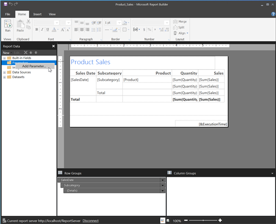

{}

يمكنك تحديد بعض معلمات التكوين التي تؤثر على طريقة إنشاء Aspose.Pdf لخدمات التقارير للمستندات. يصف هذا القسم هذه العملية.

{}

لتكوين Aspose.Pdf لخدمات التقارير، تحتاج إلى تحرير ملف C:\Program Files\Microsoft SQL Server\<Instance>\Reporting Services\ReportServer\rsreportserver.config. هذا ملف XML وتكوين المرسِّل موجود داخل ```<Extension>``` العنصر المقابل لمعالج Aspose.PDF.

**مثال**



<Render>
…
<Extension Name="APPDF" Type="Aspose.Pdf.ReportingServices.Renderer,Aspose.Pdf.ReportingServices">
<!--Insert configuration elements for exporting to PDF here. The following is an example
For PageOrientation -->
    <Configuration>
    <IsLandscape>True</IsLandscape>
    </Configuration>
</Extension>
</Render>



{}

إذا أردت ضبط معلمات لملف تقرير محدد ولكن ليس لكل تقرير على الخادم، يمكنك إضافة معلمة تقرير للتقرير المحدد في Report Builder كما في الخطوات التالية (على سبيل المثال، سنضيف معلمة ‘IsLandscape’ المذكورة سابقًا):

1. افتح التقرير في Report Designer، انقر بزر الماوس الأيمن على مجلد ‘Parameters’ في لوحة ‘Report Data’، واختر ‘Add Parameter…’ (أو، بدلاً من ذلك، اسحب قائمة ‘New’ واختر ‘Parameter…’).
 


1. في مربع الحوار ‘Report Parameter Properties’، أنشئ المعلمة باسم ‘IsLandscape’، مع نوع البيانات Boolean، وأضف القيمة True في علامة التبويب ‘Default Values’.


{}

