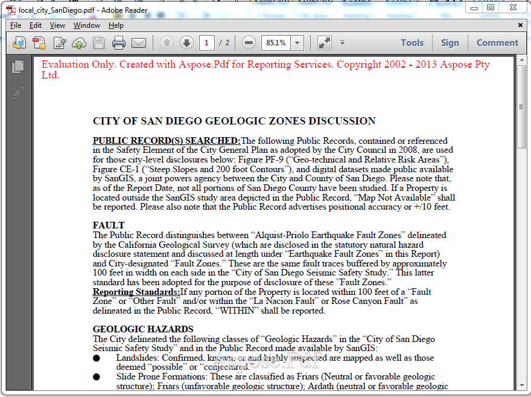

{}

توضح هذه الصفحة الفرق بين الإصدار المرخص والإصدار التقييمي من Aspose.PDF لخدمات التقارير

{}

يمكنك التنزيل بسهولة [Aspose.PDF لخدمات التقارير](https://downloads.aspose.com/pdf/reportingservices) للتقييم. تنزيل التقييم هو نفس التنزيل الذي تم شراؤه. يصبح الإصدار التقييمي مرخصًا ببساطة عندما تضع ملف الترخيص في مجلد يحتوي على Aspose.PDF.ReportingServices.dll أو بضعة أسطر من التعليمات البرمجية لتهيئة الترخيص عند استخدام المكون مع Report Viewer في الوضع المحلي. يوفر الإصدار التقييمي من Aspose.PDF لخدمات التقارير (بدون ترخيص محدد) وظائف المنتج الكاملة، ولكنه يُدرج علامة مائية تقييمية في أعلى المستند عند عرض ملف .RDL إلى تنسيق PDF. يمكنك زيارة الصفحة التالية للحصول على مزيد من التعليمات حول [كيفية ترخيص Aspose.PDF لخدمات التقارير](/pdf/ar/reportingservices/license-aspose-pdf-for-reporting-services/)

{}

إذا كنت تريد اختبار Aspose.PDF لخدمات التقارير دون قيود الإصدار التقييمي، فيمكنك أيضًا طلب ترخيص مؤقت لمدة 30 يومًا. يرجى الرجوع إلى [كيف تحصل على ترخيص مؤقت؟](<https://about.aspose.com/>)

{}
