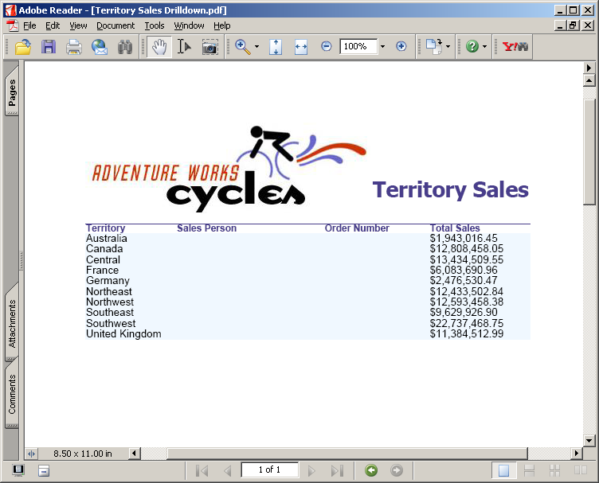

**يوفر الإصدار التقييمي **Aspose.PDF لخدمات التقارير** نفس مجموعة الميزات الموجودة في الإصدار المرخص، باستثناء العلامة المائية للتقييم في ملف PDF الناتج عند استخدام الإصدار التقييمي. يرجى زيارة موقعنا على الإنترنت وتنزيل إصدار المنتج والبدء في استكشاف منتجنا مع مجموعة كاملة من الميزات في وضع التقييم.

عندما تكون راضيًا عن تقييمك، [قم بشراء ترخيص](https://purchase.aspose.com/buy). قبل الشراء، تأكد من أنك تفهم شروط الاشتراك في الترخيص وتوافق عليها.

سيكون الترخيص متاحًا للتنزيل من صفحة الطلب بعد دفع الطلب. الترخيص عبارة عن نص واضح وملف XML موقّع رقميًا. يحتوي الترخيص على معلومات مثل اسم العميل والمنتج الذي تم شراؤه ونوع الترخيص. لا تقم بتعديل محتوى ملف الترخيص لأن ذلك سيؤدي إلى إبطال الترخيص.

## ترخيص الخادم

قم بتنزيل ملف الترخيص وانسخه إلى C:\Program Files\Microsoft SQL Server\<Instance>\Reporting Services\ReportServer\bin، أو C:\Program Files\Microsoft SQL Server\SSRS\ReportServer\bin، أو C:\Program Files\Microsoft Power BI Report Server\PBIRS\ReportServer\bin المجلد على الخادم (نفسه) المجلد حيث تم وضع Aspose.Pdf.ReportingServices.dll).

`<Instance>` هو اسم الدليل الفرعي الذي يتوافق مع مثيل Microsoft SQL Server 2016 الذي تريد ترخيصه.

دليل المثيل الافتراضي لـ Microsoft SQL Server 2016 هو MSRS13.MSSQLSERVER.
بالنسبة لـ Microsoft SQL Server 2017 والإصدارات الأحدث، يكون مسار المثيل الافتراضي هو C:\Program Files\Microsoft SQL Server\SSRS.
بالنسبة لخادم Power BI Report Server، يكون مسار المثيل الافتراضي هو C:\Program Files\Microsoft Power BI Report Server\PBIRS.

**تم إنشاء ملف PDF باستخدام تقرير "التنقل التفصيلي لمبيعات المنطقة"**

**PDF generated using "Sales Order details" report**

إذا كانت هناك مشكلة أثناء تهيئة الترخيص، فسيتم عرض علامة مائية للتقييم في مستند PDF الناتج كما هو محدد أدناه.

**تم إنشاء مستند PDF باستخدام "التنقل بين مبيعات المنطقة" مع العلامة المائية**

يرجى ملاحظة أن أسماء ملفات الترخيص المدعومة هي Aspose.PDF.ReportingServices.lic وAspose.Total.ReportingServices.lic وAspose.Total.Product.Family.lic. إذا كان للملف أي اسم آخر، يرجى إعادة تسميته.

## ترخيص مؤقت

{}

يمكنك أيضًا طلب ترخيص مؤقت لمدة 30 يومًا لاختبار المنتج. يرجى زيارة الرابط التالي لمزيد من المعلومات حول كيفية الحصول على ترخيص مؤقت. [الحصول على ترخيص مؤقت](https://purchase.aspose.com/temporary-license).

{}
