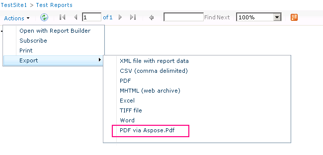

{}

الآن بعد أن تم تثبيت SharePoint وتكوينه على خادم RS وتم إعداد RS عبر مدير تكوين Reporting Services، يمكننا الانتقال إلى الإعداد داخل Central Admin. لقد بسّط RS 2008 R2 هذه العملية فعلاً. كنا نمتلك عملية من ثلاث خطوات كان عليك تنفيذها لجعلها تعمل. الآن لدينا خطوة واحدة فقط.

{}

{}

نريد الانتقال إلى موقع مسؤول المركز ثم إلى إعدادات التطبيق العامة. نحو الأسفل سنرى خدمات التقارير.

**Image1**:- حوار تكوين SharePoint

حدد رابط "Reporting Services Integration". سيتم عرض الشاشة التالية.

**Image2**:- تحديد بيانات اعتماد تكامل خدمات التقارير

{}

## عنوان URL لخدمة الويب:

**سنزوّدك بعنوان URL لخادم التقارير الذي وجدناه في مدير تكوين خدمات التقارير.**

## وضع المصادقة:

**سنقوم أيضًا باختيار وضع المصادقة. الرابط التالي في MSDN يشرح بالتفصيل ما هي هذه الخيارات.
نظرة عامة على الأمان لخدمات التقارير في وضع SharePoint المتكامل**

{}

**باختصار، إذا كان موقعك يستخدم مصادقة المطالبات، فستستخدم دائمًا المصادقة الموثوقة بغض النظر عما تختاره هنا. إذا أردت تمرير بيانات اعتماد ويندوز، فستحتاج إلى اختيار مصادقة ويندوز. بالنسبة للمصادقة الموثوقة، سنمرّر رمز SPUser ولن نعتمد على بيانات اعتماد ويندوز. ستحتاج أيضًا إلى استخدام المصادقة الموثوقة إذا قمت بتكوين مواقع الوضع الكلاسيكي للعمل مع NTLM وتم إعداد RS لـ NTLM. سيُحتاج إلى Kerberos لاستخدام مصادقة ويندوز ولتمرير ذلك إلى مصدر البيانات الخاص بك.**

{}

## تفعيل الميزة:

{}

**هذا يمنحك خيار تفعيل خدمات التقارير على جميع مجموعات المواقع، أو يمكنك اختيار أي منها تريد تفعيلها. هذا يعني ببساطة أي المواقع التي ستتمكن من استخدام خدمات التقارير. عند الانتهاء، يجب أن ترى النتائج التالية**

**Image3:**- نجاح تكامل خدمات التقارير مع بيئة SharePoint
{}

{}

بالعودة إلى عنوان URL الخاص بـ ReportServer، ينبغي أن نرى شيئًا مشابهًا لما يلي

**Image4:**- تم اتصال خدمات التقارير بنجاح مع بيئة SharePoint

**ملاحظة:** ***إذا تم تكوين موقع SharePoint الخاص بك لاستخدام SSL، فلن يظهر في هذه القائمة. إنها مشكلة معروفة ولا تعني وجود مشكلة. يجب أن تظل تقاريرك تعمل.***
{}

{}

الآن بعد أن نجحنا في دمج كلا المنتجين، نحن جاهزون لاستخدام Reporting Services في SharePoint 2010. كما في الإصدار السابق لدينا ميزة (يتم تنشيطها عند تكوين تكامل Reporting Services Integration) في "Site Collection Feature". أيضًا أضاف التثبيت 3 أنواع محتوى لإضافتها إلى موقعنا. في Image 7 يمكننا أن نرى 2 من أنواع المحتوى المضافة في مكتبة مستندات لإنشاء تقرير مخصص باستخدامها، كما نرى في Image5 أدناه.

**Image5:**- مُنشئ التقارير

المُنشئ “Reporter Builder” هو عنصر تحكم ActiveX لذا نحتاج إلى تنزيله عبر الخادم، كما نرى في Image 6 أدناه.

**Image6:**- تنزيل وتثبيت Report Builder
{}

{}

بمجرد اكتمال عملية التنزيل، قم بتحميل عنصر التحكم “Report Builder”. الآن نحن جاهزون لتصميم تقريرنا الأول، كما هو موضح في Image7 أدناه.

**Image7:**- Report Builder – معالج إنشاء تقرير جديد
{}

{}

بعد إنشاء تقريرنا يمكننا حفظه في مكتبة المستندات التي تم إنشاؤها لوضع التقارير في SharePoint 2010. يجب استخدام نوع المحتوى الآخر لإنشاء اتصال مشترك كمصدر بيانات وحفظه في مكتبة مستندات في SharePoint. يمكننا إنشاء مكتبة مستندات، إضافة هذا النوع من المحتوى ثم يصبح لدينا اتصالات متاحة لتغيير مصدر بيانات التقارير.

**Image8:**- تكامل ناجح لـ Aspose.PDF لخدمات التقارير مع MS SharePoint
{}

