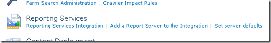

{}

Now that SharePoint is installed and configured on the RS server and RS is setup and setup through the Reporting Services Configuration Manager, we can move onto the configuration within Central Admin. RS 2008 R2 has really simplified this process. We use to have a 3 step process that you had to perform to get this to work. Now we just have one step.

{}

{}

نريد الانتقال إلى موقع ويب المسؤول المركزي ثم إلى إعدادات التطبيق العامة. نحو الأسفل سنرى خدمات التقارير.

**Image1**: - مربع حوار تكوين SharePoint

Select "Reporting Services Integration" link. Following screen will be displayed.

**Image2**: - حدد بيانات اعتماد تكامل خدمات التقارير

{}

## عنوان URL لخدمة الويب:

**سنقدم عنوان URL لخادم التقارير الذي عثرنا عليه في مدير تكوين خدمات التقارير.**

## وضع المصادقة:

**سنقوم أيضًا بتحديد وضع المصادقة. يشرح رابط MSDN التالي بالتفصيل ما هي هذه العناصر.
نظرة عامة على الأمان لخدمات التقارير في وضع SharePoint المتكامل**

{}

**باختصار، إذا كان موقعك يستخدم مصادقة المطالبات، فستستخدم دائمًا المصادقة الموثوقة بغض النظر عما تختاره هنا. إذا كنت تريد تمرير بيانات اعتماد Windows، فستحتاج إلى اختيار مصادقة Windows. بالنسبة للمصادقة الموثوقة، سنمرر رمز SPUser المميز ولن نعتمد على بيانات اعتماد Windows. ستحتاج أيضًا إلى استخدام المصادقة الموثوقة إذا قمت بتكوين مواقع الوضع الكلاسيكي الخاصة بك لـ NTLM وتم إعداد RS لـ NTLM. ستكون هناك حاجة إلى Kerberos لاستخدام مصادقة Windows وتمرير ذلك لمصدر البيانات الخاص بك.**

{}

## تفعيل الميزة:

{}

**يمنحك هذا خيار تنشيط خدمات التقارير على كافة مجموعات الموقع، أو يمكنك اختيار المجموعات التي تريد تنشيطها عليها. وهذا يعني حقًا المواقع التي ستكون قادرة على استخدام خدمات التقارير. عند الانتهاء من ذلك، يجب أن ترى النتائج التالية **

**Image3:**- التكامل الناجح لخدمات التقارير مع بيئة SharePoint
{}

{}

بالعودة إلى عنوان URL الخاص بـ ReportServer، يجب أن نرى شيئًا مشابهًا لما يلي

**Image4:**- تم ربط خدمات التقارير ببيئة SharePoint بنجاح

**ملاحظة:** ***إذا تم تكوين موقع SharePoint الخاص بك لـ SSL، فلن يظهر في هذه القائمة. إنها مشكلة معروفة ولا تعني أن هناك مشكلة. من المفترض أن تظل تقاريرك تعمل.***
{}

{}

Now that we have successfully integrated both products, we are ready to use Reporting Services in SharePoint 2010. As the previous version we have a feature (activated when we configure Reporting Services Integration) in the “Site Collection Feature”. Also the installation added 3 content types to add to our site. In Image 7 we can see 2 of them content types added in a document library to create a custom report us ing the, as we can see in Image5 below.

**الصورة5:**- منشئ التقارير

يعد "Reporter Builder" أحد عناصر تحكم ActiveX لذا نحتاج إلى تنزيله عبر الخادم، كما نرى في الصورة 6 أدناه.

**Image6:**- قم بتنزيل وتثبيت Report Builder
{}

{}

بمجرد اكتمال عملية التنزيل، قم بتحميل عنصر التحكم "منشئ التقرير". نحن الآن جاهزون لتصميم تقريرنا الأول، كما هو موضح في الصورة 7 أدناه.

**الصورة7:**- منشئ التقارير – معالج إنشاء التقارير الجديد
{}

{}

بعد إنشاء تقريرنا، يمكننا حفظه في مكتبة المستندات التي تم إنشاؤها لوضع التقارير في SharePoint 2010. ويجب استخدام نوع المحتوى الآخر لإنشاء اتصال مشترك كمصدر بيانات وحفظه في مكتبة مستندات في SharePoint. يمكننا إنشاء مكتبة مستندات وإضافة نوع المحتوى هذا وبعد ذلك يمكننا إتاحة اتصالاتنا لتغيير مصدر بيانات التقارير.

**Image8:**- الدمج الناجح لملف Aspose.PDF لخدمات التقارير مع MS SharePoint
{}

