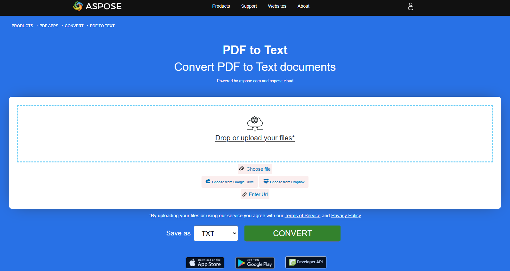

## تحويل PDF إلى EPUB

**<abbr title="Electronic Publication">EPUB</abbr>** هو معيار كتب إلكترونية مجاني ومفتوح من المنتدى الدولي للنشر الرقمي (IDPF). الملفات لها الامتداد .epub.
تم تصميم EPUB للمحتوى القابل لإعادة التدفق، مما يعني أن قارئ EPUB يمكنه تحسين النص لجهاز عرض معين. كما يدعم EPUB المحتوى ذا التخطيط الثابت. يُقصد بهذا التنسيق أن يكون تنسيقًا موحدًا يمكن للناشرين وشركات التحويل استخدامه داخليًا، وكذلك للتوزيع والبيع. وهو يحل محل معيار Open eBook.

يظهر مقطع الشيفرة Rust المقدم كيفية تحويل مستند PDF إلى EPUB باستخدام مكتبة Aspose.PDF:

1. افتح مستند PDF.
1. تحويل ملف PDF إلى EPUB باستخدام [save_epub](https://reference.aspose.com/pdf/rust-cpp/convert/save_epub/) دالة.

```rs

  use asposepdf::Document;

  fn main() -> Result<(), Box<dyn std::error::Error>> {
      // Open a PDF-document with filename
      let pdf = Document::open("sample.pdf")?;

      // Convert and save the previously opened PDF-document as Epub-document
      pdf.save_epub("sample.epub")?;

      Ok(())
  }
```

{}
**حاول تحويل PDF إلى EPUB عبر الإنترنت**

Aspose.PDF for Rust يقدم لك تطبيقًا مجانيًا عبر الإنترنت ["PDF إلى EPUB"](https://products.aspose.app/pdf/conversion/pdf-to-epub)، حيث يمكنك محاولة استكشاف الوظيفة والجودة التي يعمل بها.

[](https://products.aspose.app/pdf/conversion/pdf-to-epub)
{}

## تحويل PDF إلى TeX

**Aspose.PDF for Rust** يدعم تحويل PDF إلى TeX.
تنسيق ملف LaTeX هو تنسيق ملف نصي يحتوي على ترميز خاص ويُستخدم في نظام إعداد المستندات القائم على TeX لتخطيط عالي الجودة.

يظهر مقطع كود Rust المقدم كيفية تحويل مستند PDF إلى TeX باستخدام مكتبة Aspose.PDF:

1. افتح مستند PDF.
1. تحويل ملف PDF إلى TeX باستخدام [save_tex](https://reference.aspose.com/pdf/rust-cpp/convert/save_tex/) دالة.

```rs

  use asposepdf::Document;

  fn main() -> Result<(), Box<dyn std::error::Error>> {
      // Open a PDF-document with filename
      let pdf = Document::open("sample.pdf")?;

      // Convert and save the previously opened PDF-document as TeX-document
      pdf.save_tex("sample.tex")?;

      Ok(())
  }
```

{}
**حاول تحويل PDF إلى LaTeX/TeX عبر الإنترنت**

Aspose.PDF for Rust يقدم لك تطبيقًا مجانيًا عبر الإنترنت ["PDF إلى LaTeX"](https://products.aspose.app/pdf/conversion/pdf-to-tex)، حيث يمكنك محاولة استكشاف الوظيفة والجودة التي يعمل بها.

[](https://products.aspose.app/pdf/conversion/pdf-to-tex)
{}

## تحويل PDF إلى TXT

المقتطف البرمجي بلغة Rust المقدم يوضح كيفية تحويل مستند PDF إلى TXT باستخدام مكتبة Aspose.PDF:

1. افتح مستند PDF.
1. تحويل ملف PDF إلى TXT باستخدام [save_txt](https://reference.aspose.com/pdf/rust-cpp/convert/save_txt/) دالة.

```rs

  use asposepdf::Document;

  fn main() -> Result<(), Box<dyn std::error::Error>> {
      // Open a PDF-document with filename
      let pdf = Document::open("sample.pdf")?;

      // Convert and save the previously opened PDF-document as Txt-document
      pdf.save_txt("sample.txt")?;

      Ok(())
  }
```

{}
**حاول تحويل PDF إلى نص عبر الإنترنت**

Aspose.PDF for Rust يقدم لك تطبيقًا مجانيًا عبر الإنترنت ["PDF إلى نص"](https://products.aspose.app/pdf/conversion/pdf-to-txt)، حيث يمكنك محاولة استكشاف الوظيفة والجودة التي يعمل بها.

[](https://products.aspose.app/pdf/conversion/pdf-to-txt)
{}

## تحويل PDF إلى XPS

نوع ملف XPS مرتبط أساسًا بـ XML Paper Specification من شركة Microsoft Corporation. مواصفة الورق XML (XPS)، التي كانت تُعرف سابقًا بالاسم الرمزي Metro والتي تشمل مفهوم التسويق لطباعة الجيل التالي (NGPP)، هي مبادرة مايكروسوفت لدمج إنشاء المستندات وعرضها في نظام تشغيل Windows.

**Aspose.PDF for Rust** يعطي إمكانية تحويل ملفات PDF إلى <abbr title="XML Paper Specification">XPS</abbr> تنسيق. دعنا نجرب استخدام مقتطف الشيفرة المقدم لتحويل ملفات PDF إلى تنسيق XPS باستخدام Rust.

توضح مقطع كود Rust المقدم كيفية تحويل مستند PDF إلى XPS باستخدام مكتبة Aspose.PDF:

1. افتح مستند PDF.
1. تحويل ملف PDF إلى XPS باستخدام [save_xps](https://reference.aspose.com/pdf/rust-cpp/convert/save_xps/) دالة.

```rs

  use asposepdf::Document;

  fn main() -> Result<(), Box<dyn std::error::Error>> {
      // Open a PDF-document with filename
      let pdf = Document::open("sample.pdf")?;

      // Convert and save the previously opened PDF-document as Xps-document
      pdf.save_xps("sample.xps")?;

      Ok(())
  }
```

{}
**حاول تحويل PDF إلى XPS عبر الإنترنت**

Aspose.PDF for Rust يقدم لك تطبيقًا مجانيًا عبر الإنترنت ["PDF إلى XPS"](https://products.aspose.app/pdf/conversion/pdf-to-xps)، حيث يمكنك محاولة استكشاف الوظيفة والجودة التي يعمل بها.

[](https://products.aspose.app/pdf/conversion/pdf-to-xps)
{}

## تحويل PDF إلى PDF بتدرج الرمادي

يظهر مقتطف كود Rust المقدم كيفية تحويل الصفحة الأولى من مستند PDF إلى PDF بتدرج الرمادي باستخدام مكتبة Aspose.PDF:

1. افتح مستند PDF.
1. تحويل صفحة PDF إلى PDF بتدرج الرمادي باستخدام [page_grayscale](https://reference.aspose.com/pdf/rust-cpp/organize/page_grayscale/) دالة.

هذا المثال يحول صفحة محددة من ملف PDF الخاص بك إلى التدرج الرمادي:

```rs

  use asposepdf::Document;

  fn main() -> Result<(), Box<dyn std::error::Error>> {
      // Open a PDF-document from file
      let pdf = Document::open("sample.pdf")?;

      // Convert page to black and white
      pdf.page_grayscale(1)?;

      // Save the previously opened PDF-document with new filename
      pdf.save_as("sample_page1_grayscale.pdf")?;

      Ok(())
  }
```

## تحويل PDF إلى Markdawn

المقتطف البرمجي المقدم بلغة Rust يوضح كيفية تحويل مستند PDF إلى ملف Markdown (.md) باستخدام Aspose.PDF for Rust.

1. افتح ملف PDF المصدر.
1. تحويل PDF إلى Markdown.
1. احفظ مستند PDF المفتوح كملف Markdown.

```rs

  use asposepdf::Document;

  fn main() -> Result<(), Box<dyn std::error::Error>> {
      // Open a PDF-document with filename
      let pdf = Document::open("sample.pdf")?;

      // Convert and save the previously opened PDF-document as Markdown-document
      pdf.save_markdown("sample.md")?;

      Ok(())
  }
```

{}
**حاول تحويل PDF إلى MD عبر الإنترنت**

Aspose.PDF for Rust يقدم لك تطبيقًا مجانيًا عبر الإنترنت ["PDF إلى MD"](https://products.aspose.app/pdf/conversion/md)، حيث يمكنك محاولة استكشاف الوظيفة والجودة التي يعمل بها.

[](https://products.aspose.app/pdf/conversion/md)
{}
