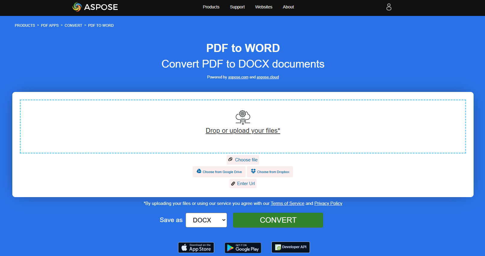

لتحرير محتوى ملف PDF في Microsoft Word أو معالجات النص الأخرى التي تدعم تنسيقات DOC و DOCX. ملفات PDF قابلة للتحرير، ولكن ملفات DOC و DOCX أكثر مرونة وقابلة للتخصيص.

## تحويل PDF إلى DOC

المقتطف البرمجي بلغة Rust المقدم يوضح كيفية تحويل مستند PDF إلى DOC باستخدام مكتبة Aspose.PDF:

1. افتح مستند PDF.
1. حوّل ملف PDF إلى DOC باستخدام [save_doc](https://reference.aspose.com/pdf/rust-cpp/convert/save_doc/) دالة.

```rs

  use asposepdf::Document;

  fn main() -> Result<(), Box<dyn std::error::Error>> {
      // Open a PDF-document with filename
      let pdf = Document::open("sample.pdf")?;

      // Convert and save the previously opened PDF-document as Doc-document
      pdf.save_doc("sample.doc")?;

      Ok(())
  }
```

{}
**حاول تحويل PDF إلى DOC عبر الإنترنت**

Aspose.PDF for Rust يقدم لك تطبيقًا مجانيًا عبر الإنترنت ["PDF إلى DOC"](https://products.aspose.app/pdf/conversion/pdf-to-doc), حيث يمكنك محاولة استكشاف الوظيفة والجودة التي يعمل بها.

[](https://products.aspose.app/pdf/conversion/pdf-to-doc) 
{}

## تحويل PDF إلى DOCX

تتيح لك واجهة برمجة تطبيقات Aspose.PDF for Rust قراءة وتحويل مستندات PDF إلى DOCX. DOCX هو تنسيق معروف لمستندات Microsoft Word تم تغيير هيكله من ثنائي بسيط إلى مزيج من ملفات XML والملفات الثنائية. يمكن فتح ملفات Docx باستخدام Word 2007 والإصدارات اللاحقة ولكن ليس مع الإصدارات الأقدم من MS Word التي تدعم امتدادات ملفات DOC.

يوضح مقتطف كود Rust المقدم كيفية تحويل مستند PDF إلى DOCX باستخدام مكتبة Aspose.PDF:

1. افتح مستند PDF.
1. تحويل ملف PDF إلى DOCX باستخدام [save_docx](https://reference.aspose.com/pdf/rust-cpp/convert/save_docx/) دالة.

```rust

  use asposepdf::Document;

  fn main() -> Result<(), Box<dyn std::error::Error>> {
      // Open a PDF-document with filename
      let pdf = Document::open("sample.pdf")?;

      // Convert and save the previously opened PDF-document as DocX-document
      pdf.save_docx("sample.docx")?;

      Ok(())
  }
```

{}
**حاول تحويل PDF إلى DOCX عبر الإنترنت**

Aspose.PDF for Rust يقدم لك تطبيقًا مجانيًا عبر الإنترنت ["PDF إلى Word"](https://products.aspose.app/pdf/conversion/pdf-to-docx), حيث يمكنك محاولة استكشاف الوظيفة والجودة التي يعمل بها.

[](https://products.aspose.app/pdf/conversion/pdf-to-docx)

{}

## تحويل PDF إلى DOCX باستخدام وضع التعرف المحسن

تحويل مستند PDF إلى ملف Microsoft Word (DOCX) باستخدام Aspose.PDF for Rust مع وضع التعرف المحسن.

وضع التعرف المحسّن ينتج ملف DOCX قابل للتحرير بالكامل، مع الحفاظ على:

 - هيكل الفقرة
 - الجداول كجداول Word أصلية
 - تدفق النص المنطقي والتنسيق

1. افتح ملف PDF المصدر.
1. احفظ PDF كملف DOCX مع تمكين التعرف على التخطيط المحسن.

```rs

  use asposepdf::Document;

  fn main() -> Result<(), Box<dyn std::error::Error>> {
      // Open a PDF-document with filename
      let pdf = Document::open("sample.pdf")?;

      // Convert and save the previously opened PDF-document as DocX-document with Enhanced Recognition Mode (fully editable tables and paragraphs)
      pdf.save_docx_enhanced("sample_enhanced.docx")?;

      Ok(())
  }
```
