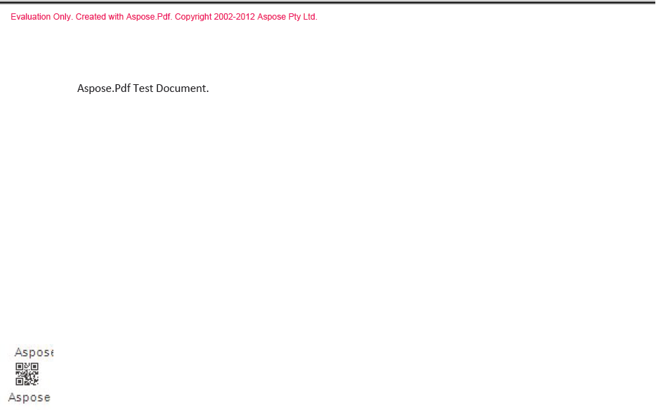

---
title: أضف باركود إلى ملف PDF في SharePoint
linktitle: إضافة الباركود إلى ملف PDF
type: docs
weight: 40
url: /ar/sharepoint/add-barcode-to-a-pdf-file/
lastmod: "2020-12-16"
description: يتيح لك PDF SharePoint API إضافة رمز شريطي إلى مستند PDF كما هو موضح في الصورة أدناه.
---

## إضافة الباركود إلى ملف PDF

{}

يتيح لك Aspose.PDF for SharePoint إضافة رمز شريطي إلى مستند PDF. يمكن للمستخدمين إضافة رمز شريطي إلى الركن الأيسر السفلي من كل صفحة من مستند PDF المضافة إلى المكتبة. تعطي الصورة أدناه فكرة عن الشكل الذي قد يبدو عليه مستند PDF مع إضافة رمز شريطي.

### الباركود في الزاوية اليسرى السفلية

{}

{}

لتمكين ميزة الباركود لمكتبة معينة، استخدم زر **إعدادات العلامة المائية** في علامة التبويب **Aspose PDF Watermark Tools** في **Library Tools** كما هو موضح أدناه.

### إعدادات العلامة المائية لملف PDF

بعد تمكين الرموز الشريطية لمكتبة معينة، يقوم Aspose.PDF for SharePoint بإضافة رمز شريطي إلى أي مستند PDF مضاف إلى تلك المكتبة.

{}

