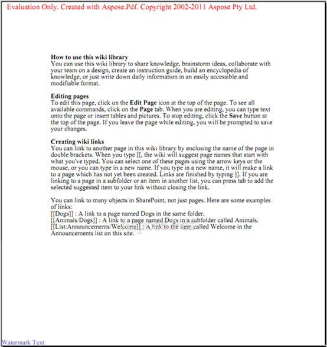

---
title: إضافة علامة مائية إلى ملف PDF المُضاف إلى مكتبة SharePoint
linktitle: إضافة علامة مائية إلى PDF
type: docs
weight: 20
url: /ar/sharepoint/add-watermark-to-pdf/
lastmod: "2020-12-16"
description: يتيح لك PDF SharePoint API إضافة علامة مائية إلى مستندات PDF المضافة إلى المكتبة.
---

{}

يتيح لك Aspose.PDF for SharePoint إضافة علامة مائية إلى مستند PDF. تضيف الميزة علامة مائية نصية إلى الزاوية اليسرى السفلية من كل صفحة في مستند PDF مضاف إلى المكتبة.

## نص العلامة المائية في الزاوية اليسرى السفلية

{}

{}

لتمكين ميزة العلامة المائية لمكتبة معينة:

1. انقر فوق **إعدادات العلامة المائية** في علامة التبويب **Aspose Tools** في مربع الحوار **Library Tools**.

   **أدوات المكتبة**

إعدادات العلامة المائية خاصة بالقائمة حتى تتمكن من اختيار إعداد علامة مائية مختلفة لمكتبات مختلفة. تعرض لقطة الشاشة التالية مربع حوار إعدادات العلامة المائية لمكتبة **المستندات المشتركة**.

## إعدادات العلامة المائية

- حدد **تمكين العلامة المائية لـ** لتمكين ميزة العلامة المائية لقائمة محددة.
- **نص العلامة المائية** – النص الذي سيظهر على الصفحة كعلامة مائية.
- **الخط** – الخط المستخدم للعلامة المائية.
- **اللون** – لون العلامة المائية.

بعد تمكين العلامة المائية لمكتبة معينة، يقوم Aspose.PDF بإضافة علامات مائية إلى كل مستند PDF يضاف إلى تلك المكتبة.

{}

