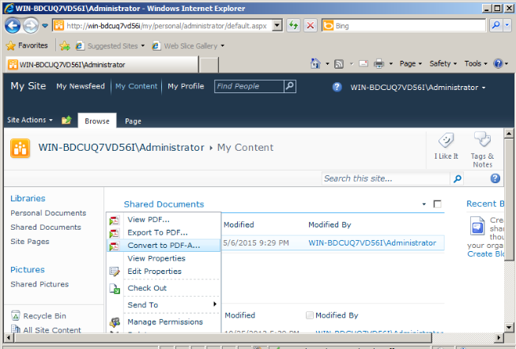

{}

في إصدار [Aspose.PDF for SharePoint 2.0](https://releases.aspose.com/pdf/sharepoint/new-releases/Aspose.PDF-for-SharePoint-2.0.0/) أضفنا دعمًا لإنشاء ملف PDF متوافق مع PDFA.

حاليًا، يدعم Aspose.PDF for SharePoint معيار PDFA1b فقط.

{}

## إنشاء مستند متوافق مع PDFA

تحويل PDF من مكتبة مستندات SharePoint إلى PDFA على النحو التالي:

1. انقر **تحويل إلى PDF** في قائمة البنك المركزي الأوروبي.

2. قم بتنزيل وحفظ ملف PDF الناتج.

