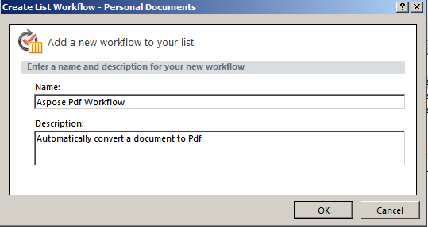

---
title: Converting a File to PDF via Workflow Activity
linktitle: Converting a File to PDF via Workflow Activity
type: docs
weight: 50
url: /ar/sharepoint/converting-a-file-to-pdf-via-workflow-activity/
lastmod: "2020-12-16"
description: PDF SharePoint API can be used in a SharePoint workflow that converts a document to PDF.
---

{}

يعد دعم سير العمل وظيفة أساسية في Microsoft Office SharePoint Server. تساعد عمليات سير العمل على أتمتة حركة المستندات وفقًا لمنطق الأعمال وتبسيط تكلفة تنظيم المستندات ووقتها. توضح هذه المقالة كيفية استخدام Aspose.PDF لـ SharePoint في سير عمل يقوم بتحويل مستند إلى PDF.

{}

## إعداد سير العمل

يقوم هذا المثال بإنشاء سير عمل يحول أي عنصر جديد في مكتبة المستندات إلى تنسيق PDF ويخزنه في مكتبة مستندات أخرى. يستخدم المثال مكتبة **المستندات الشخصية** باعتبارها المكتبة المصدر والمجلد الفرعي **Pdf** في مكتبة **المستندات المشتركة** باعتبارها المكتبة الوجهة.

Aspose.PDF for SharePoint supports conversion of HTML, text and image files.

### تصميم سير العمل باستخدام SharePoint Designer

1. Open **SharePoint Designer** and connect to the site where the workflow will be implemented.
1. حدد **سير العمل** من **كائنات الموقع** ثم افتح **قائمة سير العمل**.
1. حدد مكتبة **المستندات الشخصية** لإنشاء سير عمل قائمة جديدة وإرفاقه بمكتبة المستندات.

   **اختيار المستندات الشخصية من القائمة**

1. قم بإنشاء سير عمل القائمة وإرفاقه بمكتبة **المستندات الشخصية** عن طريق كتابة اسم سير العمل ووصفه.
1. Click **OK** to complete this step.

   **إنشاء سير عمل القائمة**

يظهر محرر خطوة سير العمل. يُستخدم هذا لتحديد الشروط والإجراءات الخاصة بمهام سير العمل. أضف الآن إجراءً لتحويل مستند جديد إلى PDF دون أي شرط، من **Aspose Actions**.

1. حدد الإجراء **تحويل الملف إلى PDF عبر Aspose.PDF** من قائمة **الإجراء**.

   **Selecting and action**

1. تكوين معلمات الإجراء:
   1. قم بتعيين معلمة **هذا المجلد** إلى المجلد الوجهة.
   1. Either leave the other action parameters as default values or set using the action properties window. The default value for the **Overwrite** parameter is false.

      **محرر سير العمل**

**Setting the destination library**

**Setting the properties**

1. من القائمة **سير العمل**، حدد **إعدادات سير العمل**.
1. حدد **بدء سير العمل تلقائيًا عند إنشاء عنصر جديد** وامسح الخيارات الأخرى من **خيارات البدء**.

   **ضبط خيارات البدء**

تم الانتهاء من تصميم سير العمل.

1. قم بحفظ سير العمل ونشره لتنفيذه على موقع SharePoint.

### اختبار سير العمل

لاختبار سير العمل:

1. افتح موقع SharePoint وقم بتحميل مستند جديد إلى مكتبة المستندات **المستندات الشخصية**.
   يدعم Aspose.PDF for SharePoint التحويل من ملفات HTML والملفات النصية والصور (JPG وPNG وGIF وTIFF وBMP*) إلى PDF. يتم تكوين سير العمل ليبدأ تلقائيًا عند إنشاء عنصر جديد، بحيث تتم معالجة الملفات تلقائيًا.
1. قم بتحديث المتصفح.
   تظهر حالة سير العمل في عمود سير العمل، **Aspose.PDF Workflow** في هذه الحالة.

   **إضافة مستند إلى المكتبة المصدر**

1. افتح مكتبة المستندات الوجهة لعرض المستند المحول. **المستندات المشتركة/Pdf** هو المسار في هذا المثال.

   **مكتبة الوجهة**

