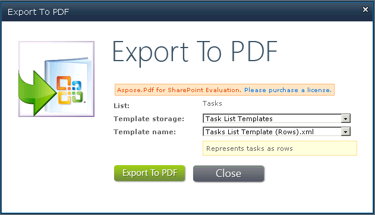

{}

يتيح لك Aspose.PDF لـ SharePoint تحويل عدة مستندات، أو واحدة تلو الأخرى. توضح هذه المقالة كيفية تصدير عنصر من القائمة.

{}

لتصدير عنصر معين من قائمة: حدد **تصدير إلى Pdf** من كتلة التحكم في تحرير العنصر (ECB).

## تحديد تصدير إلى Pdf في البنك المركزي الأوروبي للعنصر

## تصدير إلى PDF

