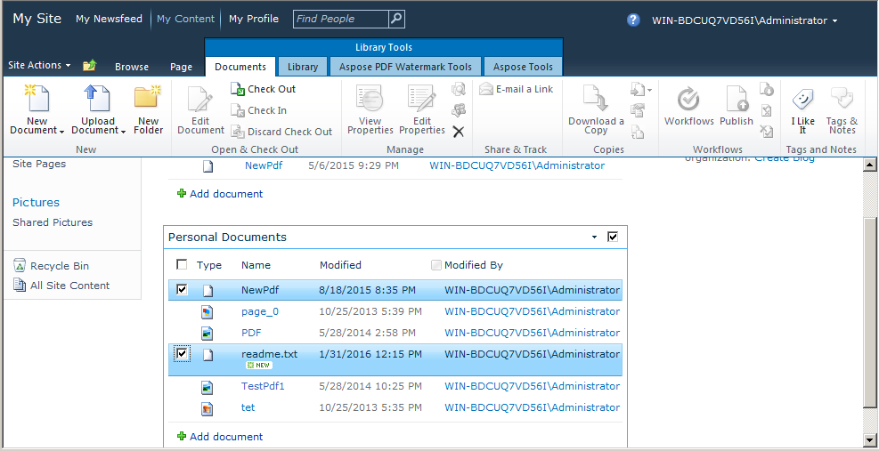

{}

يعد دمج/تسلسل ملفات PDF المتعددة في ملف PDF واحد ميزة شائعة جدًا ومطلوبة في تطبيقات معالجة ملفات PDF. لقد قدمنا ​​هذه الميزة المهمة في إصدار [Aspose.PDF for SharePoint 2.2.0](https://releases.aspose.com/pdf/sharepoint/new-releases/Aspose.PDF-for-SharePoint-2.2.0/). دمج ملفين هو إنشاء ملف واحد عن طريق إضافة الملف الثاني إلى نهاية الملف الأول.

{}

## دمج ملفات PDF

دمج ملفات PDF متعددة من مكتبة مستندات SharePoint في ملف PDF واحد على النحو التالي:

1.  حدد ملفات PDF من مكتبة مستندات SharePoint المراد دمجها.

2.  انقر فوق علامة التبويب Aspose Tools في أدوات المكتبة.

3.  انقر فوق خيار Merge to PDF من Library Tools لدمج جميع ملفات PDF المحددة في PDF الناتج.

4.  سيتم عرض مطالبة بتنزيل/حفظ ملف PDF الناتج بالاسم المناسب.

