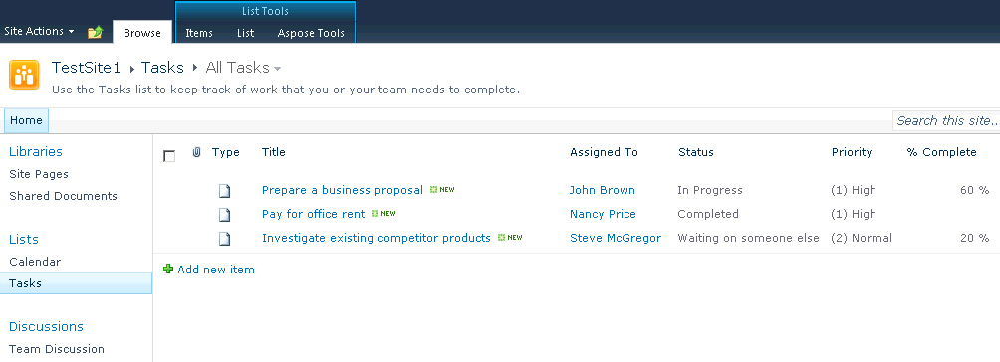

{}

## مرحبًا بك في ملف Aspose.PDF الخاص بتوثيق SharePoint!

يعد Aspose.PDF لـ SharePoint حلاً يسمح للمستخدمين بتصدير القوائم وعناصر القائمة وصفحات SharePoint Wiki إلى تنسيق ملف PDF.

{}

{}
تم تصميم Aspose.PDF لـ SharePoint ليتم استخدامه مع Microsoft SharePoint Server 2010. ولا توجد متطلبات نظام إضافية إلى جانب Microsoft SharePoint Server 2010.

توضح هذه الوثائق Aspose.PDF لـ [ميزات](/pdf/ar/sharepoint/features/) و[التثبيت](/pdf/ar/sharepoint/install-aspose-pdf-for-sharepoint/) و[قيود التقييم](/pdf/ar/sharepoint/evaluate-aspose-pdf/) و[الترخيص](/pdf/ar/sharepoint/license-aspose-pdf-for-sharepoint/) وحالات الاستخدام الشائعة والإعدادات.

{}

تُظهر علامة التبويب Aspose Tools الموجودة على شريط القوائم والمكتبات تثبيت Aspose.PDF لـ SharePoint

