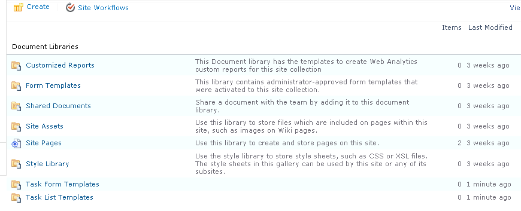

{}

توضح هذه المقالة كيفية إنشاء القوالب وتصديرها باستخدام Aspose.PDF for SharePoint.

من Aspose.PDF for SharePoint 1.9.2، يغطي دعم قالب PDF أيضًا مواقع SharePoint الفرعية.

{}

## إنشاء وتصدير القوالب

{}

لاستخدام ميزة التصدير Aspose.PDF for SharePoint، قم أولاً بإنشاء قائمة تستخدم "قوالب PDF".

إنشاء قائمة تستخدم قوالب PDF:

يتم إنشاء قالبين للمستندات، قوالب نماذج المهام وقوالب قائمة المهام:

يتيح لك نموذج القالب إدخال المعلومات التالية:

- **الاسم**: اسم ملف القالب.
- **العنوان**: عنوان القالب. (افتراضيًا، هو نفس اسم الملف.)
- **الوصف**: وصف القالب. الوصف الجيد يجعل القالب أسهل في الاستخدام.
- **أنواع القائمة المعينة**: معرفات القائمة المفصولة بفواصل (ذات صلة بالقالب. قد يحتوي هذا الحقل أيضًا على القيمة
- **جميع أنواع القائمة**. ينطبق هذا الحقل فقط عند تعيين الحقل **النوع** على **القائمة**).
- **أنواع المحتوى المعينة**: معرفات أنواع المحتوى المفصولة بفواصل المرتبطة بالقالب. قد يحتوي هذا الحقل على **AllListTypes**. ينطبق هذا الحقل فقط عند تعيين الحقل **النوع** على **العنصر**.
- **النوع**: إما قالب القائمة أو قالب العنصر.
- **الحالة**: الخيارات نشطة، وغير نشطة (غير مرئية للجميع)، وتصحيح الأخطاء (مرئية فقط للمسؤولين).

نموذج قوالب قائمة المهام:

نموذج قوالب نموذج المهمة:

عند حفظها، تظهر القوالب الجديدة في قائمة القوالب، وتكون جاهزة للاستخدام:

قالبان لقائمة المهام:*

نموذج نماذج المهام:

### تطوير القوالب

القالب هو ملف XML يعتمد على Aspose XML PDF. لإنشاء قالب لقائمة، ضع علامات خاصة مرتبطة بالاسم الداخلي لحقل نوع محتوى هدف SharePoint في ملف XML PDF.

### علامات

- **SPListItemsCount** – تم استبداله بعدد عناصر القائمة.
- **SPListTitle** - تم استبداله بعنوان القائمة.
- **SPTableIterator** - يتم وضعه في خلية الجدول الأولى ووضع علامة على الجدول للتكرار الكامل.
- **SPRowIterator** - يتم وضعه في خلية الجدول الأول ووضع علامة على الجدول لتكرار الصف.
- **SPField** – تم استبداله بقيمة حقل العنصر.

كمرجع، يرجى تنزيل [ملفات قالب XML](attachments/8421394/8618082.zip).

### تصدير إلى PDF

عندما يتم تكوين القالب بالكامل، تكون جاهزًا لتصدير القوائم أو العناصر إلى ملفات PDF.

تصدير قائمة إلى PDF باستخدام قالب قائمة المهام:

{}
