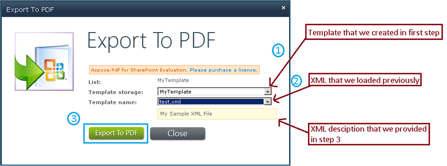
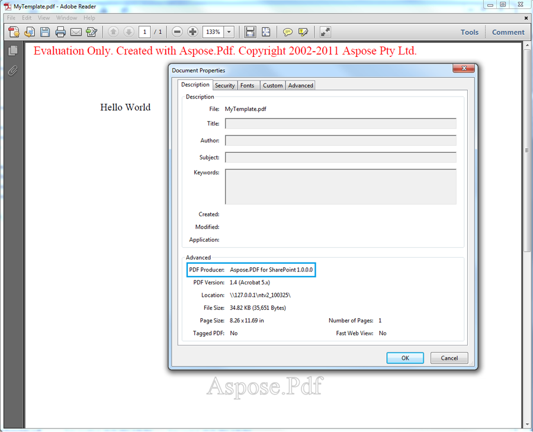

{}

تم إنشاء Aspose.PDF لـ SharePoint على أساس مكون Aspose.PDF الحائز على جوائز لمكون .NET. يوفر Aspose.PDF for .NET ميزات رائعة بدءًا من إنشاء مستند PDF من البداية وحتى معالجة ملفات PDF الموجودة. ومن بين هذه الميزات، يعد تحويل XML إلى PDF أحد الميزات الرائعة التي يدعمها هذا المنتج. لذلك نعتقد أن Aspose.PDF لـ SharePoint سيكون قادرًا أيضًا على تحويل ملفات XML إلى تنسيق PDF.

{}

## إنشاء ملف XML وتحويله إلى PDF

{}

سترشدك هذه المقالة خطوة بخطوة خلال عملية إنشاء ملف XML وتحويله إلى PDF:

1. [إنشاء ملف XML](/pdf/ar/sharepoint/how-to-create-and-convert-an-xml-file-to-pdf/#step-1-create-xml-file).
2. [إنشاء قالب PDF](/pdf/ar/sharepoint/how-to-create-and-convert-an-xml-file-to-pdf/#step-2-create-pdf-template).
3. [قم بتحميل قالب XML](/pdf/ar/sharepoint/how-to-create-and-convert-an-xml-file-to-pdf/#step-3-load-xml-template).
4. [حدد المسار إلى المسار المصدر](/pdf/ar/sharepoint/how-to-create-and-convert-an-xml-file-to-pdf/#step-4-specify-source-file-path).
5. [حدد خصائص الملف](/pdf/ar/sharepoint/how-to-create-and-convert-an-xml-file-to-pdf/#step-5-specify-file-properties).
6. [تصدير الملف إلى PDF](/pdf/ar/sharepoint/how-to-create-and-convert-an-xml-file-to-pdf/#step-6-export-to-pdf).
7. [احفظ ملف PDF](/pdf/ar/sharepoint/how-to-create-and-convert-an-xml-file-to-pdf/#step-7-save-pdf-document)

### الخطوة 1: إنشاء ملف XML

قم أولاً بإنشاء ملف XML استنادًا إلى Aspose.PDF لـ .NET Document Object Model.

وفقًا لـ DOM الخاص بـ Aspose.PDF for .NET، يحتوي مستند PDF على مجموعة من كائنات Section، ويحتوي كل Section على عنصر Paragraph واحد أو أكثر. ويُعد Text كائنًا على مستوى Paragraph وقد يحتوي على مقطع واحد أو أكثر. في المثال أدناه، تتم إضافة سلسلة نصية نموذجية إلى كائن Segment ثم تُضاف إلى كائن Text. وأخيرًا، يُضاف عنصر Text إلى مجموعة الفقرات الخاصة بكائن Section.

```xml

<?xml version="1.0" encoding="utf-8" ?>

  <Pdf xmlns="Aspose.PDF">

   <Section>

    <Text>

            <Segment>Hello World</Segment>

    </Text>

   </Section>

  </Pdf>

```

### الخطوة 2: إنشاء قالب PDF

قبل المتابعة، تأكد من تثبيت SharePoint Foundation server 2010 وتكوينه بشكل صحيح على النظام الذي سيتم فيه التحويل.

1. قم بتسجيل الدخول إلى موقع SharePoint.
1. حدد **إجراء الموقع** و**كافة العناصر**.
1. حدد خيار **إنشاء** وحدد **قالب PDF** من القائمة.
1. أدخل اسم القالب.
1. انقر **إنشاء**.


### الخطوة 3: تحميل قالب XML

بمجرد إنشاء القالب، قم بتحميل [ملف XML](/pdf/ar/sharepoint/how-to-create-and-convert-an-xml-file-to-pdf/)

1. في صفحة قالب PDF، حدد **إضافة عنصر جديد**.


### الخطوة 4: تحديد مسار الملف المصدر

في مربع حوار تحميل المستند:

1. انقر فوق **تصفح** وحدد موقع ملف XML على نظامك. يمكنك تمكين خانة الاختيار للكتابة فوق خيار الملف الموجود.
1. اضغط على زر **موافق**.


### الخطوة 5: تحديد خصائص الملف

عند تحميل الملف، قم بإضافة المعلومات في الحقول الإلزامية (المميزة بعلامة النجمة الحمراء: *).

في هذا المثال، تمت إضافة وصف نموذجي وإكمال الحقول التالية:

1. وصف موجز للوثيقة.
1. أدخل **AllListTypes** في الحقل **Assigned List Types**.
1. حدد **قائمة** من قائمة **النوع**.
   تأكد من بقاء الحالة **نشطة**.
1. انقر **حفظ** لحفظ الخصائص.


### الخطوة 6: التصدير إلى PDF

عند إضافة ملف XML إلى قالب PDF:
أيضاً:

1. انقر بزر الماوس الأيمن فوق ملف test.xml.
1. حدد **تصدير إلى PDF** من القائمة.

أو:

1. حدد **Aspose Tools** من **Library Tools**.
1. انقر **تصدير**.


### الخطوة 7: حفظ مستند PDF

1. في مربع الحوار "تصدير إلى PDF"، حدد **تخزين القالب** (الموقع الذي يتم فيه تخزين الملف المصدر).
1. حدد الملف المراد تصديره من قائمة **اسم القالب**.
1. انقر **تصدير إلى PDF** لحفظ مستند PDF النهائي.



## افتح ملف بي دي إف

تم حفظ مستند PDF ويمكن فتحه. في الصورة أدناه، لاحظ العبارة "Hello World" التي كانت موجودة في علامة المقطع في ملف XML. لاحظ أيضًا أن منتج PDF هو Aspose.PDF لـ SharePoint.



{}
