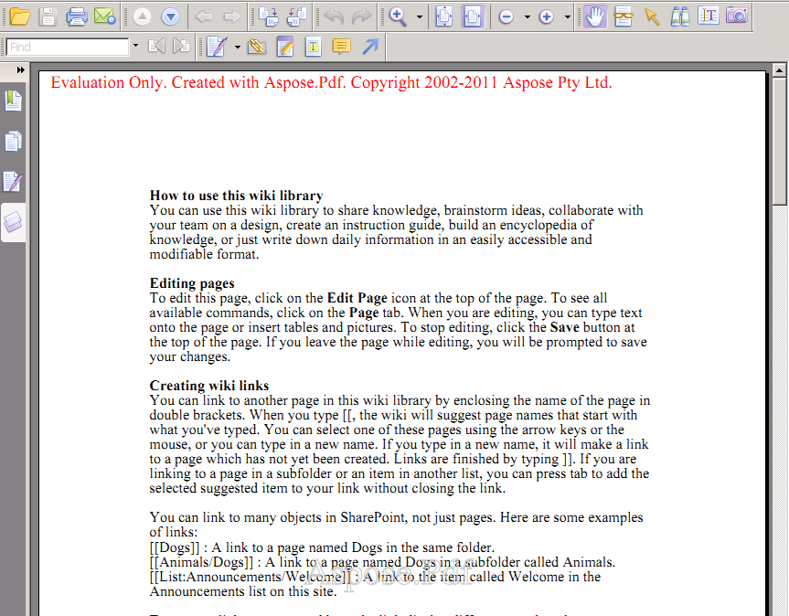

---
title: احفظ صفحة SharePoint Wiki بصيغة PDF
linktitle: احفظ صفحة SharePoint Wiki بصيغة PDF
type: docs
weight: 20
url: /ar/sharepoint/save-sharepoint-wiki-page-as-pdf/
lastmod: "2020-12-16"
description: يمكن استخدام مكتبة Sharepoint PDF لتصدير صفحات SharePoint Wiki إلى PDF.
---

{}

## Sharepoint Wiki Pdf Export

This article shows how to export SharePoint Wiki Pages to PDF using Aspose.PDF for SharePoint.

{}

## Saving Wiki Pages

{}

لحفظ صفحة Wiki بصيغة PDF، انقر فوق **حفظ بتنسيق PDF** في علامة التبويب **الصفحة**. تُظهر لقطات الشاشة أدناه قسمًا من النص كما يظهر في صفحة Wiki ويتم تصديره إلى PDF.

**صفحة Wiki على وشك أن يتم تصديرها إلى ملف PDF.** (لاحظ الزر **حفظ بتنسيق PDF** في علامة التبويب **الصفحة**.)

ملف PDF يعرض صفحة Wiki المصدرة.

{}

