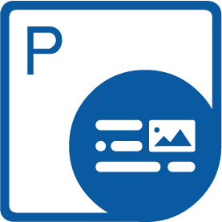

{}

<h2>Welcome to the Aspose.PDF for C++ Documentation Section</h2>

Aspose.PDF for C++ is a native C++ library that enables developers to create, read and manipulate PDF documents without using Adobe Acrobat. Aspose.PDF for C++ allows developers to create forms, add/edit text, manipulate PDF pages, add annotations, handle custom fonts and much more. Here in the documentation section of Aspose.PDF for C++, you can explore all the features of the API along with the basic examples to demonstrate the implementation of those features in your C++ application.

{}

<h2>Chapters</h2>

- [What's new](/pdf/cpp/whatsnew/)
- [Overview](/pdf/cpp/overview/)
- [Get Started](/pdf/cpp/get-started/)
- [Basic operations](/pdf/cpp/basic-operations/)
- [Converting documents](/pdf/cpp/converting/)
- [Parsing PDF documents](/pdf/cpp/parsing/)
- [Advanced operations](/pdf/cpp/advanced-operations/)
- [Release Notes](https://releases.aspose.com/pdf/cpp/release-notes/)

<h3> Aspose.PDF for C++ Resources</h3>

The following links offer some useful resources you may need to accomplish your tasks.

- [Aspose.PDF for C++ Online Documentation](/pdf/cpp/)
- [Aspose.PDF for C++ Features](/pdf/cpp/overview/)
- [Aspose.PDF for C++ Release Notes](https://releases.aspose.com/pdf/cpp/release-notes/)
- [Aspose.PDF for C++ Product Page](https://products.aspose.com/pdf/cpp/)
- [Install Aspose.PDF for C++ NuGet Package](https://www.nuget.org/packages/Aspose.PDF.CPP/)
- [Download Aspose.PDF for C++](https://releases.aspose.com/pdf/cpp/)
- [Aspose.PDF for C++ API Reference Guide](https://reference.aspose.com/pdf/cpp)
- [Download Examples at GitHub Repository](https://github.com/aspose-pdf/Aspose.PDF-for-C)
- [Aspose.PDF for C++ Free Support Forum](https://forum.aspose.com/c/pdf/10)
- [Aspose.PDF for C++ Paid Support Helpdesk](https://helpdesk.aspose.com/)
