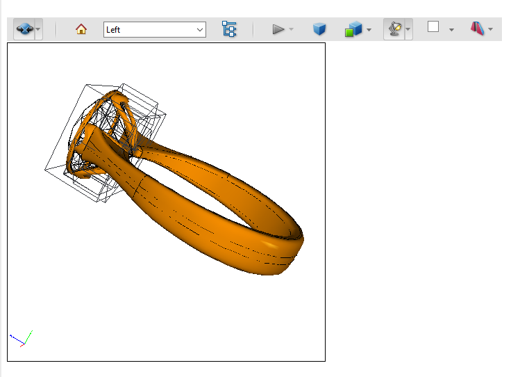

Adding video, audio, and interactive content turns PDFs into multidimensional communication tools that increase interest and engagement with your documents. Such content in PDF format files is called Multimedia Annotations.

Annotations in a PDF document are contained in a [Page](https://apireference.aspose.com/pdf/cpp/class/aspose.pdf.page) object’s Annotations collection. This collection contains all annotations for that individual page only: every page has its own Annotations collection. To add an annotation to a particular page, add it to that page’s Annotations collection using the Add method.

Use the [ScreenAnnotation](https://apireference.aspose.com/pdf/cpp/class/aspose.pdf.annotations.screen_annotation) class in the Aspose.PDF.InteractiveFeatures.Annotations namespace to include SWF files as annotations in a PDF document instead. A screen annotation specifies a region of a page upon which media clips may be played.

When you need to add an external video link in PDF document, you can use [MovieAnnotaiton](https://apireference.aspose.com/pdf/cpp/class/aspose.pdf.annotations.movie_annotation).
A Movie Annotation contains animated graphics and sound to be presented on the computer screen and through the speakers.

A [Sound Annotation](https://apireference.aspose.com/pdf/cpp/class/aspose.pdf.annotations.sound_annotation) shall analogous to a text annotation except that instead of a text note, it contains sound recorded from the computer’s microphone or imported from a file. When the annotation is activated, the sound shall be played. The annotation shall behave like a text annotation in most ways, with a different icon (by default, a speaker) to indicate that it represents a sound.

However, when there is a requirement to embed media inside PDF document, you need to use [RichMediaAnnotation](https://apireference.aspose.com/pdf/cpp/class/aspose.pdf.annotations.rich_media_annotation).

## Add Screen Annotation

The following code snippet shows how to add Screen Annotation to a PDF file:

```cpp
using namespace System;
using namespace Aspose::Pdf;
using namespace Aspose::Pdf::Text;
using namespace Aspose::Pdf::Annotations;

void MultimediaAnnotations::AddScreenAnnotation()
{
    String _dataDir("C:\\Samples\\");

    // Load the PDF file    
    auto document = MakeObject<Document>(_dataDir + u"sample.pdf");
    auto page = document->get_Pages()->idx_get(1);

    String mediaFile = _dataDir + u"input.swf";

    // Create Screen Annotation
    auto screenAnnotation = MakeObject<ScreenAnnotation>(page, MakeObject<Rectangle>(170, 190, 470, 380), mediaFile);
    page->get_Annotations()->Add(screenAnnotation);

    document->Save(_dataDir + u"sample_swf.pdf");
}
```

## Add Sound Annotation

The following code snippet shows how to add Sound Annotation to a PDF file:

```cpp
  void MultimediaAnnotations::AddSoundAnnotation() 
{

    String _dataDir("C:\\Samples\\");

    // Load the PDF file    
    auto document = MakeObject<Document>(_dataDir + u"sample.pdf");
    auto page = document->get_Pages()->idx_get(1);

    String mediaFile = _dataDir + u"file_example_WAV_1MG.wav";

    // Create Sound Annotation
    auto soundAnnotation = MakeObject<SoundAnnotation>(page, new Rectangle(20, 700, 60, 740), mediaFile);
    soundAnnotation->set_Color(Color::get_Blue());
    soundAnnotation->set_Title(u"John Smith");
    soundAnnotation->set_Subject(u"Sound Annotation demo");
    soundAnnotation->set_Popup(MakeObject<PopupAnnotation>(document));

    page->get_Annotations()->Add(soundAnnotation);

    document->Save(_dataDir + u"sample_wav.pdf");
}

```

## Add RichMediaAnnotation

The following code snippet shows how to add RichMediaAnnotation to a PDF file:

```cpp
       void MultimediaAnnotations::AddRichMediaAnnotation()
{
    String _dataDir("C:\\Samples\\");

    auto document = MakeObject<Document>();

    String pathToAdobeApp (u"C:\\Program Files (x86)\\Adobe\\Acrobat 2017\\Acrobat\\Multimedia Skins");
    auto page = document->get_Pages()->Add();

    // give name to video data. This data will be embedded into document with this
    // name and referenced from flash variables by this name.
    // videoName should not contain path to the file; this is rather "key" to access
    // data inside of the PDF document

    String videoName (u"file_example_MP4_480_1_5MG.mp4");
    String posterName (u"file_example_MP4_480_1_5MG_poster.jpg");

    // also we use skin for video player
    String skinName (u"SkinOverAllNoFullNoCaption.swf");

    auto rma = MakeObject<RichMediaAnnotation>(page, MakeObject<Rectangle>(100, 500, 300, 600));

    // here we should specify stream containing code of the video player
    rma->set_CustomPlayer(System::IO::File::OpenRead(pathToAdobeApp + u"Players\\" + u"Videoplayer.swf"));

    // compose flash variables line for player. please note that different players
    // may have different format of the flash variables line.
    // Refer to documentation for your player.
    rma->set_CustomFlashVariables(u"source=" + videoName + u"&skin=" + skinName);

    // add skin code.
    rma->AddCustomData(skinName, System::IO::File::OpenRead(pathToAdobeApp + u"SkinOverAllNoFullNoCaption.swf"));
    // set poster for video
    rma->SetPoster(System::IO::File::OpenRead(_dataDir + posterName));

    // set video content
    rma->SetContent(videoName, System::IO::File::OpenRead(_dataDir + videoName));

    // set type of the content (video)
    rma->set_Type(RichMediaAnnotation::ContentType::Video);

    // active player by click
    rma->set_ActivateOn(RichMediaAnnotation::ActivationEvent::Click);

    // update annotation data. This method should be called after all
    // assignments/setup. This method initializes data structure of the annotation
    // and embeds required data.
    rma->Update();

    // add annotation on the page.
    page->get_Annotations()->Add(rma);

    document->Save(_dataDir + u"RichMediaAnnotation.pdf");
}
```

### Get MultimediaAnnotation

Please try using the following code snippet to Get MultimediaAnnotation from PDF document.

```cpp
void MultimediaAnnotations::GetMultimediaAnnotation() {

    String _dataDir("C:\\Samples\\");
    // Load the PDF file
    auto document = MakeObject<Document>(_dataDir + u"RichMediaAnnotation.pdf");
    auto page = document->get_Pages()->idx_get(1);

    auto annotationSelector = MakeObject<AnnotationSelector>(
        MakeObject<RichMediaAnnotation>(page, Rectangle::get_Trivial()));
    page->Accept(annotationSelector);
    auto mediaAnnotations = annotationSelector->get_Selected();

    for (auto ma : mediaAnnotations) {
        Console::WriteLine(u"{0} {1}", ma->get_AnnotationType(), ma->get_Rect());
    }
}
```

### Delete MultimediaAnnotation

The following code snippet shows how to Delete MultimediaAnnotation from PDF file.

```cpp
void MultimediaAnnotations::DeleteRichMediaAnnotation() {

    String _dataDir("C:\\Samples\\");
    // Load the PDF file
    auto document = MakeObject<Document>(_dataDir + u"RichMediaAnnotation.pdf");
    auto page = document->get_Pages()->idx_get(1);
    
    auto annotationSelector = MakeObject<AnnotationSelector>(
        MakeObject<RichMediaAnnotation>(page, Rectangle::get_Trivial()));
    page->Accept(annotationSelector);
    auto mediaAnnotations = annotationSelector->get_Selected();
    
    for (auto ma : mediaAnnotations) {
        page->get_Annotations()->Delete(ma);
    }
    document->Save(_dataDir + u"RichMediaAnnotation_del.pdf");
}
```

## Add 3D Annotation

Today, PDF files can contain a variety of content other than simple text and graphics, including logical structures, interactive elements such as annotations and form fields, layers, multimedia (including video content), and 3D objects.

Such 3D content can be viewed in a PDF file using 3D annotations. 

This section shows the basic steps of creating a 3D annotation in a PDF document using the C++ library by Aspose.PDF.

3D annotation is added using a model created in the U3D format.

1. Create a new [Document](https://apireference.aspose.com/pdf/cpp/class/aspose.pdf.document/)
1. Load the data of the desired 3D model (in our case "Ring.u3d") to create [PDF3DContent](https://apireference.aspose.com/pdf/cpp/class/aspose.pdf.annotations.p_d_f3_d_content/)
1. Create [3dArtWork](https://apireference.aspose.com/pdf/cpp/class/aspose.pdf.annotations.p_d_f3_d_artwork/) object and link it to the document and 3DContent
1. Tune pdf3dArtWork object:

```cpp
void MultimediaAnnotation::Add3DAnnottaion()
{
    public static void Add3dAnnotation()
    {
        // Load the PDF file
        Document document = new Document();
        PDF3DContent pdf3DContent = new PDF3DContent(_dataDir + "Ring.u3d");
        PDF3DArtwork pdf3dArtWork = new PDF3DArtwork(document, pdf3DContent);
        pdf3dArtWork.setLightingScheme(new PDF3DLightingScheme(LightingSchemeType.CAD));
        pdf3dArtWork.setRenderMode(new PDF3DRenderMode(RenderModeType.Solid));

        var topMatrix = new Matrix3D(1, 0, 0, 0, -1, 0, 0, 0, -1, 0.10271, 0.08184, 0.273836);
        var frontMatrix = new Matrix3D(0, -1, 0, 0, 0, 1, -1, 0, 0, 0.332652, 0.08184, 0.085273);
        pdf3dArtWork.getViewArray().add(new PDF3DView(document, topMatrix, 0.188563, "Top")); //1
        pdf3dArtWork.getViewArray().add(new PDF3DView(document, frontMatrix, 0.188563, "Left")); //2

        var page = document.getPages().add();

        var pdf3dAnnotation = new PDF3DAnnotation(page, new Rectangle(100, 500, 300, 700), pdf3dArtWork);
        pdf3dAnnotation.setBorder(new Border(pdf3dAnnotation));
        pdf3dAnnotation.setDefaultViewIndex(1);
        pdf3dAnnotation.setFlags(com.aspose.pdf.AnnotationFlags.NoZoom);
        pdf3dAnnotation.setName("Ring.u3d");
        //set preview image if needed
        //pdf3dAnnotation.setImagePreview(_dataDir + "sample_3d.png");
        document.getPages().get_Item(1).getAnnotations().add(pdf3dAnnotation);

        document.save(_dataDir + "sample_3d.pdf");
    }
}
```

This code example showed us such a model:


