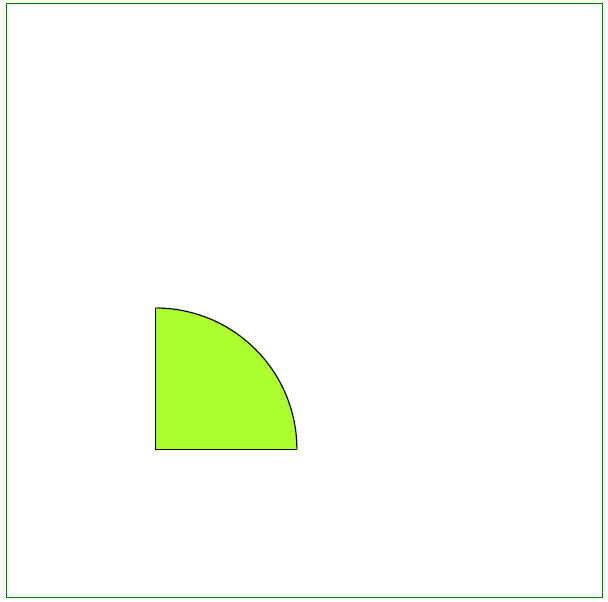

## Add Arc object

Aspose.PDF for C++  supports the feature to add graph objects (for example graph, line, rectangle etc.) to PDF documents. It also offers the feature to fill [Arc](https://reference.aspose.com/pdf/cpp/class/aspose.pdf.drawing.arc) object with a certain color.

Follow the steps below:

1. Create [Document](https://reference.aspose.com/pdf/cpp/class/aspose.pdf.document) instance

1. Create [Drawing object](https://reference.aspose.com/pdf/cpp/namespace/aspose.pdf.drawing) with certain dimensions

1. Set [Border](https://reference.aspose.com/pdf/cpp/class/aspose.pdf.drawing.graph#ab63dde9501441515b915fd68f66a01bd) for Drawing object

1. Add [Graph](https://reference.aspose.com/pdf/cpp/class/aspose.pdf.drawing.graph) object to paragraphs collection of page

1. Save our PDF file

The following code snippet shows how to add a [Arc](https://reference.aspose.com/pdf/cpp/class/aspose.pdf.drawing.arc/) object.

```cpp
void ExampleArc() {
    // Create Document instance
    String _dataDir("C:\\Samples\\");
    // Create Document instance
    auto document = MakeObject<Document>();

    // Add page to pages collection of PDF file
    auto page = document->get_Pages()->Add();

    // Create Drawing object with certain dimensions
    auto graph = MakeObject<Aspose::Pdf::Drawing::Graph>(400, 400);
    // Set border for Drawing object
    auto borderInfo = MakeObject<BorderInfo>(BorderSide::All, Color::get_Green());
    graph->set_Border(borderInfo);

    auto arc1 = MakeObject<Aspose::Pdf::Drawing::Arc>(100, 100, 95, 0, 90);
    arc1->get_GraphInfo()->set_Color(Color::get_GreenYellow());
    graph->get_Shapes()->Add(arc1);

    auto arc2 = MakeObject<Aspose::Pdf::Drawing::Arc>(100, 100, 90, 70, 180);
    arc2->get_GraphInfo()->set_Color(Color::get_DarkBlue());
    graph->get_Shapes()->Add(arc2);

    auto arc3 = MakeObject<Aspose::Pdf::Drawing::Arc>(100, 100, 85, 120, 210);
    arc3->get_GraphInfo()->set_Color(Color::get_Red());
    graph->get_Shapes()->Add(arc3);

    // Add Graph object to paragraphs collection of page
    page->get_Paragraphs()->Add(graph);

    // Save PDF file
    document->Save(_dataDir + u"DrawingArc_out.pdf");

}
```

## Create Filled Arc Object

Next example shows how to add a Arc object that is filled with color and certain dimensions.

```cpp
void ExampleFilledArc() {

    // Create Document instance
    String _dataDir("C:\\Samples\\");
    // Create Document instance
    auto document = MakeObject<Document>();

    // Add page to pages collection of PDF file
    auto page = document->get_Pages()->Add();

    // Create Drawing object with certain dimensions
    auto graph = MakeObject<Aspose::Pdf::Drawing::Graph>(400, 400);
    // Set border for Drawing object
    auto borderInfo = MakeObject<BorderInfo>(BorderSide::All, Color::get_Green());
    graph->set_Border(borderInfo);

    auto arc = MakeObject<Aspose::Pdf::Drawing::Arc>(100, 100, 95, 0, 90);
    arc->get_GraphInfo()->set_FillColor(Color::get_GreenYellow());
    graph->get_Shapes()->Add(arc);

    auto line = MakeObject<Aspose::Pdf::Drawing::Line>(MakeArray<double>({ 195, 100, 100, 100, 100, 195 }));
    line->get_GraphInfo()->set_FillColor(Color::get_GreenYellow());
    graph->get_Shapes()->Add(line);

    // Add Graph object to paragraphs collection of page
    page->get_Paragraphs()->Add(graph);

    // Save PDF file
    document->Save(_dataDir + u"DrawingArc_out.pdf");

}
```

Let's see the result of adding a filled Arс:


