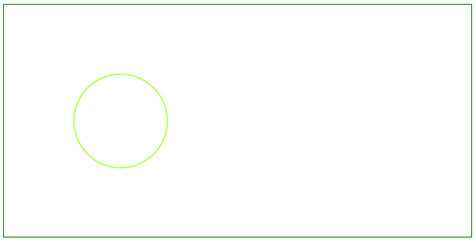

## Add Circle object

Like bar graphs, circle graphs can be used to display data in a number of separate categories. Unlike bar graphs, however, circle graphs can be used only when you have data for all the categories that make up the whole. So let's take a look at adding a [Circle](https://apireference.aspose.com/pdf/cpp/class/aspose.pdf.drawing.circle/) object with Aspose.PDF for C++.

Follow the steps below:

1. Create [Document](https://apireference.aspose.com/pdf/cpp/class/aspose.pdf.document) instance

1. Create [Drawing object](https://apireference.aspose.com/pdf/cpp/namespace/aspose.pdf.drawing) with certain dimensions

1. Set [Border](https://apireference.aspose.com/pdf/cpp/class/aspose.pdf.drawing.graph#ab63dde9501441515b915fd68f66a01bd) for Drawing object

1. Add [Graph](https://apireference.aspose.com/pdf/cpp/class/aspose.pdf.drawing.graph) object to paragraphs collection of page

1. Save our PDF file

```cpp
void ExampleCircle() {

    // Create Document instance
    String _dataDir("C:\\Samples\\");
    // Create Document instance
    auto document = MakeObject<Document>();

    // Add page to pages collection of PDF file
    auto page = document->get_Pages()->Add();

    // Create Drawing object with certain dimensions
    auto graph = MakeObject<Aspose::Pdf::Drawing::Graph>(400, 200);
    // Set border for Drawing object
    auto borderInfo = MakeObject<BorderInfo>(BorderSide::All, Color::get_Green());
    graph->set_Border(borderInfo);

    auto circle = MakeObject<Aspose::Pdf::Drawing::Circle>(100, 100, 40);

    circle->get_GraphInfo()->set_Color(Color::get_GreenYellow());
    graph->get_Shapes()->Add(circle);

    // Add Graph object to paragraphs collection of page
    page->get_Paragraphs()->Add(graph);

    // Save PDF file
    document->Save(_dataDir + u"DrawingCircle1_out.pdf");
}
```

Our drawn circle will look like this:



## Create Filled Circle Object

This example shows how to add a Circle object that is filled with color.

```cpp
void ExampleFilledCircle() {
    // Create Document instance
    String _dataDir("C:\\Samples\\");
    // Create Document instance
    auto document = MakeObject<Document>();

    // Add page to pages collection of PDF file
    auto page = document->get_Pages()->Add();

    // Create Drawing object with certain dimensions
    auto graph = MakeObject<Aspose::Pdf::Drawing::Graph>(400, 200);
    
    // Set border for Drawing object
    auto borderInfo = MakeObject<BorderInfo>(BorderSide::All, Color::get_Green());
    graph->set_Border(borderInfo);

    auto circle = MakeObject<Aspose::Pdf::Drawing::Circle>(100, 100, 40);
    circle->get_GraphInfo()->set_Color(Color::get_GreenYellow());
    circle->get_GraphInfo()->set_FillColor(Color::get_Green());

    circle->set_Text(MakeObject<Aspose::Pdf::Text::TextFragment>(u"Circle"));

    graph->get_Shapes()->Add(circle);

    // Add Graph object to paragraphs collection of page
    page->get_Paragraphs()->Add(graph);

    // Save PDF file
    document->Save(_dataDir + u"DrawingCircle2_out.pdf");
}
```

Let's see the result of adding a filled Circle:


