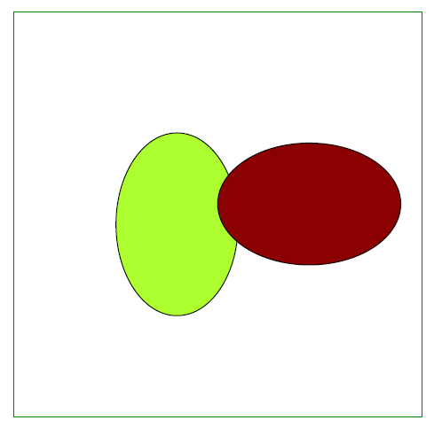

## Add Ellipse object

Aspose.PDF for C++ supports to add [Ellipse](https://apireference.aspose.com/pdf/cpp/class/aspose.pdf.drawing.ellipse/) objects to PDF documents. It also offers the feature to fill ellipse  object with a certain color.

```cpp
void ExampleEllipse() {
    // Create Document instance
    String _dataDir("C:\\Samples\\");
    // Create Document instance
    auto document = MakeObject<Document>();

    // Add page to pages collection of PDF file
    auto page = document->get_Pages()->Add();

    // Create Drawing object with certain dimensions
    auto graph = MakeObject<Aspose::Pdf::Drawing::Graph>(400, 400);
    // Set border for Drawing object
    auto borderInfo = MakeObject<BorderInfo>(BorderSide::All, Color::get_Green());
    graph->set_Border(borderInfo);

    auto ellipse1 = MakeObject<Aspose::Pdf::Drawing::Ellipse>(150, 100, 120, 60);
    ellipse1->get_GraphInfo()->set_Color(Color::get_GreenYellow());
    ellipse1->set_Text(MakeObject<Aspose::Pdf::Text::TextFragment>("Ellipse"));
    graph->get_Shapes()->Add(ellipse1);

    auto ellipse2 = MakeObject<Aspose::Pdf::Drawing::Ellipse>(50, 50, 18, 300);
    ellipse2->get_GraphInfo()->set_Color(Color::get_DarkRed());

    graph->get_Shapes()->Add(ellipse2);

    // Add Graph object to paragraphs collection of page
    page->get_Paragraphs()->Add(graph);

    // Save PDF file
    document->Save(_dataDir + u"DrawingEllipse_out.pdf");

}
```


## Create Filled Ellipse Object

The following code snippet shows how to add a [Ellipse](https://apireference.aspose.com/pdf/cpp/class/aspose.pdf.drawing.ellipse/)  object that is filled with color.

```csharp
void ExampleFilledEllipse() {
    // Create Document instance
    String _dataDir("C:\\Samples\\");
    // Create Document instance
    auto document = MakeObject<Document>();

    // Add page to pages collection of PDF file
    auto page = document->get_Pages()->Add();

    // Create Drawing object with certain dimensions
    auto graph = MakeObject<Aspose::Pdf::Drawing::Graph>(400, 400);
    // Set border for Drawing object
    auto borderInfo = MakeObject<BorderInfo>(BorderSide::All, Color::get_Green());
    graph->set_Border(borderInfo);

    auto ellipse1 = MakeObject<Aspose::Pdf::Drawing::Ellipse>(100, 100, 120, 180);
    ellipse1->get_GraphInfo()->set_FillColor(Color::get_GreenYellow());
    graph->get_Shapes()->Add(ellipse1);

    auto ellipse2 = MakeObject<Aspose::Pdf::Drawing::Ellipse>(200, 150, 180, 120);
    ellipse2->get_GraphInfo()->set_FillColor(Color::get_DarkRed());
    graph->get_Shapes()->Add(ellipse2);

    // Add Graph object to paragraphs collection of page
    page->get_Paragraphs()->Add(graph);

    // Save PDF file
    document->Save(_dataDir + u"DrawingEllipse_out.pdf");
}
```



## Add Text inside the Ellipse

Aspose.PDF for C++ supports to add text inside the Graph Object. Text property of Graph Object provides option to set text of the Graph Object. 

The following code snippet shows how to add text inside a Rectangle object.

```cpp
void ExampleEllipseWithText() {
    // Create Document instance
    String _dataDir("C:\\Samples\\");
    // Create Document instance
    auto document = MakeObject<Document>();

    // Add page to pages collection of PDF file
    auto page = document->get_Pages()->Add();

    // Create Drawing object with certain dimensions
    auto graph = MakeObject<Aspose::Pdf::Drawing::Graph>(400, 400);
    // Set border for Drawing object
    auto borderInfo = MakeObject<BorderInfo>(BorderSide::All, Color::get_Green());
    graph->set_Border(borderInfo);

    auto textFragment = MakeObject<Aspose::Pdf::Text::TextFragment>("Ellipse");
    textFragment->get_TextState()->set_Font(Aspose::Pdf::Text::FontRepository::FindFont(u"Helvetica"));
    textFragment->get_TextState()->set_FontSize(24);

    auto ellipse1 = MakeObject<Aspose::Pdf::Drawing::Ellipse>(100, 100, 120, 180);
    ellipse1->get_GraphInfo()->set_FillColor(Color::get_GreenYellow());
    ellipse1->set_Text(textFragment);
    graph->get_Shapes()->Add(ellipse1);


    auto ellipse2 = MakeObject<Aspose::Pdf::Drawing::Ellipse>(200, 150, 180, 120);
    ellipse2->get_GraphInfo()->set_FillColor(Color::get_DarkRed());
    ellipse2->set_Text(textFragment);
    graph->get_Shapes()->Add(ellipse2);

    // Add Graph object to paragraphs collection of page
    page->get_Paragraphs()->Add(graph);

    // Save PDF file
    document->Save(_dataDir + u"DrawingEllipseText_out.pdf");

}
 ```


