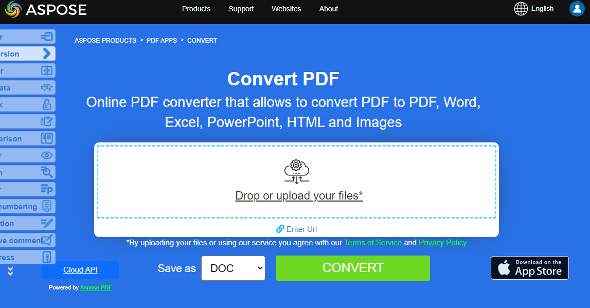

**Aspose.PDF for C++** library gives you the ability to convert PDF documents to various formats, as well as convert from other formats to PDF.

Our **Aspose.PDF for C++** library allows you to successfully, quickly, and easily convert your PDF documents to the most popular formats and vice versa.

## How to use Aspose.PDF to convert

Aspose.PDF supports the largest number of popular document formats, both for loading and saving.

Draw your attention to that the current section describes only popular conversions.
For a complete list of supported formats, see [Supported Aspose.PDF File Formats](https://docs.aspose.com/pdf/cpp/supported-file-formats/).

 Explore the sections on converting documents with code snippets.

Word documents are as versatile as possible and editable. Converting PDF to Word manually is a very time-consuming task. This article will show you how to programmatically convert PDF to Word in C++.

- [Convert PDF to Microsoft Word](/pdf/cpp/convert-pdf-to-word/) - you can convert your PDF document to Word format with C++

Number formats are needed not only to make the data in the table easier to read, but also to make the table easier to use. Of course, if you need to convert such data from a PDF document to Excel format use our Aspose.PDF library.

- [Convert PDF to Microsoft Excel](/pdf/cpp/convert-pdf-to-excel/) - this section describes how to convert PDF document to XLSX, ODS, CSV and SpreadSheetML

The PowerPoint format is used to create various presentations. PPT files contain a large number of slides or pages containing various information.

- [Convert PDF to Microsoft PowerPoint](/pdf/cpp/convert-pdf-to-powerpoint/) - here we are talking about converting PDF to PowerPoint by tracking the conversion process

HyperText Markup Language is a hypertext document description language, a standard language for creating web pages. With Aspose.PDF for C++ you can easily convert HTML documents.

- [Convert PDF file to HTML format](/pdf/cpp/convert-pdf-to-html/) - convert your PDF documents to HTML files as separate pages or as a simgle page

There are many image formats that need to be converted to PDF for different purposes. Aspose.PDF allows the most popular images formats and vice versa.

- [Convert Images formats to PDF file](/pdf/cpp/convert-images-format-to-pdf/) - convert different formats of images to PDF file
- [Convert PDF to various Images formats](/pdf/cpp/convert-pdf-to-images-format/) - convert PDF pages as images in JPEG, PNG and other formats

This section includes such formats as: EPUB, Markdown, PCL, XPS, LATex/TeX, Text, and PostScript.

- [Convert other file formats to PDF](/pdf/cpp/convert-other-files-to-pdf/) - this topic describes conversion with various formats like EPUB, XPS, Postscript, text and others
- [Convert PDF file to other formats](/pdf/cpp/convert-pdf-to-other-files/) - this topic describes way for conversion PDF document to various formats

PDF/A is a version of PDF designed for the long-term archiving of electronic documents.
If honestly, externally, it is very difficult to determine if it is PDF or PDF/A. To check this file, validators are used. Check the following articles for a quality converting PDF to PDF/A and vice versa.

- [Convert PDF to PDF/A formats](/pdf/cpp/convert-pdf-to-pdfa/) - C++ library by Aspose.PDF has an easy way for converting PDF to PDF/A
- [Convert PDF/A to PDF format](/pdf/cpp/convert-pdfa-to-pdf/) - convert PDF/A to PDF format with C++ easy, fast, and high quality

## Try to convert PDF files online

Also, you can check the quality of Aspose.PDF conversion and view the results on the Internet using the Aspose.PDF converter application.

{}
**Try to convert PDF files online**

You can try the conversion functionality by using our Aspose PDF APPS:

{}
