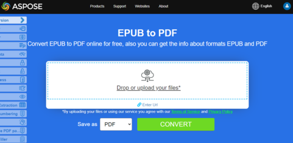

**Aspose.PDF for C++** allows you simply convert EPUB files to PDF format.

<abbr title="electronic publication">EPUB</abbr> (short for electronic publication) is a free and open e-book standard from the International Digital Publishing Forum (IDPF). Files have the extension .epub. EPUB is designed for reflowable content, meaning that an EPUB reader can optimize text for a particular display device.

EPUB also supports fixed-layout content. The format is intended as a single format that publishers and conversion houses can use in-house, as well as for distribution and sale. It supersedes the Open eBook standard.The version EPUB 3 is also endorsed by the Book Industry Study Group (BISG), a leading book trade association for standardized best practices, research, information and events, for packaging of content.

## Live Example

Aspose.PDF for .NET presents you online free application ["EPUB to PDF"](https://products.aspose.app/pdf/conversion/epub-to-pdf), where you may try to investigate the functionality and quality it works.

[](https://products.aspose.app/pdf/conversion/epub-to-pdf)

Conversion steps:

1. Create a [String Class](https://apireference.aspose.com/pdf/cpp/class/system.string) for path name and file name.
1. Create an instance of [EpubLoadOptions](https://apireference.aspose.com/pdf/cpp/class/aspose.pdf.load_options)class.
1. Create an instance of [Document](https://apireference.aspose.com/pdf/cpp/class/aspose.pdf.document) class with mention source filename and options.
1. Load and [Save](https://apireference.aspose.com/pdf/cpp/class/aspose.pdf.document/#ac082fe8e67b25685fc51d33e804269fa) the input file.

Next following code snippet show you how to convert EPUB files to PDF format with C++.

```cpp
void ConvertEPUBtoPDF()
{
 std::clog << "EPUB to PDF convert: Start" << std::endl;
 String _dataDir("C:\\Samples\\Conversion\\");
 String infilename("aliceDynamic.epub");
 String outfilename("epub_test.pdf");
 auto options = MakeObject<EpubLoadOptions>();
 try {
  auto document = MakeObject<Document>(_dataDir + infilename, options);
  document->Save(_dataDir + outfilename);
 }
 catch (System::Exception ex) {
  std::cerr << ex->get_Message() << std::endl;
 }
 std::clog << "EPUB to PDF convert: End" << std::endl;
}
```
