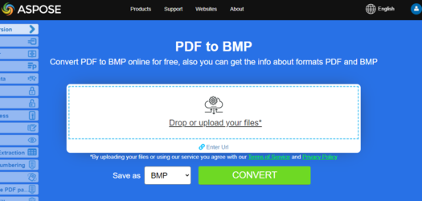

## Live Example

Aspose.PDF for C++ presents you online free application ["PDF to BMP"](https://products.aspose.app/pdf/conversion/pdf-to-bmp), where you may try to investigate the functionality and quality it works.

[](https://products.aspose.app/pdf/conversion/pdf-to-bmp)

## Convert PDF Pages to BMP Images

Use the [String Class](https://apireference.aspose.com/pdf/cpp/class/system.string) with variables _dataDir, infilename and outfilename.

Next, to get the Smart Pointers, we use a special macro called MakeObject. It serves as a pointer to the type of document, you can also specify the path to this document in brackets.

To get the count of pages, use the method [get_Pages](https://apireference.aspose.com/pdf/cpp/class/aspose.pdf.document#a481178a0c2c6277ae9b6b931d63e4122), and after [get_Count](https://apireference.aspose.com/pdf/cpp/class/aspose.pdf.page_collection#a1238d9a0f0fc05c64ba40072e14ae356).

Next, create a name using [String Class](https://apireference.aspose.com/pdf/cpp/class/system.string) and [Format](https://apireference.aspose.com/pdf/cpp/class/system.string#a46b690c629b9aa32c6999971b6912f3c) method.

The next step is to create ImageStream that allows you to record as needed. An empty file with the specified name is created on the disk. Create a MakeObject pointer to an object of type Resolution. And put it all in a variable Resolution.

The next step is to create the output device. We create a BmpDevice.

After, use the Process and close with the ImageStream.

The following code snippet shows you how to convert all PDF pages to BMP images with Aspose.PDF for C++.

```cpp
public static void ConvertPDFtoBmpAllPages()
{
    Document pdfDocument = new Document(_dataDir + "ConvertAllPagesToBmp.pdf");

    for (int pageCount = 1; pageCount <= pdfDocument.Pages.Count; pageCount++)
    {
        using (FileStream imageStream = new FileStream(_dataDir + "image" + pageCount + "_out" + ".bmp", FileMode.Create))
        {
            // Create Resolution object
            Resolution resolution = new Resolution(300);
            // Create PNG device with specified attributes
            // Width, Height, Resolution
            BmpDevice BmpDevice = new BmpDevice(500, 700, resolution);

            // Convert a particular page and save the image to stream
            BmpDevice.Process(pdfDocument.Pages[pageCount], imageStream);

            // Close stream
            imageStream.Close();

        }
    }
}
```

## Convert single PDF page to BMP image

To convert a particular page to BMP format with C++:

1. Create a [String Class](https://apireference.aspose.com/pdf/cpp/class/system.string) for path name and file name.

1. Open document with MakeObject.

1. Create Resolution object.

1. Create BMP device with specified attributes Width, Height, Resolution.

1. Convert a particular page and save the image to stream.

1. Close stream using imageStream.

```cpp
void ConvertPDFtoBmpSinglePage()
{
 std::clog << __func__ << ": Start" << std::endl;
 // String for path name
 String _dataDir("C:\\Samples\\Conversion\\");

 // String for file name
 String infilename("PageToBmp.pdf");
 String outfilename("PageToBmp_out.bmp");

 // Open document
 auto document = MakeObject<Document>(_dataDir + infilename);

 auto imageStream = System::IO::File::OpenWrite(outfilename);

 // Create Resolution object
 auto resolution = MakeObject<Aspose::Pdf::Devices::Resolution>(300);

 // Create BMP device with specified attributes Width, Height, Resolution
 auto BmpDevice = MakeObject<Aspose::Pdf::Devices::BmpDevice>(resolution);

 // Convert a particular page and save the image to stream
 BmpDevice->Process(document->get_Pages()->idx_get(1), imageStream);

 // Close stream
 imageStream->Close();
 std::clog << __func__ << ": Finish" << std::endl;
}
```
