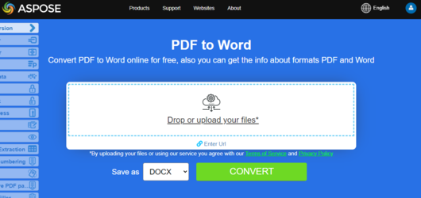

## Live Example

Aspose.PDF for C++ presents you online free application ["PDF to Word"](https://products.aspose.app/pdf/conversion/pdf-to-docx), where you may try to investigate the functionality and quality it works.

[](https://products.aspose.app/pdf/conversion/pdf-to-docx)

## Convert PDF to DOCX

Aspose.PDF for C++ API lets you read and convert PDF documents to DOCX using C++ language. DOCX is a well-known format for Microsoft Word documents whose structure was changed from plain binary to a combination of XML and binary files. Docx files can be opened with Word 2007 and lateral versions but not with the earlier versions of MS Word which support DOC file extensions.

For quick conversion use [Save](https://apireference.aspose.com/pdf/cpp/class/aspose.pdf.document/#ac082fe8e67b25685fc51d33e804269fa) method with `SaveFormat.DocX` options:

```cpp
void ConvertPDFtoWord_DOCX_Format()
{
 std::clog << __func__ << ": Start" << std::endl;
 // String for path name
 String _dataDir("C:\\Samples\\Conversion\\");

 // String for file name
 String infilename("sample.pdf");
 String outfilename("PDFToDOC.docx");

 // Open document
 auto document = MakeObject<Document>(_dataDir + infilename);

 try {
  // Save the file into MS document format
  document->Save(_dataDir + outfilename, SaveFormat::DocX);
 }
 catch (Exception ex) {
  std::cerr << ex->get_Message();
 }

 std::clog << __func__ << ": Finish" << std::endl;
}
```

The [`DocSaveOptions`](https://apireference.aspose.com/pdf/cpp/class/aspose.pdf.doc_save_options) class has a property named Format which provides the capability to specify the format of the resultant document, that is, DOC or DOCX. In order to convert a PDF file to DOCX format, please pass the Docx value from the DocSaveOptions.DocFormat enumeration.

Please take a look over the following code snippet which provides the capability to convert PDF file to DOCX format with C++.

```cpp
void ConvertPDFtoWord_Advanced_DOCX_Format()
{
 std::clog << __func__ << ": Start" << std::endl;
 // String for path name
 String _dataDir("C:\\Samples\\Conversion\\");

 // String for file name
 String infilename("sample.pdf");
 String outfilename("PDFToDOC.docx");

 // Open document
 auto document = MakeObject<Document>(_dataDir + infilename);

 auto saveOptions = MakeObject<DocSaveOptions>();
 saveOptions->set_Format(DocSaveOptions::DocFormat::DocX);

 // Set other DocSaveOptions params
 // ...

 // Save the file into MS document format

 try {
  // Save the file into MS document format
  document->Save(_dataDir + outfilename, saveOptions);
 }
 catch (Exception ex) {
  std::cerr << ex->get_Message();
 }

 std::clog << __func__ << ": Finish" << std::endl;
}
```
