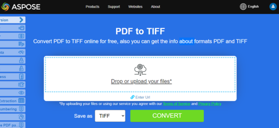
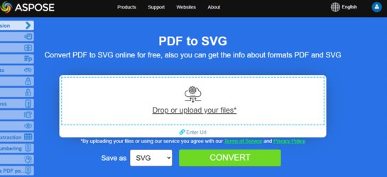

**Aspose.PDF for C++** uses few approaches to convert PDF to image. Generally speaking, we use two approaches: conversion using the Device approach and conversion using SaveOption. This section will show you how to convert PDF documents to image formats such as BMP, JPEG, PNG, TIFF, and SVG formats using one of those approaches.

There are several classes in the library that allow you to use a virtual device to transform images. DocumentDevice is oriented for conversion whole document, but ImageDevice - for a particular page.

## Convert PDF using DocumentDevice class

**Aspose.PDF for C++** makes a possible to convert PDF Pages to TIFF images.

The [TiffDevice](https://apireference.aspose.com/pdf/cpp/class/aspose.pdf.devices.tiff_device/) (based on DocumentDevice) class allows you to convert PDF pages to TIFF images. This class provides a method named [Process](https://apireference.aspose.com/pdf/cpp/class/aspose.pdf.devices.tiff_device#a0790daa96125c5638a645647e9678f0c) which allows you to convert all the pages in a PDF file to a single TIFF image.

{}
**Try to convert PDF to TIFF online**

Aspose.PDF for C++ presents you online free application ["PDF to TIFF"](https://products.aspose.app/pdf/conversion/pdf-to-tiff), where you may try to investigate the functionality and quality it works.

[](https://products.aspose.app/pdf/conversion/pdf-to-tiff)
{}

### Convert PDF Pages to One TIFF Image

Aspose.PDF for С++ explain how to convert all pages in a PDF file to a single TIFF image:

1. Open [Document](https://apireference.aspose.com/pdf/cpp/class/aspose.pdf.document/) with MakeObject.
1. Create Resolution object.
1. Create [TIffSettings](https://apireference.aspose.com/pdf/cpp/class/aspose.pdf.devices.tiff_settings/) object.
1. Create [Tiff device](https://apireference.aspose.com/pdf/cpp/class/aspose.pdf.devices.tiff_device/) with specified attributes.
1. Convert a particular page and save the image to stream.

The following code snippet shows how to convert all the PDF pages to a single TIFF image.

```cpp
void Convert_PDF_To_Images::ConvertPDFtoTIFF()
{
    std::clog << __func__ << ": Start" << std::endl;
    // String for path name
    String _dataDir("C:\\Samples\\Conversion\\");

    // String for file name
    String infilename("PageToTiff.pdf");
    String outfilename("PagesToTIFF_out.tif");

    // Open document
    auto document = MakeObject<Document>(_dataDir + infilename);

    auto imageStream = System::IO::File::OpenWrite(_dataDir + outfilename);

    // Create Resolution object
    auto resolution = MakeObject<Aspose::Pdf::Devices::Resolution>(300);

    // Create TiffSettings object
    auto tiffSettings = MakeObject<Aspose::Pdf::Devices::TiffSettings>();
    tiffSettings->set_Compression(Aspose::Pdf::Devices::CompressionType::None);
    tiffSettings->set_Depth(Aspose::Pdf::Devices::ColorDepth::Default);
    tiffSettings->set_Shape(Aspose::Pdf::Devices::ShapeType::Landscape);
    tiffSettings->set_SkipBlankPages(false);

    // Create TIFF device
    auto tiffDevice = MakeObject<Aspose::Pdf::Devices::TiffDevice>(resolution, tiffSettings);

    // Convert pages and save the image to stream
    tiffDevice->Process(document, 1, 2, imageStream);
    std::clog << __func__ << ": Finish" << std::endl;
}
```

### Convert One Page to TIFF Image

Aspose.PDF for C++ allows you to convert a particular page in a PDF file to a TIFF image, use an overloaded version of the Process(..) method which takes a page number as an argument for conversion. The following code snippet shows how to convert the first page of a PDF to TIFF format.

```cpp
void Convert_PDF_To_Images::ConvertPDFtoTiffSinglePage()
{
    std::clog << __func__ << ": Start" << std::endl;
    // String for path name
    String _dataDir("C:\\Samples\\Conversion\\");

    // String for file name
    String infilename("PageToTiff.pdf");
    String outfilename("PageToTiff_out.tif");

    // Open document
    auto document = MakeObject<Document>(_dataDir + infilename);

    auto imageStream = System::IO::File::OpenWrite(_dataDir + outfilename);

    // Create Resolution object
    auto resolution = MakeObject<Aspose::Pdf::Devices::Resolution>(300);

    // Create TIFF device
    auto tiffDevice = MakeObject<Aspose::Pdf::Devices::TiffDevice>(resolution);

    // Convert a particular page and save the image to stream
    tiffDevice->Process(document, 1, 1, imageStream);
    std::clog << __func__ << ": Finish" << std::endl;
}
```

### Use Bradley algorithm during conversion

Aspose.PDF for C++ has been supporting the feature to convert PDF to TIF using LZW compression and then with the use of AForge, Binarization can be applied. However one of the customers requested that for some images, they need to get the Threshold using Otsu, so they also would like to use Bradley.

```cpp
void Convert_PDF_To_Images::ConvertPDFtoTiffBradleyBinarization()
{
    // String for path name
    String _dataDir("C:\\Samples\\Conversion\\");

    // Open document
    auto pdfDocument = MakeObject<Document>(_dataDir + u"PageToTIFF.pdf");

    String outputImageFile = _dataDir + u"resultant_out.tif";
    String outputBinImageFile = _dataDir + u"37116-bin_out.tif";

    // Create Resolution object 
    auto resolution = MakeObject<Aspose::Pdf::Devices::Resolution>(300);

    // Create TiffSettings object
    auto tiffSettings = MakeObject<Aspose::Pdf::Devices::TiffSettings>();
    tiffSettings->set_Compression(Aspose::Pdf::Devices::CompressionType::LZW);
    tiffSettings->set_Depth(Aspose::Pdf::Devices::ColorDepth::Format1bpp);

    // Create TIFF device
    auto tiffDevice = MakeObject<Aspose::Pdf::Devices::TiffDevice>(resolution, tiffSettings);
    auto imageStream = System::IO::File::OpenWrite(_dataDir + outputImageFile);

    // Convert a particular page and save the image to stream
    tiffDevice->Process(pdfDocument, 1, 2, imageStream);

    imageStream->Close();

    auto inStream = System::IO::File::OpenRead(outputImageFile);
    auto outStream = System::IO::File::OpenWrite(outputBinImageFile);

    tiffDevice->BinarizeBradley(inStream, outStream, 0.1);
}
```

## Convert PDF using ImageDevice class

`ImageDevice` is the ancestor for `BmpDevice`, `JpegDevice`, `GifDevice`, `PngDevice` and `EmfDevice`.

- The [BmpDevice](https://apireference.aspose.com/pdf/cpp/class/aspose.pdf.devices.bmp_device/) class allows you to convert PDF pages to <abbr title="Bitmap Image File">BMP</abbr> images.
- The [EmfDevice](https://apireference.aspose.com/pdf/cpp/class/aspose.pdf.devices.emf_device/) class allows you to convert PDF pages to <abbr title="Enhanced Meta File">EMF</abbr> images.
- The [JpegDevice](https://apireference.aspose.com/pdf/cpp/class/aspose.pdf.devices.jpeg_device/) class allows you to convert PDF pages to JPEG images.
- The [PngDevice](https://apireference.aspose.com/pdf/cpp/class/aspose.pdf.devices.png_device/) class allows you to convert PDF pages to <abbr title="Portable Network Graphics">PNG</abbr> images.
- The [GifDevice](https://apireference.aspose.com/pdf/cpp/class/aspose.pdf.devices.gif_device/) class allows you to convert PDF pages to <abbr title="Graphics Interchange Format">GIF</abbr> images.

Let's take a look at how to convert a PDF page to an image.

[BmpDevice](https://apireference.aspose.com/pdf/cpp/class/aspose.pdf.devices.bmp_device) class provides a method named [Process](https://apireference.aspose.com/pdf/cpp/class/aspose.pdf.devices.bmp_device#a22cefdb47b7c762320fa7973aa4f1f93) which allows you to convert a particular page of the PDF file to BMP image format. The other classes have the same method. So, if we need to convert a PDF page to an image, we just instantiate the required class.

The following code snippet shows this possibility:

```cpp
void Convert_PDF_To_Images::ConvertPDFusingImageDevice()
{
    std::clog << __func__ << ": Start" << std::endl;

    // String for path name
    String _dataDir("C:\\Samples\\Conversion\\");

    // Create Resolution object            
    auto resolution = MakeObject<Aspose::Pdf::Devices::Resolution>(300); //300 dpi

    System::SmartPtr<Aspose::Pdf::Devices::ImageDevice>
    bmpDevice = MakeObject<Aspose::Pdf::Devices::BmpDevice>(resolution);
    System::SmartPtr<Aspose::Pdf::Devices::ImageDevice>
    jpegDevice = MakeObject<Aspose::Pdf::Devices::JpegDevice>(resolution);
    System::SmartPtr<Aspose::Pdf::Devices::ImageDevice>
    gifDevice = MakeObject<Aspose::Pdf::Devices::GifDevice>(resolution);
    System::SmartPtr<Aspose::Pdf::Devices::ImageDevice>
    pngDevice = MakeObject<Aspose::Pdf::Devices::PngDevice>(resolution);
    System::SmartPtr<Aspose::Pdf::Devices::ImageDevice>
    emfDevice = MakeObject<Aspose::Pdf::Devices::EmfDevice>(resolution);

    auto document = MakeObject<Document>(_dataDir + u"ConvertAllPagesToBmp.pdf");

    ConvertPDFtoImage(bmpDevice, u"bmp", document);
    ConvertPDFtoImage(jpegDevice, u"jpeg", document);
    ConvertPDFtoImage(gifDevice, u"gif", document);
    ConvertPDFtoImage(pngDevice, u"png", document);
    ConvertPDFtoImage(emfDevice, u"emf", document);

    std::clog << __func__ << ": Finish" << std::endl;

}

void Convert_PDF_To_Images::ConvertPDFtoImage(
 System::SmartPtr<Aspose::Pdf::Devices::ImageDevice> imageDevice,
 String ext, System::SmartPtr<Document> document)
{
    // String for path name
    String _dataDir("C:\\Samples\\Conversion\\");

    for (int pageCount = 1; pageCount <= document->get_Pages()->get_Count(); pageCount++)
    {
    String outfilename = String::Format(u"{0}PageToBmp{1}_out.{2}",
    _dataDir, pageCount, ext);

    auto imageStream = System::IO::File::OpenWrite(outfilename);

    // Create Resolution object
    auto resolution = MakeObject<Aspose::Pdf::Devices::Resolution>(300);

    // Convert a particular page and save the image to stream
    imageDevice->Process(document->get_Pages()->idx_get(pageCount), imageStream);

    // Close stream
    imageStream->Close();
    }
}
```

{}
**Try to convert PDF to PNG online**

As an example of how our free applications work please check the next feature.

Aspose.PDF for C++ presents you online free application ["PDF to PNG"](https://products.aspose.app/pdf/conversion/pdf-to-png), where you may try to investigate the functionality and quality it works.

[](https://products.aspose.app/pdf/conversion/pdf-to-png)
{}

## Convert PDF using SaveOptions class

This part of article shows you how to convert PDF to <abbr title="Scalable Vector Graphics">SVG</abbr> using C++ and SaveOptions class.

{}
**Try to convert PDF to SVG online**

Aspose.PDF for C++ presents you online free application ["PDF to SVG"](https://products.aspose.app/pdf/conversion/pdf-to-svg), where you may try to investigate the functionality and quality it works.

[](https://products.aspose.app/pdf/conversion/pdf-to-svg)
{}

In order to convert PDF to SVG, Aspose.PDF for CPP offers [Save](https://apireference.aspose.com/pdf/cpp/class/aspose.pdf.document#ac082fe8e67b25685fc51d33e804269fa) method of [Document](https://apireference.aspose.com/pdf/cpp/class/aspose.pdf.document) class. You need to pass the output path and enum SaveFormat:: svg to the Save method to convert PDF to SVG. The following code snippet shows how to convert PDF to SVG:

This article teacher you how to convert PDF to <abbr title="Scalable Vector Graphics">SVG</abbr> using C++.

**Scalable Vector Graphics (SVG)** is a family of specifications of an XML-based file format for two-dimensional vector graphics, both static and dynamic (interactive or animated). The SVG specification is an open standard that has been under development by the World Wide Web Consortium (W3C) since 1999.

SVG images and their behaviors are defined in XML text files. This means that they can be searched, indexed, scripted and if required, compressed. As XML files, SVG images can be created and edited with any text editor, but it is often more convenient to create them with drawing programs such as Inkscape.

Aspose.PDF for C++ supports the feature to convert SVG image to PDF format and also offers the capability to convert PDF files to SVG format. To accomplish this requirement, the `SvgSaveOptions` class has been introduced into the Aspose.PDF namespace. Instantiate an object of SvgSaveOptions and pass it as a second argument to the [Save](https://apireference.aspose.com/pdf/cpp/class/aspose.pdf.document#ac082fe8e67b25685fc51d33e804269fa) method .

The following code snippet shows the steps for converting a PDF file to SVG format with C++.

```cpp
void Convert_PDF_To_Images::ConvertPDFtoSvgSinglePage()
{
    std::clog << __func__ << ": Start" << std::endl;
    // String for path name
    String _dataDir("C:\\Samples\\Conversion\\");

    // String for file name
    String infilename("PageToSvg.pdf");
    String outfilename("PageToSvg_out.svg");

    // Open document
    auto document = MakeObject<Document>(_dataDir + infilename);

    // Instantiate an object of SvgSaveOptions
    auto saveOptions = MakeObject<SvgSaveOptions>();
    // Do not compress SVG image to Zip archive
    saveOptions->CompressOutputToZipArchive = false;

    try {
    // Save the output in SVG files
    document->Save(_dataDir + outfilename, saveOptions);
    }
    catch (Exception ex) {
    std::cerr << ex->get_Message();
    }

    std::clog << __func__ << ": Finish" << std::endl;
}
```
