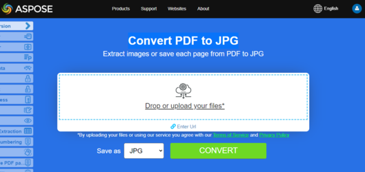

Aspose.PDF for C++ API lets you read and convert PDF files to Jpeg formats with simple lines of code. The API focuses on providing quality output with efficient processing in your C++ applications without being worried about the underlying file formats. The following code samples show how easy it is to convert PDF files to Jpeg using our API.

## Convert PDF Pages to JPG Images

## Live Example

Aspose.PDF presents you online free application ["Convert PDF to JPG"](https://products.aspose.app/pdf/conversion/pdf-to-jpg), where you may try to investigate the functionality and quality it works.

[](https://products.aspose.app/pdf/conversion/pdf-to-jpg)

## Convert single PDF page to JPG image

Aspose.PDF for C++ allows you to convert a particular page to Jpeg format.

Use the [String Class](https://apireference.aspose.com/pdf/cpp/class/system.string) with variables _dataDir, infilename and outfilename.

Next, to get the Smart Pointers, we use a special macro called MakeObject. It serves as a pointer to the type of document, you can also specify the path to this document in brackets.

The next step is to create ImageStream that allows you to record as needed. An empty file with the specified name is created on the disk. Create a MakeObject pointer to an object of type Resolution. And put it all in a variable Resolution.

The next step is to create the output device. We create a JpegDevice, specify the size of our image. Next, we call the JpegDevice, call the Process method, with the specified parameters.

Then we call the method Close in the imageStream object.

The following code snippet shows the steps to convert the first page of PDF to Jpeg format.

```cpp
void ConvertPDFtoJpegSinglePage()
{
 // String for path name
 String _dataDir("C:\\Samples\\");

 // String for file name
 String infilename("PageToJpeg.pdf");
 String outfilename("image_out.jpeg");

 // Open document
 auto document = MakeObject<Document>(_dataDir + infilename);

 auto imageStream = System::IO::File::OpenWrite(_dataDir + outfilename);

 // Create Resolution object
 auto resolution = MakeObject<Aspose::Pdf::Devices::Resolution>(300);

 // Create JPEG device with specified attributes Width, Height, Resolution
 auto JpegDevice = MakeObject<Aspose::Pdf::Devices::JpegDevice >(500, 700, resolution);

 // Convert a particular page and save the image to stream
 JpegDevice->Process(document->get_Pages()->idx_get(1), imageStream);

 // Close stream
 imageStream->Close();
}
```
