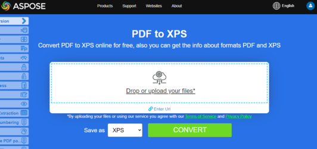

## Convert PDF to EPUB

{}
**Try to convert PDF to EPUB online**

Aspose.PDF for C++ presents you online free application ["PDF to EPUB"](https://products.aspose.app/pdf/conversion/pdf-to-epub), where you may try to investigate the functionality and quality it works.

[](https://products.aspose.app/pdf/conversion/pdf-to-epub)
{}

<abbr title="Electronic Publication">EPUB</abbr> (short for Electronic Publication) is a free and open e-book standard from the International Digital Publishing Forum (IDPF). Files have the extension .epub.
EPUB is designed for reflowable content, meaning that an EPUB reader can optimize text for a particular display device. EPUB also supports fixed-layout content. The format is intended as a single format that publishers and conversion houses can use in-house, as well as for distribution and sale. It supersedes the Open eBook standard.

Aspose.PDF for C++ also supports the feature to convert PDF documents to EPUB format. Aspose.PDF for C++ has a class named EpubSaveOptions which can be used as the second argument to [`Document.Save(..)`](https://apireference.aspose.com/pdf/cpp/class/aspose.pdf.document#ac082fe8e67b25685fc51d33e804269fa) method, to generate an EPUB file.
Please try using the following code snippet to accomplish this requirement with C++.

```cpp
void ConvertPDFtoEPUB()
{
    std::clog << __func__ << ": Start" << std::endl;
    // String for path name
    String _dataDir("C:\\Samples\\Conversion\\");

    // String for input file name
    String infilename("sample.pdf");
    // String for output file name
    String outfilename("PDFToEPUB_out.epub");

    // Open document
    auto document = MakeObject<Document>(_dataDir + infilename);

    // Save PDF file into EPUB format
    document->Save(_dataDir + outfilename, SaveFormat::Epub);
    std::clog << __func__ << ": Finish" << std::endl;
}
```

## Convert PDF to LaTeX/TeX

**Aspose.PDF for C++** support converting PDF to LaTeX/TeX.
The LaTeX file format is a text file format with the special markup and used in TeX-based document preparation system for high-quality typesetting.

To convert PDF files to TeX, Aspose.PDF has the class [LaTeXSaveOptions](https://apireference.aspose.com/pdf/cpp/class/aspose.pdf.la_te_x_save_options) which provides the property OutDirectoryPath for saving temporary images during the conversion process.

The following code snippet shows the process of converting PDF files into the TEX format with C++.

```cpp
void ConvertPDFtoLaTeX()
{
    std::clog << __func__ << ": Start" << std::endl;
    // String for path name
    String _dataDir("C:\\Samples\\Conversion\\");

    // String for input file name
    String infilename("sample.pdf");
    // String for output file name
    String outfilename("PDFToTeX_out.tex");

    // Open document
    auto document = MakeObject<Document>(_dataDir + infilename);

    // Instantiate LaTex save option
    auto saveOptions = MakeObject<LaTeXSaveOptions>();

    // Set the output directory path for save option object
    saveOptions->set_OutDirectoryPath(_dataDir);

    // Save PDF file into LaTex format
    document->Save(_dataDir + outfilename, saveOptions);
    std::clog << __func__ << ": Finish" << std::endl;
}
```

{}
**Try to convert PDF to LaTeX/TeX online**

Aspose.PDF for C++ presents you online free application ["PDF to LaTeX"](https://products.aspose.app/pdf/conversion/pdf-to-tex), where you may try to investigate the functionality and quality it works.

[](https://products.aspose.app/pdf/conversion/pdf-to-tex)
{}

## Convert PDF to Text

**Aspose.PDF for C++** support converting whole PDF document and single page to a Text file.

### Convert whole PDF document to Text file

You can convert PDF document to TXT file using [TextAbsorber](https://apireference.aspose.com/pdf/cpp/class/aspose.pdf.text.text_absorber/) class.

The following code snippet explains how to extract the texts from the all pages.

```cpp
void ConvertPDFDocToTXT()
{
    std::clog << __func__ << ": Start" << std::endl;
    // String for path name
    String _dataDir("C:\\Samples\\Conversion\\");

    // String for input file name
    String infilename("sample.pdf");
    // String for output file name
    String outfilename("input_Text_Extracted_out.txt");

    // Open document
    auto document = MakeObject<Document>(_dataDir + infilename);

    auto ta = MakeObject<TextAbsorber>();
    ta->Visit(document);
    // Save the extracted text in text file
    System::IO::File::WriteAllText(_dataDir + outfilename, ta->get_Text());
    std::clog << __func__ << ": Finish" << std::endl;
}
```

### Convert PDF page to text file

You can convert PDF document to TXT file with Aspose.PDF for C++. You should use  [TextAbsorber](https://apireference.aspose.com/pdf/cpp/class/aspose.pdf.text.text_absorber/) class for resolve this task.

The following code snippet explains how to extract the texts from the particular pages.

```cpp
void ConvertPDFPagestoTXT()
{
    std::clog << __func__ << ": Start" << std::endl;
    // String for path name
    String _dataDir("C:\\Samples\\Conversion\\");

    // String for input file name
    String infilename("sample-4pages.pdf");
    // String for output file name
    String outfilename("sample-4pages_out.txt");

    // Open document
    auto document = MakeObject<Document>(_dataDir + infilename);

    auto ta = MakeObject<TextAbsorber>();

    auto pages = { 1, 3, 4 };
    try {
    for (auto page : pages)
    {
    ta->Visit(document->get_Pages()->idx_get(page));
    }
    // Save the extracted text in text file
    auto text = ta->get_Text();
    System::IO::File::WriteAllText(_dataDir + outfilename, text);
    }
    catch (Exception ex) {
    std::cerr << ex->get_Message() << std::endl;
    }
    std::clog << __func__ << ": Finish" << std::endl;
}
```

{}
**Try to convert Convert PDF to Text online**

Aspose.PDF for C++ presents you online free application ["PDF to Text"](https://products.aspose.app/pdf/conversion/pdf-to-txt), where you may try to investigate the functionality and quality it works.

[](https://products.aspose.app/pdf/conversion/pdf-to-txt)
{}

## Convert PDF to XPS

**Aspose.PDF for C++** gives a possibility to convert PDF files to <abbr title="XML Paper Specification">XPS</abbr> format. Let try to use the presented code snippet for converting PDF files to XPS format with C++.

The XPS file type is primarily associated with the XML Paper Specification by Microsoft Corporation. The XML Paper Specification (XPS), formerly codenamed Metro and subsuming the Next Generation Print Path (NGPP) marketing concept, is Microsoft's initiative to integrate document creation and viewing into the Windows operating system.

To convert PDF files to XPS, Aspose.PDF has the class [XpsSaveOptions](https://apireference.aspose.com/pdf/cpp/class/aspose.pdf.xps_save_options) that is used as the second argument to the [Document.Save(..)](https://apireference.aspose.com/pdf/cpp/class/aspose.pdf.document#ac082fe8e67b25685fc51d33e804269fa) method to generate the XPS file.

The following code snippet shows the process of converting PDF file into XPS format.

```cpp
void ConvertPDFtoXPS()
{
    std::clog << __func__ << ": Start" << std::endl;
    // String for path name
    String _dataDir("C:\\Samples\\Conversion\\");

    // String for input file name
    String infilename("sample.pdf");
    // String for output file name
    String outfilename("PDFToXPS_out.xps");

    // Open document
    auto document = MakeObject<Document>(_dataDir + infilename);

    // Instantiate LaTex save option
    auto saveOptions = MakeObject<XpsSaveOptions>();

    // Save PDF file into XPS format
    document->Save(_dataDir + outfilename, saveOptions);
    std::clog << __func__ << ": Finish" << std::endl;
}
```

{}
**Try to convert PDF to SVG online**

Aspose.PDF for C++ presents you online free application ["PDF to XPS"](https://products.aspose.app/pdf/conversion/pdf-to-xps), where you may try to investigate the functionality and quality it works.

[](https://products.aspose.app/pdf/conversion/pdf-to-xps)
{}

