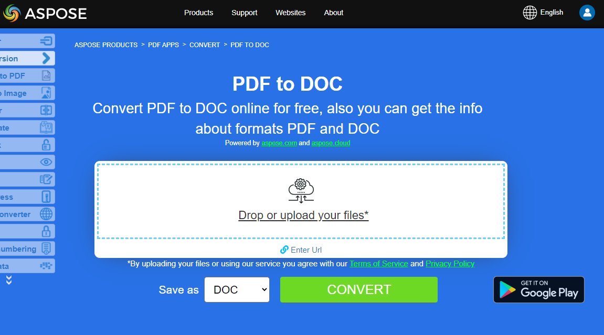
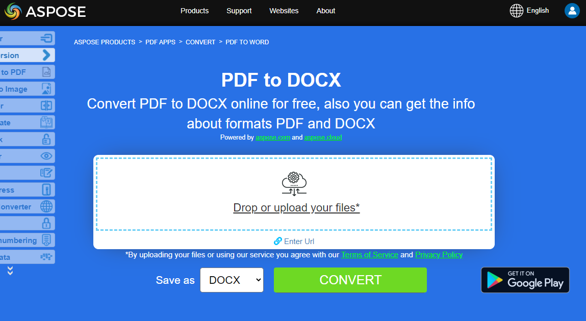

One of the most popular feature is PDF to Microsoft Word DOC conversion, which makes the content easy to manipulate. Aspose.PDF for C++ allows you to convert PDF files to DOC.

## Convert PDF to DOC (Word 97-2003) file

Convert PDF file to DOC format with ease and full control. Aspose.PDF for C++ is flexible and supports a wide variety of conversions. Converting pages from PDF documents to images, for example, is a very popular feature.

A conversion that many of our customers have requested is PDF to DOC: converting a PDF file to a Microsoft Word document. Customers want this because PDF files cannot easily be edited, whereas Word documents can. Some companies want their users to be able to manipulate text, tables and images in files that started as PDFs.

Keeping alive the tradition of making things simple and understandable, Aspose.PDF for C++ lets you transform a source PDF file into a DOC file with two lines of code. To accomplish this feature, we have introduced an enumeration named SaveFormat and its value .Doc lets you save the source file to Microsoft Word format.

The following code snippet shows the process of converting PDF file into DOC.

```cpp
void ConvertPDFtoWord()
{
 std::clog << __func__ << ": Start" << std::endl;
 // String for path name
 String _dataDir("C:\\Samples\\Conversion\\");

 // String for file name
 String infilename("sample.pdf");
 String outfilename("PDFToDOC.doc");

 // Open document
 auto document = MakeObject<Document>(_dataDir + infilename);

 try {
  // Save the file into MS document format
  document->Save(_dataDir + outfilename, SaveFormat::Doc);
 }
 catch (Exception ex) {
  std::cerr << ex->get_Message();
 }

 std::clog << __func__ << ": Finish" << std::endl;
}
```

The following code snippet shows the process of converting PDF file into DOC Advanced version:

```cpp
void ConvertPDFtoWordDocAdvanced()
{
 std::clog << __func__ << ": Start" << std::endl;
 // String for path name
 String _dataDir("C:\\Samples\\Conversion\\");

 // String for file name
 String infilename("sample.pdf");
 String outfilename("PDFToDOC.doc");

 // Open document
 auto document = MakeObject<Document>(_dataDir + infilename);

 auto saveOptions = MakeObject<DocSaveOptions>();
 saveOptions->set_Format(DocSaveOptions::DocFormat::Doc);
 // Set the recognition mode as Flow
 saveOptions->set_Mode(DocSaveOptions::RecognitionMode::Flow);
 // Set the Horizontal proximity as 2.5
 saveOptions->set_RelativeHorizontalProximity(2.5f);
 // Enable the value to recognize bullets during conversion process
 saveOptions->set_RecognizeBullets(true);

 try {
  // Save the file into MS document format
  document->Save(_dataDir + outfilename, saveOptions);
 }
 catch (Exception ex) {
  std::cerr << ex->get_Message();
 }

 std::clog << __func__ << ": Finish" << std::endl;
}
```

{}
**Try to convert PDF to DOC online**

Aspose.PDF for C++ presents you online free application ["PDF to DOC"](https://products.aspose.app/pdf/conversion/pdf-to-doc), where you may try to investigate the functionality and quality it works.

[](https://products.aspose.app/pdf/conversion/pdf-to-doc)
{}

## Convert PDF to DOCX

Aspose.PDF for C++ API lets you read and convert PDF documents to DOCX using C++ language. DOCX is a well-known format for Microsoft Word documents whose structure was changed from plain binary to a combination of XML and binary files. Docx files can be opened with Word 2007 and lateral versions but not with the earlier versions of MS Word which support DOC file extensions.

For quick conversion use [Save](https://apireference.aspose.com/pdf/cpp/class/aspose.pdf.document#ac082fe8e67b25685fc51d33e804269fa) method with `SaveFormat.DocX` options:

```cpp
void ConvertPDFtoWord_DOCX_Format()
{
 std::clog << __func__ << ": Start" << std::endl;
 // String for path name
 String _dataDir("C:\\Samples\\Conversion\\");

 // String for file name
 String infilename("sample.pdf");
 String outfilename("PDFToDOC.docx");

 // Open document
 auto document = MakeObject<Document>(_dataDir + infilename);

 try {
  // Save the file into MS document format
  document->Save(_dataDir + outfilename, SaveFormat::DocX);
 }
 catch (Exception ex) {
  std::cerr << ex->get_Message();
 }

 std::clog << __func__ << ": Finish" << std::endl;
}
```

The [`DocSaveOptions`](https://apireference.aspose.com/pdf/cpp/class/aspose.pdf.doc_save_options) class has a property named Format which provides the capability to specify the format of the resultant document, that is, DOC or DOCX. In order to convert a PDF file to DOCX format, please pass the Docx value from the DocSaveOptions.DocFormat enumeration.

Please take a look over the following code snippet which provides the capability to convert PDF file to DOCX format with C++.

```cpp
void ConvertPDFtoWord_Advanced_DOCX_Format()
{
 std::clog << __func__ << ": Start" << std::endl;
 // String for path name
 String _dataDir("C:\\Samples\\Conversion\\");

 // String for file name
 String infilename("sample.pdf");
 String outfilename("PDFToDOC.docx");

 // Open document
 auto document = MakeObject<Document>(_dataDir + infilename);

 auto saveOptions = MakeObject<DocSaveOptions>();
 saveOptions->set_Format(DocSaveOptions::DocFormat::DocX);

 // Set other DocSaveOptions params
 // ...

 // Save the file into MS document format

 try {
  // Save the file into MS document format
  document->Save(_dataDir + outfilename, saveOptions);
 }
 catch (Exception ex) {
  std::cerr << ex->get_Message();
 }

 std::clog << __func__ << ": Finish" << std::endl;
}
```

{}
**Try to convert PDF to DOCX online**

Aspose.PDF for C++ presents you online free application ["PDF to DOCX"](https://products.aspose.app/pdf/conversion/pdf-to-docx), where you may try to investigate the functionality and quality it works.

[](https://products.aspose.app/pdf/conversion/pdf-to-docx)

{}
